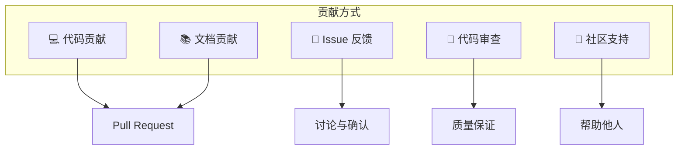
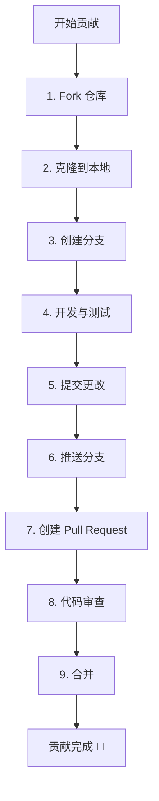
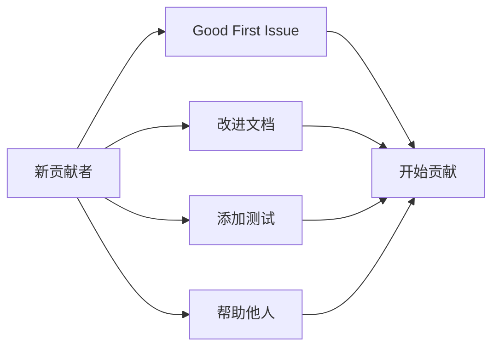

# 如何贡献

感谢你对 DeP2P 的关注！我们欢迎各种形式的贡献。

---

## 欢迎贡献者

```
┌─────────────────────────────────────────────────────────────────────┐
│                                                                      │
│           🎉 欢迎加入 DeP2P 开源社区！                               │
│                                                                      │
│      无论你是经验丰富的开发者还是刚入门的新手，                       │
│              我们都欢迎你的参与和贡献。                               │
│                                                                      │
└─────────────────────────────────────────────────────────────────────┘
```

---

## 贡献方式



### 💻 代码贡献

- 修复 Bug
- 实现新功能
- 优化性能
- 改进测试

### 📚 文档贡献

- 修正错误
- 补充说明
- 翻译文档
- 添加示例

### 🐛 Issue 反馈

- 报告 Bug
- 提出功能建议
- 讨论设计问题

### 👀 代码审查

- 审查 Pull Request
- 提供建设性反馈

### 💬 社区支持

- 回答问题
- 分享使用经验

---

## 贡献流程



### 1. Fork 仓库

在 GitHub 上 Fork DeP2P 仓库到你的账户。

### 2. 克隆到本地

```bash
git clone https://github.com/YOUR_USERNAME/go-dep2p.git
cd go-dep2p
```

### 3. 创建分支

```bash
# 功能分支
git checkout -b feature/your-feature-name

# Bug 修复分支
git checkout -b fix/issue-number-description
```

**分支命名规范**：
| 类型 | 格式 | 示例 |
|------|------|------|
| 功能 | `feature/<描述>` | `feature/add-relay-support` |
| 修复 | `fix/<issue>-<描述>` | `fix/123-connection-leak` |
| 文档 | `docs/<描述>` | `docs/update-api-reference` |
| 重构 | `refactor/<描述>` | `refactor/simplify-discovery` |

### 4. 开发与测试

```bash
# 安装依赖
go mod download

# 运行测试
go test ./...

# 运行 lint
golangci-lint run
```

### 5. 提交更改

```bash
git add .
git commit -m "feat: add new relay feature"
```

**提交信息规范**：
| 类型 | 描述 |
|------|------|
| `feat` | 新功能 |
| `fix` | Bug 修复 |
| `docs` | 文档更新 |
| `style` | 代码格式（不影响功能） |
| `refactor` | 重构 |
| `test` | 测试相关 |
| `chore` | 构建/工具相关 |

### 6. 推送分支

```bash
git push origin feature/your-feature-name
```

### 7. 创建 Pull Request

- 在 GitHub 上创建 Pull Request
- 填写清晰的标题和描述
- 关联相关 Issue

### 8. 代码审查

- 回应审查意见
- 根据反馈进行修改
- 保持耐心和友好

### 9. 合并

审查通过后，维护者会合并你的贡献。

---

## 行为准则

我们致力于创建一个友好、包容的社区环境。请：

- **尊重他人**：使用友好和专业的语言
- **接受反馈**：建设性地接受和提供反馈
- **关注目标**：专注于对社区最有利的事情
- **表现同理心**：理解他人的观点和经历

### 不可接受的行为

- 使用性别、种族等歧视性语言或图像
- 人身攻击或侮辱性评论
- 公开或私下骚扰
- 未经许可发布他人私人信息

---

## 获取帮助

如果你在贡献过程中遇到问题：

| 渠道 | 用途 |
|------|------|
| [GitHub Issues](https://github.com/dep2p/go-dep2p/issues) | Bug 报告、功能请求 |
| [GitHub Discussions](https://github.com/dep2p/go-dep2p/discussions) | 问题讨论、想法分享 |

---

## 贡献者认可

我们感谢每一位贡献者！所有贡献者将被记录在项目的 Contributors 列表中。

### 贡献类型徽章

| 徽章 | 贡献类型 |
|------|----------|
| 💻 | 代码贡献 |
| 📖 | 文档贡献 |
| 🐛 | Bug 报告 |
| 💡 | 想法/建议 |
| 👀 | 代码审查 |
| 🔧 | 工具/基础设施 |

---

## 快速链接

| 文档 | 描述 |
|------|------|
| [开发环境搭建](development-setup.md) | 如何设置开发环境 |
| [代码规范](code-style.md) | 代码风格和规范 |
| [设计文档](design-docs.md) | 项目设计文档导航 |

---

## 第一次贡献？

不知道从哪里开始？可以：

1. **查看 "good first issue" 标签**：这些 Issue 适合新贡献者
2. **改进文档**：发现文档中的错误或不清楚的地方
3. **添加测试**：增加测试覆盖率
4. **回答问题**：在 Discussions 中帮助其他用户



---

感谢你考虑为 DeP2P 做出贡献！每一个贡献都很重要。
