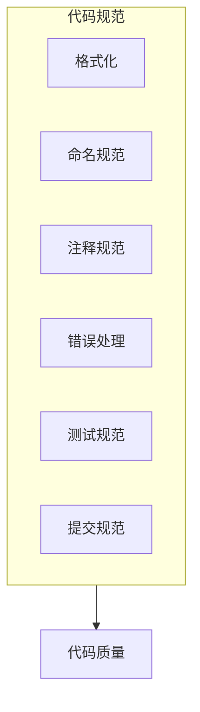
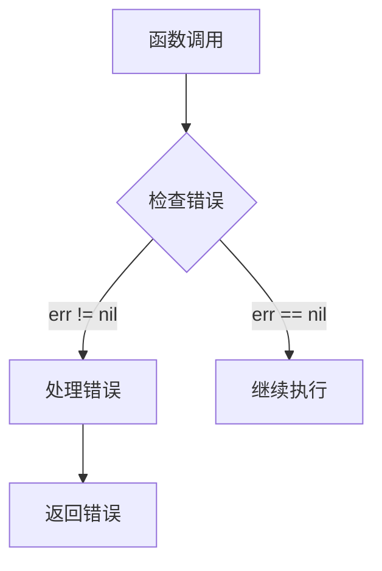
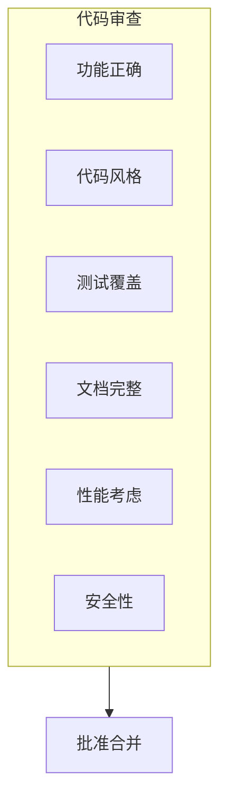

# 代码规范

本文档定义 DeP2P 项目的代码风格和最佳实践。

---

## 概述



---

## Go 代码风格

### 格式化工具

使用 `gofmt` 或 `goimports` 格式化代码：

```bash
# 使用 gofmt
gofmt -w .

# 使用 goimports（推荐，自动管理导入）
goimports -w .
```

### 代码检查

使用 `golangci-lint` 进行代码检查：

```bash
golangci-lint run
```

**启用的检查器**：
- `gofmt` - 格式检查
- `govet` - 静态分析
- `errcheck` - 错误检查
- `staticcheck` - 静态分析
- `gosimple` - 简化建议
- `ineffassign` - 无效赋值
- `unused` - 未使用代码

---

## 命名规范

### 包命名

```go
// 好的包名
package relay
package discovery
package connmgr

// 避免的包名
package util      // 太通用
package common    // 太通用
package misc      // 无意义
```

### 变量命名

```go
// 好的变量名
var nodeID types.NodeID
var connCount int
var isConnected bool
var maxRetries int

// 避免的变量名
var n types.NodeID    // 太短
var nodeIdentifier    // 太长
var node_id           // 不要使用下划线
```

### 常量命名

```go
// 使用驼峰命名
const (
    MaxConnections    = 100
    DefaultTimeout    = 30 * time.Second
    ProtocolVersion   = "1.0.0"
)

// 避免全大写（Go 不推荐）
const MAX_CONNECTIONS = 100  // 不推荐
```

### 函数命名

```go
// 好的函数名
func Connect(ctx context.Context, nodeID NodeID) error
func GetConnection(nodeID NodeID) (Connection, bool)
func IsConnected(nodeID NodeID) bool

// 避免的函数名
func DoConnect()      // Do 前缀通常多余
func ConnectToNode()  // 冗余的后缀
```

### 接口命名

```go
// 单方法接口使用 -er 后缀
type Reader interface {
    Read(p []byte) (n int, err error)
}

type Connector interface {
    Connect(ctx context.Context, nodeID NodeID) error
}

// 多方法接口使用描述性名称
type Connection interface {
    RemoteID() NodeID
    Close() error
}
```

---

## 注释规范

### 包注释

```go
// Package relay 实现 DeP2P 的中继功能。
//
// 中继允许 NAT 后的节点通过公网中继节点进行通信。
// 主要组件包括:
//   - RelayClient: 中继客户端
//   - RelayServer: 中继服务器
//   - CircuitDialer: 电路拨号器
package relay
```

### 函数注释

```go
// Connect 连接到指定节点。
//
// 自动从 AddressBook/Discovery 查找地址并连接。
// 如果已有到该节点的连接，返回现有连接。
//
// 参数:
//   - ctx: 上下文，支持超时和取消
//   - nodeID: 目标节点 ID
//
// 返回:
//   - Connection: 建立的连接
//   - error: 连接失败时返回错误
//
// 示例:
//
//	conn, err := node.Connect(ctx, targetID)
//	if err != nil {
//	    log.Fatal(err)
//	}
//	defer conn.Close()
func (n *Node) Connect(ctx context.Context, nodeID NodeID) (Connection, error)
```

### 类型注释

```go
// Node 是 DeP2P 的主要用户入口。
//
// Node 封装了底层的 Endpoint，提供更友好的高层 API。
// 支持以下功能:
//   - 连接管理（Connect, Disconnect）
//   - 消息传递（Send, Request, Publish, Subscribe）
//   - 地址管理（ShareableAddrs, BootstrapCandidates）
type Node struct {
    // ...
}
```

### TODO 注释

```go
// TODO(username): 描述待完成的工作
// FIXME(username): 描述需要修复的问题
// NOTE: 重要说明
// DEPRECATED: 已废弃，说明替代方案
```

---

## 错误处理规范

### 错误定义

```go
// 使用 errors.New 定义简单错误
var ErrNotConnected = errors.New("not connected")

// 使用自定义错误类型包含更多信息
type ConnectionError struct {
    NodeID NodeID
    Cause  error
}

func (e *ConnectionError) Error() string {
    return fmt.Sprintf("connection to %s failed: %v", e.NodeID, e.Cause)
}

func (e *ConnectionError) Unwrap() error {
    return e.Cause
}
```

### 错误处理

```go
// 好的错误处理
conn, err := node.Connect(ctx, targetID)
if err != nil {
    return fmt.Errorf("connect to %s: %w", targetID, err)
}

// 使用 errors.Is 检查错误
if errors.Is(err, ErrNotConnected) {
    // 处理特定错误
}

// 使用 errors.As 获取错误详情
var connErr *ConnectionError
if errors.As(err, &connErr) {
    log.Printf("Failed to connect to %s", connErr.NodeID)
}
```

### 错误检查顺序



```go
// 推荐：先处理错误
result, err := doSomething()
if err != nil {
    return err
}
// 使用 result...

// 避免：先处理成功情况
result, err := doSomething()
if err == nil {
    // 使用 result...
} else {
    return err
}
```

---

## 测试规范

### 测试文件

```go
// 文件: connection_test.go

func TestConnect(t *testing.T) {
    // Arrange
    node := createTestNode(t)
    defer node.Close()
    
    // Act
    conn, err := node.Connect(ctx, targetID)
    
    // Assert
    require.NoError(t, err)
    assert.Equal(t, targetID, conn.RemoteID())
}
```

### 表驱动测试

```go
func TestParseAddress(t *testing.T) {
    tests := []struct {
        name    string
        input   string
        want    Address
        wantErr bool
    }{
        {
            name:  "valid IPv4",
            input: "/ip4/192.168.1.1/udp/4001",
            want:  expectedAddr,
        },
        {
            name:    "invalid format",
            input:   "invalid",
            wantErr: true,
        },
    }
    
    for _, tt := range tests {
        t.Run(tt.name, func(t *testing.T) {
            got, err := ParseAddress(tt.input)
            if tt.wantErr {
                require.Error(t, err)
                return
            }
            require.NoError(t, err)
            assert.Equal(t, tt.want, got)
        })
    }
}
```

### 基准测试

```go
func BenchmarkConnect(b *testing.B) {
    node := createTestNode(b)
    defer node.Close()
    
    b.ResetTimer()
    for i := 0; i < b.N; i++ {
        conn, _ := node.Connect(ctx, targetID)
        conn.Close()
    }
}
```

---

## 提交信息规范

### 格式

```
<type>(<scope>): <subject>

<body>

<footer>
```

### 类型

| 类型 | 描述 |
|------|------|
| `feat` | 新功能 |
| `fix` | Bug 修复 |
| `docs` | 文档更新 |
| `style` | 代码格式（不影响功能） |
| `refactor` | 重构 |
| `perf` | 性能优化 |
| `test` | 测试相关 |
| `chore` | 构建/工具相关 |

### 示例

```
feat(relay): add auto-relay discovery

Implement automatic relay node discovery using DHT.
This allows nodes behind NAT to automatically find
and use relay nodes.

Closes #123
```

```
fix(connection): prevent goroutine leak on timeout

The connection goroutine was not properly cleaned up
when context timeout occurred. Add defer cleanup to
ensure goroutine exits.

Fixes #456
```

---

## 代码审查清单



### 审查要点

- [ ] **功能正确性**
  - 代码实现符合需求
  - 边界条件处理正确
  - 错误情况处理得当

- [ ] **代码风格**
  - 遵循项目代码规范
  - 命名清晰准确
  - 没有未使用的代码

- [ ] **测试**
  - 有充分的单元测试
  - 测试覆盖主要场景
  - 测试可以通过

- [ ] **文档**
  - 公共 API 有注释
  - 复杂逻辑有说明
  - README 已更新（如需要）

- [ ] **性能**
  - 没有明显的性能问题
  - 资源使用合理
  - 没有内存泄漏

- [ ] **安全性**
  - 没有敏感信息泄露
  - 输入已验证
  - 权限检查正确

---

## 代码组织

### 文件结构

```go
// 推荐的文件结构
package mypackage

import (
    // 标准库
    "context"
    "fmt"
    
    // 第三方库
    "github.com/stretchr/testify/require"
    
    // 项目内部包
    "github.com/dep2p/go-dep2p/pkg/types"
)

// 常量
const (
    DefaultTimeout = 30 * time.Second
)

// 变量
var (
    ErrNotFound = errors.New("not found")
)

// 类型定义
type MyType struct {
    // ...
}

// 构造函数
func NewMyType() *MyType {
    // ...
}

// 方法
func (m *MyType) DoSomething() error {
    // ...
}

// 包级函数
func HelperFunction() {
    // ...
}
```

---

## 相关文档

- [如何贡献](README.md)
- [开发环境搭建](development-setup.md)
- [设计文档](design-docs.md)
