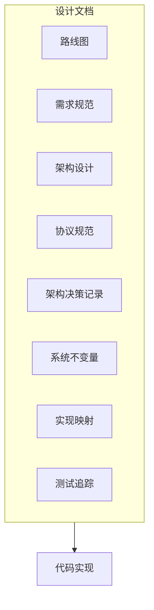
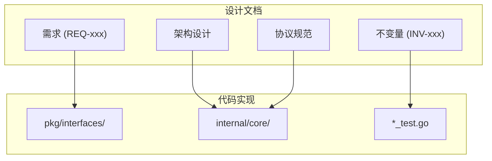

# 设计文档导航

本文档帮助你了解和使用 DeP2P 的设计文档。

---

## 概述

DeP2P 使用设计文档来记录架构决策、协议规范和实现细节。设计文档位于 `design/` 目录。



---

## 设计文档结构

完整的设计文档结构：

```
design/
├── README.md                 # 设计文档导航
├── roadmap.md                # 版本里程碑
│
├── requirements/             # 需求规范
│   ├── README.md
│   ├── index.yaml            # 需求索引
│   └── REQ-*.md              # 具体需求
│
├── architecture/             # 架构设计
│   ├── README.md
│   ├── overview.md           # 架构总览
│   ├── layers.md             # 三层架构详解
│   ├── components.md         # 核心组件
│   └── interactions.md       # 组件交互
│
├── protocols/                # 协议规范
│   ├── README.md
│   ├── foundation/           # 基础层协议
│   ├── transport/            # 传输层协议
│   ├── network/              # 网络层协议
│   └── application/          # 应用层协议
│
├── adr/                      # 架构决策记录
│   ├── README.md
│   └── 0001-*.md             # 决策记录
│
├── invariants/               # 系统不变量
│   ├── README.md
│   └── INV-*.md              # 不变量定义
│
├── implementation/           # 实现映射
│   ├── README.md
│   ├── module-map.md         # 模块映射
│   └── status.md             # 实现状态
│
└── testing/                  # 测试追踪
    ├── README.md
    ├── strategy.md           # 测试策略
    └── cases/                # 测试用例
```

---

## 如何阅读设计文档

### 阅读顺序


**建议阅读顺序**：

1. **架构总览** (`architecture/overview.md`)
   - 了解整体设计思路
   - 理解设计目标

2. **三层架构** (`architecture/layers.md`)
   - 理解分层设计
   - 了解各层职责

3. **核心组件** (`architecture/components.md`)
   - 了解主要组件
   - 理解组件关系

4. **协议规范** (`protocols/`)
   - 深入了解具体协议
   - 理解通信细节

5. **架构决策** (`adr/`)
   - 了解设计决策背景
   - 理解权衡取舍

---

## 主要设计文档

### 架构设计

| 文档 | 描述 |
|------|------|
| `architecture/overview.md` | 架构总览，设计目标和原则 |
| `architecture/layers.md` | 三层架构详解（基础层、网络层、应用层） |
| `architecture/components.md` | 核心组件说明 |
| `architecture/interactions.md` | 组件交互流程 |

### 协议规范

| 文档 | 描述 |
|------|------|
| `protocols/foundation/identity.md` | 身份协议 |
| `protocols/foundation/addressing.md` | 地址协议 |
| `protocols/transport/quic.md` | QUIC 传输 |
| `protocols/transport/relay.md` | 中继协议 |
| `protocols/network/discovery.md` | 发现协议 |
| `protocols/network/nat.md` | NAT 穿透 |
| `protocols/application/messaging.md` | 消息协议 |
| `protocols/application/realm.md` | Realm 协议 |

### 架构决策记录 (ADR)

| 文档 | 描述 |
|------|------|
| `adr/0001-identity-first.md` | 身份第一性设计 |
| `adr/0002-realm-isolation.md` | Realm 隔离设计 |
| `adr/0003-relay-first-connect.md` | 中继优先连接策略 |

---

## 设计文档与代码的关系



### 需求 → API

每个需求（REQ-xxx）对应具体的 API 设计：

```
REQ-CONN-001 → pkg/interfaces/endpoint/endpoint.go
REQ-REALM-001 → pkg/interfaces/realm/realm.go
```

### 架构 → 实现

架构设计对应目录结构：

```
三层架构:
  基础层 → internal/core/identity/
  网络层 → internal/core/discovery/
  应用层 → internal/core/realm/
```

### 协议 → 实现

协议规范对应具体实现：

```
protocols/transport/relay.md → internal/core/relay/
protocols/network/discovery.md → internal/core/discovery/
```

### 不变量 → 测试

系统不变量必须有对应测试：

```
INV-001-identity-first → internal/core/identity/*_test.go
INV-002-realm-membership → internal/core/realm/*_test.go
```

---

## 编号体系

### 需求编号 (REQ-xxx)

```
REQ-<类别>-<编号>

示例:
REQ-CONN-001    # 连接相关需求
REQ-REALM-001   # Realm 相关需求
REQ-DISC-001    # 发现相关需求
```

### 不变量编号 (INV-xxx)

```
INV-<编号>-<描述>

示例:
INV-001-identity-first
INV-002-realm-membership
INV-003-connection-security
```

### 架构决策编号 (ADR-xxxx)

```
<编号>-<描述>.md

示例:
0001-identity-first.md
0002-realm-isolation.md
```

---

## 贡献设计文档

### 添加新需求

1. 在 `requirements/index.yaml` 添加条目
2. 创建 `requirements/REQ-xxx.md` 文件
3. 填写需求详情

### 添加架构决策

1. 确定下一个编号
2. 创建 `adr/<编号>-<描述>.md`
3. 使用 ADR 模板填写

### ADR 模板

```markdown
# ADR <编号>: <标题>

## 状态

[提议 | 接受 | 废弃 | 取代]

## 上下文

描述决策的背景和问题。

## 决策

描述做出的决策。

## 后果

描述决策的正面和负面后果。
```

---

## 快速链接

| 资源 | 链接 |
|------|------|
| 设计文档根目录 | [design/README.md](../../../design/README.md) |
| 架构总览 | [design/architecture/overview.md](../../../design/architecture/overview.md) |
| 协议规范 | [design/protocols/README.md](../../../design/protocols/README.md) |
| 架构决策 | [design/adr/README.md](../../../design/adr/README.md) |

---

## 相关文档

- [如何贡献](README.md)
- [开发环境搭建](development-setup.md)
- [代码规范](code-style.md)
