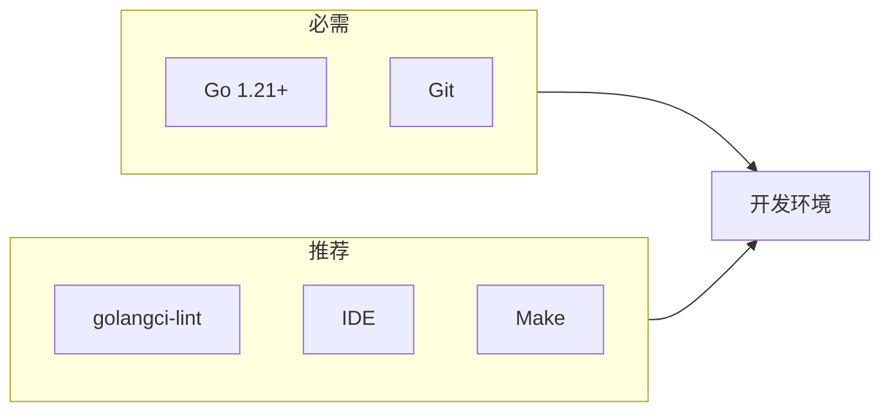
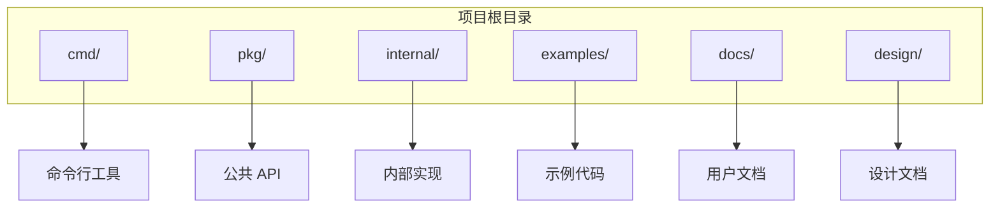
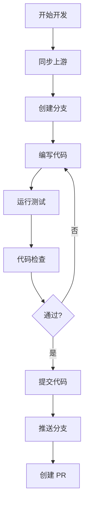

# 开发环境搭建

本文档指导你搭建 DeP2P 的开发环境。

---

## 环境要求



### 必需工具

| 工具 | 版本 | 说明 |
|------|------|------|
| **Go** | 1.21+ | 编程语言 |
| **Git** | 2.0+ | 版本控制 |

### 推荐工具

| 工具 | 用途 |
|------|------|
| **golangci-lint** | 代码静态检查 |
| **VS Code / GoLand** | IDE |
| **Make** | 构建自动化 |
| **Docker** | 集成测试 |

---

## 检查环境

### 检查 Go 版本

```bash
go version
# 输出示例: go version go1.21.0 darwin/arm64
```

如果版本低于 1.21，请升级 Go：

```bash
# macOS (使用 Homebrew)
brew install go

# Linux (使用官方包)
wget https://go.dev/dl/go1.21.0.linux-amd64.tar.gz
sudo tar -C /usr/local -xzf go1.21.0.linux-amd64.tar.gz
export PATH=$PATH:/usr/local/go/bin
```

### 检查 Git

```bash
git version
# 输出示例: git version 2.39.0
```

---

## 克隆仓库

```bash
# 克隆仓库
git clone https://github.com/dep2p/go-dep2p.git
cd go-dep2p

# 添加上游仓库（如果是 Fork）
git remote add upstream https://github.com/dep2p/go-dep2p.git
```

---

## 安装依赖

```bash
# 下载依赖
go mod download

# 验证依赖
go mod verify

# 整理依赖
go mod tidy
```

---

## 项目结构



```
go-dep2p/
├── cmd/                      # 可执行程序
│   └── dep2p/
│       └── main.go
│
├── pkg/                      # 公共包（对外暴露）
│   ├── types/                # 基础类型
│   ├── interfaces/           # 接口定义
│   └── dep2p/                # 用户 API
│
├── internal/                 # 内部实现
│   ├── app/                  # 应用编排
│   ├── config/               # 配置管理
│   └── core/                 # 核心组件
│
├── examples/                 # 示例代码
├── docs/                     # 用户文档
├── design/                   # 设计文档
│
├── go.mod                    # Go 模块文件
├── go.sum                    # 依赖校验和
├── Makefile                  # 构建脚本
└── README.md                 # 项目说明
```

---

## 构建项目

### 使用 go build

```bash
# 构建所有包
go build ./...

# 构建命令行工具
go build -o bin/dep2p ./cmd/dep2p
```

### 使用 Makefile

```bash
# 构建
make build

# 清理
make clean
```

---

## 运行测试

### 运行所有测试

```bash
go test ./...
```

### 运行特定包的测试

```bash
go test ./internal/core/...
```

### 带覆盖率的测试

```bash
go test -cover ./...

# 生成覆盖率报告
go test -coverprofile=coverage.out ./...
go tool cover -html=coverage.out
```

### 运行基准测试

```bash
go test -bench=. ./...
```

---

## 代码检查

### 安装 golangci-lint

```bash
# macOS
brew install golangci-lint

# Linux
curl -sSfL https://raw.githubusercontent.com/golangci/golangci-lint/master/install.sh | sh -s -- -b $(go env GOPATH)/bin

# 或使用 go install
go install github.com/golangci/golangci-lint/cmd/golangci-lint@latest
```

### 运行 lint

```bash
golangci-lint run

# 或使用 Makefile
make lint
```

---

## IDE 配置

### VS Code

推荐扩展：
- **Go** (官方扩展)
- **Go Test Explorer**
- **Error Lens**

`.vscode/settings.json` 配置：

```json
{
    "go.useLanguageServer": true,
    "go.lintTool": "golangci-lint",
    "go.lintOnSave": "package",
    "go.formatTool": "goimports",
    "editor.formatOnSave": true,
    "[go]": {
        "editor.codeActionsOnSave": {
            "source.organizeImports": true
        }
    }
}
```

### GoLand

1. 打开 **Settings** → **Go** → **Go Modules**
   - 启用 Go Modules 集成

2. 打开 **Settings** → **Tools** → **File Watchers**
   - 添加 `gofmt` 或 `goimports` 监视器

3. 打开 **Settings** → **Editor** → **Inspections**
   - 启用 Go 相关检查

---

## 调试配置

### VS Code launch.json

```json
{
    "version": "0.2.0",
    "configurations": [
        {
            "name": "Debug Main",
            "type": "go",
            "request": "launch",
            "mode": "debug",
            "program": "${workspaceFolder}/cmd/dep2p",
            "args": []
        },
        {
            "name": "Debug Test",
            "type": "go",
            "request": "launch",
            "mode": "test",
            "program": "${workspaceFolder}/internal/core/...",
            "args": ["-test.v"]
        }
    ]
}
```

### 使用 delve

```bash
# 安装 delve
go install github.com/go-delve/delve/cmd/dlv@latest

# 调试
dlv debug ./cmd/dep2p

# 调试测试
dlv test ./internal/core/...
```

---

## 开发工作流



### 同步上游

```bash
git fetch upstream
git rebase upstream/main
```

### 日常开发

```bash
# 1. 创建分支
git checkout -b feature/my-feature

# 2. 开发...

# 3. 测试
go test ./...

# 4. 检查
golangci-lint run

# 5. 提交
git add .
git commit -m "feat: add my feature"

# 6. 推送
git push origin feature/my-feature
```

---

## 常见问题

### 依赖问题

**问题**：`go mod download` 失败

**解决**：
```bash
# 设置代理
go env -w GOPROXY=https://goproxy.cn,direct

# 或使用私有模块
go env -w GOPRIVATE=github.com/dep2p/*
```

---

### 测试失败

**问题**：测试需要网络访问

**解决**：
```bash
# 跳过需要网络的测试
go test -short ./...
```

---

### lint 错误

**问题**：golangci-lint 报告错误

**解决**：
```bash
# 查看详细错误
golangci-lint run --verbose

# 自动修复部分问题
golangci-lint run --fix
```

---

### 端口冲突

**问题**：测试使用的端口被占用

**解决**：
```bash
# 查找占用端口的进程
lsof -i :4001

# 终止进程
kill -9 <PID>
```

---

## 相关文档

- [如何贡献](README.md)
- [代码规范](code-style.md)
- [设计文档](design-docs.md)
