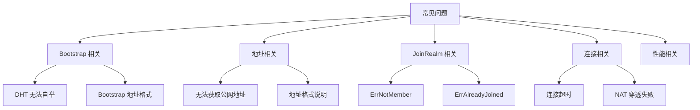

# 常见问题

本文档汇总了 DeP2P 使用过程中的常见问题和解决方案。

---

## 问题分类



---

## Bootstrap 相关

### Q: DHT 无法自举，节点无法发现其他节点

**原因**：DHT 无法在没有种子的情况下自举。

**解决方案**：

1. **使用预设配置**（推荐）：
```go
node, _ := dep2p.StartNode(ctx, dep2p.WithPreset(dep2p.PresetDesktop))
// PresetDesktop/Mobile/Server 默认配置 Bootstrap 节点
```

2. **手动配置 Bootstrap 节点**：
```go
bootstrapPeers := []string{
    "/ip4/1.2.3.4/udp/4001/quic-v1/p2p/5Q2STWvBFn...",
}
node, _ := dep2p.StartNode(ctx,
    dep2p.WithPreset(dep2p.PresetDesktop),
    dep2p.WithBootstrapPeers(bootstrapPeers),
)
```

3. **局域网场景**：mDNS 会自动发现同网段节点
```go
// mDNS 默认启用，无需额外配置
```

### Q: Bootstrap 地址格式是什么？

**答**：Bootstrap 地址必须使用**完整格式**（Full Address），包含 `/p2p/<NodeID>`：

```
✅ 正确格式：
/ip4/1.2.3.4/udp/4001/quic-v1/p2p/5Q2STWvBFn...
/dns4/bootstrap.example.com/udp/4001/quic-v1/p2p/5Q2STWvBFn...

❌ 错误格式（缺少 NodeID）：
/ip4/1.2.3.4/udp/4001/quic-v1
```

### Q: 如何作为创世节点启动？

**答**：创世节点是网络中的第一个节点，无需 Bootstrap：

```go
node, _ := dep2p.StartNode(ctx,
    dep2p.WithPreset(dep2p.PresetServer),
    dep2p.WithBootstrapPeers(nil),  // 显式设为空
)

// 打印可分享地址，供其他节点作为 Bootstrap
addrs, _ := node.WaitShareableAddrs(ctx)
fmt.Println("Bootstrap 地址:", addrs)
```

---

## 地址相关

### Q: 无法获取公网地址

**原因**：
1. NAT 探测需要时间
2. 需要 Relay 支持
3. 端口被防火墙阻止

**解决方案**：

```go
// 1. 等待一段时间
time.Sleep(3 * time.Second)
fmt.Println("通告地址:", node.AdvertisedAddrs())

// 2. 使用 WaitShareableAddrs 等待验证
ctx, cancel := context.WithTimeout(context.Background(), 30*time.Second)
defer cancel()
addrs, err := node.WaitShareableAddrs(ctx)
if err != nil {
    // 超时：可能无公网可达性
    fmt.Println("使用 Relay 地址作为备选")
}

// 3. 确保启用 Relay
node, _ := dep2p.StartNode(ctx,
    dep2p.WithPreset(dep2p.PresetDesktop),
    dep2p.WithRelay(true),  // 启用 Relay
)
```

### Q: ListenAddrs 和 AdvertisedAddrs 有什么区别？

**答**：

| 方法 | 返回内容 | 用途 |
|------|----------|------|
| `ListenAddrs()` | 本地绑定地址（如 `0.0.0.0:4001`） | 本地监听 |
| `AdvertisedAddrs()` | 对外通告地址（含公网/Relay） | 分享给其他节点 |

```go
fmt.Println("监听:", node.ListenAddrs())
// [/ip4/0.0.0.0/udp/4001/quic-v1]

fmt.Println("通告:", node.AdvertisedAddrs())
// [/ip4/203.x.x.x/udp/4001/quic-v1, /ip4/.../p2p-circuit/p2p/...]
```

### Q: 什么是 Full Address？

**答**：Full Address 是包含 `/p2p/<NodeID>` 后缀的完整地址：

```
Full Address（完整地址）：
/ip4/192.168.1.1/udp/4001/quic-v1/p2p/5Q2STWvBFn...
                                      ↑
                                   NodeID 部分

Dial Address（拨号地址）：
/ip4/192.168.1.1/udp/4001/quic-v1
```

- **Full Address**：用于 Bootstrap、分享给用户
- **Dial Address**：仅用于内部拨号路由

---

## JoinRealm 相关

### Q: 收到 ErrNotMember 错误

**原因**：未加入 Realm 就调用业务 API。

**解决方案**：

```go
// ❌ 错误
node, _ := dep2p.StartNode(ctx, dep2p.WithPreset(dep2p.PresetDesktop))
err := node.Send(ctx, peerID, "/dep2p/app/chat/1.0.0", data)
// err == ErrNotMember

// ✅ 正确
node, _ := dep2p.StartNode(ctx, dep2p.WithPreset(dep2p.PresetDesktop))
node.Realm().JoinRealm(ctx, "my-realm")  // 先加入 Realm
err := node.Send(ctx, peerID, "/dep2p/app/chat/1.0.0", data)
// err == nil
```

### Q: 收到 ErrAlreadyJoined 错误

**原因**：已在某个 Realm 中，又尝试加入另一个。

**解决方案**：

```go
// 检查当前状态
current := node.Realm().CurrentRealm()
if current != "" {
    // 先离开当前 Realm
    node.Realm().LeaveRealm()
}
// 再加入新 Realm
node.Realm().JoinRealm(ctx, "new-realm")
```

### Q: 为什么必须显式 JoinRealm？

**答**：这是 DeP2P 的**强制隔离设计**：

1. **安全性**：防止跨 Realm 数据泄露
2. **明确性**：用户清楚知道自己在哪个业务网络
3. **简洁性**：无需每次调用都传递 `realmID`

---

## 连接相关

### Q: 连接超时

**可能原因**：
1. 目标节点不在线
2. 网络不通
3. NAT 穿透失败
4. DHT 未找到地址

**排查步骤**：

```go
// 1. 检查 DHT 是否就绪
time.Sleep(5 * time.Second)  // 等待 DHT 初始化

// 2. 使用完整地址连接（跳过 DHT）
fullAddr := "/ip4/1.2.3.4/udp/4001/quic-v1/p2p/5Q2STWvBFn..."
conn, err := node.ConnectToAddr(ctx, fullAddr)

// 3. 检查错误类型
if errors.Is(err, context.DeadlineExceeded) {
    fmt.Println("连接超时")
}
```

### Q: NAT 穿透失败

**答**：DeP2P 采用**可达性优先**设计，NAT 穿透失败会自动使用 Relay：

```go
// 确保启用 Relay
node, _ := dep2p.StartNode(ctx,
    dep2p.WithPreset(dep2p.PresetDesktop),
    dep2p.WithRelay(true),
)

// Relay 会作为兜底，保证连通性
// 连接流程：直连尝试 → 失败 → 自动 Relay
```

### Q: 如何判断连接是直连还是中继？

**答**：检查远程地址：

```go
conn, _ := node.Connect(ctx, remoteID)
remoteAddr := conn.RemoteMultiaddr()

// 如果地址包含 /p2p-circuit/，则是中继连接
if strings.Contains(remoteAddr.String(), "/p2p-circuit/") {
    fmt.Println("通过 Relay 中继连接")
} else {
    fmt.Println("直连")
}
```

---

## 性能相关

### Q: 连接数过多怎么办？

**答**：调整连接管理器的水位线：

```go
node, _ := dep2p.StartNode(ctx,
    dep2p.WithPreset(dep2p.PresetDesktop),
    dep2p.WithConnectionLimits(30, 60),  // 降低限制
)
```

### Q: 内存占用过高

**答**：
1. 使用 `PresetMobile` 或 `PresetMinimal`
2. 减少连接数
3. 定期清理无活动连接

```go
// 使用低资源预设
node, _ := dep2p.StartNode(ctx, dep2p.WithPreset(dep2p.PresetMobile))
```

---

## 调试技巧

### 启用详细日志

```go
// 设置日志级别（使用环境变量）
// export DEP2P_LOG_LEVEL=debug
```

### 检查节点状态

```go
fmt.Printf("节点 ID: %s\n", node.ID())
fmt.Printf("监听地址: %v\n", node.ListenAddrs())
fmt.Printf("通告地址: %v\n", node.AdvertisedAddrs())
fmt.Printf("当前 Realm: %s\n", node.Realm().CurrentRealm())
```

---

## 更多资源

- [安装](installation.md) - 安装和环境配置
- [5 分钟上手](quickstart.md) - 快速入门
- [创建第一个节点](first-node.md) - 节点配置详解
- [加入第一个 Realm](first-realm.md) - Realm 使用指南
- [核心概念](../concepts/core-concepts.md) - 深入理解架构
