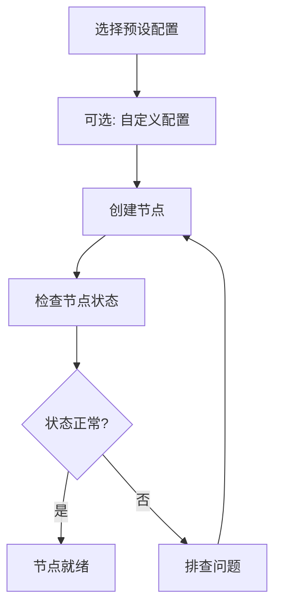

# 创建第一个节点

本文档将详细介绍如何创建和配置你的第一个 DeP2P 节点。

---

## 节点创建流程



---

## 使用预设配置（推荐）

### 基础创建

```go
package main

import (
    "context"
    "fmt"
    "log"
    
    "github.com/dep2p/go-dep2p"
)

func main() {
    ctx := context.Background()
    
    // 使用 Desktop 预设创建节点
    node, err := dep2p.StartNode(ctx, dep2p.WithPreset(dep2p.PresetDesktop))
    if err != nil {
        log.Fatalf("创建节点失败: %v", err)
    }
    defer node.Close()
    
    // 打印节点信息
    fmt.Printf("节点 ID: %s\n", node.ID())
    fmt.Printf("监听地址: %v\n", node.ListenAddrs())
}
```

### 预设配置对比

| 预设 | 场景 | 连接数 | NAT | Relay | Liveness | 说明 |
|------|------|--------|-----|-------|----------|------|
| `PresetMobile` | 移动端 | 20/50 | ✅ | ✅ | ✅ | 省电优化 |
| `PresetDesktop` | 桌面端 | 50/100 | ✅ | ✅ | ✅ | 默认推荐 |
| `PresetServer` | 服务器 | 200/500 | ✅ | ✅ | ✅ | 可作中继 |
| `PresetMinimal` | 测试 | 10/20 | ❌ | ❌ | ❌ | 最小配置 |
| `PresetTest` | 单测 | 5/10 | ❌ | ❌ | ✅ | 快速测试 |

---

## 自定义配置

### 指定监听端口

```go
node, err := dep2p.StartNode(ctx,
    dep2p.WithPreset(dep2p.PresetDesktop),
    dep2p.WithListenPort(4001),  // 指定端口
)
```

### 使用固定身份

默认情况下，每次启动会生成新的临时身份。如需固定身份（推荐用于服务器）：

```go
// 方法一：使用身份文件（推荐）
node, err := dep2p.StartNode(ctx,
    dep2p.WithPreset(dep2p.PresetServer),
    dep2p.WithIdentityFile("./node.key"),  // 首次运行自动生成
)

// 方法二：编程式生成密钥
key, err := dep2p.GenerateKey()
if err != nil {
    log.Fatal(err)
}

node, err := dep2p.StartNode(ctx,
    dep2p.WithPreset(dep2p.PresetDesktop),
    dep2p.WithIdentity(key),
)
```

### 配置连接限制

```go
node, err := dep2p.StartNode(ctx,
    dep2p.WithPreset(dep2p.PresetDesktop),
    dep2p.WithConnectionLimits(100, 200),  // LowWater, HighWater
)
```

### 配置 Bootstrap 节点

```go
bootstrapPeers := []string{
    "/ip4/1.2.3.4/udp/4001/quic-v1/p2p/5Q2STWvBFn...",
    "/dns4/bootstrap.example.com/udp/4001/quic-v1/p2p/5Q2STWvBFn...",
}

node, err := dep2p.StartNode(ctx,
    dep2p.WithPreset(dep2p.PresetDesktop),
    dep2p.WithBootstrapPeers(bootstrapPeers),
)
```

> ⚠️ **注意**：Bootstrap 地址必须使用完整格式（含 `/p2p/<NodeID>`）。

---

## 节点状态检查

### 基本信息

```go
// 节点 ID（公钥身份，Base58 编码）
fmt.Printf("节点 ID: %s\n", node.ID())

// 本地监听地址
fmt.Printf("监听地址: %v\n", node.ListenAddrs())

// 对外通告地址（其他节点可用来连接你）
fmt.Printf("通告地址: %v\n", node.AdvertisedAddrs())
```

### 检查子系统

```go
// 检查 Realm 管理器
if rm := node.Realm(); rm != nil {
    fmt.Printf("当前 Realm: %s\n", rm.CurrentRealm())
}

// 检查 Endpoint
if ep := node.Endpoint(); ep != nil {
    fmt.Printf("Endpoint 就绪\n")
}

// 检查连接管理器
if cm := node.ConnectionManager(); cm != nil {
    fmt.Printf("连接管理器就绪\n")
}
```

---

## 完整示例

```go
package main

import (
    "context"
    "fmt"
    "log"
    "os"
    "os/signal"
    "syscall"
    
    "github.com/dep2p/go-dep2p"
)

func main() {
    ctx, cancel := context.WithCancel(context.Background())
    defer cancel()
    
    // 捕获中断信号
    signalCh := make(chan os.Signal, 1)
    signal.Notify(signalCh, syscall.SIGINT, syscall.SIGTERM)
    go func() {
        <-signalCh
        fmt.Println("\n正在关闭节点...")
        cancel()
    }()
    
    // 创建节点
    node, err := dep2p.StartNode(ctx,
        dep2p.WithPreset(dep2p.PresetDesktop),
        dep2p.WithListenPort(4001),
    )
    if err != nil {
        log.Fatalf("创建节点失败: %v", err)
    }
    defer node.Close()
    
    // 打印节点信息
    fmt.Println("=== DeP2P 节点已启动 ===")
    fmt.Printf("节点 ID: %s\n", node.ID())
    fmt.Println()
    
    fmt.Println("监听地址:")
    for i, addr := range node.ListenAddrs() {
        fmt.Printf("  [%d] %s\n", i+1, addr)
    }
    fmt.Println()
    
    fmt.Println("按 Ctrl+C 退出")
    
    // 等待退出
    <-ctx.Done()
    fmt.Println("节点已关闭")
}
```

---

## 地址格式说明

DeP2P 使用 Multiaddr 格式表示地址：

| 地址类型 | 格式示例 | 说明 |
|----------|----------|------|
| IPv4 + QUIC | `/ip4/192.168.1.1/udp/4001/quic-v1` | 本地/局域网 |
| IPv6 + QUIC | `/ip6/::1/udp/4001/quic-v1` | IPv6 地址 |
| DNS + QUIC | `/dns4/node.example.com/udp/4001/quic-v1` | DNS 解析 |
| 完整地址 | `/ip4/.../udp/4001/quic-v1/p2p/<NodeID>` | 含身份信息 |

> 💡 **提示**：`ListenAddrs()` 返回本地绑定地址，`AdvertisedAddrs()` 返回对外可连接地址。

---

## 常见问题

### Q: 端口被占用

```bash
# 错误: bind: address already in use
```

**解决方案**：

```go
// 使用随机端口
node, _ := dep2p.StartNode(ctx,
    dep2p.WithPreset(dep2p.PresetDesktop),
    dep2p.WithListenPort(0),  // 0 = 随机端口
)
```

### Q: 节点 ID 每次启动都变化

**原因**：默认使用临时身份。

**解决方案**：

```go
// 使用身份文件持久化
node, _ := dep2p.StartNode(ctx,
    dep2p.WithPreset(dep2p.PresetServer),
    dep2p.WithIdentityFile("./node.key"),
)
```

### Q: 无法获取公网地址

**原因**：NAT 探测需要时间，或需要 Relay 支持。

**解决方案**：

```go
// 等待地址就绪
time.Sleep(3 * time.Second)
fmt.Println("通告地址:", node.AdvertisedAddrs())
```

---

## 下一步

- [加入第一个 Realm](first-realm.md) - 加入业务网络
- [常见问题](faq.md) - 更多问题解答
- [预设配置参考](../reference/presets.md) - 详细预设说明
