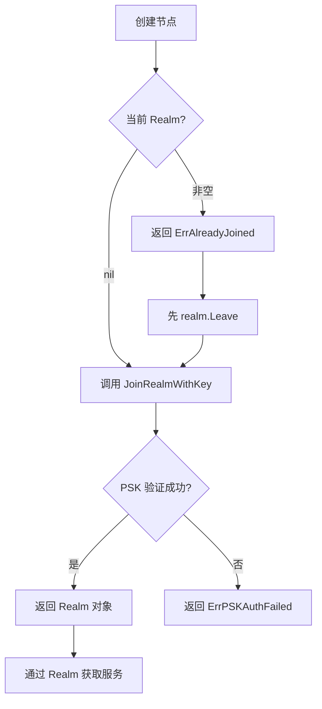

# 加入第一个 Realm

本文档将介绍 Realm 的概念以及如何加入你的第一个 Realm。

---

## 什么是 Realm？

Realm 是 DeP2P 的**业务隔离租户**，类似于：

- Kubernetes 的 Namespace
- 云厂商的 VPC（Virtual Private Cloud）
- 数据库的 Schema

```
┌─────────────────────────────────────────────────────────────────────────┐
│                         Realm 业务隔离                                   │
├─────────────────────────────────────────────────────────────────────────┤
│                                                                          │
│   ┌─────────────┐    ┌─────────────┐    ┌─────────────┐                 │
│   │  Realm A    │    │  Realm B    │    │  Realm C    │                 │
│   │  区块链主网  │    │  链游测试网  │    │  存储网络    │                 │
│   │             │    │             │    │             │                 │
│   │ ├─ 独立发现  │    │ ├─ 独立发现  │    │ ├─ 独立发现  │                 │
│   │ ├─ 独立消息  │    │ ├─ 独立消息  │    │ ├─ 独立消息  │                 │
│   │ └─ 独立订阅  │    │ └─ 独立订阅  │    │ └─ 独立订阅  │                 │
│   └─────────────┘    └─────────────┘    └─────────────┘                 │
│          │                 │                  │                          │
│          └─────────────────┴──────────────────┘                          │
│                            │                                             │
│   ┌────────────────────────┴────────────────────────────────────────┐   │
│   │              系统基础层（共享 DHT/Relay/NAT）                      │   │
│   └─────────────────────────────────────────────────────────────────┘   │
│                                                                          │
└─────────────────────────────────────────────────────────────────────────┘
```

---

## 为什么需要 Realm？

### 核心原则

1. **每个节点同一时间只能加入一个 Realm**  
   严格单 Realm 模型，避免混乱和安全问题。

2. **业务 API 必须先 JoinRealm**  
   以下 API 必须先加入 Realm 才能使用：
   - `Node.Send` / `Node.Request`
   - `Node.Publish` / `Node.Subscribe`

3. **系统 API 不受限制**  
   以下 API 不需要 JoinRealm：
   - `Node.Connect` / `Node.ConnectToAddr`
   - `Node.ListenAddrs` / `Node.AdvertisedAddrs`
   - Discovery / NAT / Relay

### 使用场景

- **隔离不同应用的数据**：应用 A 的消息不会被应用 B 收到
- **防止跨租户攻击**：恶意节点无法伪装成其他 Realm 成员
- **简化编程模型**：框架层面保证隔离，无需每次传递 `tenantID`

---

## 加入 Realm（IMPL-1227 更新）

### JoinRealmWithKey 流程



### 基础用法

```go
package main

import (
    "context"
    "fmt"
    "log"
    
    "github.com/dep2p/go-dep2p"
    "github.com/dep2p/go-dep2p/pkg/types"
)

func main() {
    ctx := context.Background()
    
    // Step 1: 创建节点
    node, err := dep2p.StartNode(ctx, dep2p.WithPreset(dep2p.PresetDesktop))
    if err != nil {
        log.Fatal(err)
    }
    defer node.Close()
    
    fmt.Printf("节点 ID: %s\n", node.ID())
    fmt.Printf("当前 Realm: %v\n", node.CurrentRealm())  // 输出: nil
    
    // Step 2: 使用 realmKey 加入 Realm
    // realmKey 是 32 字节的高熵随机数，用于 PSK 成员认证
    realmKey := types.GenerateRealmKey() // 首次创建
    // 或: realmKey, _ := types.RealmKeyFromHex("abcdef...") // 从配置读取
    
    realm, err := node.JoinRealmWithKey(ctx, "my-blockchain-mainnet", realmKey)
    if err != nil {
        log.Fatalf("加入 Realm 失败: %v", err)
    }
    
    // realm.ID() 是从 realmKey 派生的唯一标识
    fmt.Printf("已加入: %s (ID: %s)\n", realm.Name(), realm.ID())
    
    // Step 3: 通过 Realm 对象获取 Layer 3 服务
    messaging := realm.Messaging()
    pubsub := realm.PubSub()
    
    fmt.Println("可以开始发送消息了！")
    
    // 发送消息（协议自动添加 Realm 前缀）
    // messaging.SendWithProtocol(ctx, targetID, "chat/1.0.0", data)
    
    // PubSub
    // topic, _ := pubsub.Join(ctx, "news")
}
```

---

## PSK 成员认证（IMPL-1227）

IMPL-1227 采用 **PSK (Pre-Shared Key)** 作为唯一的成员认证机制：

```
┌─────────────────────────────────────────────────────────────────────────────┐
│                       PSK 成员认证流程                                        │
├─────────────────────────────────────────────────────────────────────────────┤
│                                                                             │
│   1. 创建者生成 realmKey（32字节高熵随机数）                                  │
│   2. 通过安全渠道分享 realmKey 给成员                                        │
│   3. 成员使用 JoinRealmWithKey(ctx, name, realmKey) 加入                    │
│   4. RealmID 从 realmKey 派生：SHA256("dep2p-realm-id-v1" || H(realmKey))   │
│   5. 只有持有 realmKey 的节点才能加入同一个 Realm                            │
│                                                                             │
└─────────────────────────────────────────────────────────────────────────────┘
```

### 创建 Realm

```go
// 生成 realmKey（首次创建 Realm）
realmKey := types.GenerateRealmKey()

// 保存 realmKey（分享给其他成员）
fmt.Printf("RealmKey: %s\n", realmKey.String())

// 加入 Realm
realm, err := node.JoinRealmWithKey(ctx, "my-team", realmKey)
```

### 加入已有 Realm

```go
// 从配置或其他成员处获取 realmKey
realmKey, err := types.RealmKeyFromHex("abcdef1234...")
if err != nil {
    log.Fatal("无效的 realmKey")
}

// 加入 Realm（必须使用相同的 realmKey）
realm, err := node.JoinRealmWithKey(ctx, "my-team", realmKey)
```

### RealmID 特性

- **确定性**：相同 realmKey 总是派生相同 RealmID
- **不可逆**：无法从 RealmID 反推 realmKey
- **不可枚举**：无法猜测其他 Realm 的 RealmID
- **隔离性**：不同 realmKey 派生不同 RealmID，天然隔离

---

## Realm 切换

**严格单 Realm**：节点同时只能在一个业务 Realm 中。

```go
// 加入 mainnet
err := node.Realm().JoinRealm(ctx, "chain-mainnet")
fmt.Println(node.Realm().CurrentRealm())  // chain-mainnet

// 尝试直接切换到 testnet（会失败）
err = node.Realm().JoinRealm(ctx, "chain-testnet")
// err == ErrAlreadyJoined

// 正确做法：先 Leave 再 Join
_ = node.Realm().LeaveRealm()
err = node.Realm().JoinRealm(ctx, "chain-testnet")
fmt.Println(node.Realm().CurrentRealm())  // chain-testnet
```

---

## 常见错误

### ErrNotMember

未加入 Realm 就调用业务 API：

```go
// ❌ 错误示例：未加入 Realm 就调用业务 API
node, _ := dep2p.StartNode(ctx, dep2p.WithPreset(dep2p.PresetDesktop))
realm := node.CurrentRealm()  // 返回 nil
if realm != nil {
    err := realm.Messaging().Send(ctx, peerID, "/dep2p/app/chat/1.0.0", []byte("hello"))
    fmt.Println(err)
} else {
    fmt.Println("ErrNotMember")  // 未加入 Realm
}

// ✅ 正确示例：先加入 Realm，再使用 Messaging API
node, _ := dep2p.StartNode(ctx, dep2p.WithPreset(dep2p.PresetDesktop))
realmKey := types.GenerateRealmKey()
realm, _ := node.JoinRealmWithKey(ctx, "my-realm", realmKey)
err := realm.Messaging().Send(ctx, peerID, "/dep2p/app/chat/1.0.0", []byte("hello"))
fmt.Println(err)  // nil
```

### ErrAlreadyJoined

已在某个 Realm 中，又尝试 Join：

```go
// ❌ 错误示例
node.Realm().JoinRealm(ctx, "mainnet")
err := node.Realm().JoinRealm(ctx, "testnet")
fmt.Println(err)  // ErrAlreadyJoined

// ✅ 正确示例
node.Realm().JoinRealm(ctx, "mainnet")
_ = node.Realm().LeaveRealm()  // 先离开
err := node.Realm().JoinRealm(ctx, "testnet")
fmt.Println(err)  // nil
```

---

## 完整示例

```go
package main

import (
    "context"
    "fmt"
    "log"
    
    "github.com/dep2p/go-dep2p"
)

func main() {
    ctx := context.Background()
    
    // 创建节点
    node, err := dep2p.StartNode(ctx, dep2p.WithPreset(dep2p.PresetDesktop))
    if err != nil {
        log.Fatal(err)
    }
    defer node.Close()
    
    rm := node.Realm()
    
    // 演示 Realm 生命周期
    fmt.Println("=== Realm 生命周期演示 ===")
    
    // 1. 初始状态
    fmt.Printf("1. 初始 Realm: '%s'\n", rm.CurrentRealm())
    
    // 2. 加入 Realm
    if err := rm.JoinRealm(ctx, "demo-realm"); err != nil {
        log.Fatal(err)
    }
    fmt.Printf("2. 加入后: '%s'\n", rm.CurrentRealm())
    
    // 3. 尝试重复加入（会失败）
    err = rm.JoinRealm(ctx, "another-realm")
    fmt.Printf("3. 重复加入结果: %v\n", err)
    
    // 4. 离开 Realm
    if err := rm.LeaveRealm(); err != nil {
        log.Fatal(err)
    }
    fmt.Printf("4. 离开后: '%s'\n", rm.CurrentRealm())
    
    // 5. 加入新 Realm
    if err := rm.JoinRealm(ctx, "new-realm"); err != nil {
        log.Fatal(err)
    }
    fmt.Printf("5. 新 Realm: '%s'\n", rm.CurrentRealm())
}
```

输出：

```
=== Realm 生命周期演示 ===
1. 初始 Realm: ''
2. 加入后: 'demo-realm'
3. 重复加入结果: ErrAlreadyJoined
4. 离开后: ''
5. 新 Realm: 'new-realm'
```

---

## 下一步

- [常见问题](faq.md) - 更多问题解答
- [核心概念](../concepts/core-concepts.md) - 深入理解 Realm
- [Realm 教程](../tutorials/04-realm-application.md) - 构建 Realm 应用
