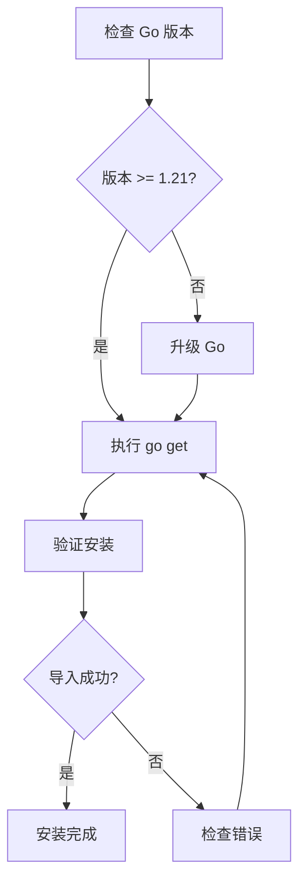

# 安装

本文档将指导你完成 DeP2P 的安装和环境配置。

---

## 环境要求

在安装 DeP2P 之前，请确保你的系统满足以下要求：

| 要求 | 版本 | 说明 |
|------|------|------|
| **Go** | 1.21+ | 推荐使用最新稳定版 |
| **操作系统** | Linux / macOS / Windows | 全平台支持 |
| **网络** | UDP 支持 | QUIC 协议需要 UDP |

### 检查 Go 版本

```bash
go version
# 输出示例: go version go1.21.0 darwin/arm64
```

> ⚠️ **注意**：如果 Go 版本低于 1.21，请先升级 Go。

---

## 安装方法

### 方法一：使用 go get（推荐）

```bash
go get github.com/dep2p/go-dep2p
```

### 方法二：使用 go mod

在你的项目中添加依赖：

```bash
# 初始化模块（如果尚未初始化）
go mod init your-project

# 添加 dep2p 依赖
go get github.com/dep2p/go-dep2p@latest
```

### 方法三：从源码构建

```bash
# 克隆仓库
git clone https://github.com/dep2p/go-dep2p.git
cd go-dep2p

# 构建
go build ./...

# 运行测试
go test ./...
```

---

## 安装流程



---

## 验证安装

创建一个简单的测试文件来验证安装是否成功：

```go
// main.go
package main

import (
    "fmt"
    
    "github.com/dep2p/go-dep2p"
)

func main() {
    fmt.Printf("DeP2P 版本: %s\n", dep2p.Version)
    fmt.Println("安装成功！")
}
```

运行测试：

```bash
go run main.go
# 输出:
# DeP2P 版本: v0.2.0-beta.1
# 安装成功！
```

---

## 项目结构

安装完成后，典型的项目结构如下：

```
your-project/
├── go.mod              # Go 模块文件
├── go.sum              # 依赖校验文件
├── main.go             # 主程序
└── ...
```

`go.mod` 文件中应包含：

```
module your-project

go 1.21

require github.com/dep2p/go-dep2p v0.2.0-beta.1
```

---

## 常见问题

### Q: go get 超时或失败

**A**: 尝试以下解决方案：

```bash
# 设置 Go 代理（中国大陆用户）
go env -w GOPROXY=https://goproxy.cn,direct

# 重试安装
go get github.com/dep2p/go-dep2p
```

### Q: 编译错误：找不到包

**A**: 确保正确初始化了 Go 模块：

```bash
# 检查是否在模块中
go env GOMOD
# 如果输出为空，需要初始化模块
go mod init your-project
go mod tidy
```

### Q: 运行时网络错误

**A**: DeP2P 使用 QUIC 协议（基于 UDP），请确保：

1. 防火墙允许 UDP 流量
2. 端口未被占用
3. 网络支持 UDP（某些企业网络可能禁用）

### Q: 依赖版本冲突

**A**: 更新所有依赖到最新版本：

```bash
go get -u ./...
go mod tidy
```

---

## 下一步

安装完成后，继续学习：

- [5 分钟上手](quickstart.md) - 快速运行第一个示例
- [创建第一个节点](first-node.md) - 详细了解节点创建
- [Hello World 教程](../tutorials/01-hello-world.md) - 完整两节点通信示例
- [核心概念](../concepts/core-concepts.md) - 深入理解 DeP2P
