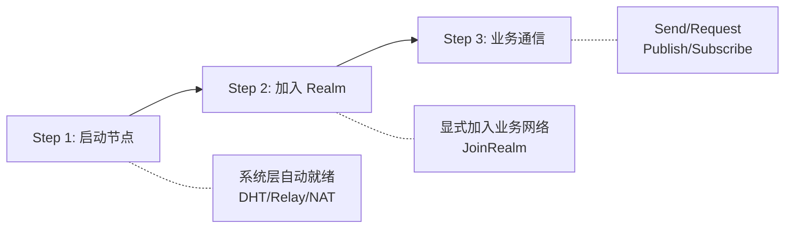

# 5 分钟上手

本文档将帮助你在 5 分钟内运行第一个 DeP2P 节点。

---

## 核心理念

```
┌─────────────────────────────────────────────────────────────────────┐
│                    DeP2P 核心理念                                    │
├─────────────────────────────────────────────────────────────────────┤
│                                                                      │
│   让 P2P 连接像调用函数一样简单：给一个公钥，发个消息                   │
│                                                                      │
│   • 用户只需关心「连接谁」，不需关心「地址在哪」                        │
│   • 复杂的网络细节（NAT 穿透、地址发现、连接管理）由库自动处理          │
│   • 简单场景简单用，复杂场景可扩展                                    │
│                                                                      │
└─────────────────────────────────────────────────────────────────────┘
```

---

## 三步走流程

DeP2P 的使用遵循简单的三步走流程：



```
┌─────────────────────────────────────────────────────────────────────────┐
│                      DeP2P 三步走                                        │
├─────────────────────────────────────────────────────────────────────────┤
│  Step 1: NewNode()     启动节点，系统层自动就绪（DHT/Relay/NAT）            │
│  Step 2: JoinRealm()   加入业务网络（必须！否则业务 API 返回 ErrNotMember） │
│  Step 3: Send/Publish  使用业务 API 进行通信                              │
└─────────────────────────────────────────────────────────────────────────┘
```

---

## 最简示例（IMPL-1227 更新）

### 创建并启动节点

```go
package main

import (
    "context"
    "fmt"
    "log"
    
    "github.com/dep2p/go-dep2p"
    "github.com/dep2p/go-dep2p/pkg/types"
)

func main() {
    ctx := context.Background()
    
    // Step 1: 创建节点（一行代码）
    node, err := dep2p.StartNode(ctx, dep2p.WithPreset(dep2p.PresetDesktop))
    if err != nil {
        log.Fatalf("启动节点失败: %v", err)
    }
    defer node.Close()
    
    // 打印节点信息
    fmt.Printf("节点 ID: %s\n", node.ID())
    fmt.Printf("监听地址: %v\n", node.ListenAddrs())
    
    // Step 2: 使用 realmKey 加入业务网络（PSK 认证）
    // realmKey 是 32 字节的高熵随机数，成员间共享
    realmKey := types.GenerateRealmKey()
    fmt.Printf("RealmKey: %s\n", realmKey.String()) // 保存并分享给成员
    
    realm, err := node.JoinRealmWithKey(ctx, "my-first-realm", realmKey)
    if err != nil {
        log.Fatalf("加入 Realm 失败: %v", err)
    }
    fmt.Printf("已加入: %s (ID: %s)\n", realm.Name(), realm.ID())
    
    // Step 3: 通过 Realm 对象使用业务 API
    messaging := realm.Messaging()
    pubsub := realm.PubSub()
    
    fmt.Println("节点已就绪，可以开始通信！")
    
    // 发送消息示例
    // messaging.SendWithProtocol(ctx, targetID, "chat/1.0.0", []byte("Hello"))
    
    // PubSub 示例
    // topic, _ := pubsub.Join(ctx, "news")
    // topic.Publish(ctx, []byte("Hello everyone!"))
}
```

运行：

```bash
go run main.go
# 输出:
# 节点 ID: 5Q2STWvBFn...  (Base58 编码的公钥)
# 监听地址: [/ip4/0.0.0.0/udp/xxxxx/quic-v1]
# RealmKey: abcdef123456...  (64字符十六进制)
# 已加入: my-first-realm (ID: 7890...)
# 节点已就绪，可以开始通信！
```

---

## 三层架构

DeP2P 采用三层架构设计：

```
┌─────────────────────────────────────────────────────────────────────┐
│                    DeP2P 三层架构                                    │
├─────────────────────────────────────────────────────────────────────┤
│                                                                      │
│  Layer 3: 应用协议层 (Application Protocols)                        │
│           /dep2p/app/* 协议、流/订阅消息                             │
│           [!] 必须加入 Realm 后才能使用                              │
│                                                                      │
│  Layer 2: Realm 层 (Business Isolation)                              │
│           业务隔离、成员管理、准入控制                                │
│           [*] 用户显式加入，严格单 Realm                             │
│                                                                      │
│  Layer 1: 系统基础层 (Infrastructure)                                │
│           Transport/Security/DHT/Relay/NAT/Bootstrap                 │
│           [~] 节点启动自动就绪，用户无感知                            │
│                                                                      │
└─────────────────────────────────────────────────────────────────────┘
```

---

## 预设配置

DeP2P 提供多种预设配置，适应不同场景：

| 预设 | 适用场景 | 连接限制 | 说明 |
|------|---------|----------|------|
| `PresetMobile` | 手机、平板 | 20/50 | 低资源占用 |
| `PresetDesktop` | PC、笔记本 | 50/100 | 默认配置 |
| `PresetServer` | 服务器 | 200/500 | 高性能 |
| `PresetMinimal` | 测试 | 10/20 | 最小配置 |

```go
// 使用预设
node, _ := dep2p.StartNode(ctx, dep2p.WithPreset(dep2p.PresetDesktop))

// 服务器场景
node, _ := dep2p.StartNode(ctx, dep2p.WithPreset(dep2p.PresetServer))

// 移动端场景
node, _ := dep2p.StartNode(ctx, dep2p.WithPreset(dep2p.PresetMobile))
```

---

## 身份优先

> **核心原则**：在 DeP2P 中，连接目标是身份（NodeID），而不是地址。

```
┌─────────────────────────────────────────────────────────────────────────────┐
│                    身份第一性原则                                            │
├─────────────────────────────────────────────────────────────────────────────┤
│                                                                              │
│   传统方式: connect("192.168.1.100:4001")  // 连接到地址（无身份保证）       │
│   DeP2P:    connect(nodeID)                 // 连接到身份（自动查找地址）    │
│                                                                              │
│   ✅ DeP2P 的正确理解：                                                      │
│   • 连接目标永远是 NodeID（公钥身份）                                       │
│   • IP/端口只是 Dial Address（拨号路径提示）                                │
│   • 任何连接都验证 RemoteIdentity == ExpectedNodeID                         │
│                                                                              │
└─────────────────────────────────────────────────────────────────────────────┘
```

---

## 常见错误

### ErrNotMember

```go
// ❌ 错误：未 JoinRealmWithKey 就调用业务 API
node, _ := dep2p.StartNode(ctx, dep2p.WithPreset(dep2p.PresetDesktop))
messaging := node.CurrentRealm().Messaging()  // CurrentRealm() 返回 nil，会 panic
err := messaging.Send(ctx, peerID, data)      // 或者直接调用会返回 ErrNotMember
// err == ErrNotMember

// ✅ 正确：先用 realmKey 加入 Realm
node, _ := dep2p.StartNode(ctx, dep2p.WithPreset(dep2p.PresetDesktop))
realmKey := types.GenerateRealmKey()
realm, _ := node.JoinRealmWithKey(ctx, "my-realm", realmKey)
err := realm.Messaging().Send(ctx, peerID, "/my/protocol/1.0", data)
// err == nil
```

---

## 遇到问题？

```
┌─────────────────────────────────────────────────────────────────────┐
│                         遇到问题？快速排查                           │
├─────────────────────────────────────────────────────────────────────┤
│                                                                      │
│  ErrNotMember         → 先调用 JoinRealmWithKey()                   │
│  连接超时             → 检查网络、启用 Relay                         │
│  地址格式错误         → 使用 ShareableAddrs() 获取完整地址          │
│  认证失败             → 确保所有成员使用相同的 realmKey             │
│                                                                      │
└─────────────────────────────────────────────────────────────────────┘
```

详细排障指南：
- [故障排查](../how-to/troubleshooting.md) - 问题诊断与解决
- [错误码参考](../reference/error-codes.md) - 所有错误的详细说明
- [API 约束](../reference/api-defaults.md) - 核心约束与默认行为

---

## 下一步

- [创建第一个节点](first-node.md) - 详细了解节点配置
- [加入第一个 Realm](first-realm.md) - 理解 Realm 概念
- [常见问题](faq.md) - 解决常见问题
- [核心概念](../concepts/core-concepts.md) - 深入理解架构
