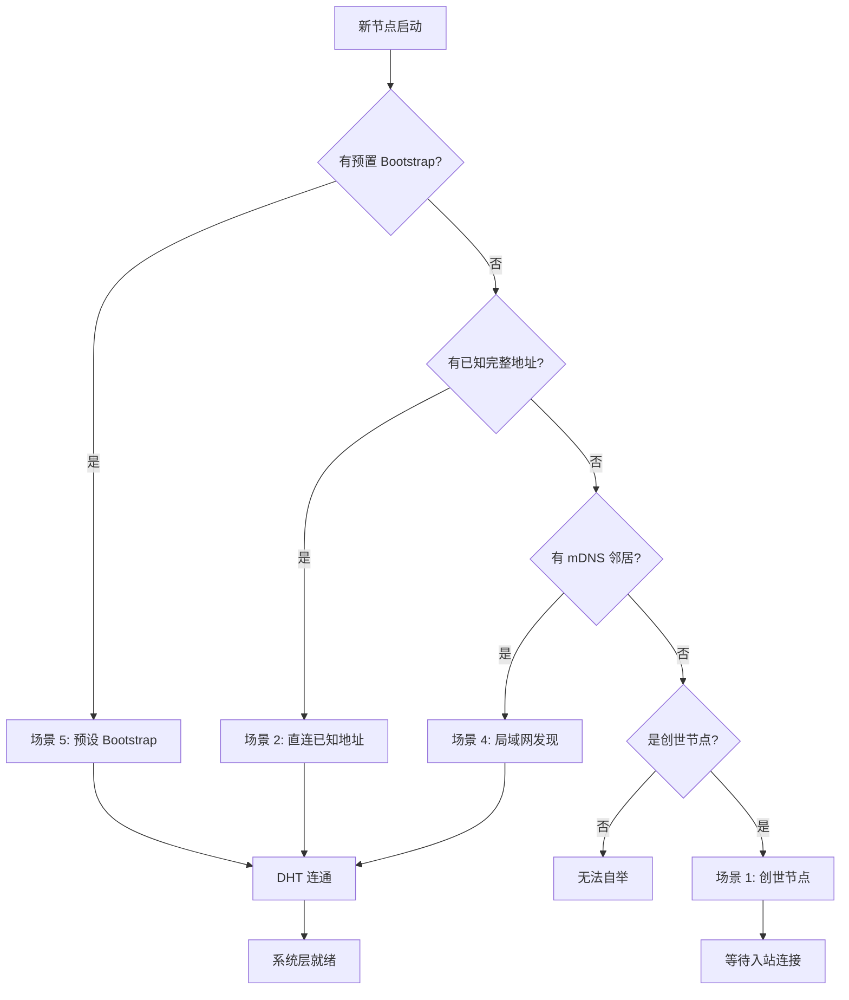
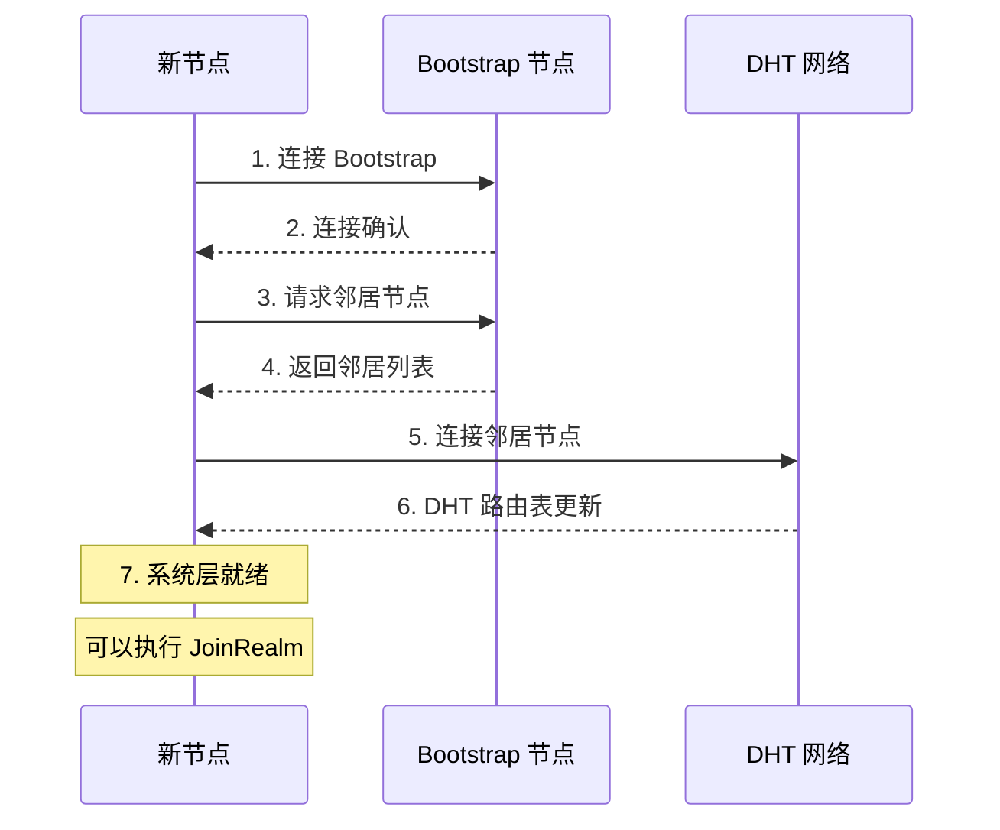

# 如何 Bootstrap 网络

本指南解答：**如何让新节点加入 DeP2P 网络？**

---

## 问题

```
┌─────────────────────────────────────────────────────────────────────┐
│                         我要解决什么问题？                           │
├─────────────────────────────────────────────────────────────────────┤
│                                                                      │
│  "我启动了一个新节点，如何让它加入现有网络？"                        │
│  "如何配置 Bootstrap 节点？"                                         │
│  "创世节点怎么启动？"                                                │
│                                                                      │
└─────────────────────────────────────────────────────────────────────┘
```

---

## Bootstrap 概述

Bootstrap 解决 P2P 网络的"鸡生蛋"问题：要连接节点需要知道地址，要知道地址需要先连接网络。



---

## 六种 Bootstrap 场景

| 场景 | 说明 | 配置 | DHT 依赖 |
|------|------|------|----------|
| **创世节点** | 网络首个节点 | `WithBootstrapPeers(nil)` | 否 |
| **known_peers** ⭐ | 已知节点直连 | `WithKnownPeers()` | 否 |
| **直连已知地址** | 已知完整地址 | `ConnectToAddr()` | 否 |
| **仅 NodeID** | 只知道公钥 | `Connect(nodeID)` | **是** |
| **局域网发现** | mDNS 发现 | 自动 | 否 |
| **预设 Bootstrap** | 公共节点 | `PresetDesktop/Server` | 否 |

---

## 推荐：使用 known_peers（私有网络）

对于私有网络或云服务器部署，推荐使用 `known_peers` 配置：

```go
import "github.com/dep2p/go-dep2p/config"

node, _ := dep2p.New(ctx,
    dep2p.WithPreset(dep2p.PresetDesktop),
    dep2p.WithKnownPeers(
        config.KnownPeer{
            PeerID: "12D3KooWxxxxxxxxxxxxxxxxxxxxxxxxxxxxxxxxxxxxxxx",
            Addrs:  []string{"/ip4/1.2.3.4/udp/4001/quic-v1"},
        },
        config.KnownPeer{
            PeerID: "12D3KooWyyyyyyyyyyyyyyyyyyyyyyyyyyyyyyyyyyyyyyy",
            Addrs:  []string{"/ip4/5.6.7.8/udp/4001/quic-v1"},
        },
    ),
    dep2p.WithBootstrapPeers(nil),  // 禁用公共 Bootstrap
)
```

**优势**：
- 启动即连接，无需等待 DHT
- 不依赖公共 Bootstrap 节点
- 适合私有集群、云服务器部署

**与 Bootstrap 的区别**：

| 特性 | known_peers | Bootstrap |
|------|-------------|-----------|
| 连接时机 | 启动即连接 | DHT 初始化后 |
| 依赖 | 仅目标节点在线 | Bootstrap 服务 |
| 用途 | 直接连接 | DHT 引导 |

详细配置请参考：[配置参考](../reference/configuration.md#withknownpeers-)

---

## 场景 1：创世节点（无 Bootstrap）

当你是网络的第一个节点时，不需要 Bootstrap。

```go
package main

import (
    "context"
    "fmt"
    "log"
    "os"
    "os/signal"
    "syscall"

    "github.com/dep2p/go-dep2p"
    "github.com/dep2p/go-dep2p/pkg/types"
)

func main() {
    ctx, cancel := context.WithCancel(context.Background())
    defer cancel()

    // 创世节点：显式传入 nil 表示无 Bootstrap
    node, err := dep2p.New(ctx,
        dep2p.WithPreset(dep2p.PresetServer),
        dep2p.WithBootstrapPeers(nil),  // 关键：无 Bootstrap
        dep2p.WithListenPort(4001),     // 固定端口
    )
    if err != nil {
        log.Fatalf("创建节点失败: %v", err)
    }
    if err := node.Start(ctx); err != nil {
        log.Fatalf("启动节点失败: %v", err)
    }
    defer node.Close()

    // 加入 Realm
    realm := node.Realm("my-network")
    realm.Join(ctx)

    fmt.Println("创世节点已启动")
    fmt.Printf("NodeID: %s\n", node.ID())
    fmt.Println()
    fmt.Println("其他节点可以使用以下地址连接：")
    for _, addr := range node.ListenAddrs() {
        fmt.Printf("  %s/p2p/%s\n", addr, node.ID())
    }

    // 等待中断信号
    sigCh := make(chan os.Signal, 1)
    signal.Notify(sigCh, syscall.SIGINT, syscall.SIGTERM)
    <-sigCh
}
```

---

## 场景 2：使用预设 Bootstrap

最简单的方式，使用内置的预设配置。

```go
package main

import (
    "context"
    "fmt"
    "log"

    "github.com/dep2p/go-dep2p"
    "github.com/dep2p/go-dep2p/pkg/types"
)

func main() {
    ctx := context.Background()

    // PresetDesktop/PresetServer 包含默认 Bootstrap 节点
    node, err := dep2p.New(ctx,
        dep2p.WithPreset(dep2p.PresetDesktop),  // 包含默认 Bootstrap
    )
    if err != nil {
        log.Fatalf("创建节点失败: %v", err)
    }
    if err := node.Start(ctx); err != nil {
        log.Fatalf("启动节点失败: %v", err)
    }
    defer node.Close()

    // 加入 Realm
    realm := node.Realm("my-network")
    realm.Join(ctx)

    fmt.Printf("节点已启动: %s\n", node.ID().ShortString())
    fmt.Println("已自动连接到默认 Bootstrap 节点")
}
```

### 预设配置对比

| 预设 | Bootstrap 节点 | 适用场景 |
|------|---------------|----------|
| `PresetMinimal` | 无 | 测试、创世节点 |
| `PresetDesktop` | 有 | 桌面应用 |
| `PresetServer` | 有 | 服务器 |
| `PresetMobile` | 有 | 移动端 |

---

## 场景 3：自定义 Bootstrap 节点

指定自己的 Bootstrap 节点。

```go
package main

import (
    "context"
    "fmt"
    "log"

    "github.com/dep2p/go-dep2p"
    "github.com/dep2p/go-dep2p/pkg/types"
)

func main() {
    ctx := context.Background()

    // 自定义 Bootstrap 节点
    // 注意：必须是 Full Address（包含 /p2p/<NodeID>）
    bootstrapPeers := []string{
        "/ip4/1.2.3.4/udp/4001/quic-v1/p2p/5Q2STWvBFn...",
        "/dns4/bootstrap.example.com/udp/4001/quic-v1/p2p/5Q2STWvBFn...",
    }

    node, err := dep2p.New(ctx,
        dep2p.WithPreset(dep2p.PresetDesktop),
        dep2p.WithBootstrapPeers(bootstrapPeers...),  // 覆盖默认 Bootstrap
    )
    if err != nil {
        log.Fatalf("创建节点失败: %v", err)
    }
    if err := node.Start(ctx); err != nil {
        log.Fatalf("启动节点失败: %v", err)
    }
    defer node.Close()

    realm := node.Realm("my-network")
    realm.Join(ctx)

    fmt.Printf("节点已启动: %s\n", node.ID().ShortString())
}
```

### Bootstrap 地址格式要求

```
┌─────────────────────────────────────────────────────────────────────┐
│                    Bootstrap 地址格式要求                            │
├─────────────────────────────────────────────────────────────────────┤
│                                                                      │
│  ✅ 正确格式（Full Address）：                                       │
│     /ip4/1.2.3.4/udp/4001/quic-v1/p2p/5Q2STWvBFn...                 │
│     /dns4/bootstrap.example.com/udp/4001/quic-v1/p2p/5Q2STWvBFn...  │
│                                                                      │
│  ❌ 错误格式（Dial Address，缺少 /p2p/ 后缀）：                      │
│     /ip4/1.2.3.4/udp/4001/quic-v1                                   │
│                                                                      │
│  ❌ 错误格式（Relay Address，不能用于 Bootstrap）：                  │
│     /ip4/.../p2p/.../p2p-circuit/p2p/...                            │
│                                                                      │
└─────────────────────────────────────────────────────────────────────┘
```

---

## 场景 4：直连已知地址

当你已经知道某个节点的完整地址时。

```go
package main

import (
    "context"
    "fmt"
    "log"

    "github.com/dep2p/go-dep2p"
    "github.com/dep2p/go-dep2p/pkg/types"
)

func main() {
    ctx := context.Background()

    // 使用 Minimal 预设（无默认 Bootstrap）
    node, err := dep2p.New(ctx,
        dep2p.WithPreset(dep2p.PresetMinimal),
    )
    if err != nil {
        log.Fatalf("创建节点失败: %v", err)
    }
    if err := node.Start(ctx); err != nil {
        log.Fatalf("启动节点失败: %v", err)
    }
    defer node.Close()

    realm := node.Realm("my-network")
    realm.Join(ctx)

    // 直接连接到已知地址
    targetAddr := "/ip4/192.168.1.100/udp/4001/quic-v1/p2p/5Q2STWvBFn..."
    conn, err := node.ConnectToAddr(ctx, targetAddr)
    if err != nil {
        log.Fatalf("连接失败: %v", err)
    }

    fmt.Printf("已连接到: %s\n", conn.RemoteID().ShortString())
}
```

---

## 场景 5：局域网 mDNS 发现

同一局域网内的节点会自动发现。

```go
package main

import (
    "context"
    "fmt"
    "log"
    "time"

    "github.com/dep2p/go-dep2p"
    "github.com/dep2p/go-dep2p/pkg/types"
)

func main() {
    ctx := context.Background()

    // mDNS 默认启用
    node, err := dep2p.New(ctx,
        dep2p.WithPreset(dep2p.PresetDesktop),
    )
    if err != nil {
        log.Fatalf("创建节点失败: %v", err)
    }
    if err := node.Start(ctx); err != nil {
        log.Fatalf("启动节点失败: %v", err)
    }
    defer node.Close()

    realm := node.Realm("my-network")
    realm.Join(ctx)

    // 设置连接通知
    node.Endpoint().SetConnectedNotify(func(conn dep2p.Connection) {
        fmt.Printf("发现并连接到局域网节点: %s\n", conn.RemoteID().ShortString())
    })

    fmt.Println("等待局域网节点...")
    fmt.Println("在同一网络启动另一个节点即可自动发现")
    
    time.Sleep(60 * time.Second)
}
```

---

## Bootstrap 流程



---

## 完整示例：动态添加 Bootstrap

```go
package main

import (
    "context"
    "fmt"
    "log"
    "os"

    "github.com/dep2p/go-dep2p"
    "github.com/dep2p/go-dep2p/pkg/types"
)

func main() {
    ctx := context.Background()

    // 从环境变量或命令行获取 Bootstrap 地址
    bootstrapAddr := os.Getenv("BOOTSTRAP_ADDR")
    
    var opts []dep2p.Option
    opts = append(opts, dep2p.WithPreset(dep2p.PresetDesktop))
    
    if bootstrapAddr != "" {
        // 使用指定的 Bootstrap
        opts = append(opts, dep2p.WithBootstrapPeers(bootstrapAddr))
        fmt.Printf("使用 Bootstrap: %s\n", bootstrapAddr)
    } else {
        // 使用默认 Bootstrap
        fmt.Println("使用默认 Bootstrap 节点")
    }

    node, err := dep2p.New(ctx, opts...)
    if err != nil {
        log.Fatalf("创建节点失败: %v", err)
    }
    if err := node.Start(ctx); err != nil {
        log.Fatalf("启动节点失败: %v", err)
    }
    defer node.Close()

    realm := node.Realm("my-network")
    realm.Join(ctx)

    fmt.Printf("节点已启动: %s\n", node.ID().ShortString())
}
```

运行：

```bash
# 使用默认 Bootstrap
go run main.go

# 使用自定义 Bootstrap
BOOTSTRAP_ADDR="/ip4/1.2.3.4/udp/4001/quic-v1/p2p/5Q2STWvBFn..." go run main.go
```

---

## 故障排查

### 问题 1：连接 Bootstrap 失败

**症状**：`failed to connect to bootstrap peer`

**可能原因**：
- Bootstrap 节点不可达
- 地址格式错误
- 防火墙阻止连接

**解决方案**：

```go
// 1. 检查地址格式
addr := "/ip4/1.2.3.4/udp/4001/quic-v1/p2p/5Q2STWvBFn..."
if !strings.Contains(addr, "/p2p/") {
    log.Fatal("Bootstrap 地址必须包含 /p2p/<NodeID>")
}

// 2. 测试网络连通性
// 使用 nc 或 telnet 测试 UDP 端口
// nc -uzv 1.2.3.4 4001

// 3. 使用多个 Bootstrap 节点
node, _ := dep2p.New(ctx,
    dep2p.WithBootstrapPeers(
        "/ip4/1.2.3.4/udp/4001/quic-v1/p2p/...",
        "/ip4/5.6.7.8/udp/4001/quic-v1/p2p/...",  // 备用
    ),
)
_ = node.Start(ctx)
```

### 问题 2：节点无法发现其他节点

**症状**：连接 Bootstrap 成功，但找不到其他节点

**可能原因**：
- 其他节点不在同一 Realm
- DHT 路由表未同步
- 网络隔离

**解决方案**：

```go
// 1. 确保 Realm 一致
realm := node.Realm("my-network")
realm.Join(ctx)

// 2. 等待 DHT 同步
time.Sleep(5 * time.Second)

// 3. 检查连接数
fmt.Printf("当前连接数: %d\n", node.ConnectionCount())
```

### 问题 3：创世节点无法被发现

**症状**：创世节点启动后，其他节点无法连接

**可能原因**：
- 监听地址是私网地址
- 防火墙阻止入站连接
- 未分享正确的地址

**解决方案**：

```go
// 1. 使用公网地址
node, _ := dep2p.New(ctx,
    dep2p.WithPreset(dep2p.PresetServer),
    dep2p.WithListenPort(4001),
    dep2p.WithExternalAddrs("/ip4/公网IP/udp/4001/quic-v1"),
)
_ = node.Start(ctx)

// 2. 获取可分享地址
addrs, _ := node.WaitShareableAddrs(ctx)
fmt.Println("分享此地址:", addrs)
```

---

## 相关文档

- [如何分享地址](share-address.md)
- [如何使用中继](use-relay.md)
- [节点发现](peer-discovery.md)
- [快速开始](../getting-started/quickstart.md)
