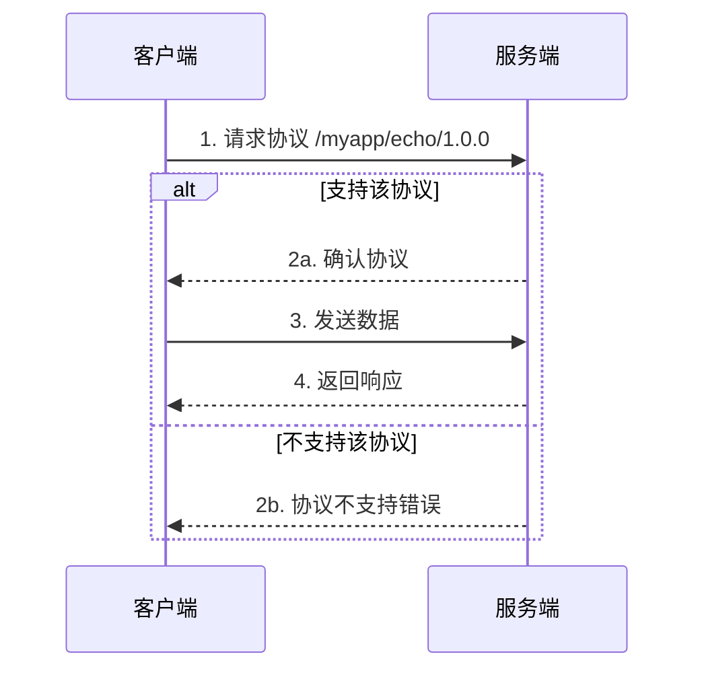
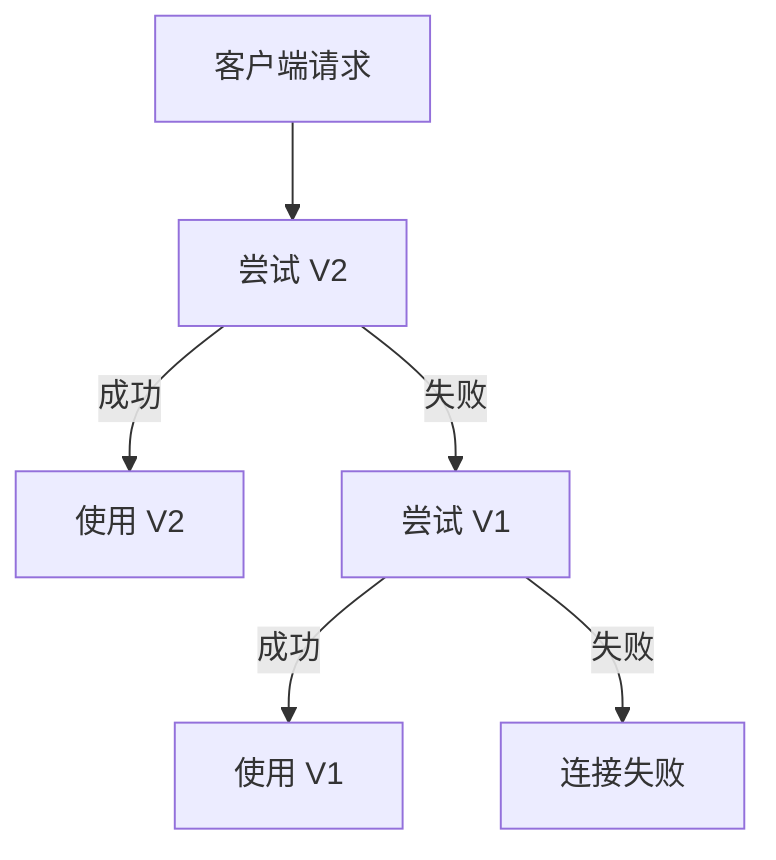

# 自定义协议

本指南解答：**如何定义和使用自定义协议？**

---

## 问题

```
┌─────────────────────────────────────────────────────────────────────┐
│                         我要解决什么问题？                           │
├─────────────────────────────────────────────────────────────────────┤
│                                                                      │
│  "如何定义自己的应用协议？"                                          │
│  "协议 ID 该怎么命名？"                                              │
│  "如何处理协议版本升级？"                                            │
│                                                                      │
└─────────────────────────────────────────────────────────────────────┘
```

---

## 协议标识符规范

```
┌─────────────────────────────────────────────────────────────────────────────┐
│                         协议标识符格式                                       │
├─────────────────────────────────────────────────────────────────────────────┤
│                                                                              │
│  格式：/<namespace>/<protocol>/<version>                                    │
│                                                                              │
│  示例：                                                                      │
│  • /myapp/chat/1.0.0          - 聊天协议 v1.0.0                             │
│  • /myapp/file-transfer/2.0.0 - 文件传输协议 v2.0.0                         │
│  • /company/rpc/1.0.0         - 公司 RPC 协议                               │
│                                                                              │
│  命名规则：                                                                  │
│  • 使用小写字母和短横线                                                     │
│  • 使用语义化版本号                                                         │
│  • 命名空间应唯一标识你的应用                                               │
│                                                                              │
└─────────────────────────────────────────────────────────────────────────────┘
```

---

## 注册协议处理器

### 基础示例

```go
package main

import (
    "context"
    "fmt"
    "io"
    "log"

    "github.com/dep2p/go-dep2p"
    "github.com/dep2p/go-dep2p/pkg/types"
)

// 定义协议 ID
const myProtocol = "/myapp/echo/1.0.0"

func main() {
    ctx := context.Background()

    node, err := dep2p.StartNode(ctx,
        dep2p.WithPreset(dep2p.PresetDesktop),
    )
    if err != nil {
        log.Fatalf("启动失败: %v", err)
    }
    defer node.Close()

    node.Realm().JoinRealm(ctx, types.RealmID("my-network"))

    // 注册协议处理器
    node.Endpoint().SetProtocolHandler(myProtocol, func(stream dep2p.Stream) {
        defer stream.Close()
        
        // 读取请求
        buf := make([]byte, 1024)
        n, err := stream.Read(buf)
        if err != nil && err != io.EOF {
            log.Printf("读取错误: %v", err)
            return
        }
        
        message := string(buf[:n])
        fmt.Printf("收到: %s\n", message)
        
        // 发送响应
        response := fmt.Sprintf("Echo: %s", message)
        stream.Write([]byte(response))
    })

    fmt.Printf("节点已启动: %s\n", node.ID())
    fmt.Printf("协议已注册: %s\n", myProtocol)

    select {}
}
```

---

## 打开协议流

```go
package main

import (
    "context"
    "fmt"
    "io"
    "log"

    "github.com/dep2p/go-dep2p"
    "github.com/dep2p/go-dep2p/pkg/types"
)

const myProtocol = "/myapp/echo/1.0.0"

func main() {
    ctx := context.Background()

    node, err := dep2p.StartNode(ctx,
        dep2p.WithPreset(dep2p.PresetDesktop),
    )
    if err != nil {
        log.Fatalf("启动失败: %v", err)
    }
    defer node.Close()

    node.Realm().JoinRealm(ctx, types.RealmID("my-network"))

    // 连接到目标节点
    targetAddr := "/ip4/192.168.1.100/udp/4001/quic-v1/p2p/5Q2STWvBFn..."
    conn, err := node.ConnectToAddr(ctx, targetAddr)
    if err != nil {
        log.Fatalf("连接失败: %v", err)
    }

    // 打开协议流
    stream, err := conn.OpenStream(ctx, myProtocol)
    if err != nil {
        log.Fatalf("打开流失败: %v", err)
    }
    defer stream.Close()

    // 发送消息
    stream.Write([]byte("Hello, World!"))

    // 读取响应
    buf := make([]byte, 1024)
    n, err := stream.Read(buf)
    if err != nil && err != io.EOF {
        log.Fatalf("读取错误: %v", err)
    }

    fmt.Printf("响应: %s\n", string(buf[:n]))
}
```

---

## 协议协商流程



---

## 协议版本管理

### 多版本支持

```go
package main

import (
    "context"
    "fmt"
    "io"
    "log"

    "github.com/dep2p/go-dep2p"
    "github.com/dep2p/go-dep2p/pkg/types"
)

// 定义多个版本
const (
    protocolV1 = "/myapp/chat/1.0.0"
    protocolV2 = "/myapp/chat/2.0.0"
)

func main() {
    ctx := context.Background()

    node, err := dep2p.StartNode(ctx,
        dep2p.WithPreset(dep2p.PresetDesktop),
    )
    if err != nil {
        log.Fatalf("启动失败: %v", err)
    }
    defer node.Close()

    node.Realm().JoinRealm(ctx, types.RealmID("my-network"))

    // 注册 v1 处理器（向后兼容）
    node.Endpoint().SetProtocolHandler(protocolV1, handleV1)
    
    // 注册 v2 处理器（新版本）
    node.Endpoint().SetProtocolHandler(protocolV2, handleV2)

    fmt.Println("已注册协议:")
    fmt.Printf("  %s (旧版本，兼容)\n", protocolV1)
    fmt.Printf("  %s (新版本)\n", protocolV2)

    select {}
}

func handleV1(stream dep2p.Stream) {
    defer stream.Close()
    buf := make([]byte, 1024)
    n, _ := stream.Read(buf)
    fmt.Printf("[V1] 收到: %s\n", buf[:n])
    stream.Write([]byte("V1 Response"))
}

func handleV2(stream dep2p.Stream) {
    defer stream.Close()
    buf := make([]byte, 1024)
    n, _ := stream.Read(buf)
    fmt.Printf("[V2] 收到: %s\n", buf[:n])
    // V2 可以有更丰富的响应格式
    stream.Write([]byte(`{"version": 2, "message": "V2 Response"}`))
}
```

### 版本协商策略



---

## 完整示例：RPC 协议

```go
package main

import (
    "context"
    "encoding/json"
    "fmt"
    "io"
    "log"

    "github.com/dep2p/go-dep2p"
    "github.com/dep2p/go-dep2p/pkg/types"
)

const rpcProtocol = "/myapp/rpc/1.0.0"

// RPC 请求
type RPCRequest struct {
    Method string      `json:"method"`
    Params interface{} `json:"params"`
    ID     int         `json:"id"`
}

// RPC 响应
type RPCResponse struct {
    Result interface{} `json:"result,omitempty"`
    Error  string      `json:"error,omitempty"`
    ID     int         `json:"id"`
}

func main() {
    ctx := context.Background()

    node, err := dep2p.StartNode(ctx,
        dep2p.WithPreset(dep2p.PresetDesktop),
    )
    if err != nil {
        log.Fatalf("启动失败: %v", err)
    }
    defer node.Close()

    node.Realm().JoinRealm(ctx, types.RealmID("my-network"))

    // 注册 RPC 处理器
    node.Endpoint().SetProtocolHandler(rpcProtocol, handleRPC)

    fmt.Printf("RPC 服务已启动: %s\n", node.ID())
    fmt.Printf("协议: %s\n", rpcProtocol)

    select {}
}

func handleRPC(stream dep2p.Stream) {
    defer stream.Close()

    // 读取请求
    buf := make([]byte, 4096)
    n, err := stream.Read(buf)
    if err != nil && err != io.EOF {
        log.Printf("读取错误: %v", err)
        return
    }

    // 解析请求
    var req RPCRequest
    if err := json.Unmarshal(buf[:n], &req); err != nil {
        sendError(stream, "invalid request", 0)
        return
    }

    fmt.Printf("RPC 调用: %s(%v)\n", req.Method, req.Params)

    // 处理方法
    var resp RPCResponse
    resp.ID = req.ID

    switch req.Method {
    case "add":
        params := req.Params.([]interface{})
        a, b := params[0].(float64), params[1].(float64)
        resp.Result = a + b
    case "echo":
        resp.Result = req.Params
    default:
        resp.Error = fmt.Sprintf("unknown method: %s", req.Method)
    }

    // 发送响应
    data, _ := json.Marshal(resp)
    stream.Write(data)
}

func sendError(stream dep2p.Stream, errMsg string, id int) {
    resp := RPCResponse{Error: errMsg, ID: id}
    data, _ := json.Marshal(resp)
    stream.Write(data)
}
```

---

## 故障排查

### 问题 1：协议不支持错误

**可能原因**：
- 对方节点未注册该协议
- 协议 ID 拼写错误
- 版本不匹配

**解决方案**：

```go
// 1. 检查协议 ID 是否完全匹配
const protocol = "/myapp/chat/1.0.0"  // 确保两端一致

// 2. 注册处理器后再连接
node.Endpoint().SetProtocolHandler(protocol, handler)

// 3. 尝试降级到旧版本
stream, err := conn.OpenStream(ctx, "/myapp/chat/2.0.0")
if err != nil {
    // 尝试 v1
    stream, err = conn.OpenStream(ctx, "/myapp/chat/1.0.0")
}
```

### 问题 2：流读写错误

**可能原因**：
- 连接已断开
- 对方已关闭流
- 超时

**解决方案**：

```go
// 1. 设置读写超时
ctx, cancel := context.WithTimeout(context.Background(), 30*time.Second)
defer cancel()

stream, err := conn.OpenStream(ctx, protocol)

// 2. 正确处理 EOF
n, err := stream.Read(buf)
if err == io.EOF {
    // 正常结束
} else if err != nil {
    // 处理错误
}

// 3. 确保关闭流
defer stream.Close()
```

---

## 最佳实践

```
┌─────────────────────────────────────────────────────────────────────┐
│                       协议设计最佳实践                               │
├─────────────────────────────────────────────────────────────────────┤
│                                                                      │
│  1. 协议 ID 命名                                                    │
│     • 使用唯一的命名空间（如公司/项目名）                           │
│     • 使用语义化版本号                                               │
│     • 示例：/mycompany/service/1.0.0                                │
│                                                                      │
│  2. 版本管理                                                        │
│     • 保持向后兼容                                                   │
│     • 同时注册多个版本                                               │
│     • 优先使用新版本，回退到旧版本                                   │
│                                                                      │
│  3. 消息格式                                                        │
│     • 使用 JSON 或 Protobuf                                         │
│     • 定义清晰的请求/响应结构                                        │
│     • 包含版本或类型字段                                             │
│                                                                      │
│  4. 错误处理                                                        │
│     • 处理所有可能的错误                                             │
│     • 设置合理的超时                                                 │
│     • 正确关闭流                                                     │
│                                                                      │
│  5. 安全考虑                                                        │
│     • 验证输入数据                                                   │
│     • 限制消息大小                                                   │
│     • 处理恶意数据                                                   │
│                                                                      │
└─────────────────────────────────────────────────────────────────────┘
```

---

## 相关文档

- [Hello World 教程](../tutorials/01-hello-world.md)
- [安全聊天应用](../tutorials/02-secure-chat.md)
- [如何分享地址](share-address.md)
- [核心概念](../concepts/core-concepts.md)
