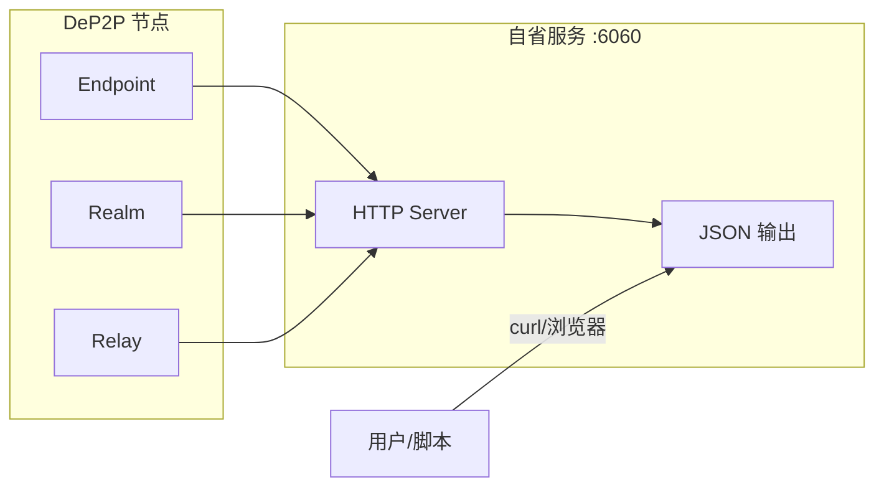

# 本地自省接口

本指南解答：**如何使用自省接口调试和监控 DeP2P 节点？**

---

## 问题

```
┌─────────────────────────────────────────────────────────────────────┐
│                         我要解决什么问题？                           │
├─────────────────────────────────────────────────────────────────────┤
│                                                                      │
│  "如何查看节点的完整状态？"                                          │
│  "如何调试连接问题？"                                                │
│  "如何监控 Relay 转发流量？"                                        │
│  "如何分析性能问题？"                                                │
│                                                                      │
└─────────────────────────────────────────────────────────────────────┘
```

---

## 什么是自省接口

自省接口是一个本地 HTTP 服务，提供 JSON 格式的诊断信息：



---

## 快速开始

### 1. 启用自省服务

```go
package main

import (
    "context"
    "fmt"
    "log"

    "github.com/dep2p/go-dep2p"
)

func main() {
    ctx := context.Background()

    node, err := dep2p.New(ctx,
        dep2p.WithPreset(dep2p.PresetDesktop),
        dep2p.WithIntrospect(true),  // 启用自省服务
    )
    if err != nil {
        log.Fatalf("创建节点失败: %v", err)
    }
    if err := node.Start(ctx); err != nil {
        log.Fatalf("启动节点失败: %v", err)
    }
    defer node.Close()

    fmt.Println("自省服务已启动: http://127.0.0.1:6060/debug/introspect")
    
    select {}
}
```

### 2. 查询诊断信息

```bash
# 完整诊断报告
curl http://127.0.0.1:6060/debug/introspect

# 节点信息
curl http://127.0.0.1:6060/debug/introspect/node

# 连接信息
curl http://127.0.0.1:6060/debug/introspect/connections

# Realm 信息
curl http://127.0.0.1:6060/debug/introspect/realm

# Relay 信息
curl http://127.0.0.1:6060/debug/introspect/relay

# 健康检查
curl http://127.0.0.1:6060/health
```

---

## API 端点

### GET /debug/introspect

返回完整的诊断报告：

```json
{
  "timestamp": "2025-12-28T10:00:00Z",
  "node": {
    "id": "12D3KooWAbCdEfGhIjKlMnOpQrStUvWxYz...",
    "id_short": "12D3KooWA",
    "public_key_type": "Ed25519",
    "uptime": 3600000000000,
    "started_at": "2025-12-28T09:00:00Z"
  },
  "connections": {
    "total": 15,
    "inbound": 8,
    "outbound": 7,
    "peers": ["12D3KooWB", "12D3KooWC"],
    "path_stats": {
      "direct": 10,
      "hole_punched": 2,
      "relayed": 3
    }
  },
  "addresses": {
    "listen_addrs": ["/ip4/0.0.0.0/udp/4001/quic-v1"],
    "advertised_addrs": ["/ip4/1.2.3.4/udp/4001/quic-v1"],
    "verified_direct_addrs": ["/ip4/1.2.3.4/udp/4001/quic-v1"]
  },
  "discovery": {
    "state": "Ready",
    "state_ready": true,
    "bootstrap_peers": 3,
    "known_peers": 50
  },
  "nat": {
    "type": "Symmetric",
    "port_mapping_available": false
  },
  "relay": {
    "enabled": true,
    "reserved_relays": 2
  },
  "realm": {
    "current_realm": "my-realm",
    "is_member": true,
    "member_count": 50
  }
}
```

### GET /debug/introspect/node

节点基本信息：

| 字段 | 说明 |
|------|------|
| `id` | 完整节点 ID |
| `id_short` | 短格式 ID（便于显示） |
| `public_key_type` | 公钥类型（Ed25519/ECDSA） |
| `uptime` | 运行时长（纳秒） |
| `started_at` | 启动时间 |

### GET /debug/introspect/connections

连接状态信息：

| 字段 | 说明 |
|------|------|
| `total` | 总连接数 |
| `inbound` | 入站连接数 |
| `outbound` | 出站连接数 |
| `peers` | 已连接节点列表 |
| `path_stats.direct` | 直连数量 |
| `path_stats.hole_punched` | 打洞成功数量 |
| `path_stats.relayed` | 中继连接数量 |

### GET /debug/introspect/realm

Realm 状态信息：

| 字段 | 说明 |
|------|------|
| `current_realm` | 当前 Realm ID |
| `is_member` | 是否已加入 Realm |
| `member_count` | 已知成员数量 |
| `psk_stats` | PSK 验证统计 |
| `topic_stats` | Topic 统计 |

### GET /debug/introspect/relay

Relay 状态信息：

| 字段 | 说明 |
|------|------|
| `enabled` | 是否启用中继客户端 |
| `reserved_relays` | 已预留的中继数量 |
| `relay_addrs` | 中继地址列表 |
| `server_stats` | 中继服务器统计（如果启用） |

### GET /health

健康检查端点：

```json
{
  "status": "ok",
  "timestamp": "2025-12-28T10:00:00Z"
}
```

### GET /debug/pprof/*

Go pprof 性能分析端点，用于分析 CPU、内存、goroutine 等：

```bash
# CPU 分析（30秒）
go tool pprof http://127.0.0.1:6060/debug/pprof/profile?seconds=30

# 内存分析
go tool pprof http://127.0.0.1:6060/debug/pprof/heap

# Goroutine 分析
go tool pprof http://127.0.0.1:6060/debug/pprof/goroutine

# 阻塞分析
go tool pprof http://127.0.0.1:6060/debug/pprof/block
```

---

## 配置选项

### 代码配置

```go
// 启用自省服务（默认地址 127.0.0.1:6060）
dep2p.WithIntrospect(true)

// 自定义监听地址
dep2p.WithIntrospectAddr("127.0.0.1:9090")
```

### 配置文件

```json
{
  "introspect": {
    "enable": true,
    "addr": "127.0.0.1:6060"
  }
}
```

---

## 使用场景

### 场景 1：调试连接问题

检查连接路径分布：

```bash
curl -s http://127.0.0.1:6060/debug/introspect/connections | jq '.path_stats'
```

```json
{
  "direct": 10,
  "hole_punched": 2,
  "relayed": 3
}
```

如果 `relayed` 比例过高，说明可能存在 NAT 穿透问题。

### 场景 2：监控 Realm 成员

定期检查 Realm 成员数量：

```bash
watch -n 5 'curl -s http://127.0.0.1:6060/debug/introspect/realm | jq ".member_count"'
```

### 场景 3：分析性能瓶颈

使用 pprof 分析 CPU 使用：

```bash
# 收集 30 秒 CPU profile
go tool pprof -http=:8080 http://127.0.0.1:6060/debug/pprof/profile?seconds=30
```

### 场景 4：集成到监控系统

编写脚本定期采集指标：

```bash
#!/bin/bash
# collect_metrics.sh

while true; do
    timestamp=$(date +%s)
    data=$(curl -s http://127.0.0.1:6060/debug/introspect)
    
    connections=$(echo "$data" | jq '.connections.total')
    members=$(echo "$data" | jq '.realm.member_count')
    
    echo "${timestamp},connections=${connections},members=${members}"
    
    sleep 60
done
```

---

## 安全说明

```
┌─────────────────────────────────────────────────────────────────────┐
│                         ⚠️ 安全警告                                 │
├─────────────────────────────────────────────────────────────────────┤
│                                                                      │
│  1. 默认绑定 127.0.0.1，仅本地可访问                                │
│     - 不要将自省端口暴露到公网                                      │
│     - 如需远程访问，请使用 SSH 隧道                                 │
│                                                                      │
│  2. pprof 端点可能泄露敏感信息                                      │
│     - 堆栈跟踪可能包含内存中的敏感数据                              │
│     - 生产环境谨慎使用                                              │
│                                                                      │
│  3. 建议配合防火墙使用                                              │
│     - 确保 6060 端口仅对本地开放                                    │
│                                                                      │
└─────────────────────────────────────────────────────────────────────┘
```

### SSH 隧道远程访问

```bash
# 在本地创建 SSH 隧道
ssh -L 6060:127.0.0.1:6060 user@remote-server

# 然后在本地访问
curl http://127.0.0.1:6060/debug/introspect
```

---

## 故障排查

### 问题 1：无法访问自省端点

**可能原因**：
- 自省服务未启用
- 端口被占用

**解决方案**：

```go
// 确认启用自省服务
node, _ := dep2p.New(ctx,
    dep2p.WithIntrospect(true),
)
_ = node.Start(ctx)

// 或使用其他端口
node, _ := dep2p.New(ctx,
    dep2p.WithIntrospect(true),
    dep2p.WithIntrospectAddr("127.0.0.1:9090"),
)
_ = node.Start(ctx)
```

### 问题 2：返回 503 Service Unavailable

**可能原因**：
- 核心组件未就绪

**解决方案**：
- 等待节点完全启动后再访问
- 检查节点日志确认启动状态

---

## 最佳实践

```
┌─────────────────────────────────────────────────────────────────────┐
│                       自省服务最佳实践                               │
├─────────────────────────────────────────────────────────────────────┤
│                                                                      │
│  1. 开发环境                                                        │
│     - 始终启用自省服务                                              │
│     - 使用 jq 格式化 JSON 输出                                      │
│     - 结合 watch 命令实时监控                                       │
│                                                                      │
│  2. 生产环境                                                        │
│     - 仅在需要时启用                                                │
│     - 使用 SSH 隧道远程访问                                         │
│     - 定期采集关键指标                                              │
│                                                                      │
│  3. 集成监控                                                        │
│     - 编写脚本定期采集 /debug/introspect                           │
│     - 将指标推送到 Prometheus/Grafana                              │
│     - 设置告警规则                                                   │
│                                                                      │
└─────────────────────────────────────────────────────────────────────┘
```

---

## 相关文档

- [可观测性（日志/指标）](observability.md)
- [故障排查](troubleshooting.md)
- [节点发现](peer-discovery.md)

