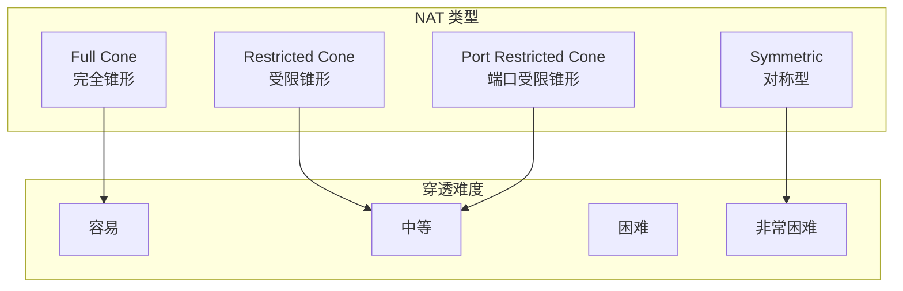
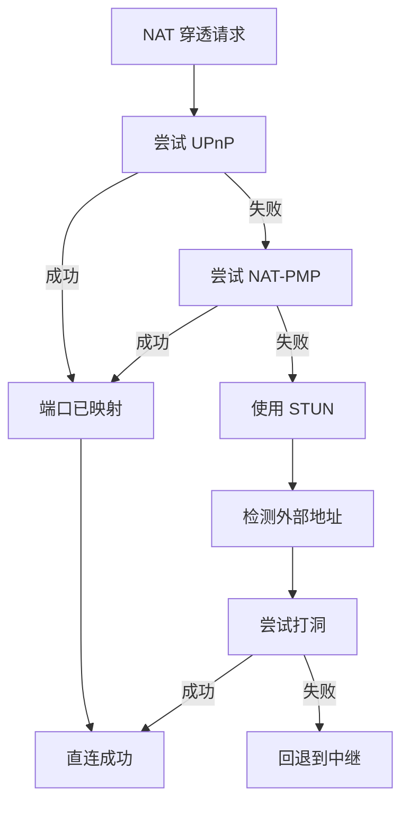
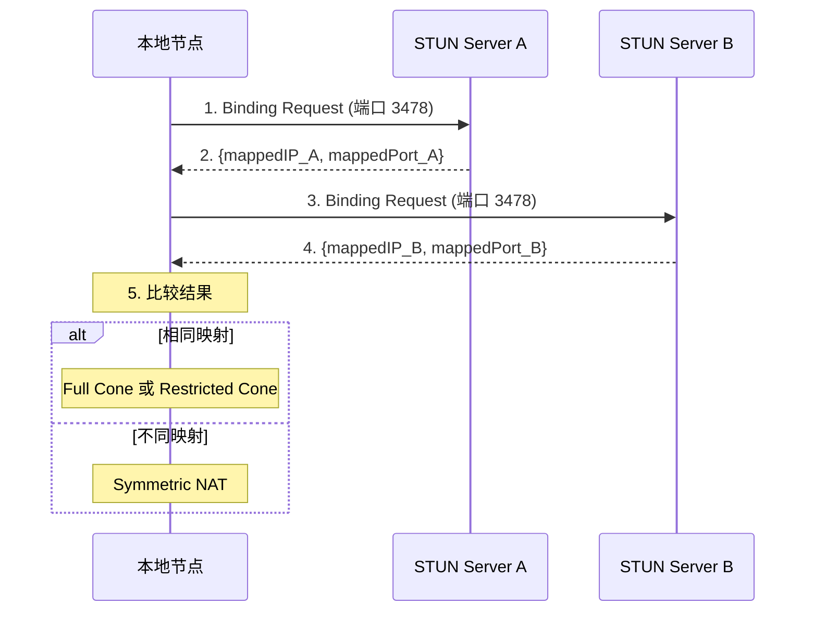

# NAT 穿透配置

本指南解答：**如何配置 NAT 穿透以提高节点的可达性？**

---

## 问题

```
┌─────────────────────────────────────────────────────────────────────┐
│                         我要解决什么问题？                           │
├─────────────────────────────────────────────────────────────────────┤
│                                                                      │
│  "我的节点在 NAT 后面，其他节点无法直接连接"                         │
│  "如何配置 UPnP 或 NAT-PMP？"                                        │
│  "如何使用打洞（Hole Punching）？"                                   │
│                                                                      │
└─────────────────────────────────────────────────────────────────────┘
```

---

## NAT 类型说明



### NAT 类型对比

| NAT 类型 | 描述 | 穿透难度 | 打洞成功率 |
|----------|------|----------|------------|
| **Full Cone** | 同一内部地址映射到固定外部地址 | 容易 | 高 |
| **Restricted Cone** | 需要先向外发送数据 | 中等 | 中 |
| **Port Restricted** | 端口也需要匹配 | 中等 | 中 |
| **Symmetric** | 每个连接使用不同映射 | 困难 | 低 |

---

## NAT 穿透策略



---

## 启用 NAT 穿透

### 基础配置

```go
package main

import (
    "context"
    "fmt"
    "log"

    "github.com/dep2p/go-dep2p"
    "github.com/dep2p/go-dep2p/pkg/types"
)

func main() {
    ctx := context.Background()

    // NAT 穿透在 Desktop 预设中默认启用
    node, err := dep2p.New(ctx,
        dep2p.WithPreset(dep2p.PresetDesktop),
        dep2p.WithNAT(true),  // 显式启用 NAT
    )
    if err != nil {
        log.Fatalf("创建节点失败: %v", err)
    }
    if err := node.Start(ctx); err != nil {
        log.Fatalf("启动节点失败: %v", err)
    }
    defer node.Close()

    realm := node.Realm("my-network")
    realm.Join(ctx)

    fmt.Printf("节点已启动: %s\n", node.ID().ShortString())
    fmt.Println("NAT 穿透已启用")
}
```

### 预设中的 NAT 配置

| 预设 | NAT | UPnP | AutoNAT | Hole Punch |
|------|-----|------|---------|------------|
| `PresetMinimal` | ❌ | ❌ | ❌ | ❌ |
| `PresetDesktop` | ✅ | ✅ | ✅ | ✅ |
| `PresetServer` | ✅ | ✅ | ✅ | ✅ |
| `PresetMobile` | ✅ | ✅ | ✅ | ✅ |

---

## UPnP/NAT-PMP 配置

自动端口映射配置。

```go
package main

import (
    "context"
    "fmt"
    "log"
    "time"

    "github.com/dep2p/go-dep2p"
    "github.com/dep2p/go-dep2p/pkg/types"
)

func main() {
    ctx := context.Background()

    node, err := dep2p.New(ctx,
        dep2p.WithPreset(dep2p.PresetDesktop),
        dep2p.WithNAT(true),
        // UPnP 和 NAT-PMP 在 NAT 启用时自动使用
    )
    if err != nil {
        log.Fatalf("创建节点失败: %v", err)
    }
    if err := node.Start(ctx); err != nil {
        log.Fatalf("启动节点失败: %v", err)
    }
    defer node.Close()

    realm := node.Realm("my-network")
    realm.Join(ctx)

    // 等待 NAT 映射完成
    time.Sleep(5 * time.Second)

    // 检查映射后的地址
    fmt.Println("通告地址:")
    for _, addr := range node.AdvertisedAddrs() {
        fmt.Printf("  %s\n", addr)
    }
}
```

---

## STUN 服务器配置

STUN 用于检测外部 IP 和 NAT 类型。

```go
package main

import (
    "context"
    "fmt"
    "log"

    "github.com/dep2p/go-dep2p"
    "github.com/dep2p/go-dep2p/pkg/types"
)

func main() {
    ctx := context.Background()

    // 自定义 STUN 服务器（可选）
    // 默认使用 Google STUN 服务器
    node, err := dep2p.New(ctx,
        dep2p.WithPreset(dep2p.PresetDesktop),
        dep2p.WithNAT(true),
        // STUN 服务器通过内部配置指定
    )
    if err != nil {
        log.Fatalf("创建节点失败: %v", err)
    }
    if err := node.Start(ctx); err != nil {
        log.Fatalf("启动节点失败: %v", err)
    }
    defer node.Close()

    realm := node.Realm("my-network")
    realm.Join(ctx)

    fmt.Printf("节点已启动: %s\n", node.ID().ShortString())
}
```

### 默认 STUN 服务器

```
stun:stun.l.google.com:19302
stun:stun1.l.google.com:19302
```

---

## Hole Punching 配置

打洞用于穿透 NAT 建立直连。

```go
package main

import (
    "context"
    "fmt"
    "log"

    "github.com/dep2p/go-dep2p"
    "github.com/dep2p/go-dep2p/pkg/types"
)

func main() {
    ctx := context.Background()

    // Hole Punching 在 Desktop 预设中默认启用
    node, err := dep2p.New(ctx,
        dep2p.WithPreset(dep2p.PresetDesktop),
        // EnableHolePunching 通过预设自动配置
    )
    if err != nil {
        log.Fatalf("创建节点失败: %v", err)
    }
    if err := node.Start(ctx); err != nil {
        log.Fatalf("启动节点失败: %v", err)
    }
    defer node.Close()

    realm := node.Realm("my-network")
    realm.Join(ctx)

    fmt.Println("Hole Punching 已启用")
    fmt.Println("当通过 Relay 连接时，系统会自动尝试打洞升级为直连")
}
```

---

## 显式声明外部地址

当你知道公网 IP 时，可以直接声明。

```go
package main

import (
    "context"
    "fmt"
    "log"

    "github.com/dep2p/go-dep2p"
    "github.com/dep2p/go-dep2p/pkg/types"
)

func main() {
    ctx := context.Background()

    // 公网服务器可以显式声明外部地址
    node, err := dep2p.New(ctx,
        dep2p.WithPreset(dep2p.PresetServer),
        dep2p.WithListenPort(4001),
        dep2p.WithExternalAddrs("/ip4/203.0.113.5/udp/4001/quic-v1"),
    )
    if err != nil {
        log.Fatalf("创建节点失败: %v", err)
    }
    if err := node.Start(ctx); err != nil {
        log.Fatalf("启动节点失败: %v", err)
    }
    defer node.Close()

    realm := node.Realm("my-network")
    realm.Join(ctx)

    fmt.Println("已声明外部地址")
    fmt.Println("通告地址:")
    for _, addr := range node.AdvertisedAddrs() {
        fmt.Printf("  %s\n", addr)
    }
}
```

---

## STUN 即验证策略（v1.2）

DeP2P v1.2 采用 **STUN 即验证策略**：STUN 协议本身即为第三方验证机制。

```
┌─────────────────────────────────────────────────────────────────────┐
│                    STUN 即验证策略                                    │
├─────────────────────────────────────────────────────────────────────┤
│                                                                     │
│  问题：冷启动时的"鸡和蛋"困境                                        │
│  ─────────────────────────────                                      │
│  • 需要验证地址才能发布到 DHT                                        │
│  • 但验证需要其他节点来 dial-back                                    │
│  • 冷启动时没有其他节点连接                                          │
│                                                                     │
│  解决方案：STUN 发现的地址直接标记为已验证                            │
│  ─────────────────────────────────────────                          │
│  • STUN 服务器是可信第三方                                           │
│  • STUN 返回的公网地址可直接使用                                      │
│  • dial-back 验证作为可选增强                                        │
│                                                                     │
│  地址优先级（v2.0）                                                  │
│  ──────────────────                                                 │
│  • VerifiedDirect: 100（dial-back 验证成功）                        │
│  • STUNDiscovered:  75（STUN 发现，默认可信）                        │
│  • RelayAddress:    50（Relay 中继地址）                             │
│  • Unverified:       0（未验证）                                     │
│                                                                     │
└─────────────────────────────────────────────────────────────────────┘
```

### trust_stun_addresses 配置

对于云服务器，可以启用完全信任 STUN 地址：

```go
node, _ := dep2p.New(ctx,
    dep2p.WithPreset(dep2p.PresetServer),
    dep2p.WithTrustSTUNAddresses(true),  // STUN 地址立即可用
)
```

**效果**：
- STUN 探测的地址立即标记为公开可用
- 跳过入站连接验证步骤
- 加速地址发布到 DHT

---

## NAT 检测流程



---

## NAT 穿透完整流程

```
┌─────────────────────────────────────────────────────────────────────────────┐
│                           NAT 穿透完整流程                                   │
├─────────────────────────────────────────────────────────────────────────────┤
│                                                                              │
│  1. 启动时                                                                   │
│     ├─ 尝试 UPnP 端口映射                                                   │
│     ├─ 尝试 NAT-PMP 端口映射                                                │
│     └─ 使用 STUN 检测外部地址                                               │
│                                                                              │
│  2. 连接时                                                                   │
│     ├─ 尝试直连（如果有公网地址）                                           │
│     ├─ 尝试打洞（如果 NAT 类型支持）                                        │
│     └─ 回退到中继                                                           │
│                                                                              │
│  3. 升级连接                                                                 │
│     ├─ 中继连接建立后自动尝试打洞                                           │
│     └─ 打洞成功后切换到直连                                                 │
│                                                                              │
└─────────────────────────────────────────────────────────────────────────────┘
```

---

## 故障排查

### 问题 1：UPnP 不工作

**可能原因**：
- 路由器不支持 UPnP
- UPnP 被禁用
- 防火墙阻止

**解决方案**：

```bash
# 1. 检查路由器设置，启用 UPnP

# 2. 使用工具检测 UPnP 支持
# miniupnpc 工具

# 3. 手动配置端口转发
# 在路由器管理界面添加 UDP 端口映射
```

### 问题 2：打洞失败

**可能原因**：
- 对称型 NAT
- 防火墙过于严格
- 没有可用的协调节点

**解决方案**：

```go
// 确保启用中继作为备选
node, _ := dep2p.New(ctx,
    dep2p.WithPreset(dep2p.PresetDesktop),
    dep2p.WithRelay(true),  // 确保启用 Relay
)
_ = node.Start(ctx)
```

### 问题 3：无法获取公网地址

**可能原因**：
- 多层 NAT
- STUN 服务器不可达
- 所有穿透方式都失败

**解决方案**：

```go
// 1. 使用 Relay 地址
// 系统会自动获取 Relay 地址

// 2. 手动声明地址（如果知道公网 IP）
node, _ := dep2p.New(ctx,
    dep2p.WithExternalAddrs("/ip4/公网IP/udp/4001/quic-v1"),
)
_ = node.Start(ctx)

// 3. 检查地址
candidates := node.BootstrapCandidates()
for _, c := range candidates {
    fmt.Printf("候选地址: %s (%s)\n", c.Addr, c.Type)
}
```

---

## QUIC 共享 Socket 打洞

DeP2P 使用 QUIC 共享 Socket 优化打洞成功率：

```
┌─────────────────────────────────────────────────────────────────────┐
│                    QUIC 共享 Socket 打洞                             │
├─────────────────────────────────────────────────────────────────────┤
│                                                                     │
│  传统方式：                                                          │
│  ├─ Listen Socket  ────► 监听端口                                   │
│  └─ Dial Socket    ────► 随机端口（与监听端口不同）                  │
│                                                                     │
│  DeP2P 共享 Socket：                                                │
│  └─ quic.Transport ────► 同一端口同时 Listen 和 Dial               │
│                                                                     │
│  优势：                                                              │
│  • 打洞成功率提高（端口映射一致）                                     │
│  • 减少 NAT 映射数量                                                 │
│  • 更好的对称 NAT 支持                                               │
│                                                                     │
└─────────────────────────────────────────────────────────────────────┘
```

---

## STUN 信任模式（云服务器）

对于有真实公网 IP 的云服务器，可以启用 STUN 信任模式：

```go
node, _ := dep2p.New(ctx,
    dep2p.WithPreset(dep2p.PresetServer),
    dep2p.WithTrustSTUNAddresses(true),  // 信任 STUN 地址
)
```

**工作原理**：
1. STUN 探测发现公网地址
2. 立即将地址标记为公开可用
3. 跳过入站连接验证步骤
4. 加速其他节点发现

**适用场景**：
- 云服务器（AWS、阿里云、腾讯云等）
- 有真实公网 IP
- 网络配置确保入站流量可达

**不适用**：
- NAT 后的节点
- 网络环境复杂（防火墙规则多变）

---

## 最佳实践

```
┌─────────────────────────────────────────────────────────────────────┐
│                       NAT 穿透最佳实践                               │
├─────────────────────────────────────────────────────────────────────┤
│                                                                      │
│  1. 使用 Desktop/Server 预设                                        │
│     - 自动启用所有 NAT 穿透功能                                      │
│     - UPnP、AutoNAT、Hole Punching 全部启用                         │
│                                                                      │
│  2. 始终启用 Relay                                                  │
│     - 作为最后的备选方案                                             │
│     - 确保任何情况下都能连接                                         │
│                                                                      │
│  3. 公网服务器声明外部地址                                          │
│     - 使用 WithExternalAddrs()                                      │
│     - 避免依赖 NAT 检测                                              │
│                                                                      │
│  4. 等待地址验证                                                    │
│     - 使用 WaitShareableAddrs()                                     │
│     - NAT 穿透需要时间                                               │
│                                                                      │
│  5. 监控 NAT 状态                                                   │
│     - 检查通告地址                                                   │
│     - 监控连接成功率                                                 │
│                                                                      │
└─────────────────────────────────────────────────────────────────────┘
```

---

## 相关文档

- [如何使用中继](use-relay.md)
- [如何分享地址](share-address.md)
- [如何 Bootstrap 网络](bootstrap-network.md)
- [云服务器部署教程](../tutorials/03-cloud-deploy.md)
- [配置参考](../reference/configuration.md)
