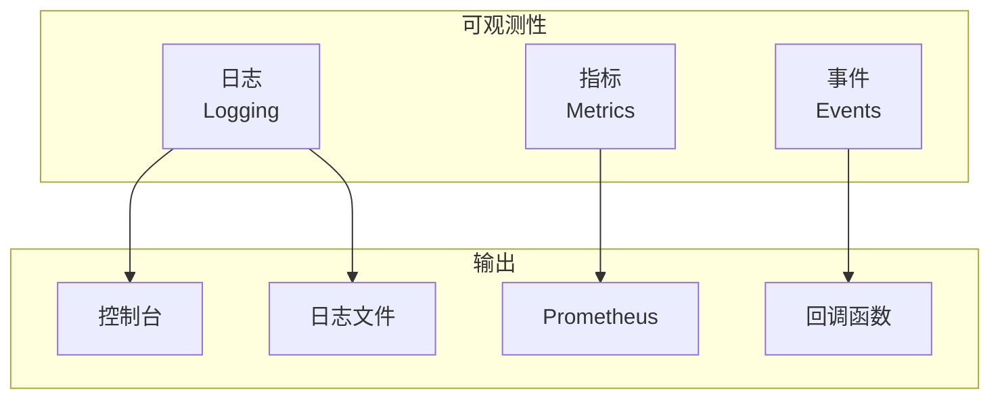
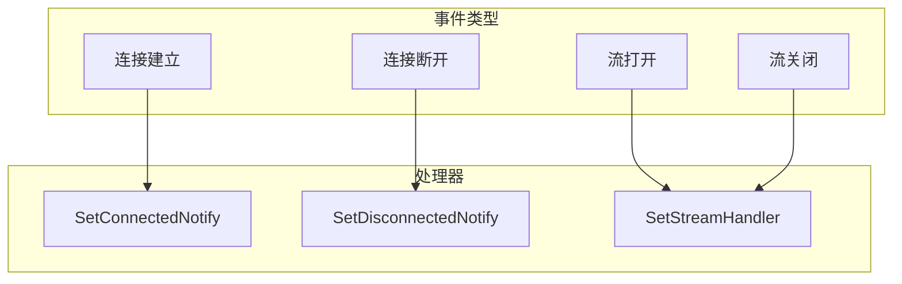

# 可观测性（日志/指标）

本指南解答：**如何监控和调试 DeP2P 节点？**

---

## 问题

```
┌─────────────────────────────────────────────────────────────────────┐
│                         我要解决什么问题？                           │
├─────────────────────────────────────────────────────────────────────┤
│                                                                      │
│  "如何查看节点的运行日志？"                                          │
│  "如何监控节点的连接状态？"                                          │
│  "如何调试连接问题？"                                                │
│                                                                      │
└─────────────────────────────────────────────────────────────────────┘
```

---

## 可观测性概述



---

## 日志配置

### 基础日志设置

```go
package main

import (
    "context"
    "fmt"
    "log"
    "os"

    "github.com/dep2p/go-dep2p"
    "github.com/dep2p/go-dep2p/pkg/types"
)

func main() {
    ctx := context.Background()

    // 设置 Go 标准日志输出
    log.SetOutput(os.Stdout)
    log.SetFlags(log.LstdFlags | log.Lshortfile)

    node, err := dep2p.StartNode(ctx,
        dep2p.WithPreset(dep2p.PresetDesktop),
    )
    if err != nil {
        log.Fatalf("启动失败: %v", err)
    }
    defer node.Close()

    node.Realm().JoinRealm(ctx, types.RealmID("my-network"))

    fmt.Printf("节点 ID: %s\n", node.ID())
    
    select {}
}
```

### 日志级别

```go
// DeP2P 使用 slog 进行日志记录
// 日志级别：Debug, Info, Warn, Error

import (
    "log/slog"
    "os"
)

// 设置日志级别
func setupLogging() {
    // Debug 级别（详细）
    handler := slog.NewTextHandler(os.Stdout, &slog.HandlerOptions{
        Level: slog.LevelDebug,
    })
    slog.SetDefault(slog.New(handler))
}

// 或者使用 JSON 格式（生产环境）
func setupJSONLogging() {
    handler := slog.NewJSONHandler(os.Stdout, &slog.HandlerOptions{
        Level: slog.LevelInfo,
    })
    slog.SetDefault(slog.New(handler))
}
```

---

## 连接状态监控

### 设置连接事件回调

```go
package main

import (
    "context"
    "fmt"
    "log"
    "time"

    "github.com/dep2p/go-dep2p"
    "github.com/dep2p/go-dep2p/pkg/types"
)

func main() {
    ctx := context.Background()

    node, err := dep2p.StartNode(ctx,
        dep2p.WithPreset(dep2p.PresetDesktop),
    )
    if err != nil {
        log.Fatalf("启动失败: %v", err)
    }
    defer node.Close()

    // 连接建立事件
    node.Endpoint().SetConnectedNotify(func(conn dep2p.Connection) {
        fmt.Printf("📥 [%s] 新连接: %s\n", 
            time.Now().Format("15:04:05"),
            conn.RemoteID().ShortString(),
        )
        fmt.Printf("   远程地址: %s\n", conn.RemoteAddr())
    })

    // 连接断开事件
    node.Endpoint().SetDisconnectedNotify(func(conn dep2p.Connection) {
        fmt.Printf("📤 [%s] 断开连接: %s\n",
            time.Now().Format("15:04:05"),
            conn.RemoteID().ShortString(),
        )
    })

    node.Realm().JoinRealm(ctx, types.RealmID("my-network"))

    fmt.Println("节点监控已启动...")
    
    // 定期输出统计
    go printStats(node)

    select {}
}

func printStats(node dep2p.Node) {
    ticker := time.NewTicker(30 * time.Second)
    defer ticker.Stop()

    for range ticker.C {
        fmt.Printf("\n📊 统计 [%s]\n", time.Now().Format("15:04:05"))
        fmt.Printf("   连接数: %d\n", node.ConnectionCount())
        fmt.Printf("   节点 ID: %s\n", node.ID().ShortString())
    }
}
```

---

## 事件通知

### 监控流程



### 完整事件监控

```go
package main

import (
    "context"
    "fmt"
    "log"
    "sync/atomic"
    "time"

    "github.com/dep2p/go-dep2p"
    "github.com/dep2p/go-dep2p/pkg/types"
)

// 统计计数器
var (
    totalConnections    int64
    activeConnections   int64
    totalStreams        int64
    messagesReceived    int64
)

func main() {
    ctx := context.Background()

    node, err := dep2p.StartNode(ctx,
        dep2p.WithPreset(dep2p.PresetDesktop),
    )
    if err != nil {
        log.Fatalf("启动失败: %v", err)
    }
    defer node.Close()

    // 设置所有事件监控
    setupEventHandlers(node)

    node.Realm().JoinRealm(ctx, types.RealmID("my-network"))

    fmt.Println("事件监控已启动")

    // 定期输出指标
    go func() {
        for {
            time.Sleep(60 * time.Second)
            printMetrics()
        }
    }()

    select {}
}

func setupEventHandlers(node dep2p.Node) {
    // 连接事件
    node.Endpoint().SetConnectedNotify(func(conn dep2p.Connection) {
        atomic.AddInt64(&totalConnections, 1)
        atomic.AddInt64(&activeConnections, 1)
        log.Printf("连接建立: %s", conn.RemoteID().ShortString())
    })

    node.Endpoint().SetDisconnectedNotify(func(conn dep2p.Connection) {
        atomic.AddInt64(&activeConnections, -1)
        log.Printf("连接断开: %s", conn.RemoteID().ShortString())
    })

    // 协议处理器（带统计）
    node.Endpoint().SetProtocolHandler("/myapp/ping/1.0.0", func(stream dep2p.Stream) {
        defer stream.Close()
        atomic.AddInt64(&totalStreams, 1)
        atomic.AddInt64(&messagesReceived, 1)
        
        buf := make([]byte, 1024)
        stream.Read(buf)
        stream.Write([]byte("pong"))
    })
}

func printMetrics() {
    fmt.Println("\n═══════════════════════════════════════")
    fmt.Printf("📊 节点指标 [%s]\n", time.Now().Format("2006-01-02 15:04:05"))
    fmt.Println("═══════════════════════════════════════")
    fmt.Printf("总连接数:     %d\n", atomic.LoadInt64(&totalConnections))
    fmt.Printf("活跃连接:     %d\n", atomic.LoadInt64(&activeConnections))
    fmt.Printf("总流数:       %d\n", atomic.LoadInt64(&totalStreams))
    fmt.Printf("收到消息:     %d\n", atomic.LoadInt64(&messagesReceived))
    fmt.Println("═══════════════════════════════════════")
}
```

---

## 调试技巧

### 1. 检查节点状态

```go
func debugNodeStatus(node dep2p.Node) {
    fmt.Println("═══════════════════════════════════════")
    fmt.Println("节点状态检查")
    fmt.Println("═══════════════════════════════════════")
    
    // 基本信息
    fmt.Printf("节点 ID:      %s\n", node.ID())
    fmt.Printf("连接数:       %d\n", node.ConnectionCount())
    
    // 监听地址
    fmt.Println("\n监听地址:")
    for _, addr := range node.ListenAddrs() {
        fmt.Printf("  - %s\n", addr)
    }
    
    // 通告地址
    fmt.Println("\n通告地址:")
    for _, addr := range node.AdvertisedAddrs() {
        fmt.Printf("  - %s\n", addr)
    }
    
    // 可分享地址
    fmt.Println("\n可分享地址:")
    addrs := node.ShareableAddrs()
    if len(addrs) > 0 {
        for _, addr := range addrs {
            fmt.Printf("  - %s\n", addr)
        }
    } else {
        fmt.Println("  (无可分享地址)")
    }
    
    fmt.Println("═══════════════════════════════════════")
}
```

### 2. 诊断连接问题

```go
func diagnoseConnection(ctx context.Context, node dep2p.Node, targetAddr string) {
    fmt.Printf("诊断连接: %s\n", targetAddr)
    fmt.Println("─────────────────────────────────────")
    
    start := time.Now()
    
    // 尝试连接
    conn, err := node.ConnectToAddr(ctx, targetAddr)
    
    elapsed := time.Since(start)
    
    if err != nil {
        fmt.Printf("❌ 连接失败 (%v)\n", elapsed)
        fmt.Printf("   错误: %v\n", err)
        
        // 分析错误类型
        switch {
        case strings.Contains(err.Error(), "timeout"):
            fmt.Println("   建议: 检查网络连通性或增加超时时间")
        case strings.Contains(err.Error(), "refused"):
            fmt.Println("   建议: 确认目标节点正在运行且端口开放")
        case strings.Contains(err.Error(), "no route"):
            fmt.Println("   建议: 检查 NAT/防火墙配置")
        }
        return
    }
    
    fmt.Printf("✅ 连接成功 (%v)\n", elapsed)
    fmt.Printf("   远程 ID: %s\n", conn.RemoteID())
    fmt.Printf("   远程地址: %s\n", conn.RemoteAddr())
}
```

---

## 生产环境配置

```go
package main

import (
    "context"
    "log/slog"
    "os"
    "time"

    "github.com/dep2p/go-dep2p"
    "github.com/dep2p/go-dep2p/pkg/types"
)

func main() {
    ctx := context.Background()

    // 生产环境日志配置
    setupProductionLogging()

    node, err := dep2p.StartNode(ctx,
        dep2p.WithPreset(dep2p.PresetServer),
    )
    if err != nil {
        slog.Error("节点启动失败", "error", err)
        os.Exit(1)
    }
    defer node.Close()

    node.Realm().JoinRealm(ctx, types.RealmID("production"))

    // 设置监控
    setupMonitoring(node)

    slog.Info("节点已启动",
        "nodeID", node.ID().ShortString(),
        "listenAddrs", node.ListenAddrs(),
    )

    select {}
}

func setupProductionLogging() {
    // JSON 格式，适合日志聚合
    handler := slog.NewJSONHandler(os.Stdout, &slog.HandlerOptions{
        Level: slog.LevelInfo,
        ReplaceAttr: func(groups []string, a slog.Attr) slog.Attr {
            // 添加时间戳格式化
            if a.Key == slog.TimeKey {
                return slog.String("timestamp", time.Now().UTC().Format(time.RFC3339))
            }
            return a
        },
    })
    slog.SetDefault(slog.New(handler))
}

func setupMonitoring(node dep2p.Node) {
    // 连接事件日志
    node.Endpoint().SetConnectedNotify(func(conn dep2p.Connection) {
        slog.Info("连接建立",
            "remoteID", conn.RemoteID().ShortString(),
            "remoteAddr", conn.RemoteAddr().String(),
        )
    })

    node.Endpoint().SetDisconnectedNotify(func(conn dep2p.Connection) {
        slog.Info("连接断开",
            "remoteID", conn.RemoteID().ShortString(),
        )
    })

    // 定期健康检查
    go func() {
        ticker := time.NewTicker(5 * time.Minute)
        defer ticker.Stop()

        for range ticker.C {
            slog.Info("健康检查",
                "connections", node.ConnectionCount(),
                "uptime", time.Since(time.Now()),
            )
        }
    }()
}
```

---

## 故障排查

### 问题 1：看不到日志输出

**解决方案**：

```go
// 确保设置了日志处理器
import "log/slog"

handler := slog.NewTextHandler(os.Stdout, &slog.HandlerOptions{
    Level: slog.LevelDebug,  // 设置为 Debug 级别
})
slog.SetDefault(slog.New(handler))
```

### 问题 2：事件回调不触发

**检查项**：

```go
// 1. 确保在启动前设置回调
node.Endpoint().SetConnectedNotify(callback)  // 在 JoinRealm 之前

// 2. 确保回调函数没有 panic
node.Endpoint().SetConnectedNotify(func(conn dep2p.Connection) {
    defer func() {
        if r := recover(); r != nil {
            log.Printf("回调 panic: %v", r)
        }
    }()
    // 处理逻辑
})
```

---

## 最佳实践

```
┌─────────────────────────────────────────────────────────────────────┐
│                       可观测性最佳实践                               │
├─────────────────────────────────────────────────────────────────────┤
│                                                                      │
│  1. 日志级别                                                        │
│     • 开发环境：Debug                                                │
│     • 生产环境：Info 或 Warn                                        │
│     • 调试时临时切换到 Debug                                        │
│                                                                      │
│  2. 结构化日志                                                      │
│     • 使用 slog 进行结构化日志记录                                  │
│     • 生产环境使用 JSON 格式                                        │
│     • 包含 nodeID、remoteID 等上下文                                │
│                                                                      │
│  3. 事件监控                                                        │
│     • 监控所有连接/断开事件                                         │
│     • 记录关键操作的执行时间                                         │
│     • 设置告警阈值                                                   │
│                                                                      │
│  4. 指标收集                                                        │
│     • 定期输出连接数等关键指标                                       │
│     • 集成 Prometheus（如需要）                                     │
│     • 监控趋势变化                                                   │
│                                                                      │
└─────────────────────────────────────────────────────────────────────┘
```

---

## 相关文档

- [本地自省接口](introspection.md)
- [故障排查](troubleshooting.md)
- [节点发现](peer-discovery.md)
- [NAT 穿透配置](nat-traversal.md)
- [核心概念](../concepts/core-concepts.md)
