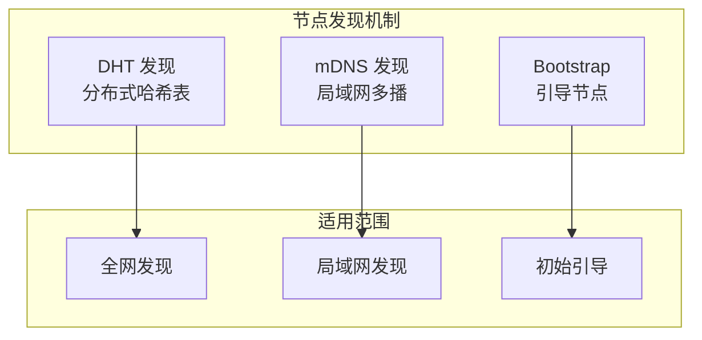
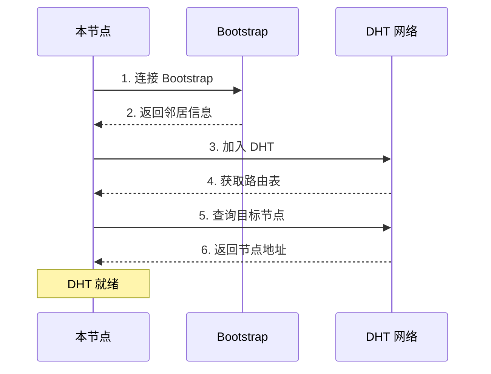
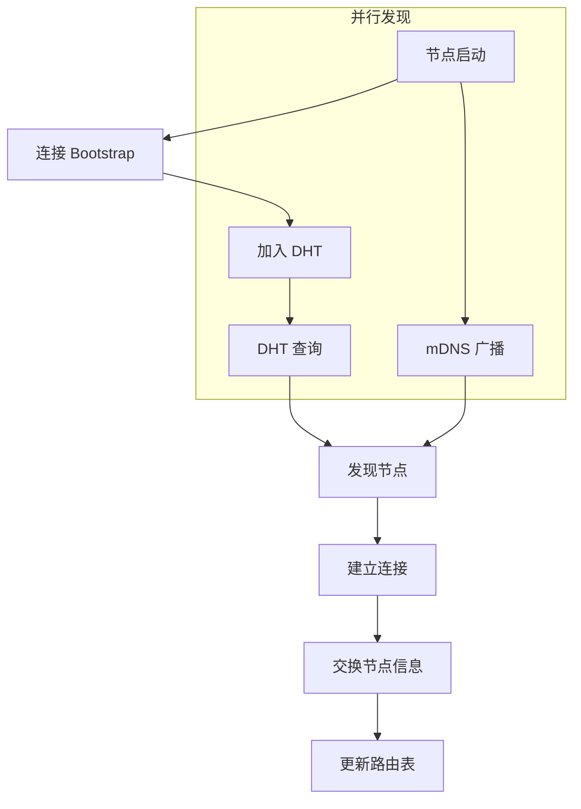

# 节点发现

本指南解答：**如何发现网络中的其他节点？**

---

## 问题

```
┌─────────────────────────────────────────────────────────────────────┐
│                         我要解决什么问题？                           │
├─────────────────────────────────────────────────────────────────────┤
│                                                                      │
│  "如何找到网络中的其他节点？"                                        │
│  "DHT 和 mDNS 有什么区别？"                                          │
│  "如何配置节点发现？"                                                │
│                                                                      │
└─────────────────────────────────────────────────────────────────────┘
```

---

## 发现机制概述



### 发现机制对比

| 机制 | 范围 | 优点 | 缺点 |
|------|------|------|------|
| **DHT** | 全网 | 去中心化、可扩展 | 需要初始连接 |
| **mDNS** | 局域网 | 自动、无需配置 | 仅限本地网络 |
| **Bootstrap** | 全网 | 可靠、快速 | 需要预配置 |

---

## DHT 发现配置

DHT（分布式哈希表）用于全网节点发现。

```go
package main

import (
    "context"
    "fmt"
    "log"
    "time"

    "github.com/dep2p/go-dep2p"
    "github.com/dep2p/go-dep2p/pkg/types"
)

func main() {
    ctx := context.Background()

    // DHT 在 Desktop/Server 预设中默认启用
    node, err := dep2p.StartNode(ctx,
        dep2p.WithPreset(dep2p.PresetDesktop),
        // DHT 通过预设自动配置
    )
    if err != nil {
        log.Fatalf("启动失败: %v", err)
    }
    defer node.Close()

    node.Realm().JoinRealm(ctx, types.RealmID("my-network"))

    fmt.Println("DHT 发现已启用")
    
    // 等待 DHT 同步
    time.Sleep(10 * time.Second)
    
    fmt.Printf("当前连接数: %d\n", node.ConnectionCount())
}
```

### DHT 工作流程



---

## mDNS 局域网发现

mDNS 用于自动发现同一局域网的节点。

```go
package main

import (
    "context"
    "fmt"
    "log"

    "github.com/dep2p/go-dep2p"
    "github.com/dep2p/go-dep2p/pkg/types"
)

func main() {
    ctx := context.Background()

    // mDNS 在 Desktop 预设中默认启用
    node, err := dep2p.StartNode(ctx,
        dep2p.WithPreset(dep2p.PresetDesktop),
        // mDNS 自动发现同网络节点
    )
    if err != nil {
        log.Fatalf("启动失败: %v", err)
    }
    defer node.Close()

    node.Realm().JoinRealm(ctx, types.RealmID("my-network"))

    // 监听新节点发现
    node.Endpoint().SetConnectedNotify(func(conn dep2p.Connection) {
        fmt.Printf("发现新节点: %s\n", conn.RemoteID().ShortString())
    })

    fmt.Println("mDNS 发现已启用")
    fmt.Println("等待局域网节点...")
    
    select {}
}
```

### mDNS 服务标签

```go
// 默认服务标签
const defaultServiceTag = "dep2p.local"

// 同一服务标签的节点会互相发现
```

---

## 发现流程



---

## 预设中的发现配置

| 预设 | DHT | mDNS | Bootstrap |
|------|-----|------|-----------|
| `PresetMinimal` | ❌ | ❌ | ❌ |
| `PresetDesktop` | ✅ | ✅ | ✅ |
| `PresetServer` | ✅ | ✅ | ✅ |
| `PresetMobile` | ✅ | ✅ | ✅ |

---

## 监控节点发现

```go
package main

import (
    "context"
    "fmt"
    "log"
    "time"

    "github.com/dep2p/go-dep2p"
    "github.com/dep2p/go-dep2p/pkg/types"
)

func main() {
    ctx := context.Background()

    node, err := dep2p.StartNode(ctx,
        dep2p.WithPreset(dep2p.PresetDesktop),
    )
    if err != nil {
        log.Fatalf("启动失败: %v", err)
    }
    defer node.Close()

    node.Realm().JoinRealm(ctx, types.RealmID("my-network"))

    // 设置连接通知
    node.Endpoint().SetConnectedNotify(func(conn dep2p.Connection) {
        fmt.Printf("✅ 新连接: %s\n", conn.RemoteID().ShortString())
    })

    // 设置断开通知
    node.Endpoint().SetDisconnectedNotify(func(conn dep2p.Connection) {
        fmt.Printf("❌ 断开连接: %s\n", conn.RemoteID().ShortString())
    })

    // 定期输出统计
    go func() {
        for {
            time.Sleep(10 * time.Second)
            fmt.Printf("📊 当前连接数: %d\n", node.ConnectionCount())
        }
    }()

    select {}
}
```

---

## 通过 NodeID 查找节点

```go
package main

import (
    "context"
    "fmt"
    "log"

    "github.com/dep2p/go-dep2p"
    "github.com/dep2p/go-dep2p/pkg/types"
)

func main() {
    ctx := context.Background()

    node, err := dep2p.StartNode(ctx,
        dep2p.WithPreset(dep2p.PresetDesktop),
    )
    if err != nil {
        log.Fatalf("启动失败: %v", err)
    }
    defer node.Close()

    node.Realm().JoinRealm(ctx, types.RealmID("my-network"))

    // 目标节点 ID
    targetIDStr := "5Q2STWvBFn..."
    targetID, err := types.ParseNodeID(targetIDStr)
    if err != nil {
        log.Fatalf("解析 NodeID 失败: %v", err)
    }

    // 通过 DHT 查找并连接（自动发现地址）
    conn, err := node.Connect(ctx, targetID)
    if err != nil {
        log.Fatalf("连接失败: %v", err)
    }

    fmt.Printf("已连接到: %s\n", conn.RemoteID().ShortString())
}
```

---

## 故障排查

### 问题 1：无法发现其他节点

**可能原因**：
- 没有 Bootstrap 节点
- 不在同一网络（mDNS）
- DHT 未同步

**解决方案**：

```go
// 1. 检查 Bootstrap 配置
node, _ := dep2p.StartNode(ctx,
    dep2p.WithPreset(dep2p.PresetDesktop),  // 包含默认 Bootstrap
)

// 2. 等待 DHT 同步
time.Sleep(10 * time.Second)

// 3. 检查连接数
if node.ConnectionCount() == 0 {
    fmt.Println("没有连接到任何节点")
}
```

### 问题 2：mDNS 发现不工作

**可能原因**：
- 防火墙阻止多播
- 不在同一网段
- mDNS 服务未启动

**解决方案**：

```bash
# 1. 检查防火墙
# macOS
sudo pfctl -d  # 临时禁用防火墙

# Linux
sudo ufw allow 5353/udp  # 允许 mDNS

# 2. 检查网络
ping -c 1 224.0.0.251  # mDNS 多播地址
```

### 问题 3：DHT 查询慢

**可能原因**：
- 网络延迟高
- DHT 路由表小
- 目标节点离线

**解决方案**：

```go
// 1. 增加超时时间
ctx, cancel := context.WithTimeout(context.Background(), 60*time.Second)
defer cancel()

// 2. 使用直接地址连接（如果已知）
conn, _ := node.ConnectToAddr(ctx, "/ip4/1.2.3.4/udp/4001/quic-v1/p2p/...")
```

---

## 最佳实践

```
┌─────────────────────────────────────────────────────────────────────┐
│                       节点发现最佳实践                               │
├─────────────────────────────────────────────────────────────────────┤
│                                                                      │
│  1. 使用预设配置                                                    │
│     - PresetDesktop 包含完整发现功能                                │
│     - DHT + mDNS + Bootstrap 全部启用                               │
│                                                                      │
│  2. 配置多个 Bootstrap                                              │
│     - 提高初始连接成功率                                             │
│     - 分布在不同地理位置                                             │
│                                                                      │
│  3. 等待 DHT 同步                                                   │
│     - 启动后等待几秒钟                                               │
│     - 再进行节点查找                                                 │
│                                                                      │
│  4. 监控连接状态                                                    │
│     - 设置连接/断开通知                                              │
│     - 定期检查连接数                                                 │
│                                                                      │
│  5. 缓存已知节点                                                    │
│     - 保存成功连接的节点                                             │
│     - 下次启动优先连接                                               │
│                                                                      │
└─────────────────────────────────────────────────────────────────────┘
```

---

## 相关文档

- [如何 Bootstrap 网络](bootstrap-network.md)
- [如何分享地址](share-address.md)
- [NAT 穿透配置](nat-traversal.md)
- [核心概念](../concepts/core-concepts.md)
