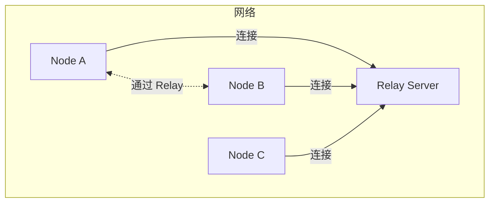
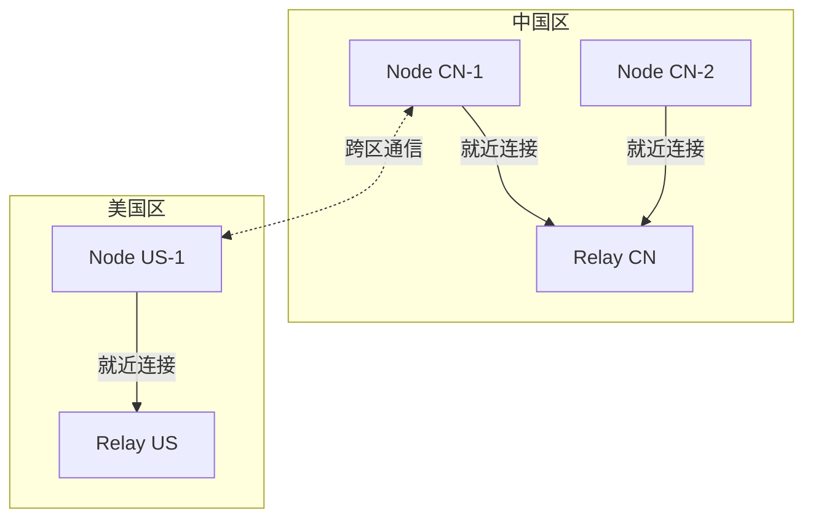
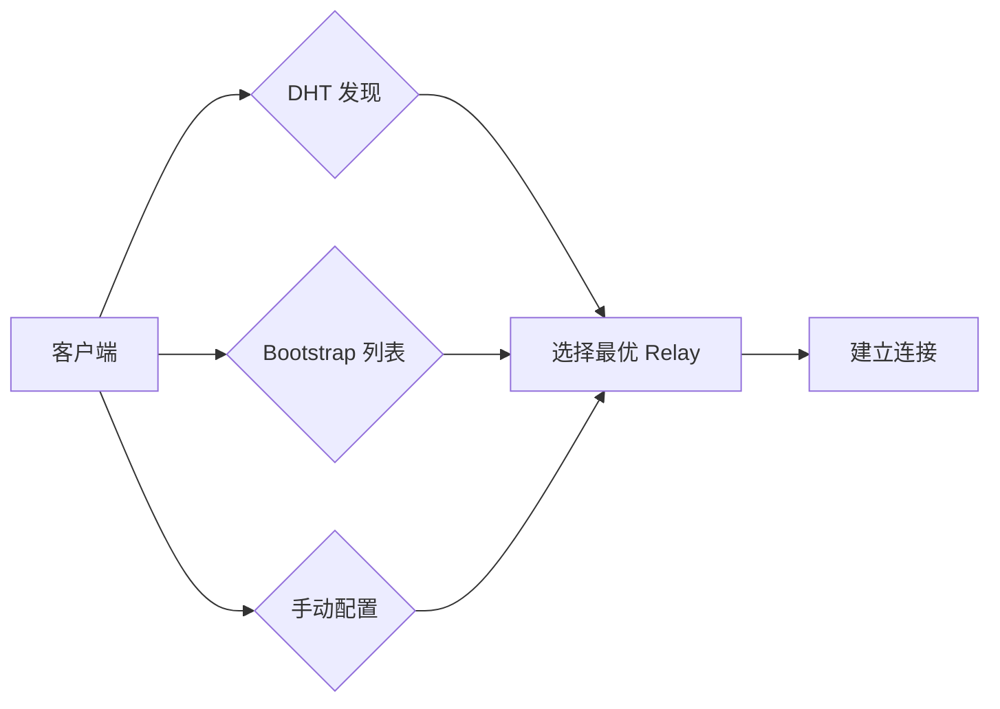
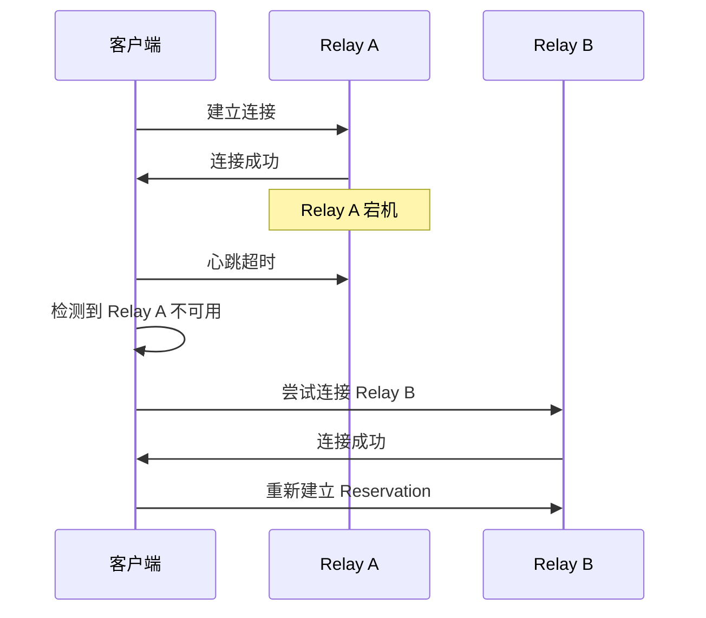
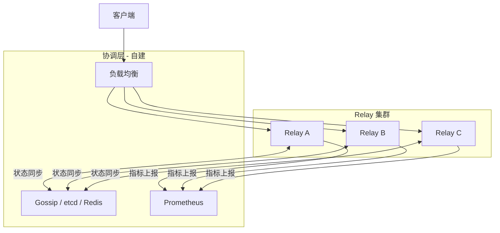

# Relay 部署模型指南

本指南解答：**如何选择适合的 Relay 部署模型？**

---

## 问题

```
┌─────────────────────────────────────────────────────────────────────┐
│                         我要解决什么问题？                           │
├─────────────────────────────────────────────────────────────────────┤
│                                                                      │
│  "我应该部署单个还是多个 Relay？"                                   │
│  "多个 Relay 之间会自动同步状态吗？"                                │
│  "如何实现高可用的中继服务？"                                       │
│  "跨地域部署需要注意什么？"                                         │
│                                                                      │
└─────────────────────────────────────────────────────────────────────┘
```

---

## 快速决策

```
我需要什么?
│
├─ 小型 Realm (<100 节点) / 开发测试
│  └─→ 单点自托管 (Tier 1)
│
├─ 中型 Realm (100-1000 节点) / 基本高可用
│  └─→ 同 Realm 多中继 (Tier 2)
│
└─ 大型 Realm (>1000 节点) / 全局限流/计费
   └─→ 自行构建分布式协调层 (Tier 3)
```

---

## Tier 1: 单点自托管

### 适用场景

- 小型 Realm（少于 100 个节点）
- 开发测试环境
- 私有网络部署
- 对可用性要求不高

### 架构



### 配置示例

```go
package main

import (
    "context"
    "log"

    "github.com/dep2p/go-dep2p"
    "github.com/dep2p/go-dep2p/pkg/types"
)

func main() {
    ctx := context.Background()

    // 单点 Relay 服务器
    relay, err := dep2p.New(ctx,
        dep2p.WithPreset(dep2p.PresetServer),
        dep2p.WithRelayServer(true),
        dep2p.WithListenPort(4001),
        // 资源限制
        dep2p.WithConnectionLimits(100, 200),
    )
    if err != nil {
        log.Fatalf("创建节点失败: %v", err)
    }
    if err := relay.Start(ctx); err != nil {
        log.Fatalf("启动节点失败: %v", err)
    }
    defer relay.Close()

    // 加入 Realm（可选，用于 Realm 内部转发）
    realm := relay.Realm("my-realm")
    realm.Join(ctx)

    log.Printf("Relay 已启动: %s", relay.ID())
    select {}
}
```

### 资源估算

| 并发连接数 | 预估内存 | 预估带宽 |
|-----------|---------|---------|
| 50 | 256MB | 10Mbps |
| 100 | 512MB | 20Mbps |
| 200 | 1GB | 50Mbps |

### 故障影响

```
┌─────────────────────────────────────────────────────────────────────┐
│                         单点故障影响                                 │
├─────────────────────────────────────────────────────────────────────┤
│                                                                      │
│  Relay 宕机时：                                                     │
│  - 所有依赖该 Relay 的连接中断                                      │
│  - 客户端需等待超时后尝试直连或其他 Relay                           │
│  - Reservation 状态丢失                                             │
│                                                                      │
│  恢复后：                                                           │
│  - 客户端自动重连                                                   │
│  - 需重新建立 Reservation                                           │
│                                                                      │
└─────────────────────────────────────────────────────────────────────┘
```

---

## Tier 2: 同 Realm 多中继

### 适用场景

- 中型 Realm（100-1000 个节点）
- 需要基本高可用
- 地理分布式客户端（就近接入）
- 可接受"无状态共享"的限制

### 架构



### 配置示例

#### Relay 服务器（每个区域部署一个）

```go
// relay_cn.go
relay, _ := dep2p.New(ctx,
    dep2p.WithPreset(dep2p.PresetServer),
    dep2p.WithRelayServer(true),
    dep2p.WithListenPort(4001),
)
_ = relay.Start(ctx)
realm := relay.Realm("my-realm")
realm.Join(ctx)
```

#### 客户端配置

```go
// 配置多个 Relay 作为 Bootstrap
node, _ := dep2p.New(ctx,
    dep2p.WithPreset(dep2p.PresetDesktop),
    dep2p.WithBootstrapPeers(
        "/ip4/cn-relay.example.com/udp/4001/quic-v1/p2p/...",
        "/ip4/us-relay.example.com/udp/4001/quic-v1/p2p/...",
        "/ip4/eu-relay.example.com/udp/4001/quic-v1/p2p/...",
    ),
    dep2p.WithRelay(true),
)
_ = node.Start(ctx)
```

### 客户端发现机制



| 发现方式 | 说明 | 适用场景 |
|---------|------|---------|
| DHT 发现 | 自动发现网络中的 Relay 节点 | 动态环境 |
| Bootstrap 列表 | 预配置的 Relay 地址列表 | 稳定部署 |
| 手动配置 | 用户指定 Relay 地址 | 私有网络 |

### 重要限制

```
┌─────────────────────────────────────────────────────────────────────┐
│                    ⚠️  Tier 2 重要限制                              │
├─────────────────────────────────────────────────────────────────────┤
│                                                                      │
│  每个 Relay 实例独立运行，不共享状态：                               │
│                                                                      │
│  1. 跨实例 Reservation 不同步                                       │
│     - 在 Relay A 建立的 reservation 在 Relay B 上不存在             │
│     - 切换 Relay 需要重新建立 reservation                           │
│                                                                      │
│  2. 限流/配额不共享                                                 │
│     - 每个 Relay 独立计数                                           │
│     - 用户可连接多个 Relay "绕过" 单实例限流                        │
│                                                                      │
│  3. 统计指标不聚合                                                  │
│     - 需自行收集各实例指标                                          │
│     - 建议使用 Prometheus + 远程写入                                │
│                                                                      │
│  如果你需要以上能力，请参考 Tier 3 自行构建协调层。                  │
│                                                                      │
└─────────────────────────────────────────────────────────────────────┘
```

### 故障处理



---

## Tier 3: 跨地域分布式集群

### 适用场景

- 大型 Realm（超过 1000 个节点）
- 企业级 SLA 要求（99.9%+）
- 需要全局限流/计费
- 需要跨实例 Reservation 同步

### 架构示意



### DeP2P 边界声明

```
┌─────────────────────────────────────────────────────────────────────┐
│                       DeP2P 能力边界                                 │
├─────────────────────────────────────────────────────────────────────┤
│                                                                      │
│  DeP2P 作为 **库**：                                                 │
│  ✅ 提供单实例 Relay Server 实现                                     │
│  ✅ 提供 Relay Client 实现                                           │
│  ✅ 提供 AutoRelay 发现机制                                          │
│  ✅ 支持统一 Relay v2.0 架构                                         │
│                                                                      │
│  DeP2P **不提供**：                                                  │
│  ❌ 多实例 Relay 状态同步                                            │
│  ❌ 分布式限流/计费                                                  │
│  ❌ 跨实例 Reservation 协调                                          │
│  ❌ 全局故障转移编排                                                 │
│                                                                      │
│  如需以上能力，请在 DeP2P 之上构建 **产品级协调层**。                │
│                                                                      │
└─────────────────────────────────────────────────────────────────────┘
```

### 需要自行解决的问题

| 问题 | 说明 | 可能的解决方案 |
|------|------|---------------|
| Reservation 同步 | 跨实例共享预留状态 | etcd / Redis Cluster |
| 全局限流 | 跨实例计数器 | Redis + Lua / 令牌桶 |
| 成员验证缓存 | 一致性失效 | 发布订阅 / TTL 策略 |
| 故障检测 | 实例健康检查 | Consul / Kubernetes |
| 负载均衡 | 智能路由 | Anycast / DNS-based LB |
| 统计聚合 | 全局指标 | Prometheus Federation |

### 扩展示例（概念性）

```go
// 这是概念性示例，展示如何在 DeP2P 之上构建协调层
// 实际实现需要根据具体需求设计

type DistributedRelay struct {
    // 底层 DeP2P Relay
    relay *dep2p.Node
    
    // 状态同步（需自行实现）
    stateSync StateSync // interface { SyncReservation(...) }
    
    // 分布式限流（需自行实现）
    rateLimiter DistributedRateLimiter // interface { Allow(...) bool }
    
    // 健康检查（需自行实现）
    healthCheck HealthCheck // interface { IsHealthy() bool }
}

// 重写 Reservation 处理，增加同步逻辑
func (d *DistributedRelay) HandleReservation(req ReservationRequest) error {
    // 1. 检查分布式限流
    if !d.rateLimiter.Allow(req.PeerID) {
        return ErrRateLimited
    }
    
    // 2. 本地处理
    res, err := d.relay.HandleReservation(req)
    if err != nil {
        return err
    }
    
    // 3. 同步到其他实例
    return d.stateSync.SyncReservation(res)
}
```

---

## 部署检查清单

### Tier 1 检查清单

- [ ] 确认节点数量 < 100
- [ ] 配置固定端口（便于防火墙）
- [ ] 设置资源限制（防止过载）
- [ ] 配置监控告警（单点故障预警）
- [ ] 准备故障恢复流程

### Tier 2 检查清单

- [ ] 规划 Relay 数量和地理位置
- [ ] 配置 Bootstrap 列表包含所有 Relay
- [ ] 理解并接受"无状态共享"限制
- [ ] 配置各实例独立监控
- [ ] 测试故障转移流程

### Tier 3 检查清单

- [ ] 评估分布式系统工程能力
- [ ] 选择状态同步方案（etcd/Redis/自建）
- [ ] 设计限流/计费架构
- [ ] 规划监控和运维体系
- [ ] 准备充足的开发和运维资源

---

## 常见问题

### Q1: 多个 Relay 之间会自动同步吗？

**不会**。DeP2P 中每个 Relay 实例独立运行，不共享状态。如果需要状态同步，请参考 Tier 3 自行构建协调层。

### Q2: 客户端如何选择最优 Relay？

客户端会根据以下因素选择 Relay：
1. 连接延迟（优先选择低延迟）
2. 可用性（优先选择可连接的）
3. 负载（如果 Relay 拒绝，尝试下一个）

### Q3: 单个 Relay 宕机会影响其他 Relay 吗？

**不会**。每个 Relay 独立运行，一个宕机不影响其他。但依赖该 Relay 的客户端需要重连到其他 Relay。

### Q4: 如何监控多个 Relay？

建议：
- 每个 Relay 暴露 Prometheus 指标
- 使用 Prometheus Federation 或远程写入聚合
- 设置告警规则监控关键指标

### Q5: Tier 3 的"协调层"有现成方案吗？

DeP2P 不提供现成方案，因为：
1. 这超出了"库"的边界
2. 不同场景需求差异大
3. 避免引入不必要的依赖

如有需求，可参考：
- etcd + gRPC 实现状态同步
- Redis Cluster 实现分布式限流
- Consul 实现服务发现和健康检查

---

## 相关文档

- [如何使用中继](use-relay.md)
- [NAT 穿透配置](nat-traversal.md)
- [ADR-0005: Relay 部署模型分级](../../design/adr/0005-relay-deployment-models.md)
- [中继协议规范](../../design/protocols/transport/relay.md)

