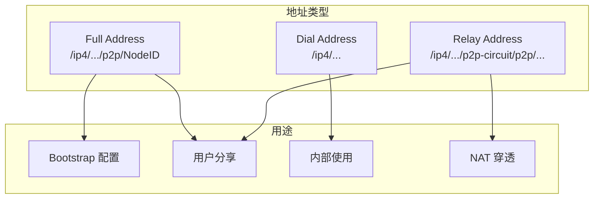
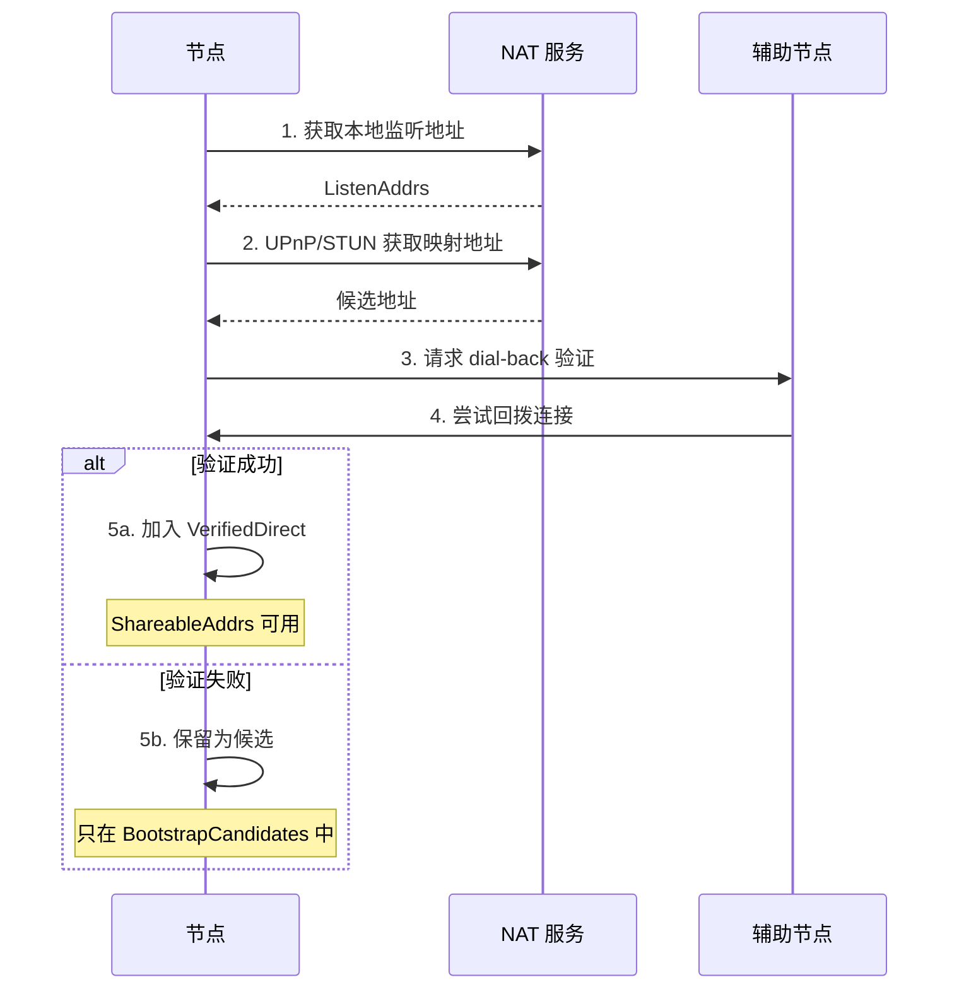

# 如何获取/分享可连接地址

本指南解答：**如何获取可以分享给其他节点的地址？**

---

## 问题

```
┌─────────────────────────────────────────────────────────────────────┐
│                         我要解决什么问题？                           │
├─────────────────────────────────────────────────────────────────────┤
│                                                                      │
│  "如何获取可以发给其他人的连接地址？"                                │
│  "ShareableAddrs 和 ListenAddrs 有什么区别？"                        │
│  "为什么有时候获取不到公网地址？"                                    │
│                                                                      │
└─────────────────────────────────────────────────────────────────────┘
```

---

## 地址类型概述

DeP2P 中有三种地址类型：



### 地址类型对比

| 类型 | 格式 | 用途 | 用户可见 |
|------|------|------|----------|
| **Full Address** | `/ip4/.../p2p/<NodeID>` | Bootstrap、分享 | ✅ 是 |
| **Dial Address** | `/ip4/...` | 内部拨号 | ❌ 否 |
| **Relay Address** | `/ip4/.../p2p-circuit/p2p/<NodeID>` | NAT 后兜底 | ✅ 是 |

---

## 获取地址的方法

### 方法 1：ShareableAddrs() - 获取可分享地址

返回已验证的公网直连地址（Full Address）。

```go
package main

import (
    "context"
    "fmt"
    "log"

    "github.com/dep2p/go-dep2p"
    "github.com/dep2p/go-dep2p/pkg/types"
)

func main() {
    ctx := context.Background()

    node, err := dep2p.New(ctx, dep2p.WithPreset(dep2p.PresetServer))
    if err != nil {
        log.Fatalf("创建节点失败: %v", err)
    }
    if err := node.Start(ctx); err != nil {
        log.Fatalf("启动节点失败: %v", err)
    }
    defer node.Close()

    realm := node.Realm("my-network")
    realm.Join(ctx)

    // 获取可分享地址（可能为空，如果还未验证）
    addrs := node.ShareableAddrs()
    if len(addrs) > 0 {
        fmt.Println("可分享地址:")
        for _, addr := range addrs {
            fmt.Printf("  %s\n", addr)
        }
    } else {
        fmt.Println("暂无可分享地址（验证中或无公网可达性）")
    }
}
```

### 方法 2：WaitShareableAddrs() - 等待可分享地址

等待地址验证完成，推荐使用。

```go
package main

import (
    "context"
    "fmt"
    "log"
    "time"

    "github.com/dep2p/go-dep2p"
    "github.com/dep2p/go-dep2p/pkg/types"
)

func main() {
    ctx := context.Background()

    node, err := dep2p.New(ctx, dep2p.WithPreset(dep2p.PresetServer))
    if err != nil {
        log.Fatalf("创建节点失败: %v", err)
    }
    if err := node.Start(ctx); err != nil {
        log.Fatalf("启动节点失败: %v", err)
    }
    defer node.Close()

    realm := node.Realm("my-network")
    realm.Join(ctx)

    // 等待地址验证（最多 30 秒）
    waitCtx, cancel := context.WithTimeout(ctx, 30*time.Second)
    defer cancel()

    addrs, err := node.WaitShareableAddrs(waitCtx)
    if err != nil {
        fmt.Println("获取地址超时，可能没有公网可达性")
        fmt.Println("考虑使用 Relay 地址")
        return
    }

    fmt.Println("可分享地址:")
    for _, addr := range addrs {
        fmt.Printf("  %s\n", addr)
    }
}
```

### 方法 3：BootstrapCandidates() - 获取候选地址

返回所有候选地址（包括未验证的），用于冷启动。

```go
package main

import (
    "context"
    "fmt"
    "log"

    "github.com/dep2p/go-dep2p"
    "github.com/dep2p/go-dep2p/pkg/types"
)

func main() {
    ctx := context.Background()

    node, err := dep2p.New(ctx, dep2p.WithPreset(dep2p.PresetServer))
    if err != nil {
        log.Fatalf("创建节点失败: %v", err)
    }
    if err := node.Start(ctx); err != nil {
        log.Fatalf("启动节点失败: %v", err)
    }
    defer node.Close()

    realm := node.Realm("my-network")
    realm.Join(ctx)

    // 获取所有候选地址（不保证全部可达）
    candidates := node.BootstrapCandidates()
    
    fmt.Println("候选地址:")
    for _, c := range candidates {
        fmt.Printf("  类型: %s, 地址: %s\n", c.Type, c.Addr)
    }
}
```

---

## 地址获取流程



---

## 不同方法的区别

```
┌─────────────────────────────────────────────────────────────────────────────┐
│                          地址获取方法对比                                    │
├─────────────────────────────────────────────────────────────────────────────┤
│                                                                              │
│  方法                      返回内容              是否验证    推荐场景       │
│  ─────────────────────────────────────────────────────────────────────────  │
│  ListenAddrs()            本地监听地址           否         内部调试       │
│  AdvertisedAddrs()        通告地址               否         高级用途       │
│  ShareableAddrs()         已验证公网地址         是         用户分享       │
│  WaitShareableAddrs()     等待已验证地址         是         推荐使用       │
│  BootstrapCandidates()    所有候选地址           否         冷启动尝试     │
│                                                                              │
└─────────────────────────────────────────────────────────────────────────────┘
```

---

## 完整示例：获取并分享地址

```go
package main

import (
    "context"
    "fmt"
    "log"
    "time"

    "github.com/dep2p/go-dep2p"
    "github.com/dep2p/go-dep2p/pkg/types"
)

func main() {
    ctx := context.Background()

    node, err := dep2p.New(ctx,
        dep2p.WithPreset(dep2p.PresetServer),
        dep2p.WithListenPort(4001),
    )
    if err != nil {
        log.Fatalf("创建节点失败: %v", err)
    }
    if err := node.Start(ctx); err != nil {
        log.Fatalf("启动节点失败: %v", err)
    }
    defer node.Close()

    realm := node.Realm("my-network")
    realm.Join(ctx)

    fmt.Println("节点信息:")
    fmt.Printf("  NodeID: %s\n", node.ID())
    fmt.Println()

    // 1. 显示监听地址
    fmt.Println("监听地址（本地）:")
    for _, addr := range node.ListenAddrs() {
        fmt.Printf("  %s\n", addr)
    }
    fmt.Println()

    // 2. 等待可分享地址
    fmt.Println("等待公网地址验证...")
    waitCtx, cancel := context.WithTimeout(ctx, 30*time.Second)
    defer cancel()

    addrs, err := node.WaitShareableAddrs(waitCtx)
    if err == nil && len(addrs) > 0 {
        fmt.Println()
        fmt.Println("✅ 可分享地址（已验证）:")
        for _, addr := range addrs {
            fmt.Printf("  %s\n", addr)
        }
        fmt.Println()
        fmt.Println("将上述地址分享给其他用户即可连接")
    } else {
        fmt.Println()
        fmt.Println("⚠️ 无法获取已验证的公网地址")
        fmt.Println()
        
        // 3. 回退到候选地址
        fmt.Println("候选地址（可尝试）:")
        candidates := node.BootstrapCandidates()
        for _, c := range candidates {
            fmt.Printf("  [%s] %s\n", c.Type, c.Addr)
        }
    }
}
```

---

## 地址格式说明

### Full Address 格式

```
/ip4/203.0.113.5/udp/4001/quic-v1/p2p/5Q2STWvBFn...
 │    │           │    │    │          │
 │    │           │    │    │          └── NodeID（Base58 编码）
 │    │           │    │    └── 传输协议
 │    │           │    └── 端口
 │    │           └── 传输层协议
 │    └── IP 地址
 └── IP 版本
```

### 使用 DNS 的 Full Address

```
/dns4/node.example.com/udp/4001/quic-v1/p2p/5Q2STWvBFn...
  │    │                 │
  │    │                 └── 端口和协议
  │    └── 域名
  └── DNS 版本（dns4 = IPv4, dns6 = IPv6）
```

### Relay Address 格式

```
/ip4/203.0.113.5/udp/4001/quic-v1/p2p/5Q2STWvB.../p2p-circuit/p2p/7K3YTWvA...
 │                                │                │             │
 │                                │                │             └── 目标 NodeID
 │                                │                └── 中继标记
 │                                └── Relay NodeID
 └── Relay 节点地址
```

---

## 故障排查

### 问题 1：ShareableAddrs() 返回空

**原因**：
1. 地址验证尚未完成
2. 节点在 NAT 后，无公网可达性
3. 没有辅助节点进行 dial-back 验证

**解决方案**：

```go
// 1. 使用 WaitShareableAddrs 等待
addrs, err := node.WaitShareableAddrs(ctx)
if err != nil {
    // 超时，可能没有公网可达性
}

// 2. 检查是否有连接的节点（用于验证）
if node.ConnectionCount() == 0 {
    fmt.Println("没有连接的节点，无法进行地址验证")
}

// 3. 使用 Relay 作为备选
node, _ := dep2p.New(ctx,
    dep2p.WithPreset(dep2p.PresetDesktop),
    dep2p.WithRelay(true),  // 启用 Relay
)
_ = node.Start(ctx)
```

### 问题 2：地址无法被其他节点连接

**原因**：
1. 防火墙阻止入站连接
2. 端口未映射（NAT 后）
3. 分享了错误的地址格式

**解决方案**：

```go
// 1. 确保使用 Full Address
addr := node.ShareableAddrs()[0]
if !strings.Contains(addr, "/p2p/") {
    log.Fatal("必须使用 Full Address 格式")
}

// 2. 对于公网服务器，显式声明外部地址
node, _ := dep2p.New(ctx,
    dep2p.WithPreset(dep2p.PresetServer),
    dep2p.WithExternalAddrs("/ip4/公网IP/udp/4001/quic-v1"),
)
_ = node.Start(ctx)

// 3. 检查端口是否开放
// sudo ufw allow 4001/udp
```

### 问题 3：只有 Relay 地址

**说明**：这是正常的，表示节点没有公网直连能力。

**处理**：

```go
// Relay 地址也可以分享给其他用户
// 但延迟会更高

addrs := node.ShareableAddrs()
if len(addrs) == 0 {
    // 尝试获取 Relay 地址
    candidates := node.BootstrapCandidates()
    for _, c := range candidates {
        if c.Type == "relay" {
            fmt.Printf("Relay 地址: %s\n", c.Addr)
        }
    }
}
```

---

## 最佳实践

```
┌─────────────────────────────────────────────────────────────────────┐
│                         地址分享最佳实践                             │
├─────────────────────────────────────────────────────────────────────┤
│                                                                      │
│  1. 总是使用 Full Address                                           │
│     ✅ /ip4/1.2.3.4/udp/4001/quic-v1/p2p/5Q2STWvBFn...              │
│     ❌ /ip4/1.2.3.4/udp/4001/quic-v1                                │
│                                                                      │
│  2. 优先使用 WaitShareableAddrs()                                   │
│     - 确保地址已验证                                                 │
│     - 设置合理的超时时间                                             │
│                                                                      │
│  3. 服务器节点声明外部地址                                          │
│     - 使用 WithExternalAddrs() 声明公网 IP                          │
│     - 确保端口开放                                                   │
│                                                                      │
│  4. NAT 后节点启用 Relay                                            │
│     - 使用 WithRelay(true)                                          │
│     - Relay 地址也可分享                                             │
│                                                                      │
└─────────────────────────────────────────────────────────────────────┘
```

---

## 相关文档

- [如何 Bootstrap 网络](bootstrap-network.md)
- [如何使用中继](use-relay.md)
- [NAT 穿透配置](nat-traversal.md)
- [常见问题](../getting-started/faq.md)
