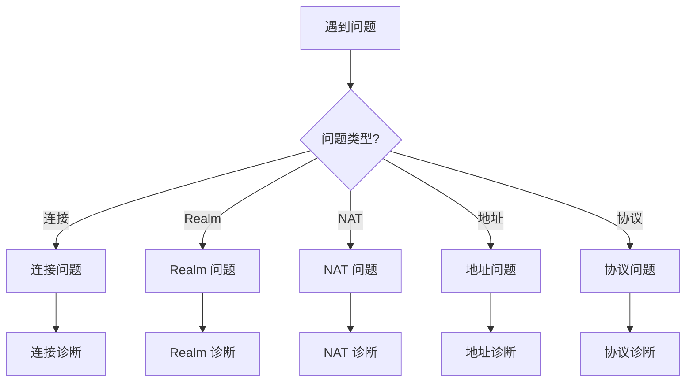

# 故障排查

本指南解答：**遇到问题时如何排查和解决？**

---

## 最常见的 5 个错误

快速定位你的问题：

| 错误 | 原因 | 解决方案 |
|------|------|----------|
| `ErrNotMember` | 未加入 Realm 就使用业务 API | 先调用 `JoinRealmWithKey()` |
| `ErrAlreadyJoined` | 重复加入同一 Realm | 检查 `CurrentRealm()` 或先 `LeaveRealm()` |
| `connection timeout` | 网络不通或防火墙阻止 | 检查网络、启用 Relay |
| `peer id mismatch` | 地址中 NodeID 错误 | 使用 `ShareableAddrs()` 获取正确地址 |
| `ErrAuthFailed` | RealmKey 不一致 | 确保所有成员使用相同的 realmKey |

> **完整错误参考**：查看 [错误码参考](../reference/error-codes.md) 获取所有错误的详细说明。
> 
> **API 约束说明**：查看 [API 默认行为与约束](../reference/api-defaults.md) 了解核心约束。

---

## 问题分类



---

## 快速诊断清单

```
┌─────────────────────────────────────────────────────────────────────┐
│                         快速诊断清单                                 │
├─────────────────────────────────────────────────────────────────────┤
│                                                                      │
│  □ 节点是否成功启动？                                               │
│    - 检查启动错误                                                    │
│    - 确认 node.ID() 可用                                            │
│                                                                      │
│  □ 是否加入了 Realm？                                               │
│    - 调用 JoinRealm() 后再使用业务 API                              │
│    - 检查 CurrentRealm()                                            │
│                                                                      │
│  □ 网络是否连通？                                                   │
│    - 检查 ConnectionCount()                                         │
│    - 检查 Bootstrap 配置                                            │
│                                                                      │
│  □ 地址是否正确？                                                   │
│    - 使用 Full Address 格式                                         │
│    - 检查 /p2p/<NodeID> 后缀                                        │
│                                                                      │
│  □ NAT/防火墙是否阻止？                                             │
│    - 检查 UDP 端口                                                   │
│    - 启用 Relay                                                     │
│                                                                      │
└─────────────────────────────────────────────────────────────────────┘
```

---

## 连接问题

### 问题：无法连接到其他节点

**诊断步骤**：

```go
func diagnoseConnectionIssue(ctx context.Context, node dep2p.Node, targetAddr string) {
    fmt.Println("═══════════════════════════════════════")
    fmt.Println("连接问题诊断")
    fmt.Println("═══════════════════════════════════════")
    
    // 1. 检查本节点状态
    fmt.Printf("本节点 ID: %s\n", node.ID())
    fmt.Printf("当前连接数: %d\n", node.ConnectionCount())
    
    // 2. 检查目标地址格式
    if !strings.Contains(targetAddr, "/p2p/") {
        fmt.Println("❌ 地址格式错误：缺少 /p2p/<NodeID> 后缀")
        return
    }
    fmt.Println("✓ 地址格式正确")
    
    // 3. 尝试连接
    start := time.Now()
    conn, err := node.ConnectToAddr(ctx, targetAddr)
    elapsed := time.Since(start)
    
    if err != nil {
        fmt.Printf("❌ 连接失败 (%v): %v\n", elapsed, err)
        analyzeConnectionError(err)
        return
    }
    
    fmt.Printf("✓ 连接成功 (%v)\n", elapsed)
    fmt.Printf("  远程节点: %s\n", conn.RemoteID())
}

func analyzeConnectionError(err error) {
    errStr := err.Error()
    
    switch {
    case strings.Contains(errStr, "timeout"):
        fmt.Println("诊断: 连接超时")
        fmt.Println("建议:")
        fmt.Println("  - 检查网络连通性")
        fmt.Println("  - 增加超时时间")
        fmt.Println("  - 检查防火墙设置")
        
    case strings.Contains(errStr, "refused"):
        fmt.Println("诊断: 连接被拒绝")
        fmt.Println("建议:")
        fmt.Println("  - 确认目标节点正在运行")
        fmt.Println("  - 检查端口是否正确")
        
    case strings.Contains(errStr, "no route"):
        fmt.Println("诊断: 无法路由")
        fmt.Println("建议:")
        fmt.Println("  - 检查 NAT 配置")
        fmt.Println("  - 启用 Relay")
        
    case strings.Contains(errStr, "peer id mismatch"):
        fmt.Println("诊断: NodeID 不匹配")
        fmt.Println("建议:")
        fmt.Println("  - 确认地址中的 NodeID 正确")
        
    default:
        fmt.Printf("诊断: 未知错误\n")
        fmt.Println("建议: 启用 Debug 日志查看详情")
    }
}
```

### 常见连接错误及解决方案

| 错误 | 原因 | 解决方案 |
|------|------|----------|
| `context deadline exceeded` | 超时 | 增加超时、检查网络 |
| `connection refused` | 目标不可达 | 确认目标节点运行 |
| `no route to host` | 路由问题 | 检查 NAT、使用 Relay |
| `peer id mismatch` | ID 不匹配 | 使用正确的完整地址 |

---

## Realm 问题

### 问题：ErrNotMember 错误

**原因**：未加入 Realm 就调用业务 API

```go
// ❌ 错误用法：未加入 Realm 就调用业务 API
node, _ := dep2p.StartNode(ctx, dep2p.WithPreset(dep2p.PresetDesktop))
realm := node.CurrentRealm()  // 返回 nil
if realm != nil {
    realm.Messaging().Send(ctx, targetID, "/myapp/1.0.0", data)  // 不会执行
}
// 实际会报错：ErrNotMember

// ✓ 正确用法：先加入 Realm，再使用 Messaging API
node, _ := dep2p.StartNode(ctx, dep2p.WithPreset(dep2p.PresetDesktop))
realmKey := types.GenerateRealmKey()
realm, _ := node.JoinRealmWithKey(ctx, "my-realm", realmKey)  // 先加入 Realm
realm.Messaging().Send(ctx, targetID, "/myapp/1.0.0", data)  // 正常
```

### 问题：ErrAlreadyJoined 错误

**原因**：重复加入同一个 Realm

```go
// ❌ 错误
node.Realm().JoinRealm(ctx, types.RealmID("realm-a"))
node.Realm().JoinRealm(ctx, types.RealmID("realm-a"))  // 报错

// ✓ 正确：检查当前 Realm
if node.Realm().CurrentRealm() != types.RealmID("realm-a") {
    node.Realm().JoinRealm(ctx, types.RealmID("realm-a"))
}
```

### 诊断 Realm 状态

```go
func diagnoseRealmIssue(node dep2p.Node) {
    fmt.Println("═══════════════════════════════════════")
    fmt.Println("Realm 诊断")
    fmt.Println("═══════════════════════════════════════")
    
    currentRealm := node.Realm().CurrentRealm()
    
    if currentRealm.IsEmpty() {
        fmt.Println("❌ 未加入任何 Realm")
        fmt.Println("建议: 调用 node.Realm().JoinRealm(ctx, realmID)")
    } else {
        fmt.Printf("✓ 当前 Realm: %s\n", currentRealm)
    }
}
```

---

## NAT 问题

### 问题：无法获取公网地址

**诊断**：

```go
func diagnoseNATIssue(ctx context.Context, node dep2p.Node) {
    fmt.Println("═══════════════════════════════════════")
    fmt.Println("NAT 诊断")
    fmt.Println("═══════════════════════════════════════")
    
    // 1. 检查监听地址
    fmt.Println("\n监听地址:")
    for _, addr := range node.ListenAddrs() {
        fmt.Printf("  %s\n", addr)
    }
    
    // 2. 检查通告地址
    fmt.Println("\n通告地址:")
    advAddrs := node.AdvertisedAddrs()
    if len(advAddrs) == 0 {
        fmt.Println("  (无)")
    } else {
        for _, addr := range advAddrs {
            fmt.Printf("  %s\n", addr)
        }
    }
    
    // 3. 等待可分享地址
    fmt.Println("\n等待公网地址验证...")
    waitCtx, cancel := context.WithTimeout(ctx, 30*time.Second)
    defer cancel()
    
    addrs, err := node.WaitShareableAddrs(waitCtx)
    if err != nil {
        fmt.Println("❌ 无法获取公网地址")
        fmt.Println("可能原因:")
        fmt.Println("  - 在多层 NAT 后")
        fmt.Println("  - UPnP 不可用")
        fmt.Println("  - 无 helper 节点进行验证")
        fmt.Println("建议: 启用 Relay")
    } else {
        fmt.Println("✓ 公网地址:")
        for _, addr := range addrs {
            fmt.Printf("  %s\n", addr)
        }
    }
    
    // 4. 检查 Relay 候选
    fmt.Println("\n候选地址:")
    for _, c := range node.BootstrapCandidates() {
        fmt.Printf("  [%s] %s\n", c.Type, c.Addr)
    }
}
```

### NAT 穿透检查清单

```
┌─────────────────────────────────────────────────────────────────────┐
│                      NAT 穿透检查清单                                │
├─────────────────────────────────────────────────────────────────────┤
│                                                                      │
│  □ 路由器支持 UPnP？                                                │
│    - 登录路由器检查 UPnP 设置                                       │
│    - 某些路由器默认禁用 UPnP                                        │
│                                                                      │
│  □ 防火墙允许 UDP？                                                 │
│    - 检查本机防火墙                                                  │
│    - 检查路由器防火墙                                                │
│    - 端口 4001/UDP 需要开放                                         │
│                                                                      │
│  □ 使用的是什么 NAT 类型？                                          │
│    - Full Cone: 最容易穿透                                          │
│    - Symmetric: 最难穿透，建议用 Relay                              │
│                                                                      │
│  □ Relay 是否启用？                                                 │
│    - PresetDesktop 默认启用                                         │
│    - 确保有可用的 Relay 节点                                        │
│                                                                      │
└─────────────────────────────────────────────────────────────────────┘
```

---

## 地址问题

### 问题：地址格式错误

**正确格式对比**：

```
┌─────────────────────────────────────────────────────────────────────────────┐
│                          地址格式对比                                        │
├─────────────────────────────────────────────────────────────────────────────┤
│                                                                              │
│  ✓ Full Address（正确，用于 Bootstrap/分享）：                              │
│    /ip4/1.2.3.4/udp/4001/quic-v1/p2p/5Q2STWvBFn...                          │
│                                                                              │
│  ✗ Dial Address（错误，缺少 NodeID）：                                      │
│    /ip4/1.2.3.4/udp/4001/quic-v1                                            │
│                                                                              │
│  ✗ 简化格式（错误）：                                                       │
│    1.2.3.4:4001                                                              │
│                                                                              │
│  ✓ DNS 格式（正确）：                                                       │
│    /dns4/node.example.com/udp/4001/quic-v1/p2p/5Q2STWvBFn...                │
│                                                                              │
│  ✓ Relay 格式（正确）：                                                     │
│    /ip4/.../p2p/.../p2p-circuit/p2p/...                                     │
│                                                                              │
└─────────────────────────────────────────────────────────────────────────────┘
```

### 地址验证函数

```go
func validateAddress(addr string) error {
    // 检查基本格式
    if !strings.HasPrefix(addr, "/") {
        return fmt.Errorf("地址必须以 / 开头")
    }
    
    // 检查是否包含 NodeID
    if !strings.Contains(addr, "/p2p/") {
        return fmt.Errorf("地址必须包含 /p2p/<NodeID>")
    }
    
    // 检查协议
    if !strings.Contains(addr, "/quic") {
        return fmt.Errorf("建议使用 QUIC 协议")
    }
    
    return nil
}
```

---

## 协议问题

### 问题：协议不支持

**诊断**：

```go
func diagnoseProtocolIssue(ctx context.Context, node dep2p.Node, 
    targetID types.NodeID, protocol string) {
    
    fmt.Println("═══════════════════════════════════════")
    fmt.Println("协议诊断")
    fmt.Println("═══════════════════════════════════════")
    
    // 1. 检查协议格式
    if !strings.HasPrefix(protocol, "/") {
        fmt.Println("❌ 协议 ID 格式错误：必须以 / 开头")
        return
    }
    
    parts := strings.Split(protocol, "/")
    if len(parts) < 4 {
        fmt.Println("❌ 协议 ID 格式错误：应为 /<namespace>/<name>/<version>")
        return
    }
    fmt.Printf("✓ 协议格式正确: %s\n", protocol)
    
    // 2. 尝试连接并打开流
    conn, err := node.Connect(ctx, targetID)
    if err != nil {
        fmt.Printf("❌ 无法连接到目标节点: %v\n", err)
        return
    }
    
    stream, err := conn.OpenStream(ctx, protocol)
    if err != nil {
        fmt.Printf("❌ 协议不支持: %v\n", err)
        fmt.Println("建议:")
        fmt.Println("  - 确认对方已注册该协议")
        fmt.Println("  - 检查协议 ID 是否完全匹配")
        fmt.Println("  - 尝试降级到旧版本")
        return
    }
    defer stream.Close()
    
    fmt.Println("✓ 协议支持")
}
```

---

## 诊断工具

### 完整诊断脚本

```go
package main

import (
    "context"
    "fmt"
    "time"

    "github.com/dep2p/go-dep2p"
    "github.com/dep2p/go-dep2p/pkg/types"
)

func runDiagnostics(node dep2p.Node) {
    ctx := context.Background()
    
    fmt.Println("╔════════════════════════════════════════╗")
    fmt.Println("║          DeP2P 节点诊断                ║")
    fmt.Println("╚════════════════════════════════════════╝")
    fmt.Println()
    
    // 基本信息
    fmt.Println("【基本信息】")
    fmt.Printf("节点 ID:     %s\n", node.ID())
    fmt.Printf("连接数:      %d\n", node.ConnectionCount())
    fmt.Println()
    
    // Realm 状态
    fmt.Println("【Realm 状态】")
    realm := node.Realm().CurrentRealm()
    if realm.IsEmpty() {
        fmt.Println("状态:       ❌ 未加入 Realm")
    } else {
        fmt.Printf("状态:       ✓ 已加入 %s\n", realm)
    }
    fmt.Println()
    
    // 地址信息
    fmt.Println("【地址信息】")
    fmt.Println("监听地址:")
    for _, addr := range node.ListenAddrs() {
        fmt.Printf("  • %s\n", addr)
    }
    
    fmt.Println("可分享地址:")
    waitCtx, cancel := context.WithTimeout(ctx, 10*time.Second)
    addrs, err := node.WaitShareableAddrs(waitCtx)
    cancel()
    
    if err != nil || len(addrs) == 0 {
        fmt.Println("  (暂无，正在验证中...)")
    } else {
        for _, addr := range addrs {
            fmt.Printf("  • %s\n", addr)
        }
    }
    fmt.Println()
    
    // 网络状态
    fmt.Println("【网络状态】")
    if node.ConnectionCount() > 0 {
        fmt.Println("Bootstrap:  ✓ 已连接")
    } else {
        fmt.Println("Bootstrap:  ❌ 未连接，检查 Bootstrap 配置")
    }
    
    fmt.Println()
    fmt.Println("═══════════════════════════════════════")
}
```

---

## 问题报告模板

当需要报告问题时，请提供以下信息：

```
## 问题描述
[简述问题]

## 环境信息
- DeP2P 版本: 
- Go 版本: 
- 操作系统: 
- 网络环境: [家庭网络/公司网络/云服务器]

## 重现步骤
1. 
2. 
3. 

## 预期行为
[描述预期行为]

## 实际行为
[描述实际行为]

## 诊断信息
节点 ID: 
连接数: 
Realm: 
监听地址: 
通告地址: 

## 日志
[相关日志输出]

## 代码示例
[最小可重现的代码]
```

---

## 相关文档

- [可观测性](observability.md)
- [NAT 穿透配置](nat-traversal.md)
- [如何使用中继](use-relay.md)
- [常见问题 FAQ](../getting-started/faq.md)
