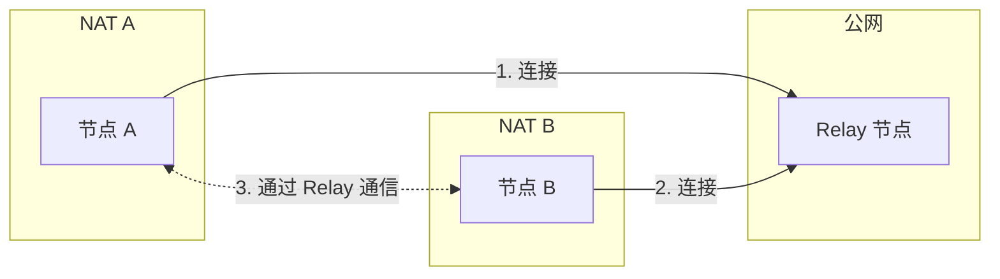
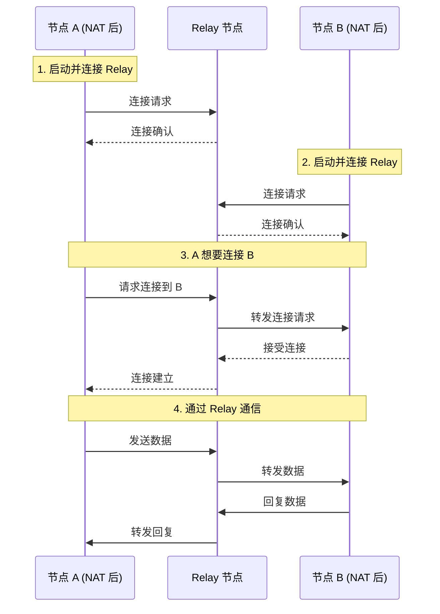

# 如何使用中继

本指南解答：**如何在 NAT 后使用中继连接其他节点？**

---

## 问题

```
┌─────────────────────────────────────────────────────────────────────┐
│                         我要解决什么问题？                           │
├─────────────────────────────────────────────────────────────────────┤
│                                                                      │
│  "我在 NAT 后面，无法被其他节点直接连接，怎么办？"                   │
│  "如何配置中继服务器？"                                              │
│  "如何使用 AutoRelay 自动发现中继？"                                 │
│                                                                      │
└─────────────────────────────────────────────────────────────────────┘
```

---

## Relay 概述



### 两种角色

| 角色 | 说明 | 配置 |
|------|------|------|
| **Relay Client** | 使用中继连接其他节点 | `WithRelay(true)` |
| **Relay Server** | 为其他节点提供中继服务 | `WithRelayServer(true)` |

---

## 启用 Relay 客户端

### 基础配置

```go
package main

import (
    "context"
    "fmt"
    "log"

    "github.com/dep2p/go-dep2p"
    "github.com/dep2p/go-dep2p/pkg/types"
)

func main() {
    ctx := context.Background()

    // 启用 Relay 客户端（默认已启用）
    node, err := dep2p.StartNode(ctx,
        dep2p.WithPreset(dep2p.PresetDesktop),
        dep2p.WithRelay(true),  // 启用 Relay
    )
    if err != nil {
        log.Fatalf("启动失败: %v", err)
    }
    defer node.Close()

    node.Realm().JoinRealm(ctx, types.RealmID("my-network"))

    fmt.Printf("节点已启动: %s\n", node.ID().ShortString())
    fmt.Println("Relay 客户端已启用，可以通过中继连接其他节点")
}
```

### 预设中的 Relay 配置

| 预设 | Relay Client | Relay Server |
|------|--------------|--------------|
| `PresetMinimal` | ❌ 禁用 | ❌ 禁用 |
| `PresetDesktop` | ✅ 启用 | ❌ 禁用 |
| `PresetServer` | ✅ 启用 | ✅ 启用 |
| `PresetMobile` | ✅ 启用 | ❌ 禁用 |

---

## 配置 Relay 服务器

部署一个为其他节点提供中继服务的节点。

```go
package main

import (
    "context"
    "fmt"
    "log"
    "os"
    "os/signal"
    "syscall"

    "github.com/dep2p/go-dep2p"
    "github.com/dep2p/go-dep2p/pkg/types"
)

func main() {
    ctx, cancel := context.WithCancel(context.Background())
    defer cancel()

    // 配置 Relay 服务器
    node, err := dep2p.StartNode(ctx,
        dep2p.WithPreset(dep2p.PresetServer),
        dep2p.WithRelayServer(true),    // 启用 Relay 服务
        dep2p.WithListenPort(4001),     // 固定端口
    )
    if err != nil {
        log.Fatalf("启动失败: %v", err)
    }
    defer node.Close()

    node.Realm().JoinRealm(ctx, types.RealmID("relay-network"))

    fmt.Println("╔════════════════════════════════════════╗")
    fmt.Println("║         Relay 服务器已启动             ║")
    fmt.Println("╚════════════════════════════════════════╝")
    fmt.Println()
    fmt.Printf("节点 ID: %s\n", node.ID())
    fmt.Println()
    fmt.Println("其他节点可以使用以下地址连接：")
    for _, addr := range node.ListenAddrs() {
        fmt.Printf("  %s/p2p/%s\n", addr, node.ID())
    }
    fmt.Println()
    fmt.Println("按 Ctrl+C 退出")

    sigCh := make(chan os.Signal, 1)
    signal.Notify(sigCh, syscall.SIGINT, syscall.SIGTERM)
    <-sigCh
}
```

---

## AutoRelay 自动发现

DeP2P 会自动发现并使用网络中的 Relay 节点。

```go
package main

import (
    "context"
    "fmt"
    "log"
    "time"

    "github.com/dep2p/go-dep2p"
    "github.com/dep2p/go-dep2p/pkg/types"
)

func main() {
    ctx := context.Background()

    // AutoRelay 在 Desktop/Server 预设中默认启用
    node, err := dep2p.StartNode(ctx,
        dep2p.WithPreset(dep2p.PresetDesktop),
        // AutoRelay 会自动发现并连接 Relay 节点
    )
    if err != nil {
        log.Fatalf("启动失败: %v", err)
    }
    defer node.Close()

    node.Realm().JoinRealm(ctx, types.RealmID("my-network"))

    // 等待 AutoRelay 发现 Relay 节点
    fmt.Println("等待 Relay 节点发现...")
    time.Sleep(10 * time.Second)

    // 检查是否有 Relay 地址
    candidates := node.BootstrapCandidates()
    for _, c := range candidates {
        if c.Type == "relay" {
            fmt.Printf("已发现 Relay: %s\n", c.Addr)
        }
    }
}
```

---

## 手动指定 Relay 节点

当你知道 Relay 节点的地址时，可以直接指定。

```go
package main

import (
    "context"
    "fmt"
    "log"

    "github.com/dep2p/go-dep2p"
    "github.com/dep2p/go-dep2p/pkg/types"
)

func main() {
    ctx := context.Background()

    // 指定 Relay 节点作为 Bootstrap
    relayAddr := "/ip4/1.2.3.4/udp/4001/quic-v1/p2p/5Q2STWvBRelayNode..."

    node, err := dep2p.StartNode(ctx,
        dep2p.WithPreset(dep2p.PresetDesktop),
        dep2p.WithBootstrapPeers(relayAddr),  // Relay 节点也可作为 Bootstrap
        dep2p.WithRelay(true),
    )
    if err != nil {
        log.Fatalf("启动失败: %v", err)
    }
    defer node.Close()

    node.Realm().JoinRealm(ctx, types.RealmID("my-network"))

    fmt.Printf("节点已启动: %s\n", node.ID().ShortString())
    fmt.Println("将使用指定的 Relay 节点")
}
```

---

## Relay 连接流程



---

## Relay 地址格式

```
┌─────────────────────────────────────────────────────────────────────────────┐
│                           Relay 地址格式                                     │
├─────────────────────────────────────────────────────────────────────────────┤
│                                                                              │
│  格式：                                                                      │
│  /ip4/<relay-ip>/udp/<port>/quic-v1/p2p/<relay-id>/p2p-circuit/p2p/<target>│
│                                                                              │
│  示例：                                                                      │
│  /ip4/1.2.3.4/udp/4001/quic-v1/p2p/5Q2STWvBRelay/p2p-circuit/p2p/7K3YTarget│
│  │                               │              │                │         │
│  └─ Relay 节点地址 ──────────────┘              │                │         │
│                                                  │                │         │
│                            p2p-circuit 标记 ────┘                │         │
│                                                                   │         │
│                                             目标节点 ID ─────────┘         │
│                                                                              │
└─────────────────────────────────────────────────────────────────────────────┘
```

---

## 完整示例：NAT 后节点通信

### 1. Relay 服务器（公网）

```go
// relay_server.go
package main

import (
    "context"
    "fmt"
    "log"
    "os"
    "os/signal"
    "syscall"

    "github.com/dep2p/go-dep2p"
    "github.com/dep2p/go-dep2p/pkg/types"
)

func main() {
    ctx, cancel := context.WithCancel(context.Background())
    defer cancel()

    node, err := dep2p.StartNode(ctx,
        dep2p.WithPreset(dep2p.PresetServer),
        dep2p.WithRelayServer(true),
        dep2p.WithListenPort(4001),
    )
    if err != nil {
        log.Fatalf("启动失败: %v", err)
    }
    defer node.Close()

    node.Realm().JoinRealm(ctx, types.RealmID("demo-network"))

    fmt.Printf("Relay 服务器: %s\n", node.ID())
    for _, addr := range node.ListenAddrs() {
        fmt.Printf("地址: %s/p2p/%s\n", addr, node.ID())
    }

    sigCh := make(chan os.Signal, 1)
    signal.Notify(sigCh, syscall.SIGINT, syscall.SIGTERM)
    <-sigCh
}
```

### 2. NAT 后节点 A

```go
// node_a.go
package main

import (
    "context"
    "fmt"
    "log"
    "os"

    "github.com/dep2p/go-dep2p"
    "github.com/dep2p/go-dep2p/pkg/types"
)

func main() {
    ctx := context.Background()

    relayAddr := os.Getenv("RELAY_ADDR") // 从环境变量获取 Relay 地址

    node, err := dep2p.StartNode(ctx,
        dep2p.WithPreset(dep2p.PresetDesktop),
        dep2p.WithBootstrapPeers(relayAddr),
        dep2p.WithRelay(true),
    )
    if err != nil {
        log.Fatalf("启动失败: %v", err)
    }
    defer node.Close()

    node.Realm().JoinRealm(ctx, types.RealmID("demo-network"))

    fmt.Printf("节点 A: %s\n", node.ID())
    fmt.Println("等待节点 B 连接...")

    // 注册消息处理器
    node.Endpoint().SetProtocolHandler("/test/1.0.0", func(stream dep2p.Stream) {
        defer stream.Close()
        buf := make([]byte, 1024)
        n, _ := stream.Read(buf)
        fmt.Printf("收到消息: %s\n", string(buf[:n]))
        stream.Write([]byte("Hello from A!"))
    })

    select {}
}
```

### 3. NAT 后节点 B

```go
// node_b.go
package main

import (
    "context"
    "fmt"
    "log"
    "os"

    "github.com/dep2p/go-dep2p"
    "github.com/dep2p/go-dep2p/pkg/types"
)

func main() {
    ctx := context.Background()

    relayAddr := os.Getenv("RELAY_ADDR")
    nodeAID := os.Getenv("NODE_A_ID")

    node, err := dep2p.StartNode(ctx,
        dep2p.WithPreset(dep2p.PresetDesktop),
        dep2p.WithBootstrapPeers(relayAddr),
        dep2p.WithRelay(true),
    )
    if err != nil {
        log.Fatalf("启动失败: %v", err)
    }
    defer node.Close()

    node.Realm().JoinRealm(ctx, types.RealmID("demo-network"))

    fmt.Printf("节点 B: %s\n", node.ID())

    // 连接到节点 A（通过 Relay）
    targetID, _ := types.ParseNodeID(nodeAID)
    conn, err := node.Connect(ctx, targetID)
    if err != nil {
        log.Fatalf("连接失败: %v", err)
    }

    fmt.Println("已连接到节点 A（通过 Relay）")

    // 发送消息
    stream, _ := conn.OpenStream(ctx, "/test/1.0.0")
    stream.Write([]byte("Hello from B!"))
    
    buf := make([]byte, 1024)
    n, _ := stream.Read(buf)
    fmt.Printf("收到回复: %s\n", string(buf[:n]))
}
```

---

## 故障排查

### 问题 1：无法连接到 Relay 节点

**可能原因**：
- Relay 节点不可达
- 防火墙阻止连接
- 地址格式错误

**解决方案**：

```go
// 1. 检查 Relay 地址格式
// 必须是 Full Address
relayAddr := "/ip4/1.2.3.4/udp/4001/quic-v1/p2p/5Q2STWvBRelay..."

// 2. 测试连接
conn, err := node.ConnectToAddr(ctx, relayAddr)
if err != nil {
    log.Printf("无法连接到 Relay: %v", err)
}

// 3. 使用多个 Relay
node, _ := dep2p.StartNode(ctx,
    dep2p.WithBootstrapPeers(
        "/ip4/1.2.3.4/udp/4001/quic-v1/p2p/...",
        "/ip4/5.6.7.8/udp/4001/quic-v1/p2p/...",
    ),
)
```

### 问题 2：通过 Relay 连接延迟很高

**原因**：所有流量都经过 Relay 转发

**解决方案**：
- 尝试直连或打洞
- 选择地理位置更近的 Relay
- DeP2P 会自动尝试升级到直连

### 问题 3：Relay 节点负载过高

**解决方案**：

```go
// 限制 Relay 连接数
// 在 Relay 服务器配置中设置
node, _ := dep2p.StartNode(ctx,
    dep2p.WithPreset(dep2p.PresetServer),
    dep2p.WithRelayServer(true),
    dep2p.WithConnectionLimits(100, 200),  // 限制连接数
)
```

---

## 部署模型选择

在部署 Relay 之前，请先确认适合的部署模型：

```
┌─────────────────────────────────────────────────────────────────────┐
│                       部署模型快速选择                               │
├─────────────────────────────────────────────────────────────────────┤
│                                                                      │
│  我需要什么?                                                        │
│  ├─ 小型 Realm (<100 节点) / 开发测试                              │
│  │  └─→ 单点自托管 (本文档示例)                                    │
│  │                                                                   │
│  ├─ 中型 Realm (100-1000 节点) / 基本高可用                        │
│  │  └─→ 同 Realm 多中继（每个独立运行，无状态共享）                │
│  │                                                                   │
│  └─ 大型 Realm (>1000 节点) / 全局限流/计费                        │
│     └─→ 自行构建分布式协调层                                       │
│                                                                      │
│  ⚠️ 注意：多个 Relay 之间不会自动同步状态！                         │
│     详见：[Relay 部署模型指南](relay-deployment-models.md)          │
│                                                                      │
└─────────────────────────────────────────────────────────────────────┘
```

> **详细说明**：[Relay 部署模型指南](relay-deployment-models.md)

---

## 最佳实践

```
┌─────────────────────────────────────────────────────────────────────┐
│                       Relay 使用最佳实践                             │
├─────────────────────────────────────────────────────────────────────┤
│                                                                      │
│  1. 选择合适的部署模型                                              │
│     - 参考上方"部署模型选择"                                        │
│     - 理解各模型的能力边界                                          │
│     - 多实例不共享状态（Reservation、限流、统计）                   │
│                                                                      │
│  2. 部署多个 Relay 节点（Tier 2）                                   │
│     - 提高可用性（客户端可切换）                                    │
│     - 分散负载                                                       │
│     - 选择不同地理位置                                               │
│                                                                      │
│  3. Relay 节点使用服务器预设                                        │
│     - PresetServer 自动启用 Relay 服务                              │
│     - 配置固定端口                                                   │
│     - 使用公网 IP                                                    │
│                                                                      │
│  4. 客户端配置                                                      │
│     - 启用 AutoRelay                                                │
│     - 配置多个 Bootstrap 节点                                        │
│     - 系统会自动选择最佳 Relay                                       │
│                                                                      │
│  5. 监控 Relay 状态                                                 │
│     - 监控连接数                                                     │
│     - 监控带宽使用                                                   │
│     - 设置合理的限制                                                 │
│                                                                      │
└─────────────────────────────────────────────────────────────────────┘
```

---

## 相关文档

- [Relay 部署模型指南](relay-deployment-models.md)
- [如何 Bootstrap 网络](bootstrap-network.md)
- [如何分享地址](share-address.md)
- [NAT 穿透配置](nat-traversal.md)
- [跨 NAT 连接教程](../tutorials/03-cross-nat-connect.md)
- [ADR-0005: Relay 部署模型分级](../../design/adr/0005-relay-deployment-models.md)
