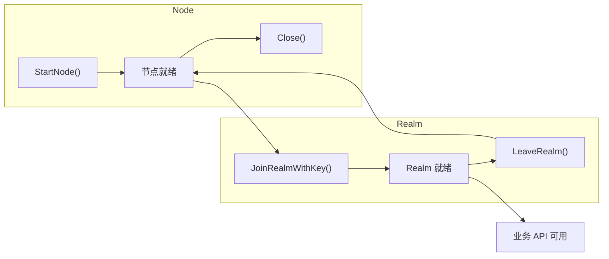

# API 默认行为与约束

本文档列出 DeP2P 的核心约束、API 默认行为，以及违反约束时的错误和修复方法。

---

## 核心约束（必须遵守）

```
┌─────────────────────────────────────────────────────────────────────┐
│                    DeP2P 核心约束                                    │
├─────────────────────────────────────────────────────────────────────┤
│                                                                      │
│  1. 必须先 JoinRealm() 再使用业务 API                               │
│     → 否则返回 ErrNotMember                                         │
│                                                                      │
│  2. 一个 Node 同一时间只能加入一个 Realm                             │
│     → 切换 Realm 需要先 LeaveRealm()                                │
│                                                                      │
│  3. RealmKey 必须在成员间安全共享                                   │
│     → 只有持有相同 realmKey 的节点才能互相验证                      │
│                                                                      │
│  4. 协议 ID 必须包含版本号                                          │
│     → 格式：/namespace/name/version                                 │
│                                                                      │
│  5. 地址必须使用 Full Address 格式                                  │
│     → 必须包含 /p2p/<NodeID> 后缀                                   │
│                                                                      │
└─────────────────────────────────────────────────────────────────────┘
```

---

## 约束速查表

| 约束 | 违反时错误 | 解决方案 |
|------|-----------|----------|
| 必须先 JoinRealm() | `ErrNotMember` | 调用 `node.JoinRealmWithKey()` |
| 不能重复加入 Realm | `ErrAlreadyJoined` | 检查 `CurrentRealm()` 或先 `LeaveRealm()` |
| RealmKey 不匹配 | `ErrAuthFailed` | 确保所有成员使用相同的 realmKey |
| 地址缺少 NodeID | 连接失败 | 使用 `ShareableAddrs()` 获取完整地址 |
| 协议 ID 格式错误 | 协议协商失败 | 使用 `/namespace/name/version` 格式 |

---

## API 默认行为

### Node 层

| API | 默认行为 | 备注 |
|-----|----------|------|
| `StartNode()` | 自动生成身份 | 每次启动生成新 NodeID |
| `StartNode()` | 随机端口 | 使用 `/udp/0/quic-v1` |
| `StartNode()` | 启用 NAT 穿透 | UPnP/STUN/打洞 |
| `StartNode()` | 启用 Relay | 作为客户端使用中继 |
| `Close()` | 优雅关闭 | 等待 Goodbye 消息传播 |

### Realm 层

| API | 默认行为 | 备注 |
|-----|----------|------|
| `JoinRealmWithKey()` | 自动派生 RealmID | 从 realmKey 哈希派生 |
| `JoinRealmWithKey()` | 启用 PSK 认证 | 成员间验证 |
| `CurrentRealm()` | 返回 nil | 未加入时 |
| `LeaveRealm()` | 清理订阅 | 自动退出所有 Topic |

### Messaging 层

| API | 默认行为 | 备注 |
|-----|----------|------|
| `Send()` | 无重试 | 需要应用层处理 |
| `Request()` | 30s 超时 | 可通过 context 覆盖 |
| `OnMessage()` | 替换处理器 | 同协议只保留最后一个 |

### PubSub 层

| API | 默认行为 | 备注 |
|-----|----------|------|
| `Join()` | 自动添加 Realm 前缀 | 实际 topic: `/dep2p/app/<realmID>/user-topic` |
| `Publish()` | 异步发送 | 不等待确认 |
| `Subscribe()` | 返回 channel | 消息通过 channel 接收 |

---

## 生命周期约束



### 正确的生命周期

```go
// 1. 启动节点
node, err := dep2p.StartNode(ctx, dep2p.WithPreset(dep2p.PresetDesktop))
if err != nil {
    log.Fatal(err)
}
defer node.Close()

// 2. 加入 Realm（必须！）
realmKey := types.RealmKey(sharedSecret)
realm, err := node.JoinRealmWithKey(ctx, "my-app", realmKey)
if err != nil {
    log.Fatal(err)
}

// 3. 使用业务 API
messaging := realm.Messaging()
pubsub := realm.PubSub()
// ... 业务逻辑 ...

// 4. 离开 Realm（可选，Close() 会自动处理）
// realm.Leave(ctx)
```

### 常见错误用法

```go
// ❌ 错误：未加入 Realm 就使用业务 API
node, _ := dep2p.StartNode(ctx, dep2p.WithPreset(dep2p.PresetDesktop))
realm := node.CurrentRealm()  // 返回 nil
if realm != nil {
    realm.Messaging().Send(ctx, targetID, "/myapp/1.0.0", data)  // 不会执行到这里
}
// 实际会返回 ErrNotMember!

// ❌ 错误：重复加入同一 Realm
node.JoinRealmWithKey(ctx, "realm-a", key)
node.JoinRealmWithKey(ctx, "realm-a", key)  // ErrAlreadyJoined!

// ❌ 错误：不同 realmKey
nodeA.JoinRealmWithKey(ctx, "test", keyA)
nodeB.JoinRealmWithKey(ctx, "test", keyB)  // 无法互相验证！
```

---

## 预设默认值

### PresetDesktop

```go
// 连接限制
LowWater:  50
HighWater: 100

// 功能开关
NAT:        true   // 启用 NAT 穿透
Relay:      true   // 启用 Relay 客户端
RelayServer: false // 不作为 Relay 服务器

// 发现
mDNS:       true   // 局域网发现
DHT:        true   // 分布式哈希表

// Liveness
Heartbeat:  15s    // 心跳间隔
Timeout:    45s    // 心跳超时
```

### PresetServer

```go
// 连接限制
LowWater:  100
HighWater: 200

// 功能开关
NAT:         true
Relay:       true
RelayServer: true   // 作为 Relay 服务器

// 发现
mDNS:        false  // 服务器通常不需要
DHT:         true
```

### PresetMobile

```go
// 连接限制
LowWater:  10
HighWater: 30

// 功能开关
NAT:        true
Relay:      true   // 移动端经常需要中继
RelayServer: false

// 电量优化
HeartbeatInterval: 30s  // 降低频率
```

---

## 协议命名空间

DeP2P 使用三级协议命名空间：

```
┌─────────────────────────────────────────────────────────────────────┐
│                      协议命名空间                                    │
├─────────────────────────────────────────────────────────────────────┤
│                                                                      │
│  /dep2p/sys/*                                                       │
│    系统协议（DHT/Relay/NAT），用户不可直接使用                       │
│                                                                      │
│  /dep2p/realm/<realmID>/*                                           │
│    Realm 控制协议（成员验证/同步），自动管理                         │
│                                                                      │
│  /dep2p/app/<realmID>/*                                             │
│    应用协议，用户通过 realm.Messaging() 使用                        │
│    框架自动添加前缀                                                  │
│                                                                      │
└─────────────────────────────────────────────────────────────────────┘
```

### 协议自动前缀

```go
// 用户代码
messaging.SendWithProtocol(ctx, targetID, "chat/1.0.0", data)

// 实际协议 ID（框架自动添加）
// /dep2p/app/<realmID>/chat/1.0.0
```

---

## 自检清单

使用此清单检查你的代码是否符合约束：

```
□ 启动节点后调用了 JoinRealmWithKey()?
□ 所有成员使用相同的 realmKey?
□ 业务 API 在 JoinRealm 之后调用?
□ 协议 ID 包含版本号（如 /1.0.0）?
□ 分享的地址包含 /p2p/<NodeID>?
□ 使用 context 控制超时?
□ 正确处理 Close() 清理?
```

---

## 相关文档

- [错误码参考](error-codes.md) - 完整错误码列表
- [配置项参考](configuration.md) - 所有配置选项
- [故障排查](../how-to/troubleshooting.md) - 问题诊断指南
- [5 分钟上手](../getting-started/quickstart.md) - 快速开始

