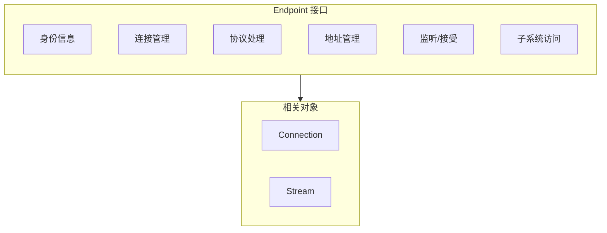
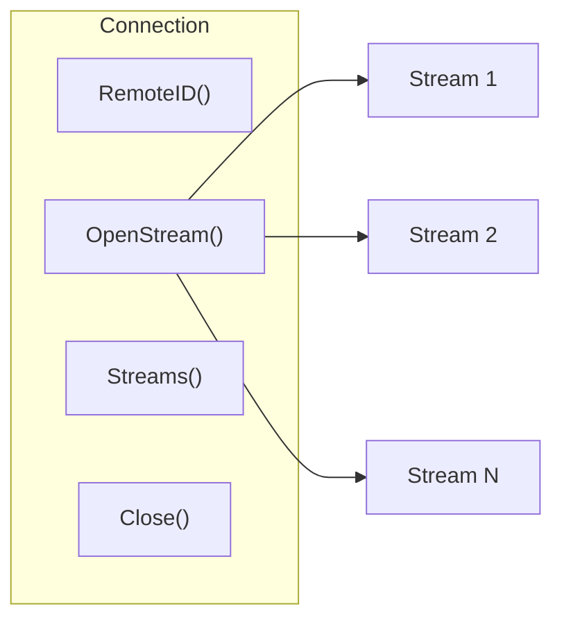

# Endpoint API

Endpoint 是 DeP2P 的核心连接接口，提供底层连接管理和协议处理功能。

---

## 概述



Endpoint 是最小稳定接口，提供：
- 节点身份管理
- 连接建立与管理
- 协议处理器注册
- 地址管理
- 子系统访问

---

## 获取 Endpoint

通过 Node 的 `Endpoint()` 方法获取：

```go
ep := node.Endpoint()
```

---

## 身份信息 API

### ID

返回节点 ID。

```go
func (e Endpoint) ID() NodeID
```

**返回值**：
| 类型 | 描述 |
|------|------|
| `NodeID` | 节点唯一标识符 |

---

### PublicKey

返回节点公钥。

```go
func (e Endpoint) PublicKey() PublicKey
```

**返回值**：
| 类型 | 描述 |
|------|------|
| `PublicKey` | 节点公钥 |

---

## 连接管理 API

### Connect

通过 NodeID 连接到节点。

```go
func (e Endpoint) Connect(ctx context.Context, nodeID NodeID) (Connection, error)
```

**参数**：
| 参数 | 类型 | 描述 |
|------|------|------|
| `ctx` | `context.Context` | 上下文 |
| `nodeID` | `NodeID` | 目标节点 ID |

**返回值**：
| 类型 | 描述 |
|------|------|
| `Connection` | 连接实例 |
| `error` | 错误信息 |

**说明**：
- 自动通过发现服务查找节点地址
- 自动选择最优连接路径（直连 → 打洞 → 中继）
- 如果已有连接，返回现有连接

**示例**：

```go
conn, err := ep.Connect(ctx, targetNodeID)
if err != nil {
    log.Printf("连接失败: %v", err)
    return
}
defer conn.Close()
```

---

### ConnectWithAddrs

使用指定地址连接到节点。

```go
func (e Endpoint) ConnectWithAddrs(ctx context.Context, nodeID NodeID, addrs []Address) (Connection, error)
```

**参数**：
| 参数 | 类型 | 描述 |
|------|------|------|
| `ctx` | `context.Context` | 上下文 |
| `nodeID` | `NodeID` | 目标节点 ID |
| `addrs` | `[]Address` | 地址列表 |

**返回值**：
| 类型 | 描述 |
|------|------|
| `Connection` | 连接实例 |
| `error` | 错误信息 |

---

### Disconnect

断开与指定节点的连接。

```go
func (e Endpoint) Disconnect(nodeID NodeID) error
```

**参数**：
| 参数 | 类型 | 描述 |
|------|------|------|
| `nodeID` | `NodeID` | 目标节点 ID |

**返回值**：
| 类型 | 描述 |
|------|------|
| `error` | 错误信息 |

---

### Connections

返回所有活跃连接。

```go
func (e Endpoint) Connections() []Connection
```

**返回值**：
| 类型 | 描述 |
|------|------|
| `[]Connection` | 连接列表 |

**示例**：

```go
for _, conn := range ep.Connections() {
    fmt.Printf("连接到: %s\n", conn.RemoteID())
}
```

---

### Connection

获取指定节点的连接。

```go
func (e Endpoint) Connection(nodeID NodeID) (Connection, bool)
```

**参数**：
| 参数 | 类型 | 描述 |
|------|------|------|
| `nodeID` | `NodeID` | 目标节点 ID |

**返回值**：
| 类型 | 描述 |
|------|------|
| `Connection` | 连接实例 |
| `bool` | 是否存在 |

---

### ConnectionCount

返回当前连接数。

```go
func (e Endpoint) ConnectionCount() int
```

---

## 协议处理 API

### SetProtocolHandler

设置协议处理器。

```go
func (e Endpoint) SetProtocolHandler(protocolID ProtocolID, handler ProtocolHandler)
```

**参数**：
| 参数 | 类型 | 描述 |
|------|------|------|
| `protocolID` | `ProtocolID` | 协议 ID |
| `handler` | `ProtocolHandler` | 处理函数 |

**示例**：

```go
ep.SetProtocolHandler("/myapp/echo/1.0.0", func(stream Stream) {
    defer stream.Close()
    
    buf := make([]byte, 1024)
    n, err := stream.Read(buf)
    if err != nil {
        return
    }
    
    stream.Write(buf[:n])
})
```

---

### RemoveProtocolHandler

移除协议处理器。

```go
func (e Endpoint) RemoveProtocolHandler(protocolID ProtocolID)
```

**参数**：
| 参数 | 类型 | 描述 |
|------|------|------|
| `protocolID` | `ProtocolID` | 协议 ID |

---

### Protocols

返回已注册的协议列表。

```go
func (e Endpoint) Protocols() []ProtocolID
```

**返回值**：
| 类型 | 描述 |
|------|------|
| `[]ProtocolID` | 协议 ID 列表 |

---

## 监听与接受 API

### Listen

开始监听连接。

```go
func (e Endpoint) Listen(ctx context.Context) error
```

**参数**：
| 参数 | 类型 | 描述 |
|------|------|------|
| `ctx` | `context.Context` | 上下文 |

**返回值**：
| 类型 | 描述 |
|------|------|
| `error` | 错误信息 |

**说明**：
- 应该在设置协议处理器之后调用
- 调用后开始接受入站连接

---

### Accept

接受入站连接。

```go
func (e Endpoint) Accept(ctx context.Context) (Connection, error)
```

**参数**：
| 参数 | 类型 | 描述 |
|------|------|------|
| `ctx` | `context.Context` | 上下文 |

**返回值**：
| 类型 | 描述 |
|------|------|
| `Connection` | 新连接 |
| `error` | 错误信息 |

---

## 地址管理 API

### ListenAddrs

返回本地监听地址。

```go
func (e Endpoint) ListenAddrs() []Address
```

---

### AdvertisedAddrs

返回通告地址。

```go
func (e Endpoint) AdvertisedAddrs() []Address
```

---

### AddAdvertisedAddr

添加通告地址。

```go
func (e Endpoint) AddAdvertisedAddr(addr Address)
```

---

## 子系统访问 API

### Discovery

返回发现服务。

```go
func (e Endpoint) Discovery() DiscoveryService
```

---

### NAT

返回 NAT 服务。

```go
func (e Endpoint) NAT() NATService
```

---

### Relay

返回中继客户端。

```go
func (e Endpoint) Relay() RelayClient
```

---

### AddressBook

返回地址簿。

```go
func (e Endpoint) AddressBook() AddressBook
```

---

## 生命周期 API

### Close

关闭 Endpoint。

```go
func (e Endpoint) Close() error
```

---

## Connection 接口

Connection 表示与远程节点的连接。



### RemoteID

返回远程节点 ID。

```go
func (c Connection) RemoteID() NodeID
```

---

### RemotePublicKey

返回远程节点公钥。

```go
func (c Connection) RemotePublicKey() PublicKey
```

---

### RemoteAddrs

返回远程节点地址。

```go
func (c Connection) RemoteAddrs() []Address
```

---

### LocalID

返回本地节点 ID。

```go
func (c Connection) LocalID() NodeID
```

---

### LocalAddrs

返回本地地址。

```go
func (c Connection) LocalAddrs() []Address
```

---

### OpenStream

打开一个新流。

```go
func (c Connection) OpenStream(ctx context.Context, protocolID ProtocolID) (Stream, error)
```

**参数**：
| 参数 | 类型 | 描述 |
|------|------|------|
| `ctx` | `context.Context` | 上下文 |
| `protocolID` | `ProtocolID` | 协议 ID |

**返回值**：
| 类型 | 描述 |
|------|------|
| `Stream` | 流实例 |
| `error` | 错误信息 |

**示例**：

```go
stream, err := conn.OpenStream(ctx, "/myapp/data/1.0.0")
if err != nil {
    log.Printf("打开流失败: %v", err)
    return
}
defer stream.Close()

stream.Write([]byte("Hello"))
```

---

### OpenStreamWithPriority

打开指定优先级的流。

```go
func (c Connection) OpenStreamWithPriority(ctx context.Context, protocolID ProtocolID, priority Priority) (Stream, error)
```

---

### AcceptStream

接受一个新流。

```go
func (c Connection) AcceptStream(ctx context.Context) (Stream, error)
```

**说明**：
- 阻塞等待直到远程节点打开新流
- 通常在独立的 goroutine 中循环调用

---

### Streams

返回所有活跃流。

```go
func (c Connection) Streams() []Stream
```

---

### StreamCount

返回当前流数量。

```go
func (c Connection) StreamCount() int
```

---

### IsClosed

检查连接是否已关闭。

```go
func (c Connection) IsClosed() bool
```

---

### ConnectedAt

返回连接建立时间。

```go
func (c Connection) ConnectedAt() time.Time
```

---

### Close

关闭连接。

```go
func (c Connection) Close() error
```

---

## Stream 接口

Stream 表示双向数据流。

### ProtocolID

返回流的协议 ID。

```go
func (s Stream) ProtocolID() ProtocolID
```

---

### Read

从流读取数据。

```go
func (s Stream) Read(p []byte) (n int, err error)
```

---

### Write

向流写入数据。

```go
func (s Stream) Write(p []byte) (n int, err error)
```

---

### Close

关闭流。

```go
func (s Stream) Close() error
```

---

### CloseRead

关闭读取方向。

```go
func (s Stream) CloseRead() error
```

---

### CloseWrite

关闭写入方向。

```go
func (s Stream) CloseWrite() error
```

---

### SetDeadline

设置读写超时。

```go
func (s Stream) SetDeadline(t time.Time) error
```

---

### SetReadDeadline

设置读取超时。

```go
func (s Stream) SetReadDeadline(t time.Time) error
```

---

### SetWriteDeadline

设置写入超时。

```go
func (s Stream) SetWriteDeadline(t time.Time) error
```

---

## 方法列表

### Endpoint 方法

| 方法 | 分类 | 描述 |
|------|------|------|
| `ID()` | 身份 | 返回节点 ID |
| `PublicKey()` | 身份 | 返回公钥 |
| `Connect()` | 连接 | 通过 NodeID 连接 |
| `ConnectWithAddrs()` | 连接 | 使用指定地址连接 |
| `Disconnect()` | 连接 | 断开连接 |
| `Connections()` | 连接 | 返回所有连接 |
| `Connection()` | 连接 | 获取指定连接 |
| `ConnectionCount()` | 连接 | 返回连接数 |
| `SetProtocolHandler()` | 协议 | 设置处理器 |
| `RemoveProtocolHandler()` | 协议 | 移除处理器 |
| `Protocols()` | 协议 | 返回协议列表 |
| `Listen()` | 监听 | 开始监听 |
| `Accept()` | 监听 | 接受连接 |
| `ListenAddrs()` | 地址 | 返回监听地址 |
| `AdvertisedAddrs()` | 地址 | 返回通告地址 |
| `AddAdvertisedAddr()` | 地址 | 添加通告地址 |
| `Discovery()` | 子系统 | 返回发现服务 |
| `NAT()` | 子系统 | 返回 NAT 服务 |
| `Relay()` | 子系统 | 返回中继客户端 |
| `AddressBook()` | 子系统 | 返回地址簿 |
| `Close()` | 生命周期 | 关闭 Endpoint |

### Connection 方法

| 方法 | 描述 |
|------|------|
| `RemoteID()` | 返回远程节点 ID |
| `RemotePublicKey()` | 返回远程公钥 |
| `RemoteAddrs()` | 返回远程地址 |
| `LocalID()` | 返回本地节点 ID |
| `LocalAddrs()` | 返回本地地址 |
| `OpenStream()` | 打开流 |
| `OpenStreamWithPriority()` | 打开优先级流 |
| `AcceptStream()` | 接受流 |
| `Streams()` | 返回所有流 |
| `StreamCount()` | 返回流数量 |
| `IsClosed()` | 检查是否关闭 |
| `ConnectedAt()` | 返回连接时间 |
| `Close()` | 关闭连接 |

### Stream 方法

| 方法 | 描述 |
|------|------|
| `ProtocolID()` | 返回协议 ID |
| `Read()` | 读取数据 |
| `Write()` | 写入数据 |
| `Close()` | 关闭流 |
| `CloseRead()` | 关闭读取 |
| `CloseWrite()` | 关闭写入 |
| `SetDeadline()` | 设置超时 |
| `SetReadDeadline()` | 设置读取超时 |
| `SetWriteDeadline()` | 设置写入超时 |

---

## 相关文档

- [Node API](node.md)
- [Realm API](realm.md)
- [协议 ID 规范](../protocol-ids.md)
