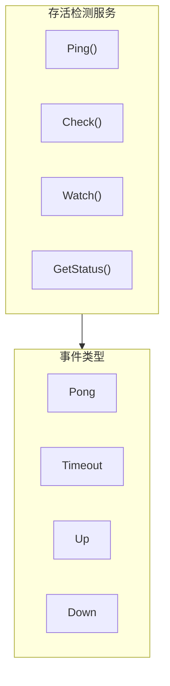

# Liveness API

Liveness 服务提供节点存活检测和网络健康监控功能。

---

## 概述



Liveness 服务支持：
- **主动探测**：Ping/Check 检查节点存活
- **被动监控**：Watch 监听节点状态变化
- **统计信息**：RTT、成功率等指标

> **获取方式**：通过 `realm.Liveness()` 获取 Liveness 服务。

---

## 获取 Liveness 服务

```go
realm, _ := node.Realm("my-realm")
_ = realm.Join(ctx)
liveness := realm.Liveness()
```

---

## Ping API

### Ping

发送 ping 并测量往返时间（RTT）。

```go
func (l *Liveness) Ping(ctx context.Context, peerID string) (time.Duration, error)
```

**参数**：
| 参数 | 类型 | 描述 |
|------|------|------|
| `ctx` | `context.Context` | 上下文 |
| `peerID` | `string` | 目标节点 ID |

**返回值**：
| 类型 | 描述 |
|------|------|
| `time.Duration` | 往返时间（RTT） |
| `error` | 错误信息 |

**说明**：
- 发送 ping 消息并等待 pong 响应
- 返回的 RTT 是消息往返的时间
- 可用于网络延迟测量

**示例**：

```go
liveness := realm.Liveness()

rtt, err := liveness.Ping(ctx, targetPeerID)
if err != nil {
    log.Printf("Ping 失败: %v", err)
    return
}
fmt.Printf("RTT: %v\n", rtt)
```

---

### Check

检查节点是否存活。

```go
func (l *Liveness) Check(ctx context.Context, peerID string) (bool, error)
```

**参数**：
| 参数 | 类型 | 描述 |
|------|------|------|
| `ctx` | `context.Context` | 上下文 |
| `peerID` | `string` | 目标节点 ID |

**返回值**：
| 类型 | 描述 |
|------|------|
| `bool` | 是否存活 |
| `error` | 错误信息（检查过程中的错误） |

**说明**：
- 与 Ping 类似，但只返回存活状态
- 适用于只需要知道节点是否在线的场景

**示例**：

```go
alive, err := liveness.Check(ctx, targetPeerID)
if err != nil {
    log.Printf("检查失败: %v", err)
    return
}
if alive {
    fmt.Println("节点在线")
} else {
    fmt.Println("节点离线")
}
```

---

## Watch API

### Watch

监控节点状态变化。

```go
func (l *Liveness) Watch(peerID string) (<-chan LivenessEvent, error)
```

**参数**：
| 参数 | 类型 | 描述 |
|------|------|------|
| `peerID` | `string` | 目标节点 ID |

**返回值**：
| 类型 | 描述 |
|------|------|
| `<-chan LivenessEvent` | 事件通道 |
| `error` | 错误信息 |

**LivenessEvent 结构**：

```go
type LivenessEvent struct {
    PeerID    string            // 节点 ID
    Type      LivenessEventType // 事件类型
    Status    LivenessStatus    // 当前状态
    Timestamp time.Time         // 事件时间
    RTT       time.Duration     // 往返时间（仅 Pong 事件）
}
```

**LivenessEventType 常量**：

| 类型 | 描述 |
|------|------|
| `LivenessEventPong` | 收到 pong 响应 |
| `LivenessEventTimeout` | 超时 |
| `LivenessEventUp` | 节点上线 |
| `LivenessEventDown` | 节点下线 |

**示例**：

```go
liveness := realm.Liveness()

// 开始监控节点
eventCh, err := liveness.Watch(targetPeerID)
if err != nil {
    log.Fatal(err)
}

// 处理事件
go func() {
    for event := range eventCh {
        switch event.Type {
        case interfaces.LivenessEventUp:
            fmt.Printf("节点 %s 上线\n", event.PeerID[:16])
        case interfaces.LivenessEventDown:
            fmt.Printf("节点 %s 下线\n", event.PeerID[:16])
        case interfaces.LivenessEventPong:
            fmt.Printf("节点 %s RTT: %v\n", event.PeerID[:16], event.RTT)
        case interfaces.LivenessEventTimeout:
            fmt.Printf("节点 %s 超时\n", event.PeerID[:16])
        }
    }
}()
```

---

### Unwatch

停止监控节点。

```go
func (l *Liveness) Unwatch(peerID string) error
```

**参数**：
| 参数 | 类型 | 描述 |
|------|------|------|
| `peerID` | `string` | 目标节点 ID |

**示例**：

```go
// 停止监控
liveness.Unwatch(targetPeerID)
```

---

## Status API

### GetStatus

获取节点存活状态。

```go
func (l *Liveness) GetStatus(peerID string) LivenessStatus
```

**参数**：
| 参数 | 类型 | 描述 |
|------|------|------|
| `peerID` | `string` | 目标节点 ID |

**返回值**：
| 类型 | 描述 |
|------|------|
| `LivenessStatus` | 存活状态 |

**LivenessStatus 结构**：

```go
type LivenessStatus struct {
    Alive        bool          // 是否存活
    LastSeen     time.Time     // 最后确认存活时间
    LastRTT      time.Duration // 最后一次 RTT
    AvgRTT       time.Duration // 平均 RTT（滑动窗口）
    MinRTT       time.Duration // 历史最优 RTT
    MaxRTT       time.Duration // 历史最差 RTT
    FailCount    int           // 连续失败次数
    TotalPings   int           // 总 Ping 次数
    SuccessCount int           // 成功次数
    SuccessRate  float64       // 成功率 (0.0 - 1.0)
}
```

**示例**：

```go
liveness := realm.Liveness()

status := liveness.GetStatus(targetPeerID)
fmt.Printf("存活: %v\n", status.Alive)
fmt.Printf("最后确认: %v\n", status.LastSeen)
fmt.Printf("平均 RTT: %v\n", status.AvgRTT)
fmt.Printf("成功率: %.2f%%\n", status.SuccessRate*100)
```

---

## 生命周期 API

### Start

启动存活检测服务。

```go
func (l *Liveness) Start(ctx context.Context) error
```

**说明**：
- 通常由 Realm 自动调用
- 启动后台定期探测任务

---

### Stop

停止存活检测服务。

```go
func (l *Liveness) Stop(ctx context.Context) error
```

**说明**：
- 停止所有后台任务
- 关闭所有监控通道

---

## 配置

**LivenessConfig 结构**：

```go
type LivenessConfig struct {
    Interval      time.Duration // 检测间隔（默认 30s）
    Timeout       time.Duration // 单次检测超时（默认 5s）
    FailThreshold int           // 判定下线的失败阈值（默认 3）
}
```

**默认配置**：

```go
func DefaultLivenessConfig() *LivenessConfig {
    return &LivenessConfig{
        Interval:      30 * time.Second,
        Timeout:       5 * time.Second,
        FailThreshold: 3,
    }
}
```

---

## 方法列表

| 方法 | 分类 | 描述 |
|------|------|------|
| `Ping()` | 探测 | 发送 ping 并测量 RTT |
| `Check()` | 探测 | 检查节点是否存活 |
| `Watch()` | 监控 | 监控节点状态变化 |
| `Unwatch()` | 监控 | 停止监控节点 |
| `GetStatus()` | 状态 | 获取节点存活状态 |
| `Start()` | 生命周期 | 启动服务 |
| `Stop()` | 生命周期 | 停止服务 |

---

## 使用场景

### 连接质量监控

```go
liveness := realm.Liveness()

// 定期检查连接质量
ticker := time.NewTicker(time.Minute)
for range ticker.C {
    for _, peerID := range realm.Members() {
        status := liveness.GetStatus(peerID)
        if status.AvgRTT > 500*time.Millisecond {
            log.Printf("警告: 到 %s 的延迟较高 (%v)", peerID[:16], status.AvgRTT)
        }
        if status.SuccessRate < 0.9 {
            log.Printf("警告: 到 %s 的连接不稳定 (%.1f%%)", peerID[:16], status.SuccessRate*100)
        }
    }
}
```

### 节点上下线通知

```go
liveness := realm.Liveness()

// 监控所有成员
for _, peerID := range realm.Members() {
    eventCh, _ := liveness.Watch(peerID)
    go func(peerID string, ch <-chan interfaces.LivenessEvent) {
        for event := range ch {
            if event.Type == interfaces.LivenessEventDown {
                notifyUserOffline(peerID)
            } else if event.Type == interfaces.LivenessEventUp {
                notifyUserOnline(peerID)
            }
        }
    }(peerID, eventCh)
}
```

---

## 相关文档

- [Realm API](realm.md)
- [Node API](node.md)
- [断开检测设计](../../../../design/03_architecture/L3_behavioral/disconnect_detection.md)
