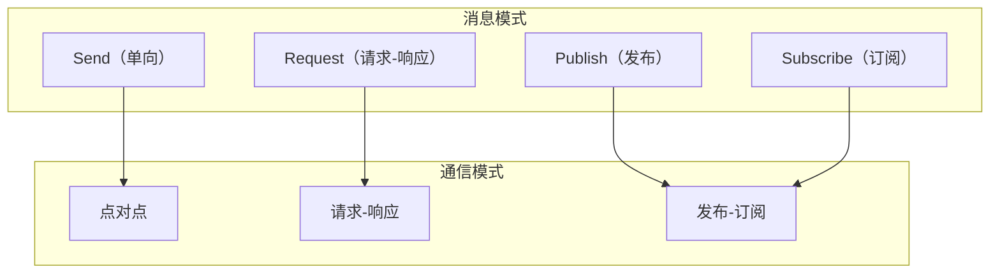

# Messaging API

MessagingService 提供统一的消息传递接口，支持多种通信模式。

---

## 概述



MessagingService 支持三种通信模式：
- **Send/Receive**：单向消息发送
- **Request/Response**：请求-响应模式
- **Publish/Subscribe**：发布-订阅模式

> **重要**：所有消息 API 必须在调用 `Realm().Join()` 后才能使用。

---

## 前提条件

使用消息 API 前必须加入 Realm：

```go
// 必须先加入 Realm
realmKey := types.GenerateRealmKey()
realm, err := node.Realm("my-realm")
if err != nil {
    log.Fatal(err)
}
err = realm.Join(ctx)
if err != nil {
    log.Fatal(err)
}

// 现在可以使用消息 API（通过 Realm 获取 Messaging 服务）
messaging := realm.Messaging()
messaging.Send(ctx, targetID, protocol, data)
```

---

## Send API

### Send

单向发送消息。

```go
func (m *Messaging) Send(ctx context.Context, nodeID types.NodeID, protocol types.ProtocolID, data []byte) error
```

**参数**：
| 参数 | 类型 | 描述 |
|------|------|------|
| `ctx` | `context.Context` | 上下文 |
| `nodeID` | `types.NodeID` | 目标节点 ID |
| `protocol` | `types.ProtocolID` | 协议 ID |
| `data` | `[]byte` | 消息数据 |

**返回值**：
| 类型 | 描述 |
|------|------|
| `error` | 错误信息 |

**说明**：
- 消息发送后不等待响应
- 适用于通知、事件等场景
- 如果未加入 Realm，返回 `ErrNotMember`

**示例**：

```go
// 获取 Messaging 服务
realm, _ := node.Realm("my-realm")
_ = realm.Join(ctx)
messaging := realm.Messaging()

// 发送通知
err := messaging.Send(ctx, targetID, "/myapp/notify/1.0.0", []byte("用户上线"))
if err != nil {
    log.Printf("发送失败: %v", err)
}

// 发送 JSON 数据
data, _ := json.Marshal(notification)
err = messaging.Send(ctx, targetID, "/myapp/event/1.0.0", data)
```

---

### SendAsync

异步发送消息，返回响应通道。

```go
func (m *Messaging) SendAsync(ctx context.Context, peerID string, protocol string, data []byte) (<-chan *Response, error)
```

**参数**：
| 参数 | 类型 | 描述 |
|------|------|------|
| `ctx` | `context.Context` | 上下文 |
| `peerID` | `string` | 目标节点 ID |
| `protocol` | `string` | 协议 ID |
| `data` | `[]byte` | 消息数据 |

**返回值**：
| 类型 | 描述 |
|------|------|
| `<-chan *Response` | 响应通道 |
| `error` | 错误信息 |

**Response 结构**：

```go
type Response struct {
    Data  []byte // 响应数据
    Error error  // 错误信息
}
```

**说明**：
- 发送消息后立即返回，响应通过通道异步传递
- 适用于需要并行发送多条消息的场景
- 通道会在收到响应或超时后关闭

**示例**：

```go
messaging := realm.Messaging()

// 并行发送给多个节点
var responses []<-chan *messaging.Response
for _, peerID := range peers {
    respCh, err := messaging.SendAsync(ctx, peerID, "/myapp/ping/1.0.0", []byte("ping"))
    if err != nil {
        continue
    }
    responses = append(responses, respCh)
}

// 收集响应
for i, respCh := range responses {
    resp := <-respCh
    if resp.Error != nil {
        log.Printf("节点 %d 响应错误: %v", i, resp.Error)
    } else {
        log.Printf("节点 %d 响应: %s", i, resp.Data)
    }
}
```

---

## Request API

### Request

请求-响应模式发送消息。

```go
func (m *Messaging) Request(ctx context.Context, nodeID types.NodeID, protocol types.ProtocolID, data []byte) ([]byte, error)
```

**参数**：
| 参数 | 类型 | 描述 |
|------|------|------|
| `ctx` | `context.Context` | 上下文 |
| `nodeID` | `types.NodeID` | 目标节点 ID |
| `protocol` | `types.ProtocolID` | 协议 ID |
| `data` | `[]byte` | 请求数据 |

**返回值**：
| 类型 | 描述 |
|------|------|
| `[]byte` | 响应数据 |
| `error` | 错误信息 |

**说明**：
- 发送请求并等待响应
- 支持 context 超时控制
- 适用于 RPC 调用场景

**示例**：

```go
// 获取 Messaging 服务
realm, _ := node.Realm("my-realm")
_ = realm.Join(ctx)
messaging := realm.Messaging()

// 简单请求
resp, err := messaging.Request(ctx, targetID, "/myapp/rpc/1.0.0", []byte("ping"))
if err != nil {
    log.Printf("请求失败: %v", err)
    return
}
fmt.Printf("响应: %s\n", resp)

// 带超时的请求
ctx, cancel := context.WithTimeout(context.Background(), 5*time.Second)
defer cancel()

resp, err = messaging.Request(ctx, targetID, "/myapp/query/1.0.0", queryData)
if err != nil {
    if ctx.Err() == context.DeadlineExceeded {
        log.Println("请求超时")
    }
}
```

---

## Publish/Subscribe API

### Publish

发布消息到主题。

```go
func (n *Node) Publish(ctx context.Context, topic string, data []byte) error
```

**参数**：
| 参数 | 类型 | 描述 |
|------|------|------|
| `ctx` | `context.Context` | 上下文 |
| `topic` | `string` | 主题名称 |
| `data` | `[]byte` | 消息数据 |

**返回值**：
| 类型 | 描述 |
|------|------|
| `error` | 错误信息 |

**说明**：
- 消息会发送给所有订阅该主题的节点
- 主题在当前 Realm 范围内有效

**示例**：

```go
// 发布聊天消息
err := node.Publish(ctx, "chat-room", []byte("Hello everyone!"))

// 发布结构化数据
msg := ChatMessage{
    Sender:  node.ID().String(),
    Content: "Hello",
    Time:    time.Now(),
}
data, _ := json.Marshal(msg)
err := node.Publish(ctx, "chat-room", data)
```

---

### Subscribe

订阅主题。

```go
func (n *Node) Subscribe(ctx context.Context, topic string) (messagingif.Subscription, error)
```

**参数**：
| 参数 | 类型 | 描述 |
|------|------|------|
| `ctx` | `context.Context` | 上下文 |
| `topic` | `string` | 主题名称 |

**返回值**：
| 类型 | 描述 |
|------|------|
| `Subscription` | 订阅实例 |
| `error` | 错误信息 |

**示例**：

```go
// 订阅主题
sub, err := node.Subscribe(ctx, "chat-room")
if err != nil {
    log.Fatal(err)
}
defer sub.Cancel()

// 接收消息
for msg := range sub.Messages() {
    fmt.Printf("收到来自 %s 的消息: %s\n", msg.From, msg.Data)
}

// 或使用 Next() 方法
for {
    msg, err := sub.Next(ctx)
    if err != nil {
        break
    }
    fmt.Printf("消息: %s\n", msg.Data)
}
```

---

## Subscription 接口

### Messages

返回消息通道。

```go
func (s Subscription) Messages() <-chan *Message
```

**返回值**：
| 类型 | 描述 |
|------|------|
| `<-chan *Message` | 消息通道 |

---

### Next

获取下一条消息。

```go
func (s Subscription) Next(ctx context.Context) (*Message, error)
```

**参数**：
| 参数 | 类型 | 描述 |
|------|------|------|
| `ctx` | `context.Context` | 上下文 |

**返回值**：
| 类型 | 描述 |
|------|------|
| `*Message` | 消息 |
| `error` | 错误信息 |

---

### Cancel

取消订阅。

```go
func (s Subscription) Cancel() error
```

---

### Topic

返回订阅的主题。

```go
func (s Subscription) Topic() string
```

---

## Message 结构

```go
type Message struct {
    // From 发送者节点 ID
    From NodeID
    
    // Topic 主题名称
    Topic string
    
    // Data 消息数据
    Data []byte
    
    // ReceivedAt 接收时间
    ReceivedAt time.Time
    
    // Signature 签名（可选）
    Signature []byte
}
```

---

## 消息流程

```mermaid
sequenceDiagram
    participant A as Node A
    participant B as Node B
    participant T as Topic
    
    Note over A,B: Send/Receive 模式
    A->>B: Send(nodeID, proto, data)
    
    Note over A,B: Request/Response 模式
    A->>B: Request(nodeID, proto, data)
    B-->>A: Response
    
    Note over A,T,B: Publish/Subscribe 模式
    B->>T: Subscribe("topic")
    A->>T: Publish("topic", data)
    T-->>B: Message
```

---

## 协议处理器 API

### RegisterHandler

注册消息处理器。

```go
func (m *Messaging) RegisterHandler(protocol string, handler MessageHandler) error
```

**参数**：
| 参数 | 类型 | 描述 |
|------|------|------|
| `protocol` | `string` | 协议 ID |
| `handler` | `MessageHandler` | 消息处理函数 |

**MessageHandler 类型**：

```go
type MessageHandler func(req *Request) (*Response, error)

type Request struct {
    From     string    // 发送者 NodeID
    Protocol string    // 协议 ID
    Data     []byte    // 请求数据
}

type Response struct {
    Data  []byte // 响应数据
    Error error  // 错误信息
}
```

**说明**：
- 注册后，当收到对应协议的消息时，会调用此处理器
- 处理器返回的响应会发送给请求方
- 如果返回 error，请求方会收到错误响应

**示例**：

```go
messaging := realm.Messaging()

// 注册 Echo 处理器
err := messaging.RegisterHandler("/myapp/echo/1.0.0", func(req *messaging.Request) (*messaging.Response, error) {
    log.Printf("收到来自 %s 的消息: %s", req.From[:16], req.Data)
    return &messaging.Response{
        Data: append([]byte("Echo: "), req.Data...),
    }, nil
})
if err != nil {
    log.Fatal(err)
}

// 注册 RPC 处理器
err = messaging.RegisterHandler("/myapp/rpc/1.0.0", func(req *messaging.Request) (*messaging.Response, error) {
    var rpcReq RPCRequest
    if err := json.Unmarshal(req.Data, &rpcReq); err != nil {
        return nil, fmt.Errorf("invalid request: %w", err)
    }
    
    // 处理 RPC 请求
    result := processRPC(rpcReq)
    
    data, _ := json.Marshal(result)
    return &messaging.Response{Data: data}, nil
})
```

---

### UnregisterHandler

移除消息处理器。

```go
func (m *Messaging) UnregisterHandler(protocol string) error
```

**参数**：
| 参数 | 类型 | 描述 |
|------|------|------|
| `protocol` | `string` | 协议 ID |

**示例**：

```go
messaging.UnregisterHandler("/myapp/echo/1.0.0")
```

---

### 使用流处理器（高级）

对于需要更精细控制的场景，可以通过 Host 直接注册流处理器：

```go
// 通过 Host 注册流处理器
node.Host().SetStreamHandler("/myapp/stream/1.0.0", func(stream interfaces.Stream) {
    defer stream.Close()
    
    // 读取请求
    buf := make([]byte, 4096)
    n, err := stream.Read(buf)
    if err != nil {
        return
    }
    
    // 发送响应
    stream.Write(buf[:n])
})

// 移除流处理器
node.Host().RemoveStreamHandler("/myapp/stream/1.0.0")
```

---

## 方法列表

### Node 消息方法

| 方法 | 模式 | 描述 |
|------|------|------|
| `Send()` | 单向 | 发送消息 |
| `Request()` | 请求-响应 | 发送请求并等待响应 |
| `Publish()` | 发布 | 发布消息到主题 |
| `Subscribe()` | 订阅 | 订阅主题 |

### Subscription 方法

| 方法 | 描述 |
|------|------|
| `Messages()` | 返回消息通道 |
| `Next()` | 获取下一条消息 |
| `Cancel()` | 取消订阅 |
| `Topic()` | 返回主题名称 |

---

## 错误处理

| 错误 | 描述 | 解决方案 |
|------|------|----------|
| `ErrNotMember` | 未加入 Realm | 先调用 `Realm().Join()` |
| `ErrPeerNotFound` | 找不到目标节点 | 检查节点是否在线 |
| `ErrConnectionFailed` | 连接失败 | 检查网络连接 |
| `context deadline exceeded` | 操作超时 | 增加超时时间 |

**示例**：

```go
realm, _ := node.Realm("my-realm")
_ = realm.Join(ctx)
messaging := realm.Messaging()

err := messaging.Send(ctx, targetID, protocol, data)
if err != nil {
    switch {
    case errors.Is(err, realm.ErrNotMember):
        log.Println("请先加入 Realm")
    case errors.Is(err, messaging.ErrPeerNotFound):
        log.Println("目标节点不在线")
    default:
        log.Printf("发送失败: %v", err)
    }
}
```

---

## 最佳实践

### 协议 ID 命名

```go
// 推荐格式: /<app>/<功能>/<版本>
const (
    ProtoChatMessage = "/myapp/chat/1.0.0"
    ProtoFileTransfer = "/myapp/file/1.0.0"
    ProtoRPC = "/myapp/rpc/1.0.0"
)
```

### 消息序列化

```go
realm, _ := node.Realm("my-realm")
_ = realm.Join(ctx)
messaging := realm.Messaging()

// 使用 JSON
data, _ := json.Marshal(message)
messaging.Send(ctx, targetID, protocol, data)

// 使用 Protobuf（推荐高性能场景）
data, _ := proto.Marshal(message)
messaging.Send(ctx, targetID, protocol, data)
```

### 超时控制

```go
realm, _ := node.Realm("my-realm")
_ = realm.Join(ctx)
messaging := realm.Messaging()

// 始终设置超时
ctx, cancel := context.WithTimeout(context.Background(), 10*time.Second)
defer cancel()

resp, err := messaging.Request(ctx, targetID, protocol, data)
```

### 订阅管理

```go
// 使用 defer 确保取消订阅
sub, _ := node.Subscribe(ctx, topic)
defer sub.Cancel()

// 使用 context 控制订阅生命周期
ctx, cancel := context.WithCancel(context.Background())
defer cancel()

go func() {
    for msg := range sub.Messages() {
        // 处理消息
    }
}()
```

---

## 相关文档

- [Node API](node.md)
- [Realm API](realm.md)
- [协议 ID 规范](../protocol-ids.md)
- [安全聊天教程](../../tutorials/02-secure-chat.md)
