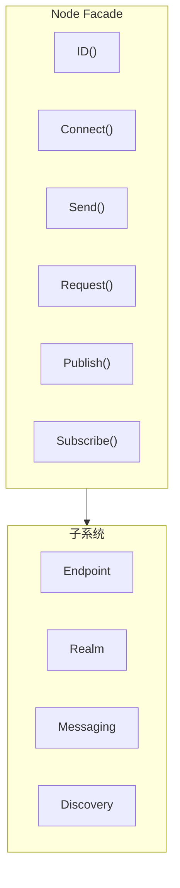

# Node API

Node 是 DeP2P 面向用户的主要入口，提供简洁的高层 API。

---

## 概述



Node 是一个 Facade 模式的实现，封装了底层的复杂性，提供：
- 简洁的连接 API
- 统一的消息传递接口
- 便捷的地址管理
- 子系统访问入口

---

## 创建节点

### StartNode

创建并启动一个新节点。

```go
func StartNode(ctx context.Context, opts ...Option) (*Node, error)
```

**参数**：
| 参数 | 类型 | 描述 |
|------|------|------|
| `ctx` | `context.Context` | 上下文 |
| `opts` | `...Option` | 配置选项 |

**返回值**：
| 类型 | 描述 |
|------|------|
| `*Node` | 节点实例 |
| `error` | 错误信息 |

**示例**：

```go
// 使用预设创建节点
node, err := dep2p.StartNode(ctx,
    dep2p.WithPreset(dep2p.PresetDesktop),
)
if err != nil {
    log.Fatal(err)
}
defer node.Close()

// 自定义配置
node, err := dep2p.StartNode(ctx,
    dep2p.WithPreset(dep2p.PresetServer),
    dep2p.WithListenPort(4001),
    dep2p.WithBootstrapPeers(bootstrapAddrs...),
)
```

---

## 身份信息 API

### ID

返回节点的唯一标识符。

```go
func (n *Node) ID() types.NodeID
```

**返回值**：
| 类型 | 描述 |
|------|------|
| `types.NodeID` | 节点 ID（Base58 编码的公钥派生） |

**示例**：

```go
nodeID := node.ID()
fmt.Printf("Node ID: %s\n", nodeID)
fmt.Printf("Short ID: %s\n", nodeID.ShortString())
```

---

## 连接管理 API

### Connect

通过 NodeID 连接到节点。

```go
func (n *Node) Connect(ctx context.Context, nodeID types.NodeID) (endpoint.Connection, error)
```

**参数**：
| 参数 | 类型 | 描述 |
|------|------|------|
| `ctx` | `context.Context` | 上下文（支持超时和取消） |
| `nodeID` | `types.NodeID` | 目标节点 ID |

**返回值**：
| 类型 | 描述 |
|------|------|
| `endpoint.Connection` | 连接实例 |
| `error` | 错误信息 |

**说明**：
- 自动从 AddressBook/Discovery 查找地址并连接
- 如果已有到该节点的连接，返回现有连接
- 这是最推荐的连接方式

**示例**：

```go
conn, err := node.Connect(ctx, targetNodeID)
if err != nil {
    log.Printf("连接失败: %v", err)
    return
}
fmt.Printf("已连接到: %s\n", conn.RemoteID())
```

---

### ConnectToAddr

通过完整地址连接到节点。

```go
func (n *Node) ConnectToAddr(ctx context.Context, fullAddr string) (endpoint.Connection, error)
```

**参数**：
| 参数 | 类型 | 描述 |
|------|------|------|
| `ctx` | `context.Context` | 上下文 |
| `fullAddr` | `string` | 完整地址（含 /p2p/<NodeID>） |

**返回值**：
| 类型 | 描述 |
|------|------|
| `endpoint.Connection` | 连接实例 |
| `error` | 错误信息 |

**说明**：
- 适用于 Bootstrap 和用户分享地址的场景
- 地址必须是 Full Address 格式

**示例**：

```go
fullAddr := "/ip4/192.168.1.100/udp/4001/quic-v1/p2p/5Q2STWvBFn..."
conn, err := node.ConnectToAddr(ctx, fullAddr)
if err != nil {
    log.Printf("连接失败: %v", err)
    return
}
```

---

### ConnectWithAddrs

使用指定地址连接到节点。

```go
func (n *Node) ConnectWithAddrs(ctx context.Context, nodeID types.NodeID, addrs []string) (endpoint.Connection, error)
```

**参数**：
| 参数 | 类型 | 描述 |
|------|------|------|
| `ctx` | `context.Context` | 上下文 |
| `nodeID` | `types.NodeID` | 目标节点 ID |
| `addrs` | `[]string` | 地址列表（Dial Address 格式） |

**返回值**：
| 类型 | 描述 |
|------|------|
| `endpoint.Connection` | 连接实例 |
| `error` | 错误信息 |

**说明**：
- 跳过发现服务，直接使用提供的地址
- 地址必须是 Dial Address 格式（不含 /p2p/）

**示例**：

```go
addrs := []string{
    "/ip4/192.168.1.100/udp/4001/quic-v1",
    "/ip4/10.0.0.1/udp/4001/quic-v1",
}
conn, err := node.ConnectWithAddrs(ctx, targetID, addrs)
```

---

## 地址管理 API

### ListenAddrs

返回本地监听地址。

```go
func (n *Node) ListenAddrs() []endpoint.Address
```

**返回值**：
| 类型 | 描述 |
|------|------|
| `[]endpoint.Address` | 监听地址列表 |

**示例**：

```go
for _, addr := range node.ListenAddrs() {
    fmt.Printf("监听: %s\n", addr)
}
```

---

### AdvertisedAddrs

返回通告地址列表。

```go
func (n *Node) AdvertisedAddrs() []endpoint.Address
```

**返回值**：
| 类型 | 描述 |
|------|------|
| `[]endpoint.Address` | 通告地址列表 |

---

### ShareableAddrs

返回可分享的完整地址列表。

```go
func (n *Node) ShareableAddrs() []string
```

**返回值**：
| 类型 | 描述 |
|------|------|
| `[]string` | 完整地址列表（含 /p2p/<NodeID>） |

**说明**：
- 仅返回已验证的公网直连地址
- 可能返回空（如果无公网可达性）

**示例**：

```go
addrs := node.ShareableAddrs()
if len(addrs) > 0 {
    fmt.Println("分享此地址:", addrs[0])
}
```

---

### WaitShareableAddrs

等待可分享地址可用。

```go
func (n *Node) WaitShareableAddrs(ctx context.Context) ([]string, error)
```

**参数**：
| 参数 | 类型 | 描述 |
|------|------|------|
| `ctx` | `context.Context` | 上下文（可设置超时） |

**返回值**：
| 类型 | 描述 |
|------|------|
| `[]string` | 完整地址列表 |
| `error` | 错误信息（超时等） |

**示例**：

```go
ctx, cancel := context.WithTimeout(context.Background(), 30*time.Second)
defer cancel()

addrs, err := node.WaitShareableAddrs(ctx)
if err != nil {
    log.Println("获取地址超时")
}
```

---

### BootstrapCandidates

返回所有候选地址。

```go
func (n *Node) BootstrapCandidates() []reachabilityif.BootstrapCandidate
```

**返回值**：
| 类型 | 描述 |
|------|------|
| `[]BootstrapCandidate` | 候选地址列表（含类型信息） |

---

## 子系统访问 API

### Endpoint

返回底层 Endpoint 接口。

```go
func (n *Node) Endpoint() endpoint.Endpoint
```

**返回值**：
| 类型 | 描述 |
|------|------|
| `endpoint.Endpoint` | Endpoint 接口 |

---

### Realm

返回 Realm 管理器。

```go
func (n *Node) Realm() realmif.RealmManager
```

**返回值**：
| 类型 | 描述 |
|------|------|
| `RealmManager` | Realm 管理器 |

**示例（IMPL-1227 更新）**：

```go
// 使用 realmKey 加入 Realm（PSK 认证）
realmKey := types.GenerateRealmKey()
realm, err := node.JoinRealmWithKey(ctx, "my-realm", realmKey)
if err != nil {
    log.Fatal(err)
}

// 获取当前 Realm 对象
currentRealm := node.CurrentRealm()
if currentRealm != nil {
    fmt.Printf("当前 Realm: %s (ID: %s)\n", currentRealm.Name(), currentRealm.ID())
}

// 通过 Realm 对象获取 Layer 3 服务
messaging := realm.Messaging()
pubsub := realm.PubSub()
```

### JoinRealmWithKey（IMPL-1227 新增）

使用 realmKey 加入指定 Realm。

```go
func (n *Node) JoinRealmWithKey(ctx context.Context, name string, realmKey types.RealmKey) (realmif.Realm, error)
```

**参数**：
| 参数 | 类型 | 描述 |
|------|------|------|
| `ctx` | `context.Context` | 上下文 |
| `name` | `string` | Realm 显示名称 |
| `realmKey` | `types.RealmKey` | 32字节 PSK 密钥 |

**返回值**：
| 类型 | 描述 |
|------|------|
| `realmif.Realm` | Realm 对象（用于获取 Layer 3 服务） |
| `error` | 错误信息 |

**示例**：

```go
realmKey := types.GenerateRealmKey() // 或从配置读取
realm, err := node.JoinRealmWithKey(ctx, "my-business-network", realmKey)
if err != nil {
    log.Fatal(err)
}

// 通过 Realm 对象访问服务
realm.Messaging().Send(ctx, target, data)
realm.PubSub().Join(ctx, "news")
```

### CurrentRealm（IMPL-1227 更新）

返回当前 Realm 对象。

```go
func (n *Node) CurrentRealm() realmif.Realm
```

**返回值**：
| 类型 | 描述 |
|------|------|
| `realmif.Realm` | 当前 Realm 对象，未加入时返回 nil |

**示例**：

```go
realm := node.CurrentRealm()
if realm == nil {
    fmt.Println("未加入任何 Realm")
} else {
    fmt.Printf("当前 Realm: %s (ID: %s)\n", realm.Name(), realm.ID())
    fmt.Printf("成员数: %d\n", realm.MemberCount())
}
```

---

### Messaging

返回消息子系统。

```go
func (n *Node) Messaging() messagingif.MessagingService
```

---

### Discovery

返回发现服务。

```go
func (n *Node) Discovery() endpoint.DiscoveryService
```

---

### NAT

返回 NAT 服务。

```go
func (n *Node) NAT() endpoint.NATService
```

---

### Relay

返回中继客户端。

```go
func (n *Node) Relay() endpoint.RelayClient
```

---

### AddressBook

返回地址簿。

```go
func (n *Node) AddressBook() endpoint.AddressBook
```

---

### ConnectionManager

返回连接管理器。

```go
func (n *Node) ConnectionManager() connmgrif.ConnectionManager
```

---

### Liveness

返回存活检测服务。

```go
func (n *Node) Liveness() livenessif.LivenessService
```

---

## 消息传递 API（IMPL-1227 更新）

> **注意**：以下快捷方法必须在调用 `JoinRealmWithKey()` 后才能使用，否则返回 `ErrNotMember`。
> **推荐**：直接通过 `realm.Messaging()` 和 `realm.PubSub()` 访问服务，获得更完整的 API。

### Send

单向发送消息（快捷方法）。

```go
func (n *Node) Send(ctx context.Context, nodeID types.NodeID, data []byte) error
```

**参数**：
| 参数 | 类型 | 描述 |
|------|------|------|
| `ctx` | `context.Context` | 上下文 |
| `nodeID` | `types.NodeID` | 目标节点 ID |
| `data` | `[]byte` | 消息数据 |

**返回值**：
| 类型 | 描述 |
|------|------|
| `error` | 错误信息 |

**示例**：

```go
// ❌ 错误：Node 层没有 Send 方法，需要通过 Realm.Messaging() 获取
// err := node.Send(ctx, targetID, []byte("Hello"))  // 不存在此方法

// ✅ 正确：先加入 Realm，再通过 Realm.Messaging() 发送
realm, _ := node.JoinRealmWithKey(ctx, "my-realm", realmKey)
err := realm.Messaging().Send(ctx, targetID, "/chat/1.0.0", []byte("Hello"))
if err != nil {
    log.Printf("发送失败: %v", err)
}
```

---

### Request

请求-响应模式发送消息（快捷方法）。

```go
func (n *Node) Request(ctx context.Context, nodeID types.NodeID, data []byte) ([]byte, error)
```

**参数**：
| 参数 | 类型 | 描述 |
|------|------|------|
| `ctx` | `context.Context` | 上下文 |
| `nodeID` | `types.NodeID` | 目标节点 ID |
| `data` | `[]byte` | 请求数据 |

**返回值**：
| 类型 | 描述 |
|------|------|
| `[]byte` | 响应数据 |
| `error` | 错误信息 |

**示例**：

```go
// ❌ 错误：Node 层没有 Request 方法，需要通过 Realm.Messaging() 获取
// resp, err := node.Request(ctx, targetID, requestData)  // 不存在此方法

// ✅ 正确：先加入 Realm，再通过 Realm.Messaging() 请求
realm, _ := node.JoinRealmWithKey(ctx, "my-realm", realmKey)
resp, err := realm.Messaging().Request(ctx, targetID, "/rpc/1.0.0", requestData)
if err != nil {
    log.Printf("请求失败: %v", err)
    return
}
fmt.Printf("响应: %s\n", resp)

// 推荐：通过 Realm 对象请求（支持指定协议）
realm := node.CurrentRealm()
resp, err := realm.Messaging().RequestWithProtocol(ctx, targetID, "rpc/1.0.0", requestData)
```

---

### 推荐使用方式（IMPL-1227）

```go
// 获取 Realm 对象
realm := node.CurrentRealm()
if realm == nil {
    return ErrNotMember
}

// Messaging 服务
messaging := realm.Messaging()
messaging.Send(ctx, target, data)
messaging.SendWithProtocol(ctx, target, "chat/1.0.0", data)  // 自动添加前缀
messaging.Request(ctx, target, data)
messaging.RequestWithProtocol(ctx, target, "rpc/1.0.0", data)
messaging.OnProtocol("handler/1.0.0", func(from types.NodeID, proto string, data []byte) ([]byte, error) {
    return []byte("response"), nil
})

// PubSub 服务
pubsub := realm.PubSub()
topic, _ := pubsub.Join(ctx, "news")  // 自动添加 Realm 前缀
topic.Publish(ctx, data)
sub, _ := topic.Subscribe()
for msg := range sub.Messages() {
    fmt.Printf("收到: %s\n", msg.Data)
}

// 协议自动前缀
// 用户: "chat/1.0.0"
// 实际: "/dep2p/app/<realmID>/chat/1.0.0"
```

---

## 生命周期 API

### Close

关闭节点并释放资源。

```go
func (n *Node) Close() error
```

**返回值**：
| 类型 | 描述 |
|------|------|
| `error` | 错误信息 |

**说明**：
- 会发送 Goodbye 消息通知其他节点
- 等待优雅下线后断开所有连接
- 释放所有资源

**示例**：

```go
defer node.Close()
```

---

## 方法列表

| 方法 | 分类 | 描述 |
|------|------|------|
| `ID()` | 身份 | 返回节点 ID |
| `Connect()` | 连接 | 通过 NodeID 连接 |
| `ConnectToAddr()` | 连接 | 通过完整地址连接 |
| `ConnectWithAddrs()` | 连接 | 使用指定地址连接 |
| `ListenAddrs()` | 地址 | 返回监听地址 |
| `AdvertisedAddrs()` | 地址 | 返回通告地址 |
| `ShareableAddrs()` | 地址 | 返回可分享地址 |
| `WaitShareableAddrs()` | 地址 | 等待可分享地址 |
| `BootstrapCandidates()` | 地址 | 返回候选地址 |
| `Endpoint()` | 子系统 | 返回 Endpoint |
| `Realm()` | 子系统 | 返回 Realm 管理器 |
| `Messaging()` | 子系统 | 返回消息服务 |
| `Discovery()` | 子系统 | 返回发现服务 |
| `NAT()` | 子系统 | 返回 NAT 服务 |
| `Relay()` | 子系统 | 返回中继客户端 |
| `AddressBook()` | 子系统 | 返回地址簿 |
| `ConnectionManager()` | 子系统 | 返回连接管理器 |
| `Liveness()` | 子系统 | 返回存活检测服务 |
| `Send()` | 消息 | 单向发送 |
| `Request()` | 消息 | 请求-响应 |
| `Publish()` | 消息 | 发布消息 |
| `Subscribe()` | 消息 | 订阅主题 |
| `Close()` | 生命周期 | 关闭节点 |

---

## 错误处理

| 错误 | 描述 | 解决方案 |
|------|------|----------|
| `ErrNotMember` | 未加入 Realm 就调用消息 API | 先调用 `JoinRealm()` |
| `ErrIdentityMismatch` | 连接时身份验证失败 | 检查地址中的 NodeID |
| `context deadline exceeded` | 操作超时 | 增加超时时间或检查网络 |

---

## 相关文档

- [Endpoint API](endpoint.md)
- [Realm API](realm.md)
- [Messaging API](messaging.md)
- [配置项参考](../configuration.md)
