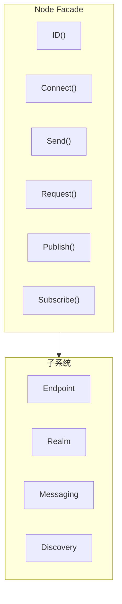

# Node API

Node 是 DeP2P 面向用户的主要入口，提供简洁的高层 API。

---

## 概述



Node 是一个 Facade 模式的实现，封装了底层的复杂性，提供：
- 简洁的连接 API
- 统一的消息传递接口
- 便捷的地址管理
- 子系统访问入口

---

## 创建节点

### New

创建一个新节点。

```go
func New(ctx context.Context, opts ...Option) (*Node, error)
```

**参数**：
| 参数 | 类型 | 描述 |
|------|------|------|
| `ctx` | `context.Context` | 上下文 |
| `opts` | `...Option` | 配置选项 |

**返回值**：
| 类型 | 描述 |
|------|------|
| `*Node` | 节点实例 |
| `error` | 错误信息 |

**示例**：

```go
// 使用预设创建节点
node, err := dep2p.New(ctx,
    dep2p.WithPreset(dep2p.PresetDesktop),
)
if err != nil {
    log.Fatal(err)
}
err = node.Start(ctx)
if err != nil {
    log.Fatal(err)
}
defer node.Close()

// 自定义配置
node, err := dep2p.New(ctx,
    dep2p.WithPreset(dep2p.PresetServer),
    dep2p.WithListenPort(4001),
    dep2p.WithBootstrapPeers(bootstrapAddrs...),
)
if err != nil {
    log.Fatal(err)
}
err = node.Start(ctx)
if err != nil {
    log.Fatal(err)
}
```

---

## 身份信息 API

### ID

返回节点的唯一标识符。

```go
func (n *Node) ID() types.NodeID
```

**返回值**：
| 类型 | 描述 |
|------|------|
| `types.NodeID` | 节点 ID（Base58 编码的公钥派生） |

**示例**：

```go
nodeID := node.ID()
fmt.Printf("Node ID: %s\n", nodeID)
fmt.Printf("Short ID: %s\n", nodeID.ShortString())
```

---

## 连接管理 API

### Connect

通过 NodeID 连接到节点。

```go
func (n *Node) Connect(ctx context.Context, nodeID types.NodeID) (endpoint.Connection, error)
```

**参数**：
| 参数 | 类型 | 描述 |
|------|------|------|
| `ctx` | `context.Context` | 上下文（支持超时和取消） |
| `nodeID` | `types.NodeID` | 目标节点 ID |

**返回值**：
| 类型 | 描述 |
|------|------|
| `endpoint.Connection` | 连接实例 |
| `error` | 错误信息 |

**说明**：
- 自动从 AddressBook/Discovery 查找地址并连接
- 如果已有到该节点的连接，返回现有连接
- 这是最推荐的连接方式

**示例**：

```go
conn, err := node.Connect(ctx, targetNodeID)
if err != nil {
    log.Printf("连接失败: %v", err)
    return
}
fmt.Printf("已连接到: %s\n", conn.RemoteID())
```

---

### ConnectToAddr

通过完整地址连接到节点。

```go
func (n *Node) ConnectToAddr(ctx context.Context, fullAddr string) (endpoint.Connection, error)
```

**参数**：
| 参数 | 类型 | 描述 |
|------|------|------|
| `ctx` | `context.Context` | 上下文 |
| `fullAddr` | `string` | 完整地址（含 /p2p/<NodeID>） |

**返回值**：
| 类型 | 描述 |
|------|------|
| `endpoint.Connection` | 连接实例 |
| `error` | 错误信息 |

**说明**：
- 适用于 Bootstrap 和用户分享地址的场景
- 地址必须是 Full Address 格式

**示例**：

```go
fullAddr := "/ip4/192.168.1.100/udp/4001/quic-v1/p2p/5Q2STWvBFn..."
conn, err := node.ConnectToAddr(ctx, fullAddr)
if err != nil {
    log.Printf("连接失败: %v", err)
    return
}
```

---

### ConnectWithAddrs

使用指定地址连接到节点。

```go
func (n *Node) ConnectWithAddrs(ctx context.Context, nodeID types.NodeID, addrs []string) (endpoint.Connection, error)
```

**参数**：
| 参数 | 类型 | 描述 |
|------|------|------|
| `ctx` | `context.Context` | 上下文 |
| `nodeID` | `types.NodeID` | 目标节点 ID |
| `addrs` | `[]string` | 地址列表（Dial Address 格式） |

**返回值**：
| 类型 | 描述 |
|------|------|
| `endpoint.Connection` | 连接实例 |
| `error` | 错误信息 |

**说明**：
- 跳过发现服务，直接使用提供的地址
- 地址必须是 Dial Address 格式（不含 /p2p/）

**示例**：

```go
addrs := []string{
    "/ip4/192.168.1.100/udp/4001/quic-v1",
    "/ip4/10.0.0.1/udp/4001/quic-v1",
}
conn, err := node.ConnectWithAddrs(ctx, targetID, addrs)
```

---

## 地址管理 API

### ListenAddrs

返回本地监听地址。

```go
func (n *Node) ListenAddrs() []endpoint.Address
```

**返回值**：
| 类型 | 描述 |
|------|------|
| `[]endpoint.Address` | 监听地址列表 |

**示例**：

```go
for _, addr := range node.ListenAddrs() {
    fmt.Printf("监听: %s\n", addr)
}
```

---

### AdvertisedAddrs

返回通告地址列表。

```go
func (n *Node) AdvertisedAddrs() []endpoint.Address
```

**返回值**：
| 类型 | 描述 |
|------|------|
| `[]endpoint.Address` | 通告地址列表 |

---

### ShareableAddrs

返回可分享的完整地址列表。

```go
func (n *Node) ShareableAddrs() []string
```

**返回值**：
| 类型 | 描述 |
|------|------|
| `[]string` | 完整地址列表（含 /p2p/<NodeID>） |

**说明**：
- 仅返回已验证的公网直连地址
- 可能返回空（如果无公网可达性）

**示例**：

```go
addrs := node.ShareableAddrs()
if len(addrs) > 0 {
    fmt.Println("分享此地址:", addrs[0])
}
```

---

### WaitShareableAddrs

等待可分享地址可用。

```go
func (n *Node) WaitShareableAddrs(ctx context.Context) ([]string, error)
```

**参数**：
| 参数 | 类型 | 描述 |
|------|------|------|
| `ctx` | `context.Context` | 上下文（可设置超时） |

**返回值**：
| 类型 | 描述 |
|------|------|
| `[]string` | 完整地址列表 |
| `error` | 错误信息（超时等） |

**示例**：

```go
ctx, cancel := context.WithTimeout(context.Background(), 30*time.Second)
defer cancel()

addrs, err := node.WaitShareableAddrs(ctx)
if err != nil {
    log.Println("获取地址超时")
}
```

---

### BootstrapCandidates

返回所有候选地址。

```go
func (n *Node) BootstrapCandidates() []reachabilityif.BootstrapCandidate
```

**返回值**：
| 类型 | 描述 |
|------|------|
| `[]BootstrapCandidate` | 候选地址列表（含类型信息） |

---

## 子系统访问 API

### Endpoint

返回底层 Endpoint 接口。

```go
func (n *Node) Endpoint() endpoint.Endpoint
```

**返回值**：
| 类型 | 描述 |
|------|------|
| `endpoint.Endpoint` | Endpoint 接口 |

---

### Realm

返回 Realm 管理器。

```go
func (n *Node) Realm() realmif.RealmManager
```

**返回值**：
| 类型 | 描述 |
|------|------|
| `RealmManager` | Realm 管理器 |

**示例（IMPL-1227 更新）**：

```go
// 使用 realmKey 加入 Realm（PSK 认证）
realmKey := types.GenerateRealmKey()
realm, err := node.Realm("my-realm")
if err != nil {
    log.Fatal(err)
}
err = realm.Join(ctx)
if err != nil {
    log.Fatal(err)
}

// 获取当前 Realm 对象
currentRealm := node.CurrentRealm()
if currentRealm != nil {
    fmt.Printf("当前 Realm: %s (ID: %s)\n", currentRealm.Name(), currentRealm.ID())
}

// 通过 Realm 对象获取 Layer 3 服务
messaging := realm.Messaging()
pubsub := realm.PubSub()
```

### Realm

获取或创建指定 Realm。

```go
func (n *Node) Realm(id string) (Realm, error)
```

**参数**：
| 参数 | 类型 | 描述 |
|------|------|------|
| `id` | `string` | Realm 标识符 |

**返回值**：
| 类型 | 描述 |
|------|------|
| `Realm` | Realm 对象（用于获取 Layer 3 服务） |
| `error` | 错误信息 |

**示例**：

```go
realmKey := types.GenerateRealmKey() // 或从配置读取
realm, err := node.Realm("my-business-network")
if err != nil {
    log.Fatal(err)
}
err = realm.Join(ctx)
if err != nil {
    log.Fatal(err)
}

// 通过 Realm 对象访问服务
realm.Messaging().Send(ctx, target, data)
realm.PubSub().Join(ctx, "news")
```

### CurrentRealm（IMPL-1227 更新）

返回当前 Realm 对象。

```go
func (n *Node) CurrentRealm() realmif.Realm
```

**返回值**：
| 类型 | 描述 |
|------|------|
| `realmif.Realm` | 当前 Realm 对象，未加入时返回 nil |

**示例**：

```go
realm := node.CurrentRealm()
if realm == nil {
    fmt.Println("未加入任何 Realm")
} else {
    fmt.Printf("当前 Realm: %s (ID: %s)\n", realm.Name(), realm.ID())
    fmt.Printf("成员数: %d\n", realm.MemberCount())
}
```

---

### Messaging

返回消息子系统。

```go
func (n *Node) Messaging() messagingif.MessagingService
```

---

### Discovery

返回发现服务。

```go
func (n *Node) Discovery() endpoint.DiscoveryService
```

---

### NAT

返回 NAT 服务。

```go
func (n *Node) NAT() endpoint.NATService
```

---

### Relay

返回中继客户端。

```go
func (n *Node) Relay() endpoint.RelayClient
```

---

### AddressBook

返回地址簿。

```go
func (n *Node) AddressBook() endpoint.AddressBook
```

---

### ConnectionManager

返回连接管理器。

```go
func (n *Node) ConnectionManager() connmgrif.ConnectionManager
```

---

### Liveness

返回存活检测服务。

```go
func (n *Node) Liveness() livenessif.LivenessService
```

---

## 消息传递 API（IMPL-1227 更新）

> **注意**：以下快捷方法必须在调用 `Realm().Join()` 后才能使用，否则返回 `ErrNotMember`。
> **推荐**：直接通过 `realm.Messaging()` 和 `realm.PubSub()` 访问服务，获得更完整的 API。

### Send

单向发送消息（快捷方法）。

```go
func (n *Node) Send(ctx context.Context, nodeID types.NodeID, data []byte) error
```

**参数**：
| 参数 | 类型 | 描述 |
|------|------|------|
| `ctx` | `context.Context` | 上下文 |
| `nodeID` | `types.NodeID` | 目标节点 ID |
| `data` | `[]byte` | 消息数据 |

**返回值**：
| 类型 | 描述 |
|------|------|
| `error` | 错误信息 |

**示例**：

```go
// ❌ 错误：Node 层没有 Send 方法，需要通过 Realm.Messaging() 获取
// err := node.Send(ctx, targetID, []byte("Hello"))  // 不存在此方法

// ✅ 正确：先加入 Realm，再通过 Realm.Messaging() 发送
realm, _ := node.Realm("my-realm")
_ = realm.Join(ctx)
err := realm.Messaging().Send(ctx, targetID, "/chat/1.0.0", []byte("Hello"))
if err != nil {
    log.Printf("发送失败: %v", err)
}
```

---

### Request

请求-响应模式发送消息（快捷方法）。

```go
func (n *Node) Request(ctx context.Context, nodeID types.NodeID, data []byte) ([]byte, error)
```

**参数**：
| 参数 | 类型 | 描述 |
|------|------|------|
| `ctx` | `context.Context` | 上下文 |
| `nodeID` | `types.NodeID` | 目标节点 ID |
| `data` | `[]byte` | 请求数据 |

**返回值**：
| 类型 | 描述 |
|------|------|
| `[]byte` | 响应数据 |
| `error` | 错误信息 |

**示例**：

```go
// ❌ 错误：Node 层没有 Request 方法，需要通过 Realm.Messaging() 获取
// resp, err := node.Request(ctx, targetID, requestData)  // 不存在此方法

// ✅ 正确：先加入 Realm，再通过 Realm.Messaging() 请求
realm, _ := node.Realm("my-realm")
_ = realm.Join(ctx)
resp, err := realm.Messaging().Request(ctx, targetID, "/rpc/1.0.0", requestData)
if err != nil {
    log.Printf("请求失败: %v", err)
    return
}
fmt.Printf("响应: %s\n", resp)

// 推荐：通过 Realm 对象请求（支持指定协议）
realm := node.CurrentRealm()
resp, err := realm.Messaging().RequestWithProtocol(ctx, targetID, "rpc/1.0.0", requestData)
```

---

### 推荐使用方式（IMPL-1227）

```go
// 获取 Realm 对象
realm := node.CurrentRealm()
if realm == nil {
    return ErrNotMember
}

// Messaging 服务
messaging := realm.Messaging()
messaging.Send(ctx, target, data)
messaging.SendWithProtocol(ctx, target, "chat/1.0.0", data)  // 自动添加前缀
messaging.Request(ctx, target, data)
messaging.RequestWithProtocol(ctx, target, "rpc/1.0.0", data)
messaging.OnProtocol("handler/1.0.0", func(from types.NodeID, proto string, data []byte) ([]byte, error) {
    return []byte("response"), nil
})

// PubSub 服务
pubsub := realm.PubSub()
topic, _ := pubsub.Join(ctx, "news")  // 自动添加 Realm 前缀
topic.Publish(ctx, data)
sub, _ := topic.Subscribe()
for msg := range sub.Messages() {
    fmt.Printf("收到: %s\n", msg.Data)
}

// 协议自动前缀
// 用户: "chat/1.0.0"
// 实际: "/dep2p/app/<realmID>/chat/1.0.0"
```

---

## 生命周期 API

### Close

关闭节点并释放资源。

```go
func (n *Node) Close() error
```

**返回值**：
| 类型 | 描述 |
|------|------|
| `error` | 错误信息 |

**说明**：
- 会发送 Goodbye 消息通知其他节点
- 等待优雅下线后断开所有连接
- 释放所有资源

**示例**：

```go
defer node.Close()
```

---

## 就绪状态 API

### ReadyLevel

返回当前节点就绪级别。

```go
func (n *Node) ReadyLevel() ReadyLevel
```

**ReadyLevel 常量**：

| 级别 | 值 | 描述 |
|------|---|------|
| `ReadyLevelCreated` | 0 | Node 对象已创建，未启动 |
| `ReadyLevelNetwork` | 1 | 传输层就绪，能发起出站连接 |
| `ReadyLevelDiscovered` | 2 | DHT 入网成功，能发现其他节点 |
| `ReadyLevelReachable` | 3 | 可达性验证完成，能被其他节点发现 |
| `ReadyLevelRealmReady` | 4 | Realm 加入完成，Realm 成员可达 |

**示例**：

```go
level := node.ReadyLevel()
if level >= interfaces.ReadyLevelDiscovered {
    // 可以使用 DHT 发现功能
    fmt.Println("DHT 已就绪")
}
```

---

### WaitReady

等待节点达到指定的就绪级别。

```go
func (n *Node) WaitReady(ctx context.Context, level ReadyLevel) error
```

**参数**：
| 参数 | 类型 | 描述 |
|------|------|------|
| `ctx` | `context.Context` | 上下文，可用于设置超时或取消 |
| `level` | `ReadyLevel` | 目标就绪级别 |

**返回值**：
| 类型 | 描述 |
|------|------|
| `error` | 如果 context 被取消或超时，返回对应错误 |

**说明**：
- 阻塞直到节点达到指定的就绪级别
- 如果当前级别已经 >= 目标级别，立即返回 nil

**示例**：

```go
// 等待 DHT 入网完成，最多等 30 秒
ctx, cancel := context.WithTimeout(context.Background(), 30*time.Second)
defer cancel()

if err := node.WaitReady(ctx, interfaces.ReadyLevelDiscovered); err != nil {
    log.Printf("等待超时: %v", err)
}
fmt.Println("DHT 入网完成，可以开始发现节点")
```

---

### OnReadyLevelChange

注册就绪级别变化回调。

```go
func (n *Node) OnReadyLevelChange(callback func(level ReadyLevel))
```

**参数**：
| 参数 | 类型 | 描述 |
|------|------|------|
| `callback` | `func(level ReadyLevel)` | 级别变化时的回调函数 |

**说明**：
- 当就绪级别发生变化时，会调用注册的回调函数
- 回调在级别变化时同步调用，请勿在回调中执行耗时操作

**示例**：

```go
node.OnReadyLevelChange(func(level interfaces.ReadyLevel) {
    log.Printf("就绪级别变化: %v", level)
    if level == interfaces.ReadyLevelRealmReady {
        fmt.Println("节点完全就绪，可以开始通信")
    }
})
```

---

## Bootstrap 能力开关

### EnableBootstrap

启用 Bootstrap 能力，将节点设置为引导节点。

```go
func (n *Node) EnableBootstrap(ctx context.Context) error
```

**说明**：
启用后，节点将：
- 维护扩展的节点存储（最多 50,000 个节点）
- 定期探测存储节点的存活状态
- 主动通过 Random Walk 发现新节点
- 响应 FIND_NODE 请求，返回最近 K 个节点

**前置条件**：
- 节点必须有公网可达地址（非 NAT 后）

**示例**：

```go
// 将节点设置为引导节点
if err := node.EnableBootstrap(ctx); err != nil {
    log.Printf("启用 Bootstrap 失败: %v", err)
}
```

---

### DisableBootstrap

禁用 Bootstrap 能力。

```go
func (n *Node) DisableBootstrap(ctx context.Context) error
```

**说明**：
- 停止作为引导节点服务
- 保留已存储的节点信息（下次启用时可快速恢复）

---

### IsBootstrapEnabled

查询 Bootstrap 能力是否已启用。

```go
func (n *Node) IsBootstrapEnabled() bool
```

---

### BootstrapStats

获取 Bootstrap 统计信息。

```go
func (n *Node) BootstrapStats() BootstrapStats
```

**BootstrapStats 结构**：

```go
type BootstrapStats struct {
    Enabled       bool          // 是否已启用
    PeerCount     int           // 存储的节点数量
    LastProbeTime time.Time     // 上次探测时间
    ProbeInterval time.Duration // 探测间隔
}
```

---

## Relay 能力开关

### EnableRelay

启用 Relay 能力，将节点设置为中继服务器。

```go
func (n *Node) EnableRelay(ctx context.Context) error
```

**说明**：
- 为 NAT 后的节点提供中继服务
- 所有资源限制参数使用内置默认值

**前置条件**：
- 节点必须有公网可达地址（非 NAT 后）

**示例**：

```go
// 将节点设置为中继服务器
if err := node.EnableRelay(ctx); err != nil {
    log.Printf("启用 Relay 失败: %v", err)
}
```

---

### DisableRelay

禁用 Relay 能力。

```go
func (n *Node) DisableRelay(ctx context.Context) error
```

**说明**：
- 停止作为中继服务
- 已建立的中继电路会被优雅关闭

---

### IsRelayEnabled

查询 Relay 能力是否已启用。

```go
func (n *Node) IsRelayEnabled() bool
```

---

### SetRelayAddr

设置要使用的 Relay 地址（客户端使用）。

```go
func (n *Node) SetRelayAddr(addr types.Multiaddr) error
```

**参数**：
| 参数 | 类型 | 描述 |
|------|------|------|
| `addr` | `types.Multiaddr` | Relay 的完整 multiaddr 地址 |

**示例**：

```go
relayAddr := "/ip4/relay.example.com/udp/4001/quic-v1/p2p/12D3KooW..."
node.SetRelayAddr(types.MustParseMultiaddr(relayAddr))
```

---

### RemoveRelayAddr

移除 Relay 地址配置。

```go
func (n *Node) RemoveRelayAddr() error
```

---

### RelayAddr

获取当前配置的 Relay 地址。

```go
func (n *Node) RelayAddr() (types.Multiaddr, bool)
```

**返回值**：
| 类型 | 描述 |
|------|------|
| `types.Multiaddr` | Relay 地址 |
| `bool` | 是否已配置（false 表示未配置） |

---

### RelayStats

获取 Relay 统计信息。

```go
func (n *Node) RelayStats() RelayStats
```

**RelayStats 结构**：

```go
type RelayStats struct {
    Enabled         bool          // 是否已启用
    ActiveCircuits  int           // 活跃电路数
    TotalCircuits   int           // 总电路数
    BytesRelayed    int64         // 中继字节数
    LastActivityAt  time.Time     // 最后活动时间
}
```

---

## 网络变化通知

### NetworkChange

通知节点网络可能已变化。

```go
func (n *Node) NetworkChange()
```

**说明**：
- 在某些平台（如 Android）上，系统无法自动检测网络变化
- 应用需要在收到系统网络变化回调时调用此方法
- 即使网络实际未变化，调用此方法也不会有副作用

**使用场景**：
- WiFi 切换
- 移动网络切换（4G → 5G）
- VPN 连接/断开

**示例**：

```go
// 在 Android 等平台监听系统网络变化事件
func onSystemNetworkChange() {
    node.NetworkChange()
}
```

---

### OnNetworkChange

注册网络变化回调。

```go
func (n *Node) OnNetworkChange(callback func(event NetworkChangeEvent))
```

**参数**：
| 参数 | 类型 | 描述 |
|------|------|------|
| `callback` | `func(event NetworkChangeEvent)` | 网络变化回调函数 |

**NetworkChangeEvent 结构**：

```go
type NetworkChangeEvent struct {
    Type      NetworkChangeType // 变化类型
    Timestamp time.Time         // 变化时间
    Details   string            // 详细信息
}
```

**示例**：

```go
node.OnNetworkChange(func(event interfaces.NetworkChangeEvent) {
    log.Printf("网络变化: %v", event.Type)
    // 可以在这里做相应处理，如重新获取配置
})
```

---

## 连接票据与地址 API

### ConnectionTicket

返回用户友好的连接票据。

```go
func (n *Node) ConnectionTicket() string
```

**返回值**：
| 类型 | 描述 |
|------|------|
| `string` | `dep2p://base64url(...)` 格式的票据，如无可用地址返回空字符串 |

**说明**：
- 票据格式便于通过聊天/二维码分享
- 包含 NodeID 和地址提示（ShareableAddrs 优先，回退到 AdvertisedAddrs）
- 其他节点可使用 `Connect(ctx, ticket)` 连接

**示例**：

```go
ticket := node.ConnectionTicket()
if ticket != "" {
    fmt.Println("分享此票据给其他用户:", ticket)
}

// 其他节点使用票据连接
err := otherNode.Connect(ctx, ticket)
```

---

### BootstrapCandidates

返回候选地址（用于人工分享/跨设备冷启动）。

```go
func (n *Node) BootstrapCandidates() []types.BootstrapCandidate
```

**BootstrapCandidate 结构**：

```go
type BootstrapCandidate struct {
    NodeID string   // 节点 ID
    Addrs  []string // 地址列表
    Type   string   // "direct" 或 "relay"
}
```

**说明**：
- 与 `ShareableAddrs` 正交：ShareableAddrs 严格验证，可入 DHT；BootstrapCandidates 包含所有候选
- 包括直连地址、监听地址和中继电路地址

---

### ConnectionCount

返回当前活跃连接数。

```go
func (n *Node) ConnectionCount() int
```

---

### IsRunning

检查节点是否正在运行。

```go
func (n *Node) IsRunning() bool
```

---

## 健康检查 API

### Health

获取节点健康状态。

```go
func (n *Node) Health(ctx context.Context) map[string]HealthStatus
```

**返回值**：
| 键 | 描述 |
|------|------|
| `"node"` | 节点整体状态 |
| `"host"` | 网络主机状态 |
| `"connections"` | 连接状态 |
| `"discovery"` | 发现服务状态（如启用） |
| `"realm"` | Realm 状态（如已加入） |

**HealthStatus 结构**：

```go
type HealthStatus struct {
    Status  HealthState            // Healthy, Degraded, Unhealthy
    Message string                 // 状态描述
    Details map[string]interface{} // 详细信息
}
```

**示例**：

```go
health := node.Health(ctx)
for name, status := range health {
    fmt.Printf("%s: %s - %s\n", name, status.Status, status.Message)
}
```

---

### HealthSummary

返回健康检查摘要。

```go
func (n *Node) HealthSummary(ctx context.Context) (overall HealthState, unhealthy []string)
```

**返回值**：
| 类型 | 描述 |
|------|------|
| `HealthState` | 整体健康状态 |
| `[]string` | 不健康组件列表 |

**示例**：

```go
overall, unhealthy := node.HealthSummary(ctx)
if overall != interfaces.HealthStateHealthy {
    log.Printf("节点不健康，问题组件: %v", unhealthy)
}
```

---

## 网络诊断 API

### GetNetworkDiagnostics

获取网络诊断报告。

```go
func (n *Node) GetNetworkDiagnostics(ctx context.Context) (*NetworkDiagnosticReport, error)
```

**NetworkDiagnosticReport 结构**：

```go
type NetworkDiagnosticReport struct {
    // IPv4 相关
    IPv4Available bool   // IPv4 是否可用
    IPv4GlobalIP  string // IPv4 外部地址
    IPv4Port      int    // IPv4 外部端口

    // IPv6 相关
    IPv6Available bool   // IPv6 是否可用
    IPv6GlobalIP  string // IPv6 外部地址

    // NAT 类型
    NATType string // NAT 类型描述

    // 端口映射可用性
    UPnPAvailable   bool // UPnP 是否可用
    NATPMPAvailable bool // NAT-PMP 是否可用
    PCPAvailable    bool // PCP 是否可用

    // 强制门户
    CaptivePortal bool // 是否存在强制门户

    // 中继延迟（毫秒）
    RelayLatencies map[string]int64

    // 生成耗时（毫秒）
    Duration int64
}
```

**示例**：

```go
report, err := node.GetNetworkDiagnostics(ctx)
if err != nil {
    log.Printf("诊断失败: %v", err)
    return
}
fmt.Printf("IPv4 外部地址: %s:%d\n", report.IPv4GlobalIP, report.IPv4Port)
fmt.Printf("NAT 类型: %s\n", report.NATType)
```

---

## 种子恢复 API

### RecoverSeeds

从节点缓存恢复种子节点并尝试连接。

```go
func (n *Node) RecoverSeeds(ctx context.Context, count int, maxAge time.Duration) (int, []SeedRecord, error)
```

**参数**：
| 参数 | 类型 | 描述 |
|------|------|------|
| `ctx` | `context.Context` | 上下文 |
| `count` | `int` | 最大恢复节点数 |
| `maxAge` | `time.Duration` | 节点最大年龄（超过此时间的节点不恢复） |

**返回值**：
| 类型 | 描述 |
|------|------|
| `int` | 成功连接的节点数 |
| `[]SeedRecord` | 恢复的种子节点列表 |
| `error` | 错误信息 |

**SeedRecord 结构**：

```go
type SeedRecord struct {
    ID       string    // 节点 ID
    Addrs    []string  // 节点地址列表
    LastSeen time.Time // 最后活跃时间
    LastPong time.Time // 最后 Pong 时间
}
```

**示例**：

```go
connected, seeds, err := node.RecoverSeeds(ctx, 50, 24*time.Hour)
if err != nil {
    log.Printf("恢复种子失败: %v", err)
}
log.Printf("从 %d 个种子中成功连接 %d 个", len(seeds), connected)
```

---

### GetSeedCount

获取节点缓存中的种子节点数量。

```go
func (n *Node) GetSeedCount() int
```

---

## 自省服务 API

### GetIntrospectInfo

获取自省服务信息。

```go
func (n *Node) GetIntrospectInfo() IntrospectInfo
```

**IntrospectInfo 结构**：

```go
type IntrospectInfo struct {
    Enabled   bool     // 是否启用
    Addr      string   // 监听地址
    Endpoints []string // 可用端点列表
}
```

**可用端点**：
- `/debug/introspect` - 完整自省信息
- `/debug/introspect/node` - 节点信息
- `/debug/introspect/connections` - 连接信息
- `/debug/introspect/peers` - 节点信息
- `/debug/introspect/bandwidth` - 带宽统计
- `/debug/introspect/runtime` - 运行时信息
- `/debug/pprof/` - Go pprof 端点
- `/health` - 健康检查

**示例**：

```go
info := node.GetIntrospectInfo()
if info.Enabled {
    fmt.Printf("自省服务地址: %s\n", info.Addr)
    fmt.Printf("可用端点: %v\n", info.Endpoints)
}
```

---

### GetIntrospectAddr

获取自省服务监听地址。

```go
func (n *Node) GetIntrospectAddr() string
```

---

### IsIntrospectEnabled

检查自省服务是否启用。

```go
func (n *Node) IsIntrospectEnabled() bool
```

---

## 方法列表

| 方法 | 分类 | 描述 |
|------|------|------|
| `ID()` | 身份 | 返回节点 ID |
| `Connect()` | 连接 | 连接到目标（支持地址/票据/NodeID） |
| `JoinRealm()` | Realm | 加入业务域 |
| `Realm()` | Realm | 获取当前 Realm |
| `LeaveRealm()` | Realm | 离开当前 Realm |
| `ListenAddrs()` | 地址 | 返回监听地址 |
| `AdvertisedAddrs()` | 地址 | 返回通告地址 |
| `ShareableAddrs()` | 地址 | 返回可分享地址 |
| `WaitShareableAddrs()` | 地址 | 等待可分享地址 |
| `BootstrapCandidates()` | 地址 | 返回候选地址 |
| `ConnectionTicket()` | 地址 | 返回连接票据 |
| `Messaging()` | 快捷方法 | 返回消息服务（需先加入 Realm） |
| `PubSub()` | 快捷方法 | 返回发布订阅服务 |
| `Streams()` | 快捷方法 | 返回流服务 |
| `Liveness()` | 快捷方法 | 返回存活检测服务 |
| `Host()` | 子系统 | 返回底层 Host |
| `ReadyLevel()` | 就绪状态 | 返回当前就绪级别 |
| `WaitReady()` | 就绪状态 | 等待指定就绪级别 |
| `OnReadyLevelChange()` | 就绪状态 | 注册就绪级别变化回调 |
| `EnableBootstrap()` | Bootstrap | 启用 Bootstrap 能力 |
| `DisableBootstrap()` | Bootstrap | 禁用 Bootstrap 能力 |
| `IsBootstrapEnabled()` | Bootstrap | 查询 Bootstrap 状态 |
| `BootstrapStats()` | Bootstrap | 获取 Bootstrap 统计 |
| `EnableRelay()` | Relay | 启用 Relay 能力 |
| `DisableRelay()` | Relay | 禁用 Relay 能力 |
| `IsRelayEnabled()` | Relay | 查询 Relay 状态 |
| `SetRelayAddr()` | Relay | 设置 Relay 地址 |
| `RemoveRelayAddr()` | Relay | 移除 Relay 地址 |
| `RelayAddr()` | Relay | 获取 Relay 地址 |
| `RelayStats()` | Relay | 获取 Relay 统计 |
| `NetworkChange()` | 网络变化 | 通知网络变化 |
| `OnNetworkChange()` | 网络变化 | 注册网络变化回调 |
| `ConnectionCount()` | 状态 | 返回当前连接数 |
| `State()` | 状态 | 返回节点状态 |
| `IsRunning()` | 状态 | 检查是否运行中 |
| `Health()` | 健康检查 | 获取健康状态 |
| `HealthSummary()` | 健康检查 | 获取健康摘要 |
| `GetNetworkDiagnostics()` | 诊断 | 获取网络诊断报告 |
| `RecoverSeeds()` | 种子恢复 | 从缓存恢复种子节点 |
| `GetSeedCount()` | 种子恢复 | 获取种子节点数量 |
| `GetIntrospectInfo()` | 自省 | 获取自省服务信息 |
| `GetIntrospectAddr()` | 自省 | 获取自省服务地址 |
| `IsIntrospectEnabled()` | 自省 | 检查自省服务是否启用 |
| `Start()` | 生命周期 | 启动节点 |
| `Stop()` | 生命周期 | 停止节点 |
| `Close()` | 生命周期 | 关闭节点 |
| `RelayAddr()` | Relay | 获取 Relay 地址 |
| `RelayStats()` | Relay | 获取 Relay 统计 |
| `NetworkChange()` | 网络变化 | 通知网络变化 |
| `OnNetworkChange()` | 网络变化 | 注册网络变化回调 |
| `Start()` | 生命周期 | 启动节点 |
| `Stop()` | 生命周期 | 停止节点 |
| `Close()` | 生命周期 | 关闭节点 |

---

## 错误处理

| 错误 | 描述 | 解决方案 |
|------|------|----------|
| `ErrNotMember` | 未加入 Realm 就调用消息 API | 先调用 `Realm().Join()` |
| `ErrIdentityMismatch` | 连接时身份验证失败 | 检查地址中的 NodeID |
| `context deadline exceeded` | 操作超时 | 增加超时时间或检查网络 |

---

## 相关文档

- [Endpoint API](endpoint.md)
- [Realm API](realm.md)
- [Messaging API](messaging.md)
- [配置项参考](../configuration.md)
