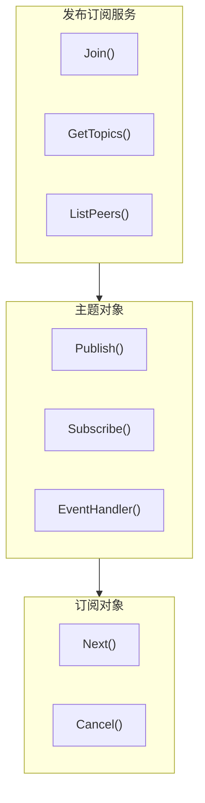

# PubSub API

PubSub 服务提供基于 GossipSub 的发布/订阅功能。

---

## 概述



PubSub 支持：
- **主题管理**：加入/列出主题
- **消息发布**：向主题发布消息
- **消息订阅**：订阅主题接收消息
- **节点事件**：监听主题中的节点加入/离开

> **获取方式**：通过 `realm.PubSub()` 获取 PubSub 服务。

---

## 获取 PubSub 服务

```go
realm, _ := node.Realm("my-realm")
_ = realm.Join(ctx)
pubsub := realm.PubSub()
```

---

## PubSub API

### Join

加入主题。

```go
func (p *PubSub) Join(topic string, opts ...TopicOption) (Topic, error)
```

**参数**：
| 参数 | 类型 | 描述 |
|------|------|------|
| `topic` | `string` | 主题名称 |
| `opts` | `...TopicOption` | 主题选项 |

**返回值**：
| 类型 | 描述 |
|------|------|
| `Topic` | 主题对象 |
| `error` | 错误信息 |

**说明**：
- 加入主题后才能发布和订阅消息
- 主题名称会自动添加 Realm 前缀

**示例**：

```go
pubsub := realm.PubSub()

// 加入主题
topic, err := pubsub.Join("chat-room")
if err != nil {
    log.Fatal(err)
}
defer topic.Close()
```

---

### GetTopics

获取所有已加入的主题。

```go
func (p *PubSub) GetTopics() []string
```

**返回值**：
| 类型 | 描述 |
|------|------|
| `[]string` | 主题名称列表 |

**示例**：

```go
topics := pubsub.GetTopics()
fmt.Printf("已加入 %d 个主题:\n", len(topics))
for _, t := range topics {
    fmt.Printf("  - %s\n", t)
}
```

---

### ListPeers

列出指定主题的所有节点。

```go
func (p *PubSub) ListPeers(topic string) []string
```

**参数**：
| 参数 | 类型 | 描述 |
|------|------|------|
| `topic` | `string` | 主题名称 |

**返回值**：
| 类型 | 描述 |
|------|------|
| `[]string` | 节点 ID 列表 |

**示例**：

```go
peers := pubsub.ListPeers("chat-room")
fmt.Printf("主题中有 %d 个节点\n", len(peers))
```

---

## Topic API

### Publish

向主题发布消息。

```go
func (t *Topic) Publish(ctx context.Context, data []byte, opts ...PublishOption) error
```

**参数**：
| 参数 | 类型 | 描述 |
|------|------|------|
| `ctx` | `context.Context` | 上下文 |
| `data` | `[]byte` | 消息数据 |
| `opts` | `...PublishOption` | 发布选项 |

**返回值**：
| 类型 | 描述 |
|------|------|
| `error` | 错误信息 |

**示例**：

```go
topic, _ := pubsub.Join("chat-room")

// 发布文本消息
err := topic.Publish(ctx, []byte("Hello everyone!"))
if err != nil {
    log.Printf("发布失败: %v", err)
}

// 发布结构化数据
msg := ChatMessage{
    Sender:  node.ID(),
    Content: "Hello",
    Time:    time.Now(),
}
data, _ := json.Marshal(msg)
topic.Publish(ctx, data)
```

---

### Subscribe

订阅主题。

```go
func (t *Topic) Subscribe(opts ...SubscribeOption) (TopicSubscription, error)
```

**参数**：
| 参数 | 类型 | 描述 |
|------|------|------|
| `opts` | `...SubscribeOption` | 订阅选项 |

**返回值**：
| 类型 | 描述 |
|------|------|
| `TopicSubscription` | 订阅对象 |
| `error` | 错误信息 |

**示例**：

```go
topic, _ := pubsub.Join("chat-room")

// 创建订阅
sub, err := topic.Subscribe()
if err != nil {
    log.Fatal(err)
}
defer sub.Cancel()

// 接收消息
for {
    msg, err := sub.Next(ctx)
    if err != nil {
        break
    }
    fmt.Printf("收到来自 %s 的消息: %s\n", msg.From[:16], msg.Data)
}
```

---

### EventHandler

注册主题事件处理器。

```go
func (t *Topic) EventHandler(opts ...TopicEventHandlerOption) (TopicEventHandler, error)
```

**返回值**：
| 类型 | 描述 |
|------|------|
| `TopicEventHandler` | 事件处理器 |
| `error` | 错误信息 |

**示例**：

```go
topic, _ := pubsub.Join("chat-room")

// 创建事件处理器
handler, err := topic.EventHandler()
if err != nil {
    log.Fatal(err)
}
defer handler.Cancel()

// 监听节点事件
go func() {
    for {
        event, err := handler.NextPeerEvent(ctx)
        if err != nil {
            break
        }
        switch event.Type {
        case interfaces.PeerJoin:
            fmt.Printf("节点 %s 加入主题\n", event.Peer[:16])
        case interfaces.PeerLeave:
            fmt.Printf("节点 %s 离开主题\n", event.Peer[:16])
        }
    }
}()
```

---

### ListPeers (Topic)

列出此主题的所有节点。

```go
func (t *Topic) ListPeers() []string
```

---

### String

返回主题名称。

```go
func (t *Topic) String() string
```

---

### Close

关闭主题。

```go
func (t *Topic) Close() error
```

---

## TopicSubscription API

### Next

获取下一条消息。

```go
func (s *TopicSubscription) Next(ctx context.Context) (*Message, error)
```

**参数**：
| 参数 | 类型 | 描述 |
|------|------|------|
| `ctx` | `context.Context` | 上下文 |

**返回值**：
| 类型 | 描述 |
|------|------|
| `*Message` | 消息对象 |
| `error` | 错误信息 |

---

### Cancel

取消订阅。

```go
func (s *TopicSubscription) Cancel()
```

---

## Message 结构

```go
type Message struct {
    From         string // 发送方节点 ID
    Data         []byte // 消息数据
    Topic        string // 消息所属主题
    Seqno        []byte // 序列号
    ID           string // 消息唯一标识
    ReceivedFrom string // 接收自哪个节点
    SentTimeNano int64  // 发送时间戳（纳秒）
    RecvTimeNano int64  // 接收时间戳（纳秒）
}
```

---

## PeerEvent 结构

```go
type PeerEvent struct {
    Type PeerEventType // 事件类型
    Peer string        // 相关节点 ID
}
```

**PeerEventType 常量**：

| 类型 | 描述 |
|------|------|
| `PeerJoin` | 节点加入主题 |
| `PeerLeave` | 节点离开主题 |

---

## 方法列表

### PubSub 方法

| 方法 | 描述 |
|------|------|
| `Join()` | 加入主题 |
| `GetTopics()` | 获取所有已加入的主题 |
| `ListPeers()` | 列出指定主题的所有节点 |
| `Close()` | 关闭服务 |

### Topic 方法

| 方法 | 描述 |
|------|------|
| `String()` | 返回主题名称 |
| `Publish()` | 发布消息 |
| `Subscribe()` | 订阅主题 |
| `EventHandler()` | 注册事件处理器 |
| `ListPeers()` | 列出主题中的节点 |
| `Close()` | 关闭主题 |

### TopicSubscription 方法

| 方法 | 描述 |
|------|------|
| `Next()` | 获取下一条消息 |
| `Cancel()` | 取消订阅 |

---

## 使用场景

### 聊天室

```go
pubsub := realm.PubSub()
topic, _ := pubsub.Join("chat-room")
sub, _ := topic.Subscribe()

// 接收消息
go func() {
    for {
        msg, err := sub.Next(ctx)
        if err != nil {
            return
        }
        displayMessage(msg)
    }
}()

// 发送消息
topic.Publish(ctx, []byte("Hello!"))
```

### 事件广播

```go
pubsub := realm.PubSub()
topic, _ := pubsub.Join("events")

// 广播事件
event := Event{
    Type:    "user_login",
    UserID:  "user123",
    Time:    time.Now(),
}
data, _ := json.Marshal(event)
topic.Publish(ctx, data)
```

---

## 相关文档

- [Realm API](realm.md)
- [Messaging API](messaging.md)
- [协议 ID 规范](../protocol-ids.md)
