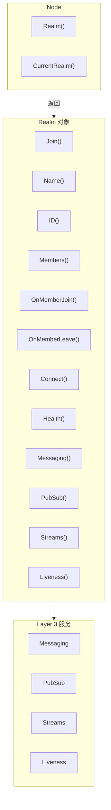
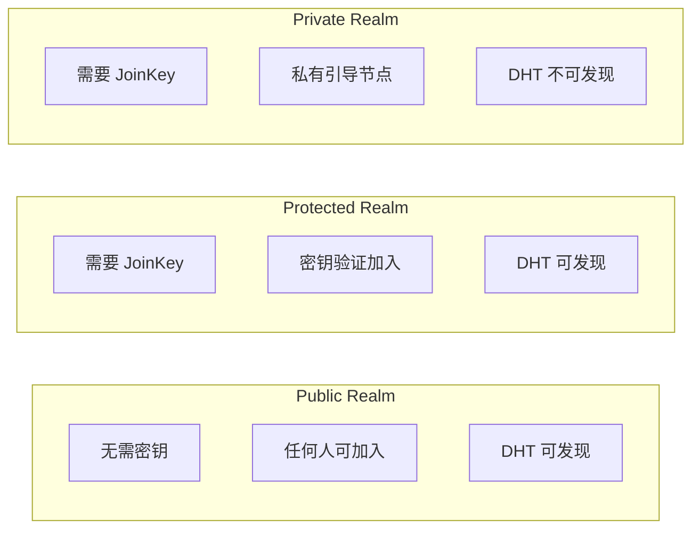
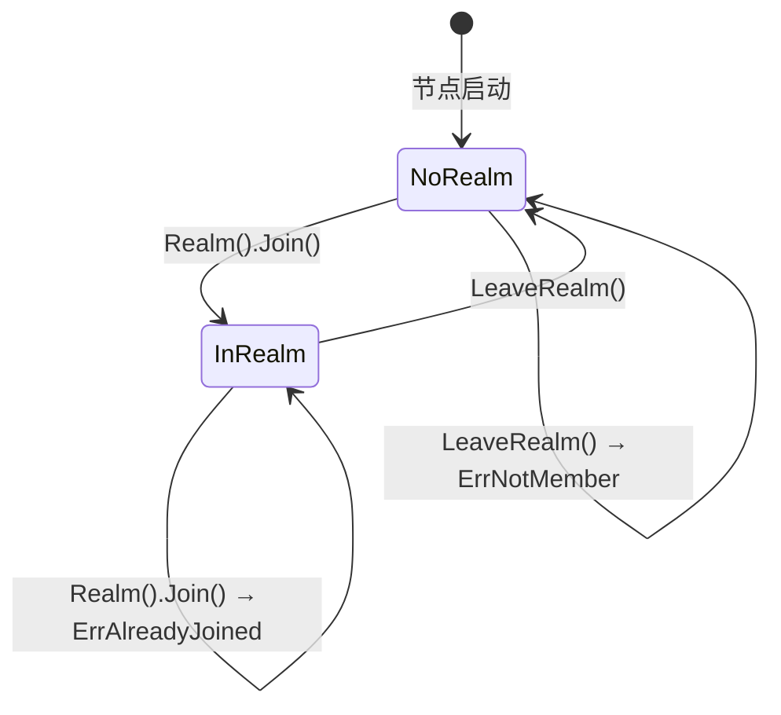

# Realm API（IMPL-1227 更新）

RealmManager 和 Realm 对象提供业务隔离域的管理功能，实现多租户隔离和 PSK 成员认证。

---

## 概述（IMPL-1227）



**IMPL-1227 核心变化**：
- `Realm()` 返回 `Realm` 对象，然后调用 `Join()` 加入
- 所有 Layer 3 服务从 `Realm` 对象获取
- 使用 `realmKey` (32字节 PSK) 进行成员认证
- `RealmID` 从 `realmKey` 哈希派生，不可枚举
- 协议 ID 自动添加 Realm 前缀

---

## 获取 RealmManager

通过 Node 的 `Realm()` 方法获取：

```go
realmMgr := node.Realm()
```

---

## Realm 成员管理 API（IMPL-1227 更新）

### Realm（推荐）

获取或创建指定 Realm。

```go
func (n *Node) Realm(id string) (Realm, error)
```

**参数**：
| 参数 | 类型 | 描述 |
|------|------|------|
| `id` | `string` | Realm 标识符 |

**返回值**：
| 类型 | 描述 |
|------|------|
| `Realm` | Realm 对象（用于获取 Layer 3 服务） |
| `error` | 错误信息 |

### Join

加入 Realm。

```go
func (r *Realm) Join(ctx context.Context) error
```

**参数**：
| 参数 | 类型 | 描述 |
|------|------|------|
| `ctx` | `context.Context` | 上下文 |

**返回值**：
| 类型 | 描述 |
|------|------|
| `error` | 错误信息 |

**说明**：
- `realmKey` 是 32 字节的高熵随机数，用于 PSK 成员认证
- `RealmID` 从 `realmKey` 哈希派生：`SHA256("dep2p-realm-id-v1" || H(realmKey))`
- 相同 `realmKey` 派生相同 `RealmID`，只有持有 `realmKey` 的节点才能加入
- 如果已加入其他 Realm，返回 `ErrAlreadyJoined`

**入口节点（EntryPeerID）**：
- 可在配置中设置 `Realm.EntryPeerID`，用于 Join 协议的入口节点
- 配置后，Realm 启动会自动向入口节点发起 Join 请求并同步成员列表
- 未配置时，Join 协议保持兼容行为（不会主动发起）

**配置示例**：
```json
{
  "Realm": {
    "EntryPeerID": "12D3KooW...入口节点PeerID..."
  }
}
```

**示例**：

```go
// 生成 realmKey（首次创建 Realm）
realmKey := types.GenerateRealmKey()
fmt.Printf("RealmKey: %s\n", realmKey.String()) // 保存并分享给成员

// 或从配置读取已有的 realmKey
realmKey, _ := types.RealmKeyFromHex("abcdef1234...")

// 加入 Realm
realm, err := node.Realm("my-business-network")
if err != nil {
    log.Fatal(err)
}
err = realm.Join(ctx)
if err != nil {
    if errors.Is(err, realm.ErrAlreadyJoined) {
        log.Println("已加入其他 Realm，请先离开")
    }
    return
}

// 使用 Realm 对象获取服务
fmt.Printf("已加入 Realm: %s (ID: %s)\n", realm.Name(), realm.ID())
messaging := realm.Messaging()
pubsub := realm.PubSub()
```

### JoinRealm（已废弃）

> **注意**：此方法已废弃，请使用 `Realm()` + `Join()` 模式。

加入指定 Realm（使用 Option 提供 realmKey）。

```go
func (m RealmManager) JoinRealm(ctx context.Context, name string, opts ...RealmOption) (Realm, error)
```

**示例（新 API）**：

```go
realm, err := node.Realm("my-realm")
if err != nil {
    log.Fatal(err)
}
err = realm.Join(ctx)
if err != nil {
    log.Fatal(err)
}
```

---

### LeaveRealm

离开当前 Realm。

```go
func (m RealmManager) LeaveRealm() error
```

**返回值**：
| 类型 | 描述 |
|------|------|
| `error` | 错误信息 |

**说明**：
- 会向 Realm 内邻居发送 Goodbye 消息
- 如果未加入任何 Realm，返回 `ErrNotMember`

**示例**：

```go
if err := node.Realm().LeaveRealm(); err != nil {
    if errors.Is(err, realm.ErrNotMember) {
        log.Println("未加入任何 Realm")
    }
}
```

---

### CurrentRealm（IMPL-1227 更新）

返回当前 Realm 对象。

```go
func (m RealmManager) CurrentRealm() Realm
```

**返回值**：
| 类型 | 描述 |
|------|------|
| `Realm` | 当前 Realm 对象，未加入时返回 nil |

**示例**：

```go
realm := node.Realm().CurrentRealm()
if realm == nil {
    fmt.Println("未加入任何 Realm")
} else {
    fmt.Printf("当前 Realm: %s (ID: %s)\n", realm.Name(), realm.ID())
    fmt.Printf("成员数: %d\n", realm.MemberCount())
    
    // 获取 Layer 3 服务
    messaging := realm.Messaging()
    pubsub := realm.PubSub()
}
```

---

### IsMember

检查是否已加入 Realm。

```go
func (m RealmManager) IsMember() bool
```

**返回值**：
| 类型 | 描述 |
|------|------|
| `bool` | 是否已加入某个 Realm |

**示例**：

```go
if node.Realm().IsMember() {
    fmt.Println("已加入 Realm")
}
```

---

## Realm 对象接口（IMPL-1227 新增）

`Realm` 对象是 IMPL-1227 的核心变化，所有 Layer 3 服务都从此对象获取。

### Realm 接口

```go
type Realm interface {
    // 基本信息
    Name() string           // 显示名称
    ID() types.RealmID      // 唯一标识（从 realmKey 派生）
    Key() types.RealmKey    // Realm 密钥
    
    // 成员信息
    Members() []types.NodeID    // 已知成员列表
    MemberCount() int           // 成员数量
    
    // Layer 3 服务获取
    Messaging() Messaging           // 消息服务
    PubSub() PubSub                 // 发布订阅服务
    Streams() StreamManager         // 流管理服务
    Discovery() RealmDiscovery      // Realm 内发现服务
    Gateway() Gateway               // Realm 网关服务
    
    // PSK 认证
    PSKAuth() PSKAuthenticator      // PSK 成员验证器
    
    // 生命周期
    Leave() error           // 离开 Realm
    Context() context.Context   // Realm 上下文
}
```

### Messaging 服务

```go
type Messaging interface {
    Send(ctx context.Context, to types.NodeID, data []byte) error
    SendWithProtocol(ctx context.Context, to types.NodeID, protocol string, data []byte) error
    Request(ctx context.Context, to types.NodeID, data []byte) ([]byte, error)
    RequestWithProtocol(ctx context.Context, to types.NodeID, protocol string, data []byte) ([]byte, error)
    OnProtocol(protocol string, handler ProtocolHandler) error
}
```

**示例**：

```go
messaging := realm.Messaging()

// 发送消息（使用默认协议）
messaging.Send(ctx, targetID, []byte("Hello"))

// 发送消息（指定协议，自动添加 Realm 前缀）
messaging.SendWithProtocol(ctx, targetID, "chat/1.0.0", []byte("Hello"))
// 实际协议: /dep2p/app/<realmID>/chat/1.0.0

// 请求-响应
resp, _ := messaging.RequestWithProtocol(ctx, targetID, "rpc/1.0.0", requestData)

// 注册处理器
messaging.OnProtocol("handler/1.0.0", func(from types.NodeID, proto string, data []byte) ([]byte, error) {
    return []byte("response"), nil
})
```

### PubSub 服务

```go
type PubSub interface {
    Join(ctx context.Context, topic string) (Topic, error)
    Publish(ctx context.Context, topic string, data []byte) error
    Subscribe(ctx context.Context, topic string) (Subscription, error)
}

type Topic interface {
    Publish(ctx context.Context, data []byte) error
    Subscribe() (Subscription, error)
    Close() error
}

type Subscription interface {
    Messages() <-chan *PubSubMessage
    Cancel()
}
```

**示例**：

```go
pubsub := realm.PubSub()

// 加入主题（自动添加 Realm 前缀）
topic, _ := pubsub.Join(ctx, "news")
// 实际主题: /dep2p/app/<realmID>/news

// 发布消息
topic.Publish(ctx, []byte("Breaking news!"))

// 订阅消息
sub, _ := topic.Subscribe()
for msg := range sub.Messages() {
    fmt.Printf("From %s: %s\n", msg.From, msg.Data)
}
```

### Gateway（Realm 网关）

```go
type Gateway interface {
    Serve() error           // 开始提供 Realm 网关服务
    StopServing() error     // 停止提供服务
    Stats() GatewayStats    // 获取统计信息
}
```

**示例**：

```go
gw := realm.Gateway()

// 成为 Realm 网关节点
gw.Serve()

// 查看统计
stats := gw.Stats()
fmt.Printf("活跃会话: %d\n", stats.ActiveSessions)
```

> **注意**：统一 Relay v2.0 架构下，节点级中继由 `node.Relay()` 管理，
> Realm 内部的网关转发由 `realm.Gateway()` 管理。

## 成员事件监听 API

### OnMemberJoin

注册成员加入回调。

```go
func (r *Realm) OnMemberJoin(handler func(peerID string)) error
```

**参数**：
| 参数 | 类型 | 描述 |
|------|------|------|
| `handler` | `func(peerID string)` | 成员加入时的回调函数 |

**返回值**：
| 类型 | 描述 |
|------|------|
| `error` | 错误信息 |

**说明**：
- 当有新成员加入 Realm 时调用回调函数
- 回调在后台 goroutine 中执行，不会阻塞事件处理
- 回调函数应该快速返回，避免长时间阻塞
- 如需执行耗时操作，请在回调中启动新的 goroutine

**示例**：

```go
realm.OnMemberJoin(func(peerID string) {
    fmt.Printf("新成员加入: %s\n", peerID[:16])
    // 可以在这里发送欢迎消息等
})
```

---

### OnMemberLeave

注册成员离开回调。

```go
func (r *Realm) OnMemberLeave(handler func(peerID string)) error
```

**参数**：
| 参数 | 类型 | 描述 |
|------|------|------|
| `handler` | `func(peerID string)` | 成员离开时的回调函数 |

**返回值**：
| 类型 | 描述 |
|------|------|
| `error` | 错误信息 |

**说明**：
- 当成员离开 Realm 时调用回调函数
- 回调在后台 goroutine 中执行，不会阻塞事件处理
- 回调函数应该快速返回，避免长时间阻塞

**示例**：

```go
realm.OnMemberLeave(func(peerID string) {
    fmt.Printf("成员离开: %s\n", peerID[:16])
    // 可以在这里清理相关资源等
})
```

---

### EventBus

返回事件总线（用于订阅成员事件）。

```go
func (r *Realm) EventBus() EventBus
```

**返回值**：
| 类型 | 描述 |
|------|------|
| `EventBus` | 事件总线接口 |

**支持的事件类型**：
| 事件类型 | 描述 |
|----------|------|
| `types.EvtRealmMemberJoined` | 成员加入事件 |
| `types.EvtRealmMemberLeft` | 成员离开事件 |

**说明**：
- `OnMemberJoin` 和 `OnMemberLeave` 是基于 EventBus 的便捷方法
- 如需更细粒度的控制，可以直接使用 EventBus

**示例**：

```go
// 使用便捷方法（推荐）
realm.OnMemberJoin(func(peerID string) {
    fmt.Println("成员加入:", peerID)
})

// 或直接使用 EventBus（高级用法）
sub, _ := realm.EventBus().Subscribe(new(types.EvtRealmMemberJoined))
go func() {
    for evt := range sub.Out() {
        if e, ok := evt.(*types.EvtRealmMemberJoined); ok {
            fmt.Println("成员加入:", e.MemberID)
        }
    }
}()
```

---

## 连接管理 API

### Connect

连接 Realm 成员或潜在成员。

```go
func (r *Realm) Connect(ctx context.Context, target string) (Connection, error)
```

**参数**：
| 参数 | 类型 | 描述 |
|------|------|------|
| `ctx` | `context.Context` | 上下文 |
| `target` | `string` | 目标（支持多种格式） |

**支持的 target 格式**：
- **ConnectionTicket**: `dep2p://base64...`（便于分享的票据）
- **Full Address**: `/ip4/x.x.x.x/udp/port/quic-v1/p2p/12D3KooW...`
- **纯 NodeID**: `12D3KooW...`（通过 DHT 自动发现地址）

**连接流程**：
1. 解析 target，提取 NodeID 和地址提示
2. 如果目标已是成员，直接连接
3. 如果目标不是成员，先建立底层连接，等待 PSK 认证完成
4. 认证完成后返回已认证的连接

**连接优先级**：直连 → 打洞 → Relay 保底

**示例**：

```go
// 使用票据连接（推荐，便于分享）
conn, err := realm.Connect(ctx, "dep2p://eyJ...")

// 使用完整地址连接
conn, err := realm.Connect(ctx, "/ip4/1.2.3.4/udp/4001/quic-v1/p2p/12D3KooW...")

// 使用纯 NodeID 连接（需要 DHT 发现）
conn, err := realm.Connect(ctx, "12D3KooWA...")
```

---

### ConnectWithHint

使用地址提示连接 Realm 成员。

```go
func (r *Realm) ConnectWithHint(ctx context.Context, target string, hints []string) (Connection, error)
```

**参数**：
| 参数 | 类型 | 描述 |
|------|------|------|
| `ctx` | `context.Context` | 上下文 |
| `target` | `string` | 目标 NodeID |
| `hints` | `[]string` | 地址提示列表 |

**说明**：
- 与 Connect 类似，但允许提供地址提示来加速连接
- 提示地址会被优先尝试，如果失败则回退到自动发现流程

**示例**：

```go
hints := []string{"/ip4/192.168.1.100/udp/4001/quic-v1"}
conn, err := realm.ConnectWithHint(ctx, "12D3KooWA...", hints)
```

---

## 健康状态 API

### Health

返回域健康状态。

```go
func (r *Realm) Health() *RealmHealth
```

**返回值**：
| 类型 | 描述 |
|------|------|
| `*RealmHealth` | 域健康状态 |

**RealmHealth 结构**：

```go
type RealmHealth struct {
    Status         string  // 状态: healthy, minimal, isolated
    MemberCount    int     // 成员数量
    ActivePeers    int     // 活跃连接数（暂未实现）
    MessagesPerSec float64 // 消息吞吐率（暂未实现）
}
```

**状态说明**：
| 状态 | 条件 | 描述 |
|------|------|------|
| `isolated` | MemberCount == 0 | 没有其他成员 |
| `minimal` | MemberCount == 1 | 只有自己 |
| `healthy` | MemberCount > 1 | 正常状态 |

**示例**：

```go
health := realm.Health()
fmt.Printf("状态: %s, 成员数: %d\n", health.Status, health.MemberCount)

if health.Status == "isolated" {
    fmt.Println("警告: 没有其他成员可以通信")
}
```

---

## Realm 成员信息 API

### Members

返回 Realm 内的成员列表。

```go
func (r Realm) Members() []types.NodeID
```

**返回值**：
| 类型 | 描述 |
|------|------|
| `[]types.NodeID` | 节点 ID 列表 |

**示例**：

```go
realm := node.CurrentRealm()
members := realm.Members()
fmt.Printf("Realm 内有 %d 个成员\n", len(members))
for _, member := range members {
    fmt.Printf("  - %s\n", member.ShortString())
}
```

### MemberCount

返回 Realm 内的成员数量。

```go
func (r Realm) MemberCount() int
```

**返回值**：
| 类型 | 描述 |
|------|------|
| `int` | 成员数量 |

---

## Realm 元数据 API

### RealmMetadata

返回 Realm 元数据。

```go
func (m RealmManager) RealmMetadata() (*types.RealmMetadata, error)
```

**返回值**：
| 类型 | 描述 |
|------|------|
| `*RealmMetadata` | Realm 元数据 |
| `error` | 错误信息 |

---

## JoinOption 选项

### WithJoinKey

提供加入密钥（用于 Protected/Private Realm）。

```go
func WithJoinKey(key []byte) JoinOption
```

**示例**：

```go
realm, _ := node.Realm(realmID)
_ = realm.Join(ctx)
```

---

### WithTimeout

设置加入超时时间。

```go
func WithTimeout(d time.Duration) JoinOption
```

**示例**：

```go
ctx, cancel := context.WithTimeout(context.Background(), 30*time.Second)
defer cancel()
realm, _ := node.Realm(realmID)
_ = realm.Join(ctx)
```

---

### WithPrivateBootstrapPeers

指定私有引导节点（用于 Private Realm）。

```go
func WithPrivateBootstrapPeers(peers []string) JoinOption
```

**示例**：

```go
bootstrapAddrs := []string{
    "/ip4/192.168.1.100/udp/4001/quic-v1/p2p/12D3KooW...",
}
realm, _ := node.Realm(realmID)
_ = realm.Join(ctx)
```

---

### WithSkipDHTRegistration

跳过 DHT 注册（用于 Private Realm）。

```go
func WithSkipDHTRegistration() JoinOption
```

**示例**：

```go
realm, _ := node.Realm(realmID)
_ = realm.Join(ctx)
```

---

## Realm 类型



### Public Realm

- 无需密钥
- 任何人可加入
- 在公共 DHT 中注册

**使用场景**：公开聊天室、公共服务

```go
realm, _ := node.Realm("public-chat")
_ = realm.Join(ctx)
```

---

### Protected Realm

- 需要 JoinKey
- 密钥验证后加入
- 在公共 DHT 中注册

**使用场景**：付费服务、会员专区

```go
realm, _ := node.Realm("premium-service")
_ = realm.Join(ctx)
```

---

### Private Realm

- 需要 JoinKey
- 使用私有引导节点
- 不在公共 DHT 中注册

**使用场景**：企业内网、私密通信

```go
realm, _ := node.Realm("company-internal")
_ = realm.Join(ctx)
```

---

## Realm 状态转换



---

## 错误处理

| 错误 | 描述 | 解决方案 |
|------|------|----------|
| `ErrNotMember` | 未加入任何 Realm | 先调用 `Realm().Join()` |
| `ErrAlreadyJoined` | 已加入其他 Realm | 先调用 `LeaveRealm()` |
| `ErrInvalidJoinKey` | JoinKey 无效 | 检查密钥是否正确 |
| `ErrRealmNotFound` | Realm 不存在 | 检查 RealmID 是否正确 |

**示例**：

```go
realm, err := node.Realm(realmID)
if err != nil {
    log.Fatal(err)
}
err = realm.Join(ctx)
if err != nil {
    switch {
    case errors.Is(err, realm.ErrAlreadyJoined):
        // 先离开当前 Realm
        node.Realm().LeaveRealm()
        realm, _ := node.Realm(realmID)
        _ = realm.Join(ctx)
    case errors.Is(err, realm.ErrInvalidJoinKey):
        log.Println("密钥错误")
    default:
        log.Printf("加入失败: %v", err)
    }
}
```

---

## 方法列表

| 方法 | 分类 | 描述 |
|------|------|------|
| `Realm()` | 成员管理 | 获取或创建 Realm |
| `Join()` | 成员管理 | 加入 Realm |
| `LeaveRealm()` | 成员管理 | 离开 Realm |
| `CurrentRealm()` | 成员管理 | 返回当前 Realm |
| `IsMember()` | 成员管理 | 检查是否已加入 |
| `Members()` | 成员信息 | 返回成员列表 |
| `MemberCount()` | 成员信息 | 返回成员数量 |
| `OnMemberJoin()` | 事件监听 | 注册成员加入回调 |
| `OnMemberLeave()` | 事件监听 | 注册成员离开回调 |
| `EventBus()` | 事件监听 | 返回事件总线 |
| `Connect()` | 连接管理 | 连接 Realm 成员 |
| `ConnectWithHint()` | 连接管理 | 使用地址提示连接 |
| `Health()` | 健康状态 | 返回域健康状态 |
| `Messaging()` | 通信服务 | 返回消息服务 |
| `PubSub()` | 通信服务 | 返回发布订阅服务 |
| `Streams()` | 通信服务 | 返回流服务 |
| `Liveness()` | 通信服务 | 返回存活检测服务 |
| `RealmMetadata()` | 元数据 | 返回元数据 |

---

## RealmMetadata 结构

```go
type RealmMetadata struct {
    ID          RealmID     // Realm ID
    Name        string      // 可读名称
    Creator     NodeID      // 创建者
    AccessLevel AccessLevel // 访问级别
    CreatedAt   time.Time   // 创建时间
    Description string      // 描述
    Signature   []byte      // 创建者签名
}

type AccessLevel int

const (
    Public    AccessLevel = 0  // 公开
    Protected AccessLevel = 1  // 受保护
    Private   AccessLevel = 2  // 私有
)
```

---

## 配置参数

| 参数名 | 类型 | 默认值 | 描述 |
|--------|------|--------|------|
| `Enable` | bool | `true` | 启用 Realm 管理 |
| `AutoJoin` | bool | `false` | 不自动加入任何业务 Realm |
| `RealmAuthEnabled` | bool | `true` | 启用 RealmAuth 协议 |
| `RealmAuthTimeout` | Duration | `10s` | RealmAuth 超时 |
| `JoinProofTTL` | Duration | `24h` | JoinProof 有效期 |
| `MemberCacheSize` | int | `10000` | 成员缓存大小 |
| `MemberCacheTTL` | Duration | `5m` | 成员缓存 TTL |

---

## 相关文档

- [Node API](node.md)
- [Messaging API](messaging.md)
- [加入 Realm 教程](../../getting-started/first-realm.md)
