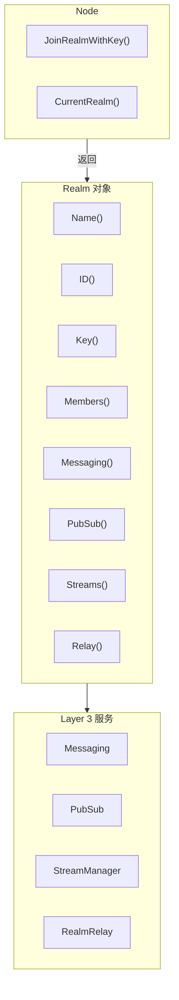
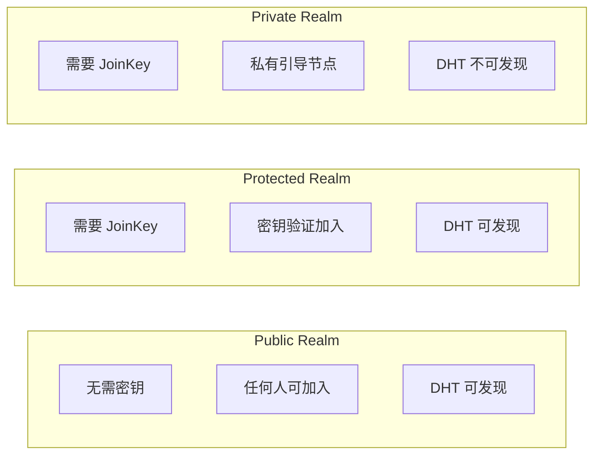
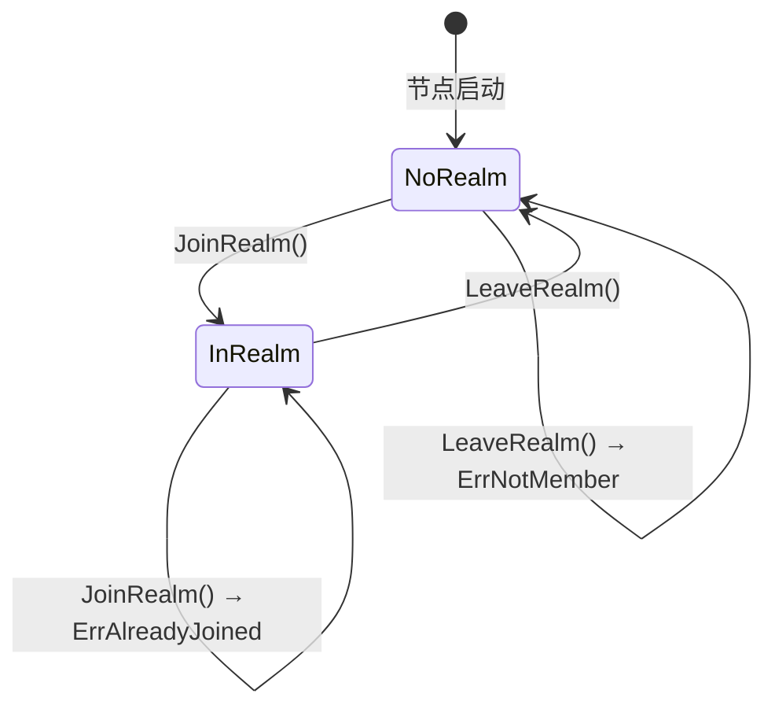

# Realm API（IMPL-1227 更新）

RealmManager 和 Realm 对象提供业务隔离域的管理功能，实现多租户隔离和 PSK 成员认证。

---

## 概述（IMPL-1227）



**IMPL-1227 核心变化**：
- `JoinRealmWithKey()` 返回 `Realm` 对象（而非 error）
- 所有 Layer 3 服务从 `Realm` 对象获取
- 使用 `realmKey` (32字节 PSK) 进行成员认证
- `RealmID` 从 `realmKey` 哈希派生，不可枚举
- 协议 ID 自动添加 Realm 前缀

---

## 获取 RealmManager

通过 Node 的 `Realm()` 方法获取：

```go
realmMgr := node.Realm()
```

---

## Realm 成员管理 API（IMPL-1227 更新）

### JoinRealmWithKey（推荐）

使用 realmKey 加入指定 Realm。

```go
func (m RealmManager) JoinRealmWithKey(ctx context.Context, name string, realmKey types.RealmKey, opts ...RealmOption) (Realm, error)
```

**参数**：
| 参数 | 类型 | 描述 |
|------|------|------|
| `ctx` | `context.Context` | 上下文 |
| `name` | `string` | Realm 显示名称 |
| `realmKey` | `types.RealmKey` | 32字节 PSK 密钥 |
| `opts` | `...RealmOption` | 加入选项 |

**返回值**：
| 类型 | 描述 |
|------|------|
| `Realm` | Realm 对象（用于获取 Layer 3 服务） |
| `error` | 错误信息 |

**说明**：
- `realmKey` 是 32 字节的高熵随机数，用于 PSK 成员认证
- `RealmID` 从 `realmKey` 哈希派生：`SHA256("dep2p-realm-id-v1" || H(realmKey))`
- 相同 `realmKey` 派生相同 `RealmID`，只有持有 `realmKey` 的节点才能加入
- 如果已加入其他 Realm，返回 `ErrAlreadyJoined`

**示例**：

```go
// 生成 realmKey（首次创建 Realm）
realmKey := types.GenerateRealmKey()
fmt.Printf("RealmKey: %s\n", realmKey.String()) // 保存并分享给成员

// 或从配置读取已有的 realmKey
realmKey, _ := types.RealmKeyFromHex("abcdef1234...")

// 加入 Realm
realm, err := node.JoinRealmWithKey(ctx, "my-business-network", realmKey)
if err != nil {
    if errors.Is(err, realm.ErrAlreadyJoined) {
        log.Println("已加入其他 Realm，请先离开")
    }
    return
}

// 使用 Realm 对象获取服务
fmt.Printf("已加入 Realm: %s (ID: %s)\n", realm.Name(), realm.ID())
messaging := realm.Messaging()
pubsub := realm.PubSub()
```

### JoinRealm

加入指定 Realm（使用 Option 提供 realmKey）。

```go
func (m RealmManager) JoinRealm(ctx context.Context, name string, opts ...RealmOption) (Realm, error)
```

**示例**：

```go
realm, err := node.Realm().JoinRealm(ctx, "my-realm",
    dep2p.WithRealmKey(realmKey),
)
```

---

### LeaveRealm

离开当前 Realm。

```go
func (m RealmManager) LeaveRealm() error
```

**返回值**：
| 类型 | 描述 |
|------|------|
| `error` | 错误信息 |

**说明**：
- 会向 Realm 内邻居发送 Goodbye 消息
- 如果未加入任何 Realm，返回 `ErrNotMember`

**示例**：

```go
if err := node.Realm().LeaveRealm(); err != nil {
    if errors.Is(err, realm.ErrNotMember) {
        log.Println("未加入任何 Realm")
    }
}
```

---

### CurrentRealm（IMPL-1227 更新）

返回当前 Realm 对象。

```go
func (m RealmManager) CurrentRealm() Realm
```

**返回值**：
| 类型 | 描述 |
|------|------|
| `Realm` | 当前 Realm 对象，未加入时返回 nil |

**示例**：

```go
realm := node.Realm().CurrentRealm()
if realm == nil {
    fmt.Println("未加入任何 Realm")
} else {
    fmt.Printf("当前 Realm: %s (ID: %s)\n", realm.Name(), realm.ID())
    fmt.Printf("成员数: %d\n", realm.MemberCount())
    
    // 获取 Layer 3 服务
    messaging := realm.Messaging()
    pubsub := realm.PubSub()
}
```

---

### IsMember

检查是否已加入 Realm。

```go
func (m RealmManager) IsMember() bool
```

**返回值**：
| 类型 | 描述 |
|------|------|
| `bool` | 是否已加入某个 Realm |

**示例**：

```go
if node.Realm().IsMember() {
    fmt.Println("已加入 Realm")
}
```

---

## Realm 对象接口（IMPL-1227 新增）

`Realm` 对象是 IMPL-1227 的核心变化，所有 Layer 3 服务都从此对象获取。

### Realm 接口

```go
type Realm interface {
    // 基本信息
    Name() string           // 显示名称
    ID() types.RealmID      // 唯一标识（从 realmKey 派生）
    Key() types.RealmKey    // Realm 密钥
    
    // 成员信息
    Members() []types.NodeID    // 已知成员列表
    MemberCount() int           // 成员数量
    
    // Layer 3 服务获取
    Messaging() Messaging           // 消息服务
    PubSub() PubSub                 // 发布订阅服务
    Streams() StreamManager         // 流管理服务
    Discovery() RealmDiscovery      // Realm 内发现服务
    Relay() RealmRelayService       // Realm 中继服务
    
    // PSK 认证
    PSKAuth() PSKAuthenticator      // PSK 成员验证器
    
    // 生命周期
    Leave() error           // 离开 Realm
    Context() context.Context   // Realm 上下文
}
```

### Messaging 服务

```go
type Messaging interface {
    Send(ctx context.Context, to types.NodeID, data []byte) error
    SendWithProtocol(ctx context.Context, to types.NodeID, protocol string, data []byte) error
    Request(ctx context.Context, to types.NodeID, data []byte) ([]byte, error)
    RequestWithProtocol(ctx context.Context, to types.NodeID, protocol string, data []byte) ([]byte, error)
    OnProtocol(protocol string, handler ProtocolHandler) error
}
```

**示例**：

```go
messaging := realm.Messaging()

// 发送消息（使用默认协议）
messaging.Send(ctx, targetID, []byte("Hello"))

// 发送消息（指定协议，自动添加 Realm 前缀）
messaging.SendWithProtocol(ctx, targetID, "chat/1.0.0", []byte("Hello"))
// 实际协议: /dep2p/app/<realmID>/chat/1.0.0

// 请求-响应
resp, _ := messaging.RequestWithProtocol(ctx, targetID, "rpc/1.0.0", requestData)

// 注册处理器
messaging.OnProtocol("handler/1.0.0", func(from types.NodeID, proto string, data []byte) ([]byte, error) {
    return []byte("response"), nil
})
```

### PubSub 服务

```go
type PubSub interface {
    Join(ctx context.Context, topic string) (Topic, error)
    Publish(ctx context.Context, topic string, data []byte) error
    Subscribe(ctx context.Context, topic string) (Subscription, error)
}

type Topic interface {
    Publish(ctx context.Context, data []byte) error
    Subscribe() (Subscription, error)
    Close() error
}

type Subscription interface {
    Messages() <-chan *PubSubMessage
    Cancel()
}
```

**示例**：

```go
pubsub := realm.PubSub()

// 加入主题（自动添加 Realm 前缀）
topic, _ := pubsub.Join(ctx, "news")
// 实际主题: /dep2p/app/<realmID>/news

// 发布消息
topic.Publish(ctx, []byte("Breaking news!"))

// 订阅消息
sub, _ := topic.Subscribe()
for msg := range sub.Messages() {
    fmt.Printf("From %s: %s\n", msg.From, msg.Data)
}
```

### RealmRelayService

```go
type RealmRelayService interface {
    Serve() error           // 开始提供 Realm 中继服务
    StopServing() error     // 停止提供服务
    Stats() RelayStats      // 获取统计信息
    FindRelays(ctx context.Context) ([]RelayInfo, error)  // 发现可用中继
}
```

**示例**：

```go
relay := realm.Relay()

// 成为 Realm 中继节点
relay.Serve()

// 查看统计
stats := relay.Stats()
fmt.Printf("活跃电路: %d\n", stats.ActiveCircuits)
```

## Realm 成员信息 API

### Members

返回 Realm 内的成员列表。

```go
func (r Realm) Members() []types.NodeID
```

**返回值**：
| 类型 | 描述 |
|------|------|
| `[]types.NodeID` | 节点 ID 列表 |

**示例**：

```go
realm := node.CurrentRealm()
members := realm.Members()
fmt.Printf("Realm 内有 %d 个成员\n", len(members))
for _, member := range members {
    fmt.Printf("  - %s\n", member.ShortString())
}
```

### MemberCount

返回 Realm 内的成员数量。

```go
func (r Realm) MemberCount() int
```

**返回值**：
| 类型 | 描述 |
|------|------|
| `int` | 成员数量 |

---

## Realm 元数据 API

### RealmMetadata

返回 Realm 元数据。

```go
func (m RealmManager) RealmMetadata() (*types.RealmMetadata, error)
```

**返回值**：
| 类型 | 描述 |
|------|------|
| `*RealmMetadata` | Realm 元数据 |
| `error` | 错误信息 |

---

## JoinOption 选项

### WithJoinKey

提供加入密钥（用于 Protected/Private Realm）。

```go
func WithJoinKey(key []byte) JoinOption
```

**示例**：

```go
node.Realm().JoinRealm(ctx, realmID, realm.WithJoinKey([]byte("secret")))
```

---

### WithTimeout

设置加入超时时间。

```go
func WithTimeout(d time.Duration) JoinOption
```

**示例**：

```go
node.Realm().JoinRealm(ctx, realmID, realm.WithTimeout(30*time.Second))
```

---

### WithPrivateBootstrapPeers

指定私有引导节点（用于 Private Realm）。

```go
func WithPrivateBootstrapPeers(peers []string) JoinOption
```

**示例**：

```go
bootstrapAddrs := []string{
    "/ip4/192.168.1.100/udp/4001/quic-v1/p2p/12D3KooW...",
}
node.Realm().JoinRealm(ctx, realmID,
    realm.WithPrivateBootstrapPeers(bootstrapAddrs),
)
```

---

### WithSkipDHTRegistration

跳过 DHT 注册（用于 Private Realm）。

```go
func WithSkipDHTRegistration() JoinOption
```

**示例**：

```go
node.Realm().JoinRealm(ctx, realmID,
    realm.WithPrivateBootstrapPeers(addrs),
    realm.WithSkipDHTRegistration(),
)
```

---

## Realm 类型



### Public Realm

- 无需密钥
- 任何人可加入
- 在公共 DHT 中注册

**使用场景**：公开聊天室、公共服务

```go
node.Realm().JoinRealm(ctx, types.RealmID("public-chat"))
```

---

### Protected Realm

- 需要 JoinKey
- 密钥验证后加入
- 在公共 DHT 中注册

**使用场景**：付费服务、会员专区

```go
node.Realm().JoinRealm(ctx,
    types.RealmID("premium-service"),
    realm.WithJoinKey(membershipKey),
)
```

---

### Private Realm

- 需要 JoinKey
- 使用私有引导节点
- 不在公共 DHT 中注册

**使用场景**：企业内网、私密通信

```go
node.Realm().JoinRealm(ctx,
    types.RealmID("company-internal"),
    realm.WithJoinKey(employeeKey),
    realm.WithPrivateBootstrapPeers(internalBootstraps),
    realm.WithSkipDHTRegistration(),
)
```

---

## Realm 状态转换



---

## 错误处理

| 错误 | 描述 | 解决方案 |
|------|------|----------|
| `ErrNotMember` | 未加入任何 Realm | 先调用 `JoinRealm()` |
| `ErrAlreadyJoined` | 已加入其他 Realm | 先调用 `LeaveRealm()` |
| `ErrInvalidJoinKey` | JoinKey 无效 | 检查密钥是否正确 |
| `ErrRealmNotFound` | Realm 不存在 | 检查 RealmID 是否正确 |

**示例**：

```go
err := node.Realm().JoinRealm(ctx, realmID)
if err != nil {
    switch {
    case errors.Is(err, realm.ErrAlreadyJoined):
        // 先离开当前 Realm
        node.Realm().LeaveRealm()
        node.Realm().JoinRealm(ctx, realmID)
    case errors.Is(err, realm.ErrInvalidJoinKey):
        log.Println("密钥错误")
    default:
        log.Printf("加入失败: %v", err)
    }
}
```

---

## 方法列表

| 方法 | 分类 | 描述 |
|------|------|------|
| `JoinRealm()` | 成员管理 | 加入 Realm |
| `LeaveRealm()` | 成员管理 | 离开 Realm |
| `CurrentRealm()` | 成员管理 | 返回当前 Realm |
| `IsMember()` | 成员管理 | 检查是否已加入 |
| `IsMemberOf()` | 成员管理 | 检查是否是指定成员 |
| `RealmPeers()` | 节点管理 | 返回节点列表 |
| `RealmPeerCount()` | 节点管理 | 返回节点数量 |
| `RealmMetadata()` | 元数据 | 返回元数据 |

---

## RealmMetadata 结构

```go
type RealmMetadata struct {
    ID          RealmID     // Realm ID
    Name        string      // 可读名称
    Creator     NodeID      // 创建者
    AccessLevel AccessLevel // 访问级别
    CreatedAt   time.Time   // 创建时间
    Description string      // 描述
    Signature   []byte      // 创建者签名
}

type AccessLevel int

const (
    Public    AccessLevel = 0  // 公开
    Protected AccessLevel = 1  // 受保护
    Private   AccessLevel = 2  // 私有
)
```

---

## 配置参数

| 参数名 | 类型 | 默认值 | 描述 |
|--------|------|--------|------|
| `Enable` | bool | `true` | 启用 Realm 管理 |
| `AutoJoin` | bool | `false` | 不自动加入任何业务 Realm |
| `RealmAuthEnabled` | bool | `true` | 启用 RealmAuth 协议 |
| `RealmAuthTimeout` | Duration | `10s` | RealmAuth 超时 |
| `JoinProofTTL` | Duration | `24h` | JoinProof 有效期 |
| `MemberCacheSize` | int | `10000` | 成员缓存大小 |
| `MemberCacheTTL` | Duration | `5m` | 成员缓存 TTL |

---

## 相关文档

- [Node API](node.md)
- [Messaging API](messaging.md)
- [加入 Realm 教程](../../getting-started/first-realm.md)
