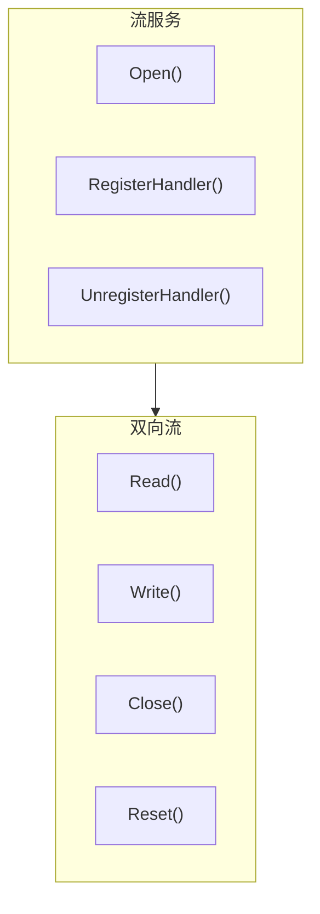

# Streams API

Streams 服务提供原始的双向流通信能力。

---

## 概述



Streams 支持：
- **打开流**：向指定节点打开双向流
- **流处理器**：注册协议处理器接收入站流
- **原始 I/O**：直接读写字节流

> **获取方式**：通过 `realm.Streams()` 获取 Streams 服务。

---

## 获取 Streams 服务

```go
realm, _ := node.Realm("my-realm")
_ = realm.Join(ctx)
streams := realm.Streams()
```

---

## Streams API

### Open

打开到指定节点的流。

```go
func (s *Streams) Open(ctx context.Context, peerID string, protocol string) (BiStream, error)
```

**参数**：
| 参数 | 类型 | 描述 |
|------|------|------|
| `ctx` | `context.Context` | 上下文 |
| `peerID` | `string` | 目标节点 ID |
| `protocol` | `string` | 协议 ID |

**返回值**：
| 类型 | 描述 |
|------|------|
| `BiStream` | 双向流对象 |
| `error` | 错误信息 |

**说明**：
- 流是双向的，可以同时读写
- 协议 ID 会自动添加 Realm 前缀

**示例**：

```go
streams := realm.Streams()

// 打开流
stream, err := streams.Open(ctx, targetPeerID, "/myapp/file-transfer/1.0.0")
if err != nil {
    log.Fatal(err)
}
defer stream.Close()

// 发送数据
stream.Write([]byte("Hello"))

// 接收响应
buf := make([]byte, 1024)
n, _ := stream.Read(buf)
fmt.Printf("收到: %s\n", buf[:n])
```

---

### RegisterHandler

注册流处理器。

```go
func (s *Streams) RegisterHandler(protocol string, handler BiStreamHandler) error
```

**参数**：
| 参数 | 类型 | 描述 |
|------|------|------|
| `protocol` | `string` | 协议 ID |
| `handler` | `BiStreamHandler` | 流处理函数 |

**BiStreamHandler 类型**：

```go
type BiStreamHandler func(stream BiStream)
```

**说明**：
- 当收到对应协议的入站流时，会调用此处理器
- 处理器在新 goroutine 中执行
- 处理器负责关闭流

**示例**：

```go
streams := realm.Streams()

// 注册 Echo 处理器
err := streams.RegisterHandler("/myapp/echo/1.0.0", func(stream interfaces.BiStream) {
    defer stream.Close()
    
    // 读取数据
    buf := make([]byte, 4096)
    n, err := stream.Read(buf)
    if err != nil {
        return
    }
    
    // Echo 回去
    stream.Write(buf[:n])
})
if err != nil {
    log.Fatal(err)
}
```

---

### UnregisterHandler

注销流处理器。

```go
func (s *Streams) UnregisterHandler(protocol string) error
```

**参数**：
| 参数 | 类型 | 描述 |
|------|------|------|
| `protocol` | `string` | 协议 ID |

---

## BiStream API

BiStream 实现了 `io.Reader`、`io.Writer` 和 `io.Closer` 接口。

### Read

从流读取数据。

```go
func (s BiStream) Read(p []byte) (n int, err error)
```

---

### Write

向流写入数据。

```go
func (s BiStream) Write(p []byte) (n int, err error)
```

---

### Close

关闭流（正常关闭）。

```go
func (s BiStream) Close() error
```

**说明**：
- 正常关闭，发送 FIN 信号
- 对方会收到 EOF

---

### Reset

重置流（异常关闭）。

```go
func (s BiStream) Reset() error
```

**说明**：
- 异常关闭，发送 RST 信号
- 对方会收到错误

---

### CloseRead

关闭读端。

```go
func (s BiStream) CloseRead() error
```

**说明**：
- 半关闭，只关闭读端
- 仍可以写入数据

---

### CloseWrite

关闭写端。

```go
func (s BiStream) CloseWrite() error
```

**说明**：
- 半关闭，只关闭写端
- 仍可以读取数据

---

### Protocol

返回流使用的协议。

```go
func (s BiStream) Protocol() string
```

---

### RemotePeer

返回远端节点 ID。

```go
func (s BiStream) RemotePeer() string
```

**说明**：
- 如果连接已断开，可能返回空字符串
- 调用者应检查返回值

---

### SetDeadline

设置读写超时。

```go
func (s BiStream) SetDeadline(t time.Time) error
```

**参数**：
| 参数 | 类型 | 描述 |
|------|------|------|
| `t` | `time.Time` | 截止时间，零值表示不超时 |

**说明**：
- 设置读和写操作的截止时间
- 超时后，Read 和 Write 会返回错误
- 对于长时间运行的流，建议设置超时以避免 goroutine 泄漏

---

### SetReadDeadline

设置读超时。

```go
func (s BiStream) SetReadDeadline(t time.Time) error
```

---

### SetWriteDeadline

设置写超时。

```go
func (s BiStream) SetWriteDeadline(t time.Time) error
```

---

### Stat

返回流统计信息。

```go
func (s BiStream) Stat() StreamStat
```

**StreamStat 结构**：

```go
type StreamStat struct {
    Direction Direction     // 流方向
    Opened    int64         // 流打开时间（Unix 纳秒）
    Protocol  string        // 使用的协议
}
```

---

## 方法列表

### Streams 方法

| 方法 | 描述 |
|------|------|
| `Open()` | 打开到指定节点的流 |
| `RegisterHandler()` | 注册流处理器 |
| `UnregisterHandler()` | 注销流处理器 |
| `Close()` | 关闭服务 |

### BiStream 方法

| 方法 | 描述 |
|------|------|
| `Read()` | 读取数据 |
| `Write()` | 写入数据 |
| `Close()` | 正常关闭流 |
| `Reset()` | 异常关闭流 |
| `CloseRead()` | 关闭读端 |
| `CloseWrite()` | 关闭写端 |
| `Protocol()` | 返回协议 |
| `RemotePeer()` | 返回远端节点 ID |
| `SetDeadline()` | 设置读写超时 |
| `SetReadDeadline()` | 设置读超时 |
| `SetWriteDeadline()` | 设置写超时 |
| `Stat()` | 返回统计信息 |

---

## 使用场景

### 文件传输

```go
streams := realm.Streams()

// 发送方
stream, _ := streams.Open(ctx, targetPeerID, "/myapp/file/1.0.0")
defer stream.Close()

// 发送文件名和大小
header := FileHeader{Name: "test.txt", Size: fileSize}
headerData, _ := json.Marshal(header)
stream.Write(headerData)

// 发送文件内容
io.Copy(stream, file)
stream.CloseWrite()

// 等待确认
ack := make([]byte, 2)
stream.Read(ack)
```

```go
// 接收方
streams.RegisterHandler("/myapp/file/1.0.0", func(stream interfaces.BiStream) {
    defer stream.Close()
    
    // 读取文件头
    headerBuf := make([]byte, 1024)
    n, _ := stream.Read(headerBuf)
    var header FileHeader
    json.Unmarshal(headerBuf[:n], &header)
    
    // 接收文件内容
    file, _ := os.Create(header.Name)
    io.CopyN(file, stream, header.Size)
    file.Close()
    
    // 发送确认
    stream.Write([]byte("OK"))
})
```

### 双向通信

```go
streams := realm.Streams()

stream, _ := streams.Open(ctx, targetPeerID, "/myapp/chat/1.0.0")
defer stream.Close()

// 设置超时
stream.SetDeadline(time.Now().Add(5 * time.Minute))

// 发送和接收循环
go func() {
    for {
        msg := <-outgoing
        stream.Write(msg)
    }
}()

for {
    buf := make([]byte, 4096)
    n, err := stream.Read(buf)
    if err != nil {
        break
    }
    incoming <- buf[:n]
}
```

---

## 最佳实践

### 超时设置

```go
// 始终设置超时
stream.SetDeadline(time.Now().Add(30 * time.Second))

// 或分别设置
stream.SetReadDeadline(time.Now().Add(10 * time.Second))
stream.SetWriteDeadline(time.Now().Add(10 * time.Second))
```

### 资源清理

```go
// 使用 defer 确保关闭
stream, _ := streams.Open(ctx, peerID, protocol)
defer stream.Close()

// 或在错误时使用 Reset
if err != nil {
    stream.Reset()
    return
}
```

### 半关闭模式

```go
// 发送完毕后半关闭写端
stream.Write(data)
stream.CloseWrite()

// 继续读取响应
response, _ := io.ReadAll(stream)
```

---

## 相关文档

- [Realm API](realm.md)
- [Messaging API](messaging.md)
- [协议 ID 规范](../protocol-ids.md)
