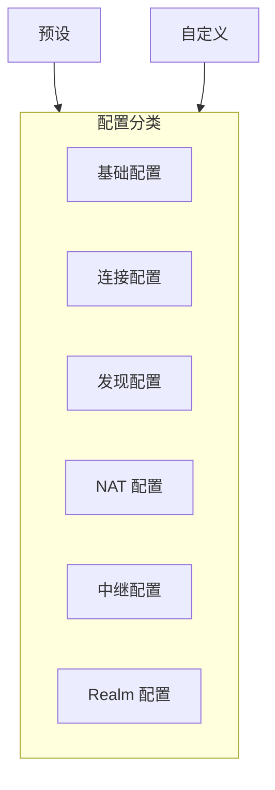

# 配置项参考

本文档详细说明 DeP2P 的所有配置选项。

---

## 概述



DeP2P 使用函数式选项模式进行配置：

```go
node, err := dep2p.StartNode(ctx,
    dep2p.WithPreset(dep2p.PresetDesktop),
    dep2p.WithListenPort(4001),
    dep2p.WithBootstrapPeers(bootstrapAddrs...),
)
```

---

## 基础配置

### WithPreset

使用预设配置。

```go
func WithPreset(preset Preset) Option
```

**参数**：
| 值 | 描述 |
|---|------|
| `PresetMinimal` | 最小配置 |
| `PresetDesktop` | 桌面应用 |
| `PresetServer` | 服务器 |
| `PresetMobile` | 移动端 |

**示例**：

```go
node, _ := dep2p.StartNode(ctx, dep2p.WithPreset(dep2p.PresetDesktop))
```

---

### WithIdentity

设置节点身份。

```go
func WithIdentity(identity crypto.PrivKey) Option
```

**说明**：
- 如果不设置，自动生成新身份
- 相同私钥产生相同 NodeID

**示例**：

```go
// 使用现有私钥
privKey, _ := crypto.UnmarshalPrivateKey(keyBytes)
node, _ := dep2p.StartNode(ctx, dep2p.WithIdentity(privKey))

// 从文件加载
key, _ := dep2p.LoadIdentity("node.key")
node, _ := dep2p.StartNode(ctx, dep2p.WithIdentity(key))
```

---

### WithListenPort

设置监听端口。

```go
func WithListenPort(port int) Option
```

**说明**：
- 默认使用随机端口
- 端口 0 表示随机分配

**示例**：

```go
node, _ := dep2p.StartNode(ctx, dep2p.WithListenPort(4001))
```

---

### WithListenAddrs

设置监听地址。

```go
func WithListenAddrs(addrs ...string) Option
```

**说明**：
- 支持多个监听地址
- 支持 IPv4 和 IPv6

**示例**：

```go
node, _ := dep2p.StartNode(ctx,
    dep2p.WithListenAddrs(
        "/ip4/0.0.0.0/udp/4001/quic-v1",
        "/ip6/::/udp/4001/quic-v1",
    ),
)
```

---

## 连接配置

### WithConnectionLimits

设置连接数限制。

```go
func WithConnectionLimits(low, high int) Option
```

**参数**：
| 参数 | 描述 |
|------|------|
| `low` | 低水位（不主动裁剪） |
| `high` | 高水位（开始裁剪） |

**示例**：

```go
node, _ := dep2p.StartNode(ctx,
    dep2p.WithConnectionLimits(50, 100),
)
```

---

### WithConnectionTimeout

设置连接超时。

```go
func WithConnectionTimeout(d time.Duration) Option
```

**示例**：

```go
node, _ := dep2p.StartNode(ctx,
    dep2p.WithConnectionTimeout(30*time.Second),
)
```

---

### WithIdleTimeout

设置空闲连接超时。

```go
func WithIdleTimeout(d time.Duration) Option
```

**说明**：
- 超过此时间无数据传输的连接将被关闭

**示例**：

```go
node, _ := dep2p.StartNode(ctx,
    dep2p.WithIdleTimeout(5*time.Minute),
)
```

---

## 发现配置

### WithBootstrapPeers

设置引导节点。

```go
func WithBootstrapPeers(addrs ...string) Option
```

**说明**：
- 使用完整地址格式（含 /p2p/<NodeID>）
- 可配置多个引导节点

**示例**：

```go
bootstrapAddrs := []string{
    "/ip4/104.131.131.82/udp/4001/quic-v1/p2p/QmaCpDMGvV2BGHeYERUEnRQAwe3N8SzbUtfsmvsqQLuvuJ",
    "/dnsaddr/bootstrap.dep2p.io/p2p/12D3KooWLQj...",
}
node, _ := dep2p.StartNode(ctx,
    dep2p.WithBootstrapPeers(bootstrapAddrs...),
)
```

---

### WithDHT

启用/配置 DHT。

```go
func WithDHT(mode DHTMode) Option
```

**参数**：
| 值 | 描述 |
|---|------|
| `DHTClient` | 仅客户端模式 |
| `DHTServer` | 服务器模式 |
| `DHTAuto` | 自动模式 |

**示例**：

```go
node, _ := dep2p.StartNode(ctx,
    dep2p.WithDHT(dep2p.DHTServer),
)
```

---

### WithMDNS

启用 mDNS 本地发现。

```go
func WithMDNS(enabled bool) Option
```

**说明**：
- 仅在局域网内有效
- 默认桌面预设启用

**示例**：

```go
node, _ := dep2p.StartNode(ctx,
    dep2p.WithMDNS(true),
)
```

---

## NAT 配置

### WithNAT

启用 NAT 穿透。

```go
func WithNAT(enabled bool) Option
```

**示例**：

```go
node, _ := dep2p.StartNode(ctx,
    dep2p.WithNAT(true),
)
```

---

### WithAutoNAT

启用 AutoNAT（自动检测公网可达性）。

```go
func WithAutoNAT(enabled bool) Option
```

---

### WithHolePunching

启用打洞。

```go
func WithHolePunching(enabled bool) Option
```

---

### WithExternalAddrs

声明外部地址。

```go
func WithExternalAddrs(addrs ...string) Option
```

**说明**：
- 适用于已知公网 IP 的场景
- 跳过 NAT 检测

**示例**：

```go
node, _ := dep2p.StartNode(ctx,
    dep2p.WithExternalAddrs("/ip4/203.0.113.1/udp/4001/quic-v1"),
)
```

---

### WithSTUNServers

设置 STUN 服务器。

```go
func WithSTUNServers(servers ...string) Option
```

**示例**：

```go
node, _ := dep2p.StartNode(ctx,
    dep2p.WithSTUNServers(
        "stun.l.google.com:19302",
        "stun.dep2p.io:3478",
    ),
)
```

---

## 中继配置

### WithRelay

启用中继客户端。

```go
func WithRelay(enabled bool) Option
```

**说明**：
- 允许通过中继节点连接
- 默认启用

---

### WithAutoRelay

启用自动中继。

```go
func WithAutoRelay(enabled bool) Option
```

**说明**：
- 自动发现并使用中继节点
- 建议 NAT 后节点启用

---

### WithRelayServer

启用中继服务器。

```go
func WithRelayServer(enabled bool) Option
```

**说明**：
- 作为中继节点为其他节点提供服务
- 需要公网 IP

**示例**：

```go
// 配置为中继服务器
node, _ := dep2p.StartNode(ctx,
    dep2p.WithPreset(dep2p.PresetServer),
    dep2p.WithRelayServer(true),
    dep2p.WithListenPort(4001),
)
```

---

### WithStaticRelays

设置静态中继节点。

```go
func WithStaticRelays(addrs ...string) Option
```

**说明**：
- 优先使用指定的中继节点
- 适用于私有部署

**示例**：

```go
node, _ := dep2p.StartNode(ctx,
    dep2p.WithStaticRelays(
        "/ip4/relay1.example.com/udp/4001/quic-v1/p2p/12D3KooW...",
    ),
)
```

---

## Realm 配置

### WithRealmAuth

启用 Realm 认证。

```go
func WithRealmAuth(enabled bool) Option
```

---

### WithRealmAuthTimeout

设置 Realm 认证超时。

```go
func WithRealmAuthTimeout(d time.Duration) Option
```

---

## 配置参数表

### 基础配置

| 选项 | 类型 | 默认值 | 描述 |
|------|------|--------|------|
| `WithPreset` | `Preset` | - | 使用预设配置 |
| `WithIdentity` | `crypto.PrivKey` | 自动生成 | 节点身份 |
| `WithListenPort` | `int` | 随机 | 监听端口 |
| `WithListenAddrs` | `[]string` | 默认地址 | 监听地址列表 |

### 连接配置

| 选项 | 类型 | 默认值 | 描述 |
|------|------|--------|------|
| `WithConnectionLimits` | `int, int` | 见预设 | 连接数限制 |
| `WithConnectionTimeout` | `Duration` | `30s` | 连接超时 |
| `WithIdleTimeout` | `Duration` | `5m` | 空闲超时 |

### 发现配置

| 选项 | 类型 | 默认值 | 描述 |
|------|------|--------|------|
| `WithBootstrapPeers` | `[]string` | 公共节点 | 引导节点 |
| `WithDHT` | `DHTMode` | `DHTClient` | DHT 模式 |
| `WithMDNS` | `bool` | 见预设 | mDNS 发现 |

### NAT 配置

| 选项 | 类型 | 默认值 | 描述 |
|------|------|--------|------|
| `WithNAT` | `bool` | `true` | 启用 NAT |
| `WithAutoNAT` | `bool` | `true` | 自动 NAT |
| `WithHolePunching` | `bool` | `true` | 打洞 |
| `WithExternalAddrs` | `[]string` | - | 外部地址 |
| `WithSTUNServers` | `[]string` | 公共服务器 | STUN 服务器 |

### 中继配置

| 选项 | 类型 | 默认值 | 描述 |
|------|------|--------|------|
| `WithRelay` | `bool` | `true` | 中继客户端 |
| `WithAutoRelay` | `bool` | `true` | 自动中继 |
| `WithRelayServer` | `bool` | `false` | 中继服务器 |
| `WithStaticRelays` | `[]string` | - | 静态中继 |

---

## 配置示例

### 最小配置

```go
node, _ := dep2p.StartNode(ctx)
```

### 桌面应用

```go
node, _ := dep2p.StartNode(ctx,
    dep2p.WithPreset(dep2p.PresetDesktop),
    dep2p.WithMDNS(true),
)
```

### 服务器配置

```go
node, _ := dep2p.StartNode(ctx,
    dep2p.WithPreset(dep2p.PresetServer),
    dep2p.WithListenPort(4001),
    dep2p.WithDHT(dep2p.DHTServer),
    dep2p.WithRelayServer(true),
)
```

### 移动端配置

```go
node, _ := dep2p.StartNode(ctx,
    dep2p.WithPreset(dep2p.PresetMobile),
    dep2p.WithAutoRelay(true),
)
```

### 私有网络

```go
node, _ := dep2p.StartNode(ctx,
    dep2p.WithBootstrapPeers(privateBootstraps...),
    dep2p.WithStaticRelays(privateRelays...),
    dep2p.WithMDNS(false),  // 禁用公共发现
)
```

---

## 相关文档

- [预设配置](presets.md)
- [Node API](api/node.md)
- [快速开始](../getting-started/quickstart.md)
