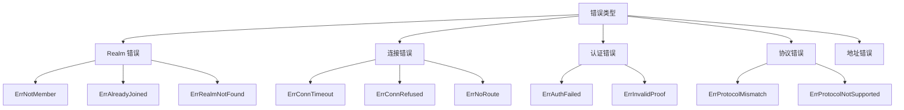

# 错误码参考

本文档列出 DeP2P 的所有错误类型，包括触发条件、根因分析和解决方案。

---

## 错误分类



---

## Realm 错误

### ErrNotMember

**描述**：节点未加入 Realm 就尝试使用业务 API。

| 项目 | 内容 |
|------|------|
| **错误类型** | `realm.ErrNotMember` |
| **触发条件** | 调用 `Send()`, `Request()`, `Publish()` 等业务 API 前未调用 `JoinRealm()` |
| **根因** | DeP2P 要求显式加入 Realm 后才能使用业务功能 |

**解决方案**：

```go
// ❌ 错误
node, _ := dep2p.StartNode(ctx, dep2p.WithPreset(dep2p.PresetDesktop))
err := node.Send(ctx, targetID, "/myapp/1.0.0", data)
// err = ErrNotMember

// ✓ 正确
node, _ := dep2p.StartNode(ctx, dep2p.WithPreset(dep2p.PresetDesktop))
realm, _ := node.JoinRealmWithKey(ctx, "my-realm", realmKey)  // 先加入
messaging := realm.Messaging()
err := messaging.Send(ctx, targetID, "/myapp/1.0.0", data)    // 再使用
```

---

### ErrAlreadyJoined

**描述**：节点已加入 Realm，再次尝试加入同一 Realm。

| 项目 | 内容 |
|------|------|
| **错误类型** | `realm.ErrAlreadyJoined` |
| **触发条件** | 对已加入的 Realm 重复调用 `JoinRealm()` |
| **根因** | 单 Realm 模式下，节点同时只能加入一个 Realm |

**解决方案**：

```go
// ❌ 错误
node.JoinRealmWithKey(ctx, "realm-a", key)
node.JoinRealmWithKey(ctx, "realm-a", key)  // ErrAlreadyJoined

// ✓ 正确：检查当前状态
if node.CurrentRealm() == nil {
    node.JoinRealmWithKey(ctx, "realm-a", key)
}

// ✓ 或者：先离开再加入
node.LeaveRealm(ctx)
node.JoinRealmWithKey(ctx, "realm-b", keyB)
```

---

### ErrRealmNotFound

**描述**：请求的 Realm 不存在或无法访问。

| 项目 | 内容 |
|------|------|
| **错误类型** | `realm.ErrRealmNotFound` |
| **触发条件** | 尝试加入不存在的 Realm |
| **根因** | RealmID 错误或网络中无该 Realm 成员 |

**解决方案**：

```go
// 检查 RealmID 是否正确
// 确保网络中有其他成员在线
// 检查 Bootstrap 配置
```

---

## 连接错误

### ErrConnectionTimeout

**描述**：连接超时。

| 项目 | 内容 |
|------|------|
| **错误类型** | `context deadline exceeded` |
| **触发条件** | 在指定时间内无法建立连接 |
| **根因** | 网络延迟、防火墙阻止、目标离线 |

**解决方案**：

```go
// 1. 增加超时时间
ctx, cancel := context.WithTimeout(context.Background(), 30*time.Second)
defer cancel()
conn, err := node.Connect(ctx, targetID)

// 2. 检查网络
// - 确认目标节点在线
// - 检查防火墙设置
// - 尝试使用 Relay
```

---

### ErrConnectionRefused

**描述**：连接被拒绝。

| 项目 | 内容 |
|------|------|
| **错误类型** | `connection refused` |
| **触发条件** | 目标节点拒绝连接 |
| **根因** | 目标节点未运行、端口错误、被拒绝列表 |

**解决方案**：

```go
// 1. 确认目标节点正在运行
// 2. 检查端口是否正确
// 3. 检查是否被加入黑名单
```

---

### ErrNoRoute

**描述**：无法路由到目标。

| 项目 | 内容 |
|------|------|
| **错误类型** | `no route to host` |
| **触发条件** | 无法找到到达目标的路径 |
| **根因** | NAT 阻止、无可用地址、Relay 不可用 |

**解决方案**：

```go
// 1. 启用 Relay
node, _ := dep2p.StartNode(ctx,
    dep2p.WithPreset(dep2p.PresetDesktop),
    dep2p.WithRelay(true),
)

// 2. 检查 NAT 配置
// - 确认 UPnP 启用
// - 检查防火墙规则

// 3. 提供更多地址
node.AddAddresses(targetID, additionalAddrs)
```

---

## 认证错误

### ErrAuthFailed

**描述**：PSK 成员认证失败。

| 项目 | 内容 |
|------|------|
| **错误类型** | `realm.ErrAuthFailed` |
| **触发条件** | 对端使用不同的 RealmKey |
| **根因** | 成员间 realmKey 不一致 |

**解决方案**：

```go
// 确保所有成员使用相同的 realmKey
// realmKey 应该通过安全渠道分发

// 生成 realmKey
realmKey := types.GenerateRealmKey()
fmt.Printf("分享此 Key: %s\n", realmKey.String())

// 其他成员使用相同的 key
key, _ := types.ParseRealmKey(sharedKeyString)
realm, _ := node.JoinRealmWithKey(ctx, "my-realm", key)
```

---

### ErrInvalidProof

**描述**：成员证明无效。

| 项目 | 内容 |
|------|------|
| **错误类型** | `realm.ErrInvalidProof` |
| **触发条件** | 提供的成员证明无法验证 |
| **根因** | 证明过期、签名错误、密钥不匹配 |

**解决方案**：

```go
// 1. 确保 realmKey 正确
// 2. 检查时间同步（证明可能过期）
// 3. 重新加入 Realm 刷新证明
```

---

## 协议错误

### ErrProtocolMismatch

**描述**：协议版本不匹配。

| 项目 | 内容 |
|------|------|
| **错误类型** | `protocol mismatch` |
| **触发条件** | 双方协议版本不兼容 |
| **根因** | 使用了不同版本的协议 |

**解决方案**：

```go
// 1. 确认协议版本一致
// 2. 实现版本协商

// 发送方
messaging.SendWithProtocol(ctx, targetID, "myproto/1.0.0", data)

// 接收方也需要注册相同版本
messaging.OnProtocol("myproto/1.0.0", handler)
```

---

### ErrProtocolNotSupported

**描述**：协议不支持。

| 项目 | 内容 |
|------|------|
| **错误类型** | `protocol not supported` |
| **触发条件** | 对端未注册请求的协议 |
| **根因** | 协议未实现、协议 ID 错误 |

**解决方案**：

```go
// 1. 确认对端注册了协议
// 2. 检查协议 ID 格式

// ❌ 错误格式
messaging.SendWithProtocol(ctx, targetID, "myproto", data)

// ✓ 正确格式（包含版本）
messaging.SendWithProtocol(ctx, targetID, "myproto/1.0.0", data)
```

---

## 地址错误

### ErrInvalidAddress

**描述**：地址格式无效。

| 项目 | 内容 |
|------|------|
| **错误类型** | `invalid address` |
| **触发条件** | 提供的地址格式不正确 |
| **根因** | 缺少 `/p2p/<NodeID>` 后缀、格式错误 |

**解决方案**：

```go
// ❌ 错误：缺少 NodeID
addr := "/ip4/1.2.3.4/udp/4001/quic-v1"

// ✓ 正确：完整地址
addr := "/ip4/1.2.3.4/udp/4001/quic-v1/p2p/5Q2STWvBFn..."

// 获取正确的完整地址
addrs, _ := node.WaitShareableAddrs(ctx)
```

---

### ErrPeerIDMismatch

**描述**：NodeID 不匹配。

| 项目 | 内容 |
|------|------|
| **错误类型** | `peer id mismatch` |
| **触发条件** | 地址中的 NodeID 与实际节点不符 |
| **根因** | 地址过期、节点身份变更 |

**解决方案**：

```go
// 1. 获取最新的地址
addrs, _ := targetNode.WaitShareableAddrs(ctx)

// 2. 更新地址簿
node.AddAddresses(targetID, addrs)
```

---

## 错误处理最佳实践

### 分类处理

```go
switch {
case errors.Is(err, realm.ErrNotMember):
    // 需要先加入 Realm
    realm, _ := node.JoinRealmWithKey(ctx, "my-realm", key)
    // 重试操作

case errors.Is(err, realm.ErrAuthFailed):
    // 认证失败，检查 realmKey
    log.Error("realmKey 不匹配，请检查配置")

case errors.Is(err, context.DeadlineExceeded):
    // 超时，可能需要重试或使用 Relay
    log.Warn("连接超时，尝试使用 Relay")

default:
    log.Errorf("未知错误: %v", err)
}
```

### 重试策略

```go
func withRetry(ctx context.Context, fn func() error, maxRetries int) error {
    var lastErr error
    for i := 0; i < maxRetries; i++ {
        if err := fn(); err != nil {
            lastErr = err
            // 可重试的错误
            if errors.Is(err, context.DeadlineExceeded) {
                time.Sleep(time.Duration(i+1) * time.Second)
                continue
            }
            // 不可重试的错误
            if errors.Is(err, realm.ErrNotMember) {
                return err
            }
        }
        return nil
    }
    return lastErr
}
```

---

## 相关文档

- [API 默认行为与约束](api-defaults.md) - 核心约束说明
- [故障排查](../how-to/troubleshooting.md) - 诊断指南
- [常见问题 FAQ](../getting-started/faq.md) - 常见问题

