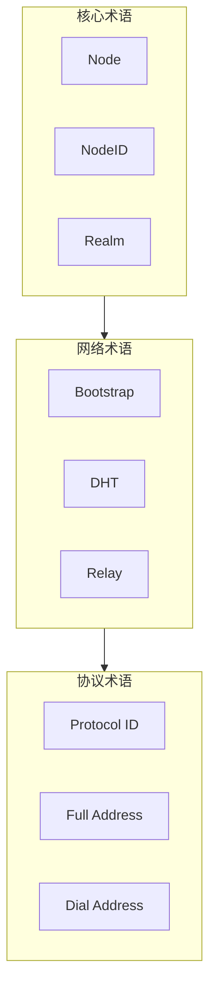
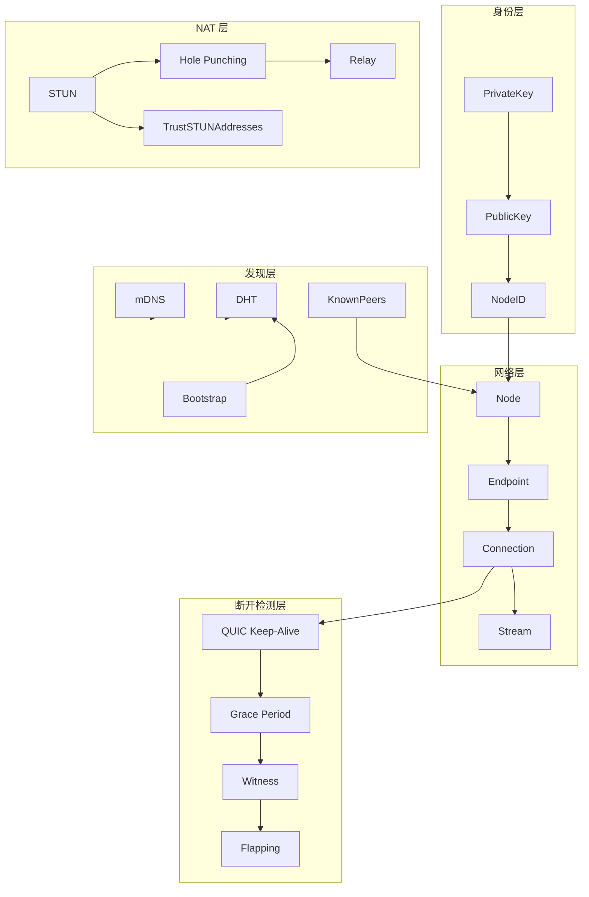

# 术语表

本文档定义 DeP2P 中使用的核心术语和概念。

---

## 概述



---

## 核心术语

### Node

**节点**

DeP2P 网络中的一个参与者实例。每个 Node 拥有唯一的 NodeID，可以与其他 Node 建立连接并进行通信。

**相关概念**：NodeID, Endpoint, Connection

**使用场景**：
```go
node, _ := dep2p.New(ctx, dep2p.WithPreset(dep2p.PresetDesktop))
node.Start(ctx)
defer node.Close()
```

---

### NodeID

**节点标识符**

节点的唯一标识，由公钥派生的 Base58 编码字符串。NodeID 是节点的"身份证"，在网络中唯一标识一个节点。

**格式**：`12D3KooWxxxxxxxxxxxxxxxxxxxxxxxxxxxxxxxx`

**相关概念**：Node, Identity, PublicKey

**使用场景**：
```go
nodeID := node.ID()
fmt.Println(nodeID)  // 12D3KooWxxxxxxx...
```

---

### Realm

**领域/业务隔离域**

DeP2P 的多租户隔离机制。不同 Realm 的节点共享底层基础设施（DHT、中继），但业务层完全隔离。

**类型**：
- **Public**：公开 Realm，任何人可加入
- **Protected**：受保护 Realm，需要密钥加入
- **Private**：私有 Realm，不在公共 DHT 注册

**相关概念**：RealmManager, JoinRealm, RealmID

**使用场景**：
```go
realm, _ := node.Realm("my-realm")
_ = realm.Join(ctx)
```

---

### Connection

**连接**

两个节点之间的安全通信链路，基于 QUIC 协议。支持多路复用，可在单个连接上创建多个 Stream。

**相关概念**：Node, Stream, Endpoint

---

### Stream

**流**

Connection 上的双向数据通道。每个 Stream 对应一个特定的协议，用于传输该协议的消息。

**相关概念**：Connection, ProtocolID

---

### Endpoint

**端点**

DeP2P 的核心连接接口，提供底层连接管理和协议处理功能。Node 是 Endpoint 的高层封装。

**相关概念**：Node, Connection, ProtocolHandler

---

### Identity

**身份**

节点的加密身份，由公私钥对组成。私钥用于签名，公钥用于验证和派生 NodeID。

**相关概念**：NodeID, PublicKey, PrivateKey

---

## 网络术语

### Bootstrap

**引导/自举**

新节点加入网络的过程。通过连接已知的 Bootstrap 节点来发现更多节点并融入网络。

**相关概念**：BootstrapPeer, DHT, Discovery, KnownPeers

**使用场景**：
```go
node, _ := dep2p.New(ctx,
    dep2p.WithBootstrapPeers(bootstrapAddrs...),
)
```

---

### Known Peers

**已知节点**

预配置的节点列表，启动时直接连接这些节点，无需通过 Bootstrap 或 DHT 发现。

**适用场景**：
- 私有网络
- 云服务器部署
- 无公共 Bootstrap 的环境

**相关概念**：Bootstrap, Discovery

**使用场景**：
```go
node, _ := dep2p.New(ctx,
    dep2p.WithKnownPeers(config.KnownPeer{
        PeerID: "12D3KooW...",
        Addrs:  []string{"/ip4/1.2.3.4/udp/4001/quic-v1"},
    }),
)
```

---

### DHT

**分布式哈希表** (Distributed Hash Table)

去中心化的键值存储系统，用于节点发现和地址存储。DeP2P 使用 Kademlia DHT。

**v2.0 权威模型**：
- DHT 是权威目录，存储签名 PeerRecord
- Relay 地址簿是缓存加速层
- 地址查询优先级：Peerstore → MemberList → DHT → Relay 地址簿

**模式**：
- **Client**：仅查询 DHT
- **Server**：存储和服务 DHT 请求

**相关概念**：Bootstrap, Discovery, Kademlia, PeerRecord

---

### PeerRecord

**节点记录**

DHT 中存储的节点地址信息，必须经过签名防止投毒攻击。

**结构**：
- NodeID：节点标识
- Addrs：地址列表
- Timestamp：时间戳
- Signature：Ed25519 签名

**相关概念**：DHT, NodeID, Signature

---

### mDNS

**多播 DNS** (Multicast DNS)

局域网内的节点发现机制。无需互联网即可在本地网络发现其他节点。

**相关概念**：Discovery, LAN

---

### NAT

**网络地址转换** (Network Address Translation)

家庭和办公室路由器常用的技术，将多个设备共享一个公网 IP。NAT 会阻止入站连接。

**相关概念**：NAT Traversal, Hole Punching, STUN

---

### NAT Traversal

**NAT 穿透**

绕过 NAT 限制建立直接连接的技术。包括 Hole Punching、UPnP、NAT-PMP 等方法。

**相关概念**：NAT, Hole Punching, Relay

---

### Hole Punching

**打洞**

两个 NAT 后的节点通过协调同时发送数据包，在各自的 NAT 上打开临时端口映射，从而建立直接连接。

**相关概念**：NAT Traversal, STUN, Relay

---

### STUN

**会话穿透实用程序** (Session Traversal Utilities for NAT)

帮助节点发现自己的公网 IP 和端口的协议。

**相关概念**：NAT, NAT Traversal, TrustSTUNAddresses

---

### Trust STUN Addresses

**信任 STUN 地址**

云服务器场景下的优化选项。启用后，STUN 探测发现的公网地址将被立即信任和通告，跳过入站连接验证步骤。

**适用场景**：
- 有真实公网 IP 的云服务器
- 网络配置确保入站流量可达

**使用场景**：
```go
node, _ := dep2p.New(ctx,
    dep2p.WithPreset(dep2p.PresetServer),
    dep2p.WithTrustSTUNAddresses(true),
)
```

**相关概念**：STUN, Reachability

---

### Relay

**中继**

当直接连接不可能时，通过第三方节点转发数据的机制。Relay 节点需要有公网可达性。

**相关概念**：NAT Traversal, RelayServer, Circuit Address

---

### AutoRelay

**自动中继**

自动发现并使用 Relay 节点的机制。当检测到无法建立直连时自动启用。

**相关概念**：Relay, NAT

---

### Reachability

**可达性**

节点是否可以被网络中的其他节点直接访问。公网节点通常是可达的，NAT 后的节点通常是不可达的。

**状态**：
- **Public**：公网可达
- **Private**：不可直接访问

**相关概念**：NAT, AutoNAT

---

## 地址术语

### Multiaddr

**多重地址**

一种自描述的地址格式，可以表示任何网络地址和协议栈。

**格式**：`/ip4/192.168.1.1/udp/4001/quic-v1`

**相关概念**：Full Address, Dial Address

---

### Full Address

**完整地址**

包含 NodeID 的完整可连接地址。格式：`<Dial Address>/p2p/<NodeID>`

**示例**：`/ip4/192.168.1.1/udp/4001/quic-v1/p2p/12D3KooWxxxxxxx`

**用途**：Bootstrap、用户分享

**相关概念**：Dial Address, Multiaddr

---

### Dial Address

**拨号地址**

不含 NodeID 的网络地址。格式：`/ip4/<IP>/udp/<Port>/quic-v1`

**示例**：`/ip4/192.168.1.1/udp/4001/quic-v1`

**用途**：与 NodeID 配合使用

**相关概念**：Full Address, Multiaddr

---

### Circuit Address

**中继电路地址**

通过 Relay 节点连接的地址格式。

**格式**：`<Relay地址>/p2p/<RelayID>/p2p-circuit/p2p/<TargetID>`

**示例**：`/ip4/relay.example.com/udp/4001/quic-v1/p2p/12D3KooW.../p2p-circuit/p2p/12D3KooW...`

**相关概念**：Relay, Full Address

---

### Listen Address

**监听地址**

节点用于接收入站连接的本地地址。

**相关概念**：Advertised Address

---

### Advertised Address

**通告地址**

节点向网络通告的可连接地址。可能与 Listen Address 不同（如经过 NAT 映射后）。

**相关概念**：Listen Address, Reachability

---

## 协议术语

### Protocol ID

**协议标识符**

标识特定通信协议的唯一字符串。格式：`/<namespace>/<name>/<version>`

**示例**：`/myapp/chat/1.0.0`

**相关概念**：Stream, ProtocolHandler

---

### Protocol Handler

**协议处理器**

处理特定协议消息的回调函数。当收到该协议的请求时被调用。

**相关概念**：Protocol ID, Stream

---

## 消息术语

### Send

**发送**

单向消息发送模式。发送后不等待响应。

**相关概念**：Request, Publish

---

### Request

**请求**

请求-响应模式。发送请求后等待对方响应。

**相关概念**：Send, Response

---

### Publish

**发布**

发布-订阅模式中的发布操作。将消息发送给所有订阅者。

**相关概念**：Subscribe, Topic

---

### Subscribe

**订阅**

发布-订阅模式中的订阅操作。接收特定主题的所有消息。

**相关概念**：Publish, Topic, Subscription

---

### Topic

**主题**

发布-订阅模式中的消息频道。订阅者只接收订阅主题的消息。

**相关概念**：Publish, Subscribe

---

## 系统术语

### Discovery

**发现**

查找网络中其他节点的机制。包括 DHT 发现、mDNS 发现等。

**相关概念**：DHT, mDNS, Bootstrap

---

### AddressBook

**地址簿**

存储已知节点地址的本地缓存。加速后续连接。

**v2.0 定位**：Relay 地址簿是 DHT 的本地缓存，不是权威目录。

**相关概念**：NodeID, Address, Discovery, DHT

---

### ReadyLevel

**就绪级别**

节点启动过程中的状态阶段。

**阶段**：
- **Created**：节点已创建
- **Network**：传输层就绪
- **Discovered**：DHT 已加入
- **Reachable**：地址已验证，可接收入站连接
- **RealmReady**：Realm 已加入，业务 API 可用

**相关概念**：Node, Lifecycle

---

### Lazy Relay Strategy

**惰性中继策略**

DeP2P 的连接策略：直连优先，中继兜底。

**连接尝试顺序**：
1. 直接连接（最快）
2. NAT 打洞（需要信令通道）
3. Relay 转发（兜底保障）

**特点**：
- 打洞成功后保留 Relay 连接作为备用
- 约 99% 的连接成功率保障

**相关概念**：Relay, NAT Traversal, Hole Punching

---

### ConnectionManager

**连接管理器**

管理连接生命周期的组件。负责连接数限制、裁剪策略等。

**相关概念**：Connection, Watermark

---

### Liveness

**存活检测**

检测连接是否仍然活跃的机制。使用 Ping-Pong 心跳协议。

**相关概念**：Connection, Ping, DisconnectDetection

---

### Disconnect Detection

**断开检测**

DeP2P 的多层断开检测机制，确保快速准确地感知节点离线。

**层次**：
- **QUIC Keep-Alive**：传输层检测，3秒周期
- **重连宽限期**：网络抖动容忍，15秒窗口
- **见证人机制**：分布式验证，3个见证人
- **震荡检测**：稳定性保护，60秒窗口

**相关概念**：Connection, Liveness, MemberEvent

---

### Reconnect Grace Period

**重连宽限期**

连接断开后等待重连的时间窗口。在此期间不触发 MemberLeft 事件，避免网络抖动造成的误判。

**默认值**：15 秒

**相关概念**：DisconnectDetection, MemberEvent

---

### Witness Mechanism

**见证人机制**

分布式验证节点离线的机制。询问多个见证人确认某节点是否真正离线，防止单点误判。

**参数**：
- **见证人数量**：默认 3 个
- **仲裁数量**：默认 2 个确认

**相关概念**：DisconnectDetection, MemberEvent

---

### Flapping Detection

**震荡检测**

检测节点频繁上下线（震荡）的机制。触发后进入冷却期，暂停重连尝试。

**参数**：
- **窗口**：60 秒
- **阈值**：3 次断线
- **冷却**：120 秒

**相关概念**：DisconnectDetection, Connection

---

### Member Event

**成员事件**

Realm 成员状态变化的事件通知。

**类型**：
- **MemberJoined**：新成员加入
- **MemberLeft**：成员离开

**相关概念**：Realm, DisconnectDetection

**使用场景**：
```go
events, _ := node.Realm().SubscribeMemberEvents(ctx, realmID)
for event := range events {
    switch event.Type {
    case dep2p.MemberJoined:
        fmt.Printf("成员加入: %s\n", event.Member)
    case dep2p.MemberLeft:
        fmt.Printf("成员离开: %s\n", event.Member)
    }
}
```

---

## 术语关系图



---

## 相关文档

- [核心概念](../concepts/core-concepts.md)
- [架构概览](../concepts/architecture-overview.md)
- [Node API](api/node.md)
