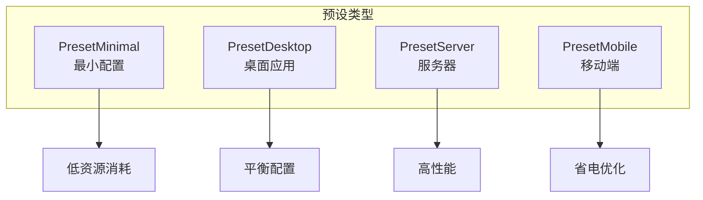
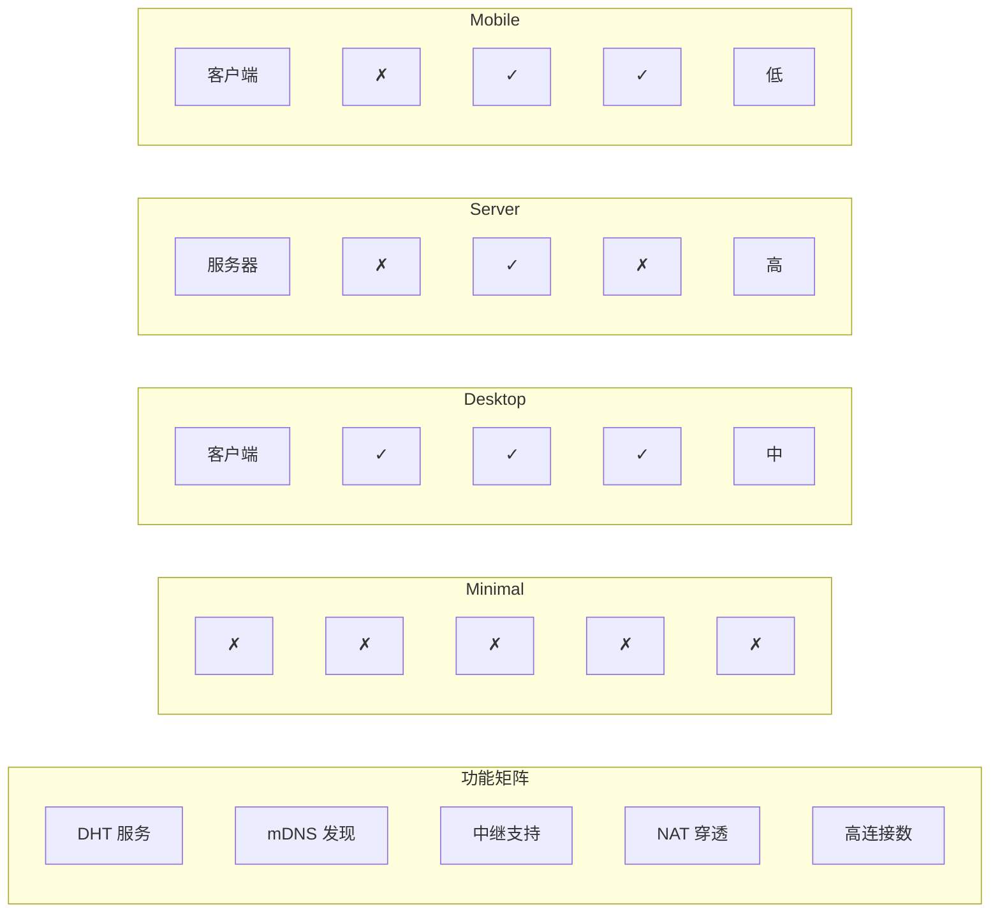
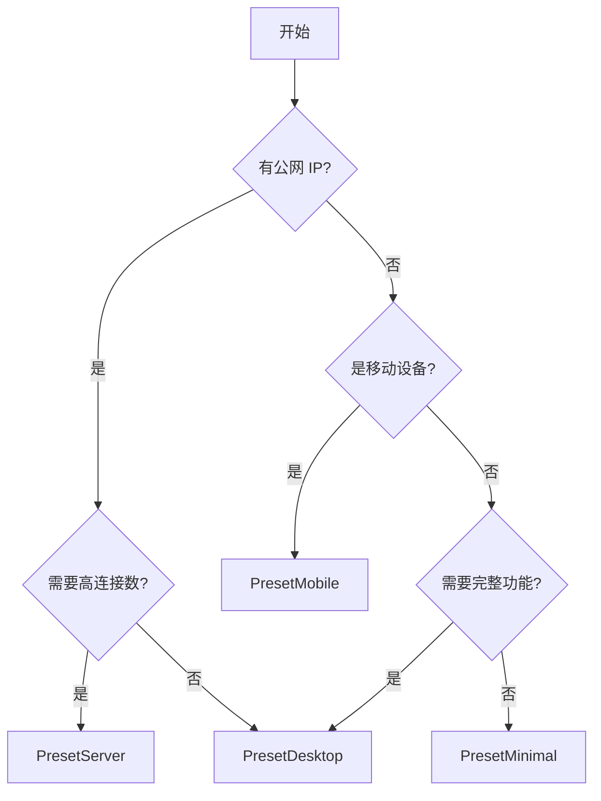

# 预设配置参考

本文档详细说明 DeP2P 提供的预设配置。

---

## 概述

预设配置是针对不同场景优化的配置集合，简化节点创建过程。



---

## 预设类型

### PresetMinimal

最小配置，适用于资源受限或测试场景。

```go
node, _ := dep2p.New(ctx, dep2p.WithPreset(dep2p.PresetMinimal))
node.Start(ctx)
```

**配置详情**：

| 配置项 | 值 | 说明 |
|--------|---|------|
| DHT | 禁用 | 不参与 DHT |
| mDNS | 禁用 | 不进行本地发现 |
| Relay | 禁用 | 不使用中继 |
| NAT | 禁用 | 无 NAT 穿透 |
| 连接限制 | 10/20 | 极低连接数 |
| 自动发现 | 禁用 | 手动连接 |

**适用场景**：
- 单元测试
- 本地开发
- 资源极度受限的环境
- 仅需直连的简单场景

---

### PresetDesktop

桌面应用默认配置，平衡功能和资源消耗。

```go
node, _ := dep2p.New(ctx, dep2p.WithPreset(dep2p.PresetDesktop))
node.Start(ctx)
```

**配置详情**：

| 配置项 | 值 | 说明 |
|--------|---|------|
| DHT | Client | DHT 客户端模式 |
| mDNS | 启用 | 局域网发现 |
| Relay | 启用 | 支持中继连接 |
| AutoRelay | 启用 | 自动使用中继 |
| NAT | 启用 | NAT 穿透 |
| AutoNAT | 启用 | 自动检测可达性 |
| HolePunching | 启用 | 打洞支持 |
| 连接限制 | 50/100 | 中等连接数 |

**适用场景**：
- 桌面聊天应用
- 文件共享应用
- 个人节点
- 开发调试

---

### PresetServer

服务器配置，最大化性能和连接能力。

```go
node, _ := dep2p.New(ctx, 
    dep2p.WithPreset(dep2p.PresetServer),
    dep2p.WithTrustSTUNAddresses(true),  // 云服务器推荐
)
node.Start(ctx)
```

**配置详情**：

| 配置项 | 值 | 说明 |
|--------|---|------|
| DHT | Server | DHT 服务器模式 |
| mDNS | 禁用 | 服务器通常不需要 |
| Relay | 启用 | 支持中继 |
| RelayServer | 可选 | 可作为中继服务器 |
| NAT | 禁用 | 假设有公网 IP |
| AutoNAT | 禁用 | 假设可达 |
| 连接限制 | 200/500 | 高连接数 |
| 监听端口 | 固定 | 推荐 4001 |

**适用场景**：
- Bootstrap 节点
- Relay 服务器
- 高可用服务
- 公网服务器

---

### PresetMobile

移动端配置，优化电池和流量消耗。

```go
node, _ := dep2p.New(ctx, dep2p.WithPreset(dep2p.PresetMobile))
node.Start(ctx)
```

**配置详情**：

| 配置项 | 值 | 说明 |
|--------|---|------|
| DHT | Client | 仅客户端 |
| mDNS | 禁用 | 节省电量 |
| Relay | 启用 | 必需（移动网络） |
| AutoRelay | 启用 | 自动中继 |
| NAT | 启用 | 尝试穿透 |
| HolePunching | 启用 | 尝试打洞 |
| 连接限制 | 20/50 | 低连接数 |
| 空闲超时 | 短 | 快速释放 |

**适用场景**：
- 移动聊天应用
- 移动客户端
- IoT 设备
- 低功耗设备

---

## 预设对比



### 功能对比表

| 功能 | Minimal | Desktop | Server | Mobile |
|------|---------|---------|--------|--------|
| DHT | 禁用 | Client | Server | Client |
| mDNS | 禁用 | 启用 | 禁用 | 禁用 |
| Relay 客户端 | 禁用 | 启用 | 启用 | 启用 |
| Relay 服务器 | 禁用 | 禁用 | 可选 | 禁用 |
| NAT 穿透 | 禁用 | 启用 | 禁用 | 启用 |
| AutoNAT | 禁用 | 启用 | 禁用 | 启用 |
| HolePunching | 禁用 | 启用 | 禁用 | 启用 |
| AutoRelay | 禁用 | 启用 | 禁用 | 启用 |

### 资源消耗对比

| 指标 | Minimal | Desktop | Server | Mobile |
|------|---------|---------|--------|--------|
| 内存 | 低 | 中 | 高 | 低 |
| CPU | 低 | 中 | 高 | 低 |
| 网络 | 极低 | 中 | 高 | 优化 |
| 连接数 | 10-20 | 50-100 | 200-500 | 20-50 |
| 电池 | N/A | N/A | N/A | 优化 |

---

## 如何选择预设



### 选择指南

| 场景 | 推荐预设 |
|------|----------|
| 本地测试 | PresetMinimal |
| 桌面应用 | PresetDesktop |
| 公网服务器 | PresetServer |
| Bootstrap 节点 | PresetServer |
| Relay 服务器 | PresetServer + WithRelayServer |
| 手机应用 | PresetMobile |
| IoT 设备 | PresetMobile 或 PresetMinimal |
| 开发调试 | PresetDesktop |

---

## 自定义预设

预设可以与其他选项组合使用：

### 基于预设扩展

```go
// 基于桌面预设，增加固定端口
node, _ := dep2p.New(ctx,
    dep2p.WithPreset(dep2p.PresetDesktop),
    dep2p.WithListenPort(4001),
)
```

### 基于预设添加 known_peers

```go
import "github.com/dep2p/go-dep2p/config"

// 基于桌面预设，配置已知节点直连
node, _ := dep2p.New(ctx,
    dep2p.WithPreset(dep2p.PresetDesktop),
    dep2p.WithKnownPeers(
        config.KnownPeer{
            PeerID: "12D3KooWxxxxxxxxxxxxxxxxxxxxxxxxxxxxxxxxxxxxxxx",
            Addrs:  []string{"/ip4/1.2.3.4/udp/4001/quic-v1"},
        },
    ),
)
```

### 基于预设覆盖

```go
// 基于服务器预设，启用 Relay 服务器和 STUN 信任
node, _ := dep2p.New(ctx,
    dep2p.WithPreset(dep2p.PresetServer),
    dep2p.WithRelayServer(true),
    dep2p.WithTrustSTUNAddresses(true),
    dep2p.WithListenPort(4001),
)
```

### 基于预设禁用功能

```go
// 基于桌面预设，禁用 mDNS（私有网络场景）
node, _ := dep2p.New(ctx,
    dep2p.WithPreset(dep2p.PresetDesktop),
    dep2p.WithMDNS(false),
    dep2p.WithBootstrapPeers(nil),  // 也禁用公共 Bootstrap
)
```

---

## 完全自定义

不使用预设，完全自定义配置：

```go
import "github.com/dep2p/go-dep2p/config"

node, _ := dep2p.New(ctx,
    // 身份
    dep2p.WithIdentityFile("./node.key"),
    
    // 网络
    dep2p.WithListenPort(4001),
    
    // 已知节点直连（私有网络场景）
    dep2p.WithKnownPeers(
        config.KnownPeer{
            PeerID: "12D3KooWxxxxxxxxxxxxxxxxxxxxxxxxxxxxxxxxxxxxxxx",
            Addrs:  []string{"/ip4/1.2.3.4/udp/4001/quic-v1"},
        },
    ),
    
    // 发现
    dep2p.WithDHT(dep2p.DHTServer),
    dep2p.WithMDNS(true),
    
    // NAT
    dep2p.WithNAT(true),
    dep2p.WithHolePunching(true),
    dep2p.WithTrustSTUNAddresses(true),  // 云服务器场景
    
    // 中继
    dep2p.WithRelay(true),
    dep2p.WithRelayServer(false),
    
    // 连接
    dep2p.WithConnectionLimits(100, 200),
)
```

---

## 相关文档

- [配置项参考](configuration.md)
- [Node API](api/node.md)
- [快速开始](../getting-started/quickstart.md)
