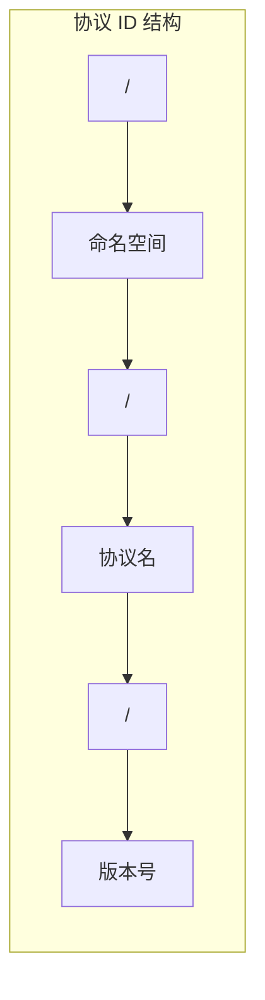
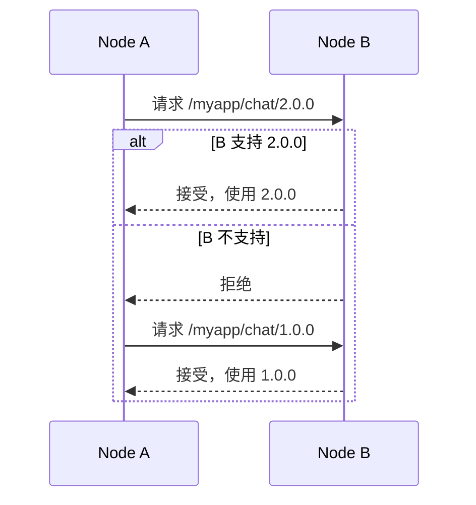
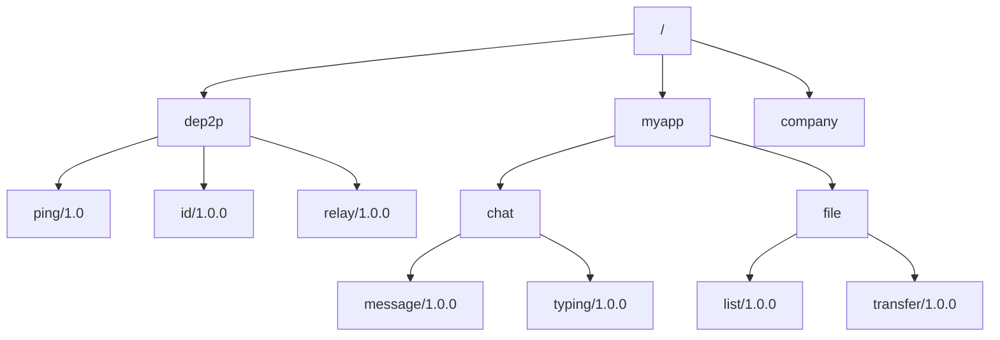

# 协议 ID 命名规范

本文档定义 DeP2P 协议 ID 的格式规范和最佳实践。

---

## 概述

协议 ID 是标识通信协议的唯一字符串。正确命名协议 ID 对于协议协商、版本管理和互操作性至关重要。



---

## 格式规范

### 基本格式

```
/<命名空间>/<协议名>/<版本>
```

**示例**：
- `/myapp/chat/1.0.0`
- `/dep2p/ping/1.0`
- `/ipfs/kad/1.0.0`

---

### 组成部分

| 部分 | 描述 | 规则 |
|------|------|------|
| 命名空间 | 应用或组织标识 | 小写字母、数字、连字符 |
| 协议名 | 协议功能描述 | 小写字母、数字、连字符 |
| 版本 | 协议版本号 | 语义化版本或简单版本 |

---

## 命名空间规则

### 应用命名空间

```
/<app-name>/<protocol>/<version>
```

**示例**：
```go
const (
    ProtoMyAppChat = "/myapp/chat/1.0.0"
    ProtoMyAppFile = "/myapp/file/1.0.0"
)
```

---

### 组织命名空间

```
/<org>/<app>/<protocol>/<version>
```

**示例**：
```go
const (
    ProtoCompanyMessaging = "/acme/messenger/message/1.0.0"
    ProtoCompanySync = "/acme/sync/data/1.0.0"
)
```

---

### 系统命名空间

DeP2P 系统协议使用 `/dep2p/` 命名空间：

```
/dep2p/<protocol>/<version>
```

**系统协议示例**：
| 协议 ID | 描述 |
|---------|------|
| `/dep2p/ping/1.0` | Ping-Pong 心跳 |
| `/dep2p/id/1.0.0` | 身份交换 |
| `/dep2p/relay/1.0.0` | 中继协议 |
| `/dep2p/realm/1.0.0` | Realm 认证 |

---

## 版本号规则

### 语义化版本

推荐使用语义化版本：

```
<major>.<minor>.<patch>
```

| 部分 | 含义 |
|------|------|
| major | 不兼容的 API 变更 |
| minor | 向后兼容的功能新增 |
| patch | 向后兼容的问题修复 |

**示例**：
- `1.0.0` - 首个稳定版本
- `1.1.0` - 新增功能
- `2.0.0` - 破坏性变更

---

### 简单版本

对于简单场景，可使用两段版本：

```
<major>.<minor>
```

**示例**：
- `1.0`
- `2.1`

---

## 版本协商

### 多版本支持

```go
// 注册多个版本处理器
node.Endpoint().SetProtocolHandler("/myapp/chat/1.0.0", handleChatV1)
node.Endpoint().SetProtocolHandler("/myapp/chat/2.0.0", handleChatV2)
```

### 协议协商流程



---

## 命名最佳实践

### 推荐做法

```go
// 使用常量定义
const (
    // 聊天协议
    ProtoChatMessage = "/myapp/chat/message/1.0.0"
    ProtoChatTyping  = "/myapp/chat/typing/1.0.0"
    
    // 文件传输
    ProtoFileRequest  = "/myapp/file/request/1.0.0"
    ProtoFileTransfer = "/myapp/file/transfer/1.0.0"
)
```

### 避免的做法

```go
// 避免：无版本号
const BadProto1 = "/myapp/chat"  // 缺少版本

// 避免：使用大写
const BadProto2 = "/MyApp/Chat/1.0.0"  // 应使用小写

// 避免：使用特殊字符
const BadProto3 = "/my_app/chat!/1.0.0"  // 使用 _ 和 !

// 避免：版本格式不一致
const BadProto4 = "/myapp/chat/v1"  // 应使用数字版本
```

---

## 协议 ID 示例

### 聊天应用

```go
const (
    // 消息相关
    ProtoChatMessage = "/chatapp/message/1.0.0"
    ProtoChatRead    = "/chatapp/read/1.0.0"
    ProtoChatTyping  = "/chatapp/typing/1.0.0"
    
    // 群组相关
    ProtoGroupCreate = "/chatapp/group/create/1.0.0"
    ProtoGroupJoin   = "/chatapp/group/join/1.0.0"
    ProtoGroupLeave  = "/chatapp/group/leave/1.0.0"
)
```

---

### 文件共享

```go
const (
    // 文件操作
    ProtoFileList     = "/fileshare/list/1.0.0"
    ProtoFileRequest  = "/fileshare/request/1.0.0"
    ProtoFileTransfer = "/fileshare/transfer/1.0.0"
    ProtoFileHash     = "/fileshare/hash/1.0.0"
)
```

---

### RPC 服务

```go
const (
    // 通用 RPC
    ProtoRPCCall   = "/myservice/rpc/call/1.0.0"
    ProtoRPCStream = "/myservice/rpc/stream/1.0.0"
)
```

---

## 协议 ID 树



---

## 常见错误

| 错误 | 问题 | 正确写法 |
|------|------|----------|
| `myapp/chat/1.0` | 缺少前导斜杠 | `/myapp/chat/1.0` |
| `/myapp/chat` | 缺少版本号 | `/myapp/chat/1.0.0` |
| `/MyApp/Chat/1.0` | 使用大写 | `/myapp/chat/1.0` |
| `/my app/chat/1.0` | 包含空格 | `/my-app/chat/1.0` |
| `/myapp/chat/v1.0` | 版本前缀 v | `/myapp/chat/1.0` |

---

## 相关文档

- [Endpoint API](api/endpoint.md)
- [Messaging API](api/messaging.md)
- [自定义协议教程](../how-to/custom-protocols.md)
