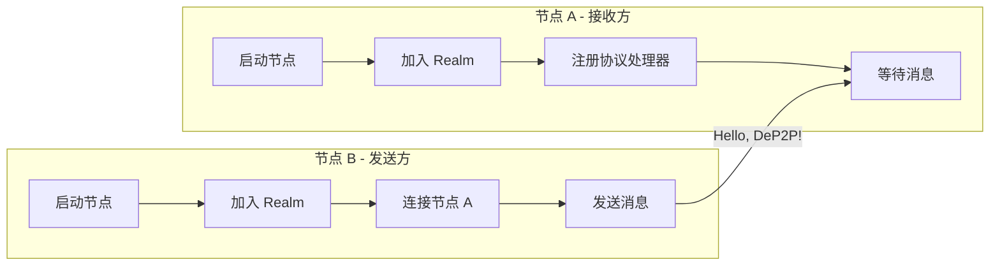
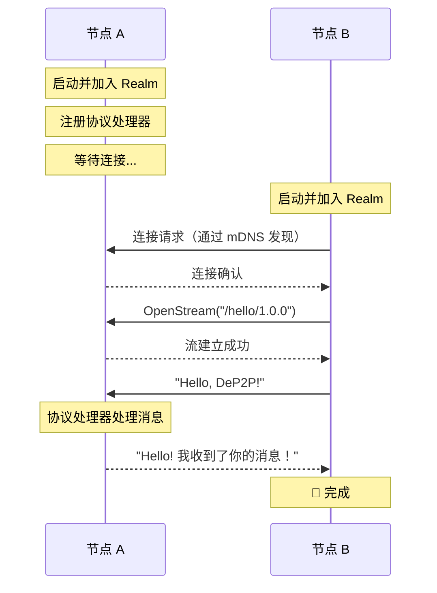

# Hello World：两节点互连

本教程将指导你完成最基本的 DeP2P 操作：让两个节点互相连接并发送消息。

---

## 教程目标

```
┌─────────────────────────────────────────────────────────────────────┐
│                    本教程完成后你将学会                              │
├─────────────────────────────────────────────────────────────────────┤
│                                                                      │
│  ✅ 创建两个 DeP2P 节点                                              │
│  ✅ 在同一网络内发现对方                                             │
│  ✅ 建立连接并发送消息                                               │
│  ✅ 接收并处理来自其他节点的消息                                     │
│                                                                      │
└─────────────────────────────────────────────────────────────────────┘
```

---

## 前置条件

- Go 1.21 或更高版本
- DeP2P 已安装（`go get github.com/dep2p/go-dep2p`）
- 两个终端窗口

---

## 架构概览



---

## 步骤 1：创建节点 A（接收方）

创建文件 `node_a/main.go`：

```go
package main

import (
    "context"
    "fmt"
    "log"
    "os"
    "os/signal"
    "syscall"

    "github.com/dep2p/go-dep2p"
    "github.com/dep2p/go-dep2p/pkg/types"
)

// 定义应用协议
const helloProtocol = "/hello/1.0.0"

func main() {
    fmt.Println("╔════════════════════════════════════════╗")
    fmt.Println("║      DeP2P Hello World - 节点 A        ║")
    fmt.Println("╚════════════════════════════════════════╝")
    fmt.Println()

    ctx, cancel := context.WithCancel(context.Background())
    defer cancel()

    // 捕获中断信号
    signalCh := make(chan os.Signal, 1)
    signal.Notify(signalCh, syscall.SIGINT, syscall.SIGTERM)
    go func() {
        <-signalCh
        fmt.Println("\n收到中断信号，准备关闭...")
        cancel()
    }()

    // ========================================
    // Step 1: 创建并启动节点
    // ========================================
    fmt.Println("Step 1: 启动节点...")
    node, err := dep2p.StartNode(ctx,
        dep2p.WithPreset(dep2p.PresetDesktop),
        dep2p.WithListenPort(8001), // 固定端口，便于连接
    )
    if err != nil {
        log.Fatalf("启动节点失败: %v", err)
    }
    defer node.Close()

    fmt.Printf("✅ 节点已启动\n")
    fmt.Printf("   节点 ID: %s\n", node.ID())
    fmt.Printf("   监听地址: %v\n", node.ListenAddrs())
    fmt.Println()

    // ========================================
    // Step 2: 加入 Realm
    // ========================================
    fmt.Println("Step 2: 加入 Realm...")
    realmID := types.RealmID("hello-world-demo")
    if err := node.Realm().JoinRealm(ctx, realmID); err != nil {
        log.Fatalf("加入 Realm 失败: %v", err)
    }
    fmt.Printf("✅ 已加入 Realm: %s\n", realmID)
    fmt.Println()

    // ========================================
    // Step 3: 注册协议处理器
    // ========================================
    fmt.Println("Step 3: 注册协议处理器...")
    node.Endpoint().SetProtocolHandler(helloProtocol, func(stream dep2p.Stream) {
        defer stream.Close()

        // 读取消息
        buf := make([]byte, 1024)
        n, err := stream.Read(buf)
        if err != nil {
            fmt.Printf("读取消息失败: %v\n", err)
            return
        }

        message := string(buf[:n])
        fmt.Printf("\n📨 收到消息: %s\n", message)
        fmt.Printf("   来自: %s\n", stream.RemotePeer())

        // 发送响应
        response := "Hello! 我收到了你的消息！"
        _, err = stream.Write([]byte(response))
        if err != nil {
            fmt.Printf("发送响应失败: %v\n", err)
            return
        }
        fmt.Printf("📤 已发送响应: %s\n", response)
    })
    fmt.Printf("✅ 已注册协议: %s\n", helloProtocol)
    fmt.Println()

    // ========================================
    // 等待消息
    // ========================================
    fmt.Println("════════════════════════════════════════")
    fmt.Println("节点 A 已就绪，等待来自节点 B 的消息...")
    fmt.Println()
    fmt.Println("请在另一个终端启动节点 B，并使用以下 NodeID 连接：")
    fmt.Printf("   %s\n", node.ID())
    fmt.Println()
    fmt.Println("按 Ctrl+C 退出")
    fmt.Println("════════════════════════════════════════")

    <-ctx.Done()
    fmt.Println("节点 A 已关闭")
}
```

---

## 步骤 2：创建节点 B（发送方）

创建文件 `node_b/main.go`：

```go
package main

import (
    "context"
    "fmt"
    "log"
    "os"
    "time"

    "github.com/dep2p/go-dep2p"
    "github.com/dep2p/go-dep2p/pkg/types"
)

// 定义应用协议（必须与节点 A 一致）
const helloProtocol = "/hello/1.0.0"

func main() {
    fmt.Println("╔════════════════════════════════════════╗")
    fmt.Println("║      DeP2P Hello World - 节点 B        ║")
    fmt.Println("╚════════════════════════════════════════╝")
    fmt.Println()

    // 从命令行参数获取节点 A 的 ID
    if len(os.Args) < 2 {
        fmt.Println("用法: go run main.go <节点A的NodeID>")
        fmt.Println()
        fmt.Println("示例: go run main.go 5Q2STWvBFn...")
        os.Exit(1)
    }
    nodeAIDStr := os.Args[1]

    ctx, cancel := context.WithTimeout(context.Background(), 30*time.Second)
    defer cancel()

    // ========================================
    // Step 1: 创建并启动节点
    // ========================================
    fmt.Println("Step 1: 启动节点...")
    node, err := dep2p.StartNode(ctx,
        dep2p.WithPreset(dep2p.PresetDesktop),
    )
    if err != nil {
        log.Fatalf("启动节点失败: %v", err)
    }
    defer node.Close()

    fmt.Printf("✅ 节点已启动\n")
    fmt.Printf("   节点 ID: %s\n", node.ID())
    fmt.Println()

    // ========================================
    // Step 2: 加入 Realm（必须与节点 A 相同）
    // ========================================
    fmt.Println("Step 2: 加入 Realm...")
    realmID := types.RealmID("hello-world-demo")
    if err := node.Realm().JoinRealm(ctx, realmID); err != nil {
        log.Fatalf("加入 Realm 失败: %v", err)
    }
    fmt.Printf("✅ 已加入 Realm: %s\n", realmID)
    fmt.Println()

    // ========================================
    // Step 3: 解析节点 A 的 ID
    // ========================================
    fmt.Println("Step 3: 解析目标节点 ID...")
    nodeAID, err := types.ParseNodeID(nodeAIDStr)
    if err != nil {
        log.Fatalf("解析 NodeID 失败: %v", err)
    }
    fmt.Printf("✅ 目标节点: %s\n", nodeAID.ShortString())
    fmt.Println()

    // ========================================
    // Step 4: 连接到节点 A
    // ========================================
    fmt.Println("Step 4: 连接到节点 A...")
    
    // 等待 mDNS 发现（同一局域网）
    fmt.Println("   等待发现节点 A（mDNS）...")
    time.Sleep(2 * time.Second)
    
    conn, err := node.Connect(ctx, nodeAID)
    if err != nil {
        log.Fatalf("连接失败: %v\n提示: 确保两节点在同一网络", err)
    }
    fmt.Printf("✅ 已连接到节点 A\n")
    fmt.Println()

    // ========================================
    // Step 5: 发送消息
    // ========================================
    fmt.Println("Step 5: 发送消息...")
    
    // 打开流
    stream, err := conn.OpenStream(ctx, helloProtocol)
    if err != nil {
        log.Fatalf("打开流失败: %v", err)
    }
    defer stream.Close()

    // 发送消息
    message := "Hello, DeP2P! 这是来自节点 B 的问候！"
    _, err = stream.Write([]byte(message))
    if err != nil {
        log.Fatalf("发送消息失败: %v", err)
    }
    fmt.Printf("📤 已发送消息: %s\n", message)

    // 读取响应
    buf := make([]byte, 1024)
    n, err := stream.Read(buf)
    if err != nil {
        log.Fatalf("读取响应失败: %v", err)
    }
    fmt.Printf("📨 收到响应: %s\n", string(buf[:n]))
    fmt.Println()

    // ========================================
    // 完成
    // ========================================
    fmt.Println("════════════════════════════════════════")
    fmt.Println("🎉 Hello World 完成！")
    fmt.Println("   你已成功在两个节点之间发送和接收消息。")
    fmt.Println("════════════════════════════════════════")
}
```

---

## 步骤 3：运行示例

### 终端 1：启动节点 A

```bash
cd node_a
go run main.go
```

预期输出：

```
╔════════════════════════════════════════╗
║      DeP2P Hello World - 节点 A        ║
╚════════════════════════════════════════╝

Step 1: 启动节点...
✅ 节点已启动
   节点 ID: 5Q2STWvBFn7xR8mK...
   监听地址: [/ip4/0.0.0.0/udp/8001/quic-v1]

Step 2: 加入 Realm...
✅ 已加入 Realm: hello-world-demo

Step 3: 注册协议处理器...
✅ 已注册协议: /hello/1.0.0

════════════════════════════════════════
节点 A 已就绪，等待来自节点 B 的消息...

请在另一个终端启动节点 B，并使用以下 NodeID 连接：
   5Q2STWvBFn7xR8mK...

按 Ctrl+C 退出
════════════════════════════════════════
```

### 终端 2：启动节点 B

复制节点 A 输出的 NodeID，然后运行：

```bash
cd node_b
go run main.go 5Q2STWvBFn7xR8mK...  # 替换为节点 A 的实际 NodeID
```

预期输出：

```
╔════════════════════════════════════════╗
║      DeP2P Hello World - 节点 B        ║
╚════════════════════════════════════════╝

Step 1: 启动节点...
✅ 节点已启动
   节点 ID: 7K3YTWvAFn8xR9nL...

Step 2: 加入 Realm...
✅ 已加入 Realm: hello-world-demo

Step 3: 解析目标节点 ID...
✅ 目标节点: 5Q2STWv...

Step 4: 连接到节点 A...
   等待发现节点 A（mDNS）...
✅ 已连接到节点 A

Step 5: 发送消息...
📤 已发送消息: Hello, DeP2P! 这是来自节点 B 的问候！
📨 收到响应: Hello! 我收到了你的消息！

════════════════════════════════════════
🎉 Hello World 完成！
   你已成功在两个节点之间发送和接收消息。
════════════════════════════════════════
```

### 终端 1（节点 A）会显示：

```
📨 收到消息: Hello, DeP2P! 这是来自节点 B 的问候！
   来自: 7K3YTWvAFn8xR9nL...
📤 已发送响应: Hello! 我收到了你的消息！
```

---

## 消息流程



---

## 关键概念

### 1. 协议标识符

```go
const helloProtocol = "/hello/1.0.0"
```

协议标识符用于区分不同的消息类型，格式通常为 `/应用名/版本`。

### 2. Realm 隔离

```go
realmID := types.RealmID("hello-world-demo")
node.Realm().JoinRealm(ctx, realmID)
```

两个节点必须加入**相同的 Realm** 才能通信。

### 3. 协议处理器

```go
node.Endpoint().SetProtocolHandler(helloProtocol, func(stream dep2p.Stream) {
    // 处理消息
})
```

协议处理器在收到指定协议的消息时被调用。

### 4. 流式通信

```go
stream, _ := conn.OpenStream(ctx, helloProtocol)
stream.Write([]byte("message"))
stream.Read(buf)
```

DeP2P 使用流式通信，支持双向数据传输。

---

## 故障排查

### 问题 1：连接超时

**症状**：节点 B 无法连接到节点 A

**可能原因**：
- 两节点不在同一网络
- 防火墙阻止 UDP 流量
- mDNS 发现需要时间

**解决方案**：
```go
// 增加等待时间
time.Sleep(5 * time.Second)

// 或使用完整地址连接
fullAddr := "/ip4/192.168.1.100/udp/8001/quic-v1/p2p/5Q2STW..."
node.ConnectToAddr(ctx, fullAddr)
```

### 问题 2：Realm 不匹配

**症状**：消息发送返回 `ErrNotMember`

**解决方案**：确保两个节点加入相同的 Realm：
```go
// 两边必须一致
realmID := types.RealmID("hello-world-demo")
```

### 问题 3：协议不匹配

**症状**：消息发送成功但没有响应

**解决方案**：确保协议标识符完全一致：
```go
// 两边必须一致
const helloProtocol = "/hello/1.0.0"
```

---

## 下一步

- [安全聊天应用](02-secure-chat.md) - 构建一个完整的聊天应用
- [跨 NAT 连接](03-cross-nat-connect.md) - 在不同网络间连接
- [Realm 应用](04-realm-application.md) - 深入理解 Realm 隔离
