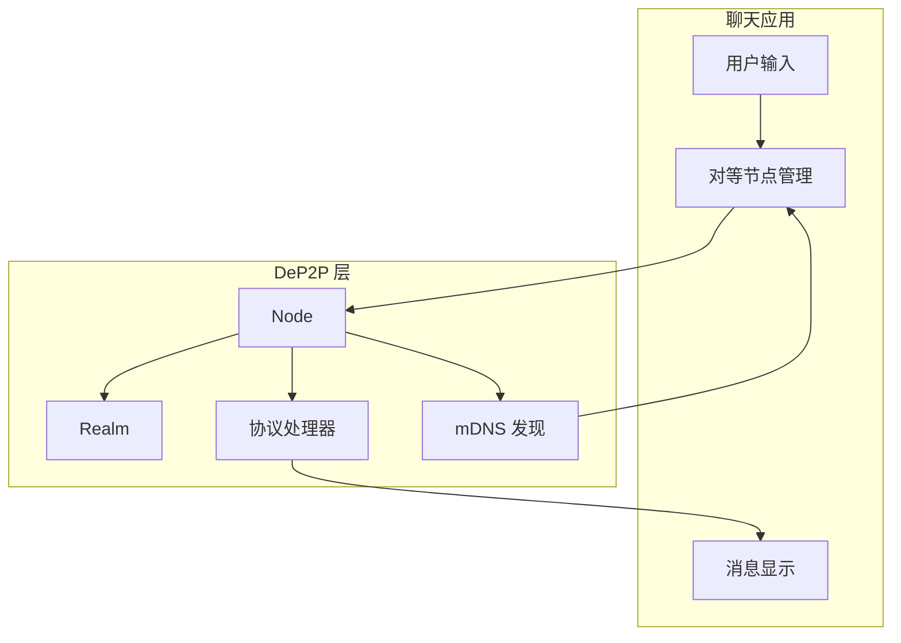
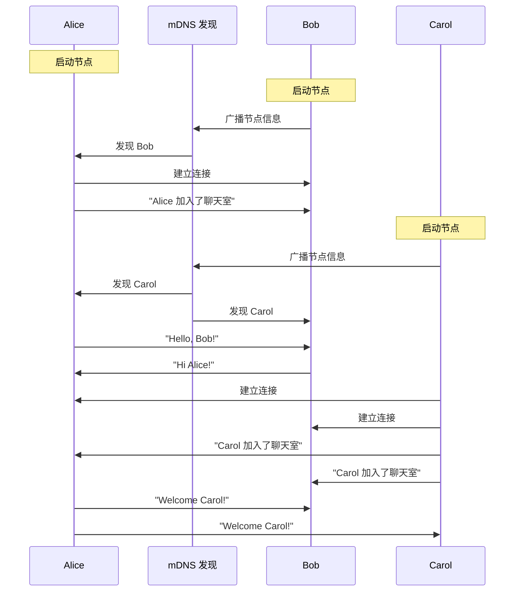

# 安全聊天应用

本教程将指导你构建一个完整的 P2P 聊天应用，支持双向消息传递和多用户交互。

---

## 教程目标

```
┌─────────────────────────────────────────────────────────────────────┐
│                    本教程完成后你将学会                              │
├─────────────────────────────────────────────────────────────────────┤
│                                                                      │
│  ✅ 设计聊天消息协议                                                 │
│  ✅ 实现双向消息传递                                                 │
│  ✅ 处理用户输入和消息显示                                           │
│  ✅ 使用 mDNS 自动发现同网络的节点                                   │
│  ✅ 管理多个对等连接                                                 │
│                                                                      │
└─────────────────────────────────────────────────────────────────────┘
```

---

## 应用架构



---

## 前置条件

- Go 1.21 或更高版本
- DeP2P 已安装
- 同一局域网内的多台设备（或多个终端）

---

## 步骤 1：设计消息协议

首先，我们定义聊天协议的结构：

```go
// 协议标识符
const chatProtocol = "/chat/1.0.0"

// 消息格式：简单文本
// 实际应用中可以使用 JSON 或 Protobuf
```

```
┌─────────────────────────────────────────────────────────────────────┐
│                       消息协议设计                                   │
├─────────────────────────────────────────────────────────────────────┤
│                                                                      │
│  协议 ID: /chat/1.0.0                                               │
│                                                                      │
│  消息格式: [昵称]:[消息内容]                                         │
│  示例: "Alice:Hello, everyone!"                                     │
│                                                                      │
│  特点:                                                               │
│  • 简单文本格式，易于调试                                            │
│  • 昵称用于标识发送者                                                │
│  • 每条消息独立，无状态                                              │
│                                                                      │
└─────────────────────────────────────────────────────────────────────┘
```

---

## 步骤 2：完整代码实现

创建文件 `chat/main.go`：

```go
package main

import (
    "bufio"
    "context"
    "fmt"
    "log"
    "os"
    "os/signal"
    "strings"
    "sync"
    "syscall"
    "time"

    "github.com/dep2p/go-dep2p"
    "github.com/dep2p/go-dep2p/pkg/types"
)

// 协议标识符
const chatProtocol = "/chat/1.0.0"

// 全局变量：管理所有连接的对等节点
var (
    peers     = make(map[string]dep2p.Stream) // NodeID -> Stream
    peersLock sync.RWMutex
    nickname  string
)

func main() {
    fmt.Println("╔════════════════════════════════════════╗")
    fmt.Println("║     DeP2P 安全聊天 - P2P Chat          ║")
    fmt.Println("╚════════════════════════════════════════╝")
    fmt.Println()

    // 获取昵称
    if len(os.Args) > 1 {
        nickname = os.Args[1]
    } else {
        fmt.Print("请输入你的昵称: ")
        reader := bufio.NewReader(os.Stdin)
        nickname, _ = reader.ReadString('\n')
        nickname = strings.TrimSpace(nickname)
    }
    if nickname == "" {
        nickname = "Anonymous"
    }
    fmt.Printf("欢迎, %s!\n\n", nickname)

    ctx, cancel := context.WithCancel(context.Background())
    defer cancel()

    // 捕获中断信号
    signalCh := make(chan os.Signal, 1)
    signal.Notify(signalCh, syscall.SIGINT, syscall.SIGTERM)
    go func() {
        <-signalCh
        fmt.Println("\n\n再见! 👋")
        cancel()
    }()

    // ========================================
    // Step 1: 创建节点
    // ========================================
    fmt.Println("正在启动节点...")
    node, err := dep2p.StartNode(ctx,
        dep2p.WithPreset(dep2p.PresetDesktop),
        // mDNS 自动启用，用于局域网发现
    )
    if err != nil {
        log.Fatalf("启动节点失败: %v", err)
    }
    defer node.Close()

    fmt.Printf("节点 ID: %s\n", node.ID().ShortString())
    fmt.Println()

    // ========================================
    // Step 2: 加入 Realm
    // ========================================
    realmID := types.RealmID("chat-room")
    if err := node.Realm().JoinRealm(ctx, realmID); err != nil {
        log.Fatalf("加入 Realm 失败: %v", err)
    }
    fmt.Printf("已加入聊天室: %s\n", realmID)
    fmt.Println()

    // ========================================
    // Step 3: 注册消息处理器
    // ========================================
    node.Endpoint().SetProtocolHandler(chatProtocol, handleIncomingStream)
    fmt.Println("消息处理器已注册")
    fmt.Println()

    // ========================================
    // Step 4: 设置连接通知（发现新节点时）
    // ========================================
    node.Endpoint().SetConnectedNotify(func(conn dep2p.Connection) {
        remoteID := conn.RemoteID()
        fmt.Printf("\n🔗 发现新节点: %s\n", remoteID.ShortString())
        fmt.Print("> ")
        
        // 尝试建立聊天流
        go func() {
            time.Sleep(500 * time.Millisecond) // 等待连接稳定
            connectToPeer(ctx, node, remoteID)
        }()
    })

    // ========================================
    // Step 5: 开始聊天
    // ========================================
    fmt.Println("════════════════════════════════════════")
    fmt.Println("聊天室已就绪！")
    fmt.Println("• 在同一网络的节点会自动发现并连接")
    fmt.Println("• 输入消息后按 Enter 发送")
    fmt.Println("• 输入 /quit 退出")
    fmt.Println("════════════════════════════════════════")
    fmt.Println()

    // 启动消息输入循环
    go inputLoop(ctx)

    // 等待退出
    <-ctx.Done()
    
    // 关闭所有流
    peersLock.Lock()
    for _, stream := range peers {
        stream.Close()
    }
    peersLock.Unlock()
    
    fmt.Println("聊天结束")
}

// handleIncomingStream 处理来自其他节点的消息流
func handleIncomingStream(stream dep2p.Stream) {
    remotePeer := stream.RemotePeer().String()
    
    // 保存流以便发送消息
    peersLock.Lock()
    peers[remotePeer] = stream
    peersLock.Unlock()
    
    defer func() {
        peersLock.Lock()
        delete(peers, remotePeer)
        peersLock.Unlock()
        stream.Close()
    }()
    
    // 持续读取消息
    buf := make([]byte, 4096)
    for {
        n, err := stream.Read(buf)
        if err != nil {
            return
        }
        
        message := string(buf[:n])
        fmt.Printf("\n%s\n", message)
        fmt.Print("> ")
    }
}

// connectToPeer 连接到发现的对等节点
func connectToPeer(ctx context.Context, node dep2p.Node, peerID types.NodeID) {
    peersLock.RLock()
    _, exists := peers[peerID.String()]
    peersLock.RUnlock()
    
    if exists {
        return // 已连接
    }
    
    // 获取连接
    conn, err := node.Connect(ctx, peerID)
    if err != nil {
        return
    }
    
    // 打开聊天流
    stream, err := conn.OpenStream(ctx, chatProtocol)
    if err != nil {
        return
    }
    
    // 保存流
    peersLock.Lock()
    peers[peerID.String()] = stream
    peersLock.Unlock()
    
    // 发送加入消息
    joinMsg := fmt.Sprintf("💬 %s 加入了聊天室", nickname)
    stream.Write([]byte(joinMsg))
    
    // 启动读取协程
    go func() {
        defer func() {
            peersLock.Lock()
            delete(peers, peerID.String())
            peersLock.Unlock()
            stream.Close()
            fmt.Printf("\n👋 节点 %s 离开了聊天室\n", peerID.ShortString())
            fmt.Print("> ")
        }()
        
        buf := make([]byte, 4096)
        for {
            n, err := stream.Read(buf)
            if err != nil {
                return
            }
            fmt.Printf("\n%s\n", string(buf[:n]))
            fmt.Print("> ")
        }
    }()
}

// inputLoop 处理用户输入
func inputLoop(ctx context.Context) {
    reader := bufio.NewReader(os.Stdin)
    
    for {
        select {
        case <-ctx.Done():
            return
        default:
        }
        
        fmt.Print("> ")
        input, err := reader.ReadString('\n')
        if err != nil {
            continue
        }
        
        input = strings.TrimSpace(input)
        if input == "" {
            continue
        }
        
        // 检查退出命令
        if input == "/quit" || input == "/exit" {
            os.Exit(0)
        }
        
        // 格式化消息
        message := fmt.Sprintf("<%s> %s", nickname, input)
        
        // 广播到所有对等节点
        broadcastMessage(message)
    }
}

// broadcastMessage 向所有连接的节点广播消息
func broadcastMessage(message string) {
    peersLock.RLock()
    defer peersLock.RUnlock()
    
    if len(peers) == 0 {
        fmt.Println("(还没有其他用户)")
        return
    }
    
    for peerID, stream := range peers {
        _, err := stream.Write([]byte(message))
        if err != nil {
            fmt.Printf("发送到 %s 失败\n", peerID[:8])
        }
    }
}
```

---

## 步骤 3：运行聊天应用

### 终端 1：用户 Alice

```bash
go run main.go Alice
```

### 终端 2：用户 Bob

```bash
go run main.go Bob
```

### 终端 3：用户 Carol（可选）

```bash
go run main.go Carol
```

---

## 预期输出

### 终端 1（Alice）

```
╔════════════════════════════════════════╗
║     DeP2P 安全聊天 - P2P Chat          ║
╚════════════════════════════════════════╝

欢迎, Alice!

正在启动节点...
节点 ID: 5Q2STW...

已加入聊天室: chat-room

消息处理器已注册

════════════════════════════════════════
聊天室已就绪！
• 在同一网络的节点会自动发现并连接
• 输入消息后按 Enter 发送
• 输入 /quit 退出
════════════════════════════════════════

🔗 发现新节点: 7K3YTW...
> 
💬 Bob 加入了聊天室
> Hello, Bob!
<Bob> Hi Alice! Nice to meet you!
> 
🔗 发现新节点: 9M5ZXY...
> 
💬 Carol 加入了聊天室
> Welcome Carol!
<Bob> Hey Carol!
<Carol> Thanks everyone!
```

### 终端 2（Bob）

```
╔════════════════════════════════════════╗
║     DeP2P 安全聊天 - P2P Chat          ║
╚════════════════════════════════════════╝

欢迎, Bob!

正在启动节点...
节点 ID: 7K3YTW...

已加入聊天室: chat-room

════════════════════════════════════════
聊天室已就绪！
════════════════════════════════════════

🔗 发现新节点: 5Q2STW...
> 
💬 Alice 加入了聊天室
<Alice> Hello, Bob!
> Hi Alice! Nice to meet you!
```

---

## 消息流程



---

## 关键概念

### 1. 双向流通信

```go
// 接收消息
n, _ := stream.Read(buf)
message := string(buf[:n])

// 发送消息
stream.Write([]byte(message))
```

每个流都是双向的，可以同时读写。

### 2. 对等节点管理

```go
var peers = make(map[string]dep2p.Stream)

// 保存连接
peers[peerID] = stream

// 广播消息
for _, stream := range peers {
    stream.Write([]byte(message))
}
```

使用 map 管理所有连接的对等节点。

### 3. mDNS 自动发现

```go
node.Endpoint().SetConnectedNotify(func(conn dep2p.Connection) {
    // 新节点发现时的回调
    remoteID := conn.RemoteID()
    connectToPeer(ctx, node, remoteID)
})
```

DeP2P 会自动通过 mDNS 发现同一网络的节点。

### 4. 消息格式

```go
// 格式化消息
message := fmt.Sprintf("<%s> %s", nickname, input)
```

简单的文本格式，包含发送者昵称。

---

## 扩展功能建议

### 1. 添加时间戳

```go
message := fmt.Sprintf("[%s] <%s> %s", 
    time.Now().Format("15:04:05"),
    nickname,
    input,
)
```

### 2. 使用 JSON 消息格式

```go
type ChatMessage struct {
    From      string    `json:"from"`
    Content   string    `json:"content"`
    Timestamp time.Time `json:"timestamp"`
}

// 发送
msg := ChatMessage{From: nickname, Content: input, Timestamp: time.Now()}
data, _ := json.Marshal(msg)
stream.Write(data)

// 接收
var msg ChatMessage
json.Unmarshal(buf[:n], &msg)
```

### 3. 私聊功能

```go
// 格式: /msg <nickname> <message>
if strings.HasPrefix(input, "/msg ") {
    parts := strings.SplitN(input, " ", 3)
    targetNick := parts[1]
    privateMsg := parts[2]
    // 只发送给特定用户
}
```

### 4. 在线用户列表

```go
// 格式: /list
if input == "/list" {
    fmt.Println("在线用户:")
    for peerID := range peers {
        fmt.Printf("  - %s\n", peerID[:16])
    }
}
```

---

## 故障排查

### 问题 1：无法发现其他节点

**可能原因**：
- 不在同一网络
- 防火墙阻止 UDP 广播
- mDNS 服务未启动

**解决方案**：
- 确保在同一 WiFi/以太网
- 检查防火墙设置
- 使用完整地址手动连接

### 问题 2：消息丢失

**可能原因**：
- 流已关闭
- 网络不稳定

**解决方案**：
```go
// 添加重试逻辑
for retry := 0; retry < 3; retry++ {
    _, err := stream.Write([]byte(message))
    if err == nil {
        break
    }
    time.Sleep(100 * time.Millisecond)
}
```

### 问题 3：重复连接

**可能原因**：
- 双向都尝试连接

**解决方案**：
```go
// 检查是否已连接
peersLock.RLock()
_, exists := peers[peerID.String()]
peersLock.RUnlock()
if exists {
    return
}
```

---

## 安全说明

```
┌─────────────────────────────────────────────────────────────────────┐
│                         安全特性                                     │
├─────────────────────────────────────────────────────────────────────┤
│                                                                      │
│  ✅ 传输加密                                                         │
│     所有消息通过 QUIC + TLS 1.3 加密传输                             │
│                                                                      │
│  ✅ 身份验证                                                         │
│     每个节点有唯一的 NodeID（公钥派生）                              │
│                                                                      │
│  ✅ Realm 隔离                                                       │
│     只有同一 Realm 的节点才能通信                                    │
│                                                                      │
│  ⚠️ 注意事项                                                        │
│     本示例使用简单文本格式，生产环境建议：                           │
│     • 使用结构化消息格式（JSON/Protobuf）                            │
│     • 添加消息签名验证                                               │
│     • 实现端到端加密                                                 │
│                                                                      │
└─────────────────────────────────────────────────────────────────────┘
```

---

## 下一步

- [跨 NAT 连接](03-cross-nat-connect.md) - 在不同网络间连接
- [Realm 应用](04-realm-application.md) - 深入理解 Realm 隔离
- [Hello World](01-hello-world.md) - 回顾基础概念
