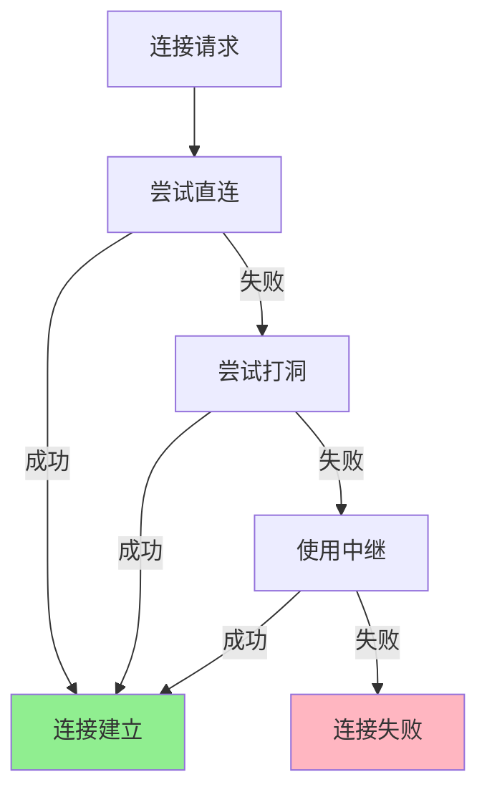
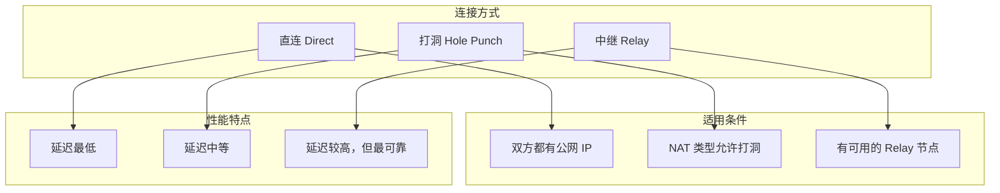

# 跨 NAT 连接

本教程将指导你如何在不同网络环境下连接节点，包括使用中继（Relay）穿透 NAT。

---

## 教程目标

```
┌─────────────────────────────────────────────────────────────────────┐
│                    本教程完成后你将学会                              │
├─────────────────────────────────────────────────────────────────────┤
│                                                                      │
│  ✅ 理解 NAT 穿透的三种方式                                          │
│  ✅ 配置 Relay 中继节点                                              │
│  ✅ 在 NAT 后的节点之间建立连接                                      │
│  ✅ 理解连接回退策略                                                 │
│                                                                      │
└─────────────────────────────────────────────────────────────────────┘
```

---

## NAT 穿透概述

```
┌─────────────────────────────────────────────────────────────────────────────┐
│                        NAT 穿透策略                                          │
├─────────────────────────────────────────────────────────────────────────────┤
│                                                                              │
│                         ┌──────────────┐                                    │
│                         │   Internet   │                                    │
│                         └──────────────┘                                    │
│                                │                                            │
│            ┌───────────────────┼───────────────────┐                       │
│            │                   │                   │                       │
│     ┌──────┴──────┐     ┌──────┴──────┐     ┌──────┴──────┐               │
│     │   NAT A     │     │   Relay     │     │   NAT B     │               │
│     │  (家庭路由) │     │  (公网节点) │     │  (公司防火墙)│               │
│     └──────┬──────┘     └─────────────┘     └──────┬──────┘               │
│            │                                       │                       │
│     ┌──────┴──────┐                         ┌──────┴──────┐               │
│     │   Node A    │                         │   Node B    │               │
│     │ 192.168.1.x │                         │ 10.0.0.x    │               │
│     └─────────────┘                         └─────────────┘               │
│                                                                              │
│  连接策略（按优先级）：                                                      │
│  ─────────────────────                                                      │
│  1. 直连 (Direct)     - 如果两边都有公网 IP                                 │
│  2. 打洞 (Hole Punch) - 尝试 UDP 打洞穿透 NAT                               │
│  3. 中继 (Relay)      - 通过公网 Relay 节点中转                             │
│                                                                              │
└─────────────────────────────────────────────────────────────────────────────┘
```

---

## 连接回退流程



---

## 网络拓扑

本教程使用以下网络拓扑：

```
┌─────────────────────────────────────────────────────────────────────────────┐
│                         示例网络拓扑                                         │
├─────────────────────────────────────────────────────────────────────────────┤
│                                                                              │
│  ┌─────────────────┐                        ┌─────────────────┐            │
│  │    网络 A       │                        │    网络 B       │            │
│  │  192.168.1.0/24 │                        │  10.0.0.0/24    │            │
│  │                 │                        │                 │            │
│  │  ┌───────────┐  │                        │  ┌───────────┐  │            │
│  │  │  Node A   │  │      ┌─────────┐      │  │  Node B   │  │            │
│  │  │ .100:8001 │──┼──────│  Relay  │──────┼──│ .50:8002  │  │            │
│  │  └───────────┘  │      │ 公网 IP │      │  └───────────┘  │            │
│  │                 │      └─────────┘      │                 │            │
│  └─────────────────┘                        └─────────────────┘            │
│                                                                              │
│  场景说明：                                                                  │
│  • Node A 和 Node B 在不同的局域网                                          │
│  • 两者都在 NAT 后面                                                        │
│  • 通过公网 Relay 节点进行中继                                              │
│                                                                              │
└─────────────────────────────────────────────────────────────────────────────┘
```

---

## 步骤 1：配置 Relay 节点

Relay 节点需要部署在公网上，有固定 IP 地址。

创建文件 `relay/main.go`：

```go
package main

import (
    "context"
    "fmt"
    "log"
    "os"
    "os/signal"
    "syscall"

    "github.com/dep2p/go-dep2p"
    "github.com/dep2p/go-dep2p/pkg/types"
)

func main() {
    fmt.Println("╔════════════════════════════════════════╗")
    fmt.Println("║      DeP2P Relay Node - 中继节点       ║")
    fmt.Println("╚════════════════════════════════════════╝")
    fmt.Println()

    ctx, cancel := context.WithCancel(context.Background())
    defer cancel()

    // 捕获中断信号
    signalCh := make(chan os.Signal, 1)
    signal.Notify(signalCh, syscall.SIGINT, syscall.SIGTERM)
    go func() {
        <-signalCh
        fmt.Println("\n关闭中继节点...")
        cancel()
    }()

    // ========================================
    // 创建 Relay 节点
    // ========================================
    fmt.Println("正在启动 Relay 节点...")
    node, err := dep2p.StartNode(ctx,
        dep2p.WithPreset(dep2p.PresetServer), // 服务器预设
        dep2p.WithListenPort(4001),           // 固定端口
        dep2p.WithRelayService(true),         // 启用中继服务
    )
    if err != nil {
        log.Fatalf("启动失败: %v", err)
    }
    defer node.Close()

    fmt.Printf("✅ Relay 节点已启动\n")
    fmt.Printf("   节点 ID: %s\n", node.ID())
    fmt.Println()
    fmt.Println("监听地址:")
    for _, addr := range node.ListenAddrs() {
        fmt.Printf("   %s\n", addr)
    }
    fmt.Println()

    // 加入系统 Realm（Relay 服务不需要特定业务 Realm）
    realmID := types.RealmID("relay-network")
    if err := node.Realm().JoinRealm(ctx, realmID); err != nil {
        log.Fatalf("加入 Realm 失败: %v", err)
    }

    // 打印连接信息
    fmt.Println("════════════════════════════════════════")
    fmt.Println("Relay 节点已就绪！")
    fmt.Println()
    fmt.Println("其他节点可以使用以下地址连接到此 Relay：")
    for _, addr := range node.ListenAddrs() {
        fmt.Printf("   %s/p2p/%s\n", addr, node.ID())
    }
    fmt.Println()
    fmt.Println("按 Ctrl+C 关闭")
    fmt.Println("════════════════════════════════════════")

    <-ctx.Done()
    fmt.Println("Relay 节点已关闭")
}
```

---

## 步骤 2：配置 NAT 后的节点 A

创建文件 `node_a/main.go`：

```go
package main

import (
    "context"
    "fmt"
    "log"
    "os"
    "os/signal"
    "syscall"

    "github.com/dep2p/go-dep2p"
    "github.com/dep2p/go-dep2p/pkg/types"
)

// Relay 节点的完整地址（需要替换为实际地址）
var relayAddr = "/ip4/1.2.3.4/udp/4001/quic-v1/p2p/QmRelayNodeID..."

const echoProtocol = "/echo/1.0.0"

func main() {
    fmt.Println("╔════════════════════════════════════════╗")
    fmt.Println("║      DeP2P Node A - NAT 后节点         ║")
    fmt.Println("╚════════════════════════════════════════╝")
    fmt.Println()

    // 从命令行获取 Relay 地址
    if len(os.Args) > 1 {
        relayAddr = os.Args[1]
    }

    ctx, cancel := context.WithCancel(context.Background())
    defer cancel()

    signalCh := make(chan os.Signal, 1)
    signal.Notify(signalCh, syscall.SIGINT, syscall.SIGTERM)
    go func() {
        <-signalCh
        fmt.Println("\n关闭节点...")
        cancel()
    }()

    // ========================================
    // 创建节点（配置 Bootstrap 节点）
    // ========================================
    fmt.Println("正在启动节点...")
    node, err := dep2p.StartNode(ctx,
        dep2p.WithPreset(dep2p.PresetDesktop),
        dep2p.WithBootstrapPeers([]string{relayAddr}), // 使用 Relay 作为 Bootstrap
        dep2p.WithEnableRelay(true),                   // 启用中继客户端
    )
    if err != nil {
        log.Fatalf("启动失败: %v", err)
    }
    defer node.Close()

    fmt.Printf("✅ 节点已启动\n")
    fmt.Printf("   节点 ID: %s\n", node.ID())
    fmt.Println()

    // 加入 Realm
    realmID := types.RealmID("cross-nat-demo")
    if err := node.Realm().JoinRealm(ctx, realmID); err != nil {
        log.Fatalf("加入 Realm 失败: %v", err)
    }
    fmt.Printf("✅ 已加入 Realm: %s\n", realmID)
    fmt.Println()

    // 注册 Echo 处理器
    node.Endpoint().SetProtocolHandler(echoProtocol, func(stream dep2p.Stream) {
        defer stream.Close()
        
        buf := make([]byte, 1024)
        n, err := stream.Read(buf)
        if err != nil {
            return
        }
        
        message := string(buf[:n])
        fmt.Printf("\n📨 收到消息: %s\n", message)
        fmt.Printf("   来自: %s\n", stream.RemotePeer().ShortString())
        
        // Echo 回复
        response := fmt.Sprintf("Echo: %s", message)
        stream.Write([]byte(response))
        fmt.Printf("📤 已回复: %s\n", response)
    })

    fmt.Println("════════════════════════════════════════")
    fmt.Println("Node A 已就绪！")
    fmt.Println()
    fmt.Println("请在另一个网络启动 Node B，使用以下 NodeID 连接：")
    fmt.Printf("   %s\n", node.ID())
    fmt.Println()
    fmt.Println("按 Ctrl+C 关闭")
    fmt.Println("════════════════════════════════════════")

    <-ctx.Done()
}
```

---

## 步骤 3：配置 NAT 后的节点 B

创建文件 `node_b/main.go`：

```go
package main

import (
    "context"
    "fmt"
    "log"
    "os"
    "time"

    "github.com/dep2p/go-dep2p"
    "github.com/dep2p/go-dep2p/pkg/types"
)

// Relay 节点的完整地址
var relayAddr = "/ip4/1.2.3.4/udp/4001/quic-v1/p2p/QmRelayNodeID..."

const echoProtocol = "/echo/1.0.0"

func main() {
    fmt.Println("╔════════════════════════════════════════╗")
    fmt.Println("║      DeP2P Node B - NAT 后节点         ║")
    fmt.Println("╚════════════════════════════════════════╝")
    fmt.Println()

    // 解析命令行参数
    if len(os.Args) < 2 {
        fmt.Println("用法: go run main.go <NodeA的NodeID> [Relay地址]")
        os.Exit(1)
    }
    nodeAIDStr := os.Args[1]
    if len(os.Args) > 2 {
        relayAddr = os.Args[2]
    }

    ctx, cancel := context.WithTimeout(context.Background(), 60*time.Second)
    defer cancel()

    // ========================================
    // 创建节点
    // ========================================
    fmt.Println("正在启动节点...")
    node, err := dep2p.StartNode(ctx,
        dep2p.WithPreset(dep2p.PresetDesktop),
        dep2p.WithBootstrapPeers([]string{relayAddr}),
        dep2p.WithEnableRelay(true),
    )
    if err != nil {
        log.Fatalf("启动失败: %v", err)
    }
    defer node.Close()

    fmt.Printf("✅ 节点已启动\n")
    fmt.Printf("   节点 ID: %s\n", node.ID())
    fmt.Println()

    // 加入 Realm（必须与 Node A 相同）
    realmID := types.RealmID("cross-nat-demo")
    if err := node.Realm().JoinRealm(ctx, realmID); err != nil {
        log.Fatalf("加入 Realm 失败: %v", err)
    }
    fmt.Printf("✅ 已加入 Realm: %s\n", realmID)
    fmt.Println()

    // 解析目标节点 ID
    nodeAID, err := types.ParseNodeID(nodeAIDStr)
    if err != nil {
        log.Fatalf("解析 NodeID 失败: %v", err)
    }

    // ========================================
    // 连接到 Node A（自动尝试各种穿透方式）
    // ========================================
    fmt.Println("正在连接到 Node A...")
    fmt.Println("   尝试顺序: 直连 → 打洞 → 中继")
    fmt.Println()

    startTime := time.Now()
    conn, err := node.Connect(ctx, nodeAID)
    if err != nil {
        log.Fatalf("连接失败: %v", err)
    }
    connectTime := time.Since(startTime)

    fmt.Printf("✅ 连接成功！耗时: %v\n", connectTime)
    fmt.Println()

    // ========================================
    // 发送测试消息
    // ========================================
    fmt.Println("发送测试消息...")
    stream, err := conn.OpenStream(ctx, echoProtocol)
    if err != nil {
        log.Fatalf("打开流失败: %v", err)
    }
    defer stream.Close()

    testMessage := "Hello from Node B via NAT!"
    _, err = stream.Write([]byte(testMessage))
    if err != nil {
        log.Fatalf("发送失败: %v", err)
    }
    fmt.Printf("📤 已发送: %s\n", testMessage)

    // 读取响应
    buf := make([]byte, 1024)
    n, err := stream.Read(buf)
    if err != nil {
        log.Fatalf("读取响应失败: %v", err)
    }
    fmt.Printf("📨 收到响应: %s\n", string(buf[:n]))
    fmt.Println()

    // ========================================
    // 完成
    // ========================================
    fmt.Println("════════════════════════════════════════")
    fmt.Println("🎉 跨 NAT 连接测试成功！")
    fmt.Printf("   连接方式: 自动选择（可能使用中继）\n")
    fmt.Printf("   连接耗时: %v\n", connectTime)
    fmt.Println("════════════════════════════════════════")
}
```

---

## 步骤 4：运行测试

### 1. 启动 Relay 节点（在公网服务器上）

```bash
cd relay
go run main.go
```

记录输出的完整地址，例如：

```
/ip4/1.2.3.4/udp/4001/quic-v1/p2p/QmRelay...
```

### 2. 启动 Node A（在网络 A 中）

```bash
cd node_a
go run main.go "/ip4/1.2.3.4/udp/4001/quic-v1/p2p/QmRelay..."
```

记录输出的 NodeID。

### 3. 启动 Node B（在网络 B 中）

```bash
cd node_b
go run main.go "QmNodeA..." "/ip4/1.2.3.4/udp/4001/quic-v1/p2p/QmRelay..."
```

---

## 预期输出

### Relay 节点

```
╔════════════════════════════════════════╗
║      DeP2P Relay Node - 中继节点       ║
╚════════════════════════════════════════╝

正在启动 Relay 节点...
✅ Relay 节点已启动
   节点 ID: QmRelay...

监听地址:
   /ip4/1.2.3.4/udp/4001/quic-v1

════════════════════════════════════════
Relay 节点已就绪！

其他节点可以使用以下地址连接到此 Relay：
   /ip4/1.2.3.4/udp/4001/quic-v1/p2p/QmRelay...

按 Ctrl+C 关闭
════════════════════════════════════════
```

### Node A

```
╔════════════════════════════════════════╗
║      DeP2P Node A - NAT 后节点         ║
╚════════════════════════════════════════╝

正在启动节点...
✅ 节点已启动
   节点 ID: QmNodeA...

✅ 已加入 Realm: cross-nat-demo

════════════════════════════════════════
Node A 已就绪！

请在另一个网络启动 Node B，使用以下 NodeID 连接：
   QmNodeA...

按 Ctrl+C 关闭
════════════════════════════════════════

📨 收到消息: Hello from Node B via NAT!
   来自: QmNodeB...
📤 已回复: Echo: Hello from Node B via NAT!
```

### Node B

```
╔════════════════════════════════════════╗
║      DeP2P Node B - NAT 后节点         ║
╚════════════════════════════════════════╝

正在启动节点...
✅ 节点已启动
   节点 ID: QmNodeB...

✅ 已加入 Realm: cross-nat-demo

正在连接到 Node A...
   尝试顺序: 直连 → 打洞 → 中继

✅ 连接成功！耗时: 1.2s

发送测试消息...
📤 已发送: Hello from Node B via NAT!
📨 收到响应: Echo: Hello from Node B via NAT!

════════════════════════════════════════
🎉 跨 NAT 连接测试成功！
   连接方式: 自动选择（可能使用中继）
   连接耗时: 1.2s
════════════════════════════════════════
```

---

## 连接方式说明



### NAT 类型对打洞的影响

| NAT 类型 | 打洞成功率 | 说明 |
|----------|-----------|------|
| Full Cone | 高 | 最容易穿透 |
| Restricted Cone | 中 | 需要配合 |
| Port Restricted | 低 | 困难 |
| Symmetric | 极低 | 几乎不可能，需要中继 |

---

## 故障排查

### 问题 1：无法连接到 Relay

**症状**：节点启动时报错 "connect to bootstrap failed"

**解决方案**：
- 确认 Relay 节点正在运行
- 确认 Relay 地址正确（包含完整的 NodeID）
- 检查防火墙是否允许 UDP 4001 端口

### 问题 2：通过 Relay 连接超时

**症状**：连接花费很长时间或超时

**解决方案**：
```go
// 增加超时时间
ctx, cancel := context.WithTimeout(context.Background(), 120*time.Second)

// 或者直接指定使用中继
conn, err := node.ConnectViaRelay(ctx, nodeAID, relayNodeID)
```

### 问题 3：连接后消息丢失

**症状**：连接成功但消息无响应

**解决方案**：
- 确认两节点加入了相同的 Realm
- 检查协议标识符是否一致
- 添加消息确认机制

---

## 高级配置

### 使用多个 Relay

```go
node, err := dep2p.StartNode(ctx,
    dep2p.WithPreset(dep2p.PresetDesktop),
    dep2p.WithBootstrapPeers([]string{
        relay1Addr,
        relay2Addr,
        relay3Addr,
    }),
    dep2p.WithEnableRelay(true),
)
```

### 自动选择最佳 Relay

DeP2P 会自动选择延迟最低的 Relay 节点进行中继。

---

## 下一步

- [Realm 应用](04-realm-application.md) - 深入理解 Realm 隔离
- [Hello World](01-hello-world.md) - 回顾基础概念
- [安全聊天](02-secure-chat.md) - 构建聊天应用
