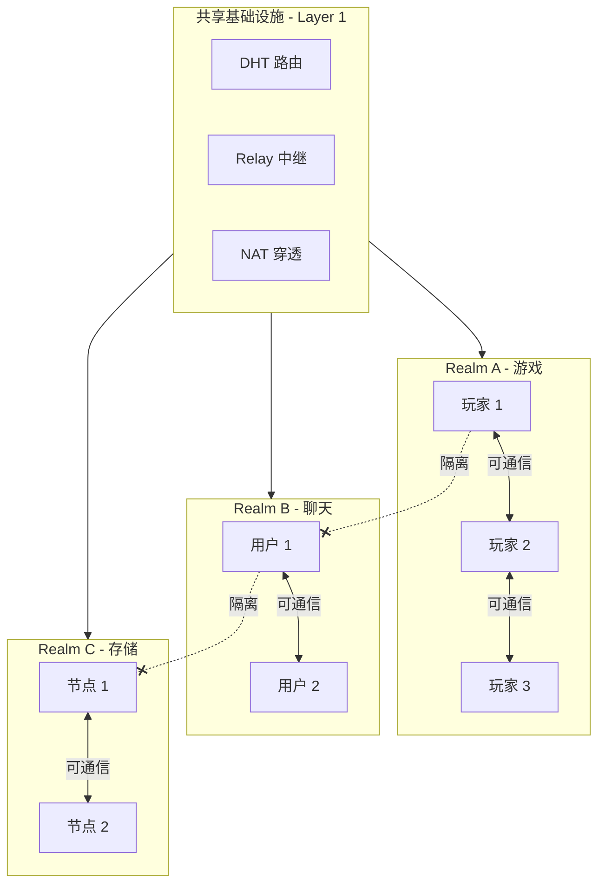

# 构建 Realm 应用

本教程将指导你深入理解 Realm 的隔离机制，并构建一个多 Realm 的应用示例。

---

## 教程目标

```
┌─────────────────────────────────────────────────────────────────────┐
│                    本教程完成后你将学会                              │
├─────────────────────────────────────────────────────────────────────┤
│                                                                      │
│  ✅ 理解 Realm 的核心概念和设计目的                                  │
│  ✅ 验证 Realm 的强制隔离机制                                        │
│  ✅ 实现 Realm 的加入、离开和切换                                    │
│  ✅ 构建多 Realm 场景的应用                                          │
│                                                                      │
└─────────────────────────────────────────────────────────────────────┘
```

---

## Realm 核心概念

```
┌─────────────────────────────────────────────────────────────────────────────┐
│                           Realm 核心概念                                     │
├─────────────────────────────────────────────────────────────────────────────┤
│                                                                              │
│  什么是 Realm？                                                              │
│  ─────────────                                                              │
│  Realm 是 DeP2P 的业务隔离单元，类似于"虚拟网络"或"聊天室"。                 │
│  同一 Realm 内的节点可以互相发现和通信，不同 Realm 之间完全隔离。            │
│                                                                              │
│  为什么需要 Realm？                                                          │
│  ─────────────────                                                          │
│  • 业务隔离：不同应用/业务使用不同 Realm，避免互相干扰                       │
│  • 节点发现：只发现同 Realm 的节点，减少网络噪音                             │
│  • 访问控制：可以通过 RealmAuth 实现准入控制                                 │
│                                                                              │
│  严格单 Realm 规则                                                          │
│  ─────────────────                                                          │
│  • 节点同一时间只能属于一个 Realm                                            │
│  • 必须先 JoinRealm 才能使用业务 API                                        │
│  • 未加入 Realm 调用业务 API 会返回 ErrNotMember                            │
│                                                                              │
└─────────────────────────────────────────────────────────────────────────────┘
```

---

## Realm 隔离模型



---

## 步骤 1：验证 Realm 强制隔离

首先，让我们验证 Realm 的强制隔离机制。

创建文件 `realm_demo/main.go`：

```go
package main

import (
    "context"
    "fmt"
    "log"
    "time"

    "github.com/dep2p/go-dep2p"
    "github.com/dep2p/go-dep2p/pkg/interfaces/endpoint"
    "github.com/dep2p/go-dep2p/pkg/types"
)

func main() {
    fmt.Println("╔══════════════════════════════════════════════╗")
    fmt.Println("║      DeP2P Realm 强制隔离演示                 ║")
    fmt.Println("╚══════════════════════════════════════════════╝")
    fmt.Println()

    ctx, cancel := context.WithTimeout(context.Background(), 30*time.Second)
    defer cancel()

    // ========================================
    // Step 1: 创建节点
    // ========================================
    fmt.Println("━━━ Step 1: 创建节点 ━━━")
    node, err := dep2p.StartNode(ctx,
        dep2p.WithPreset(dep2p.PresetDesktop),
    )
    if err != nil {
        log.Fatalf("启动节点失败: %v", err)
    }
    defer node.Close()

    fmt.Printf("✅ 节点已创建\n")
    fmt.Printf("   节点 ID: %s\n", node.ID().ShortString())
    fmt.Println()

    // ========================================
    // Step 2: 验证未加入 Realm 时的行为
    // ========================================
    fmt.Println("━━━ Step 2: 验证强制隔离 ━━━")
    fmt.Println("未 JoinRealm 时，业务 API 必须返回 ErrNotMember")
    fmt.Println()

    // 创建一个目标节点用于测试
    targetNode, _ := dep2p.StartNode(ctx, dep2p.WithPreset(dep2p.PresetDesktop))
    defer targetNode.Close()
    targetID := targetNode.ID()

    // 测试 Send
    fmt.Print("尝试 Send... ")
    err = node.Send(ctx, targetID, "/test/1.0.0", []byte("hello"))
    if err == endpoint.ErrNotMember {
        fmt.Println("✅ 正确返回 ErrNotMember")
    } else if err != nil {
        fmt.Printf("⚠️  返回其他错误: %v\n", err)
    } else {
        fmt.Println("❌ 未返回错误（不应该发生）")
    }

    // 测试 Publish
    fmt.Print("尝试 Publish... ")
    err = node.Publish(ctx, "test-topic", []byte("message"))
    if err == endpoint.ErrNotMember {
        fmt.Println("✅ 正确返回 ErrNotMember")
    } else if err != nil {
        fmt.Printf("⚠️  返回其他错误: %v\n", err)
    } else {
        fmt.Println("❌ 未返回错误（不应该发生）")
    }
    fmt.Println()

    // ========================================
    // Step 3: 加入 Realm
    // ========================================
    fmt.Println("━━━ Step 3: 加入 Realm ━━━")
    realmID := types.RealmID("demo-realm")
    
    fmt.Printf("加入 Realm: %s\n", realmID)
    if err := node.Realm().JoinRealm(ctx, realmID); err != nil {
        log.Fatalf("加入 Realm 失败: %v", err)
    }
    fmt.Printf("✅ 已加入 Realm: %s\n", node.Realm().CurrentRealm())
    fmt.Println()

    // ========================================
    // Step 4: 验证加入后的行为
    // ========================================
    fmt.Println("━━━ Step 4: 验证加入后的行为 ━━━")
    
    // 目标节点也需要加入同一 Realm
    targetNode.Realm().JoinRealm(ctx, realmID)
    
    fmt.Print("尝试 Send... ")
    err = node.Send(ctx, targetID, "/test/1.0.0", []byte("hello"))
    if err == nil {
        fmt.Println("✅ 发送成功（或正在尝试连接）")
    } else if err != endpoint.ErrNotMember {
        fmt.Printf("ℹ️  返回: %v（非 ErrNotMember，可能是连接问题）\n", err)
    } else {
        fmt.Println("❌ 返回 ErrNotMember（不应该发生）")
    }
    fmt.Println()

    // ========================================
    // Step 5: 验证严格单 Realm
    // ========================================
    fmt.Println("━━━ Step 5: 验证严格单 Realm ━━━")
    fmt.Println("尝试加入第二个 Realm（应该失败）...")
    
    err = node.Realm().JoinRealm(ctx, types.RealmID("another-realm"))
    if err != nil {
        fmt.Printf("✅ 正确拒绝: %v\n", err)
    } else {
        fmt.Println("❌ 未拒绝（不应该发生）")
    }
    fmt.Println()

    // ========================================
    // Step 6: 切换 Realm
    // ========================================
    fmt.Println("━━━ Step 6: 切换 Realm ━━━")
    fmt.Printf("当前 Realm: %s\n", node.Realm().CurrentRealm())
    
    fmt.Println("先离开当前 Realm...")
    if err := node.Realm().LeaveRealm(ctx); err != nil {
        fmt.Printf("离开失败: %v\n", err)
    } else {
        fmt.Println("✅ 已离开 Realm")
    }
    
    newRealmID := types.RealmID("new-realm")
    fmt.Printf("加入新 Realm: %s\n", newRealmID)
    if err := node.Realm().JoinRealm(ctx, newRealmID); err != nil {
        fmt.Printf("加入失败: %v\n", err)
    } else {
        fmt.Printf("✅ 已加入新 Realm: %s\n", node.Realm().CurrentRealm())
    }
    fmt.Println()

    // ========================================
    // 完成
    // ========================================
    fmt.Println("════════════════════════════════════════")
    fmt.Println("🎉 Realm 演示完成！")
    fmt.Println()
    fmt.Println("关键要点:")
    fmt.Println("  1. 未加入 Realm → 业务 API 返回 ErrNotMember")
    fmt.Println("  2. 严格单 Realm → 必须先离开再加入新的")
    fmt.Println("  3. Realm 隔离 → 不同 Realm 的节点无法通信")
    fmt.Println("════════════════════════════════════════")
}
```

---

## 步骤 2：多 Realm 隔离验证

创建文件 `multi_realm/main.go`：

```go
package main

import (
    "context"
    "fmt"
    "log"
    "sync"
    "time"

    "github.com/dep2p/go-dep2p"
    "github.com/dep2p/go-dep2p/pkg/types"
)

const testProtocol = "/realm-test/1.0.0"

func main() {
    fmt.Println("╔══════════════════════════════════════════════╗")
    fmt.Println("║      DeP2P 多 Realm 隔离验证                  ║")
    fmt.Println("╚══════════════════════════════════════════════╝")
    fmt.Println()

    ctx, cancel := context.WithTimeout(context.Background(), 30*time.Second)
    defer cancel()

    // ========================================
    // 创建三个节点
    // ========================================
    fmt.Println("创建三个节点...")
    
    nodeA, _ := dep2p.StartNode(ctx, dep2p.WithPreset(dep2p.PresetDesktop))
    nodeB, _ := dep2p.StartNode(ctx, dep2p.WithPreset(dep2p.PresetDesktop))
    nodeC, _ := dep2p.StartNode(ctx, dep2p.WithPreset(dep2p.PresetDesktop))
    defer nodeA.Close()
    defer nodeB.Close()
    defer nodeC.Close()

    fmt.Printf("  Node A: %s\n", nodeA.ID().ShortString())
    fmt.Printf("  Node B: %s\n", nodeB.ID().ShortString())
    fmt.Printf("  Node C: %s\n", nodeC.ID().ShortString())
    fmt.Println()

    // ========================================
    // 分配到不同 Realm
    // ========================================
    fmt.Println("分配节点到不同 Realm:")
    
    realmAlpha := types.RealmID("realm-alpha")
    realmBeta := types.RealmID("realm-beta")
    
    nodeA.Realm().JoinRealm(ctx, realmAlpha)
    nodeB.Realm().JoinRealm(ctx, realmAlpha)
    nodeC.Realm().JoinRealm(ctx, realmBeta)
    
    fmt.Printf("  Node A → %s\n", realmAlpha)
    fmt.Printf("  Node B → %s\n", realmAlpha)
    fmt.Printf("  Node C → %s\n", realmBeta)
    fmt.Println()

    // ========================================
    // 注册消息处理器
    // ========================================
    var received sync.Map
    
    registerHandler := func(node dep2p.Node, name string) {
        node.Endpoint().SetProtocolHandler(testProtocol, func(stream dep2p.Stream) {
            defer stream.Close()
            buf := make([]byte, 256)
            n, _ := stream.Read(buf)
            received.Store(name, string(buf[:n]))
            fmt.Printf("  [%s] 收到消息: %s\n", name, string(buf[:n]))
        })
    }
    
    registerHandler(nodeA, "A")
    registerHandler(nodeB, "B")
    registerHandler(nodeC, "C")

    // ========================================
    // 测试同 Realm 通信
    // ========================================
    fmt.Println("━━━ 测试 1: 同 Realm 通信 (A → B) ━━━")
    fmt.Println("Node A 和 Node B 在同一 Realm (realm-alpha)")
    fmt.Println()

    // 等待 mDNS 发现
    time.Sleep(2 * time.Second)
    
    conn, err := nodeA.Connect(ctx, nodeB.ID())
    if err != nil {
        fmt.Printf("  连接失败: %v\n", err)
    } else {
        stream, err := conn.OpenStream(ctx, testProtocol)
        if err != nil {
            fmt.Printf("  打开流失败: %v\n", err)
        } else {
            message := "Hello from A to B (same realm)"
            stream.Write([]byte(message))
            fmt.Printf("  [A] 发送消息: %s\n", message)
            stream.Close()
        }
    }
    
    time.Sleep(500 * time.Millisecond)
    if _, ok := received.Load("B"); ok {
        fmt.Println("  ✅ 同 Realm 通信成功")
    } else {
        fmt.Println("  ⚠️  消息可能延迟或需要更多时间")
    }
    fmt.Println()

    // ========================================
    // 测试跨 Realm 通信（应该失败）
    // ========================================
    fmt.Println("━━━ 测试 2: 跨 Realm 通信 (A → C) ━━━")
    fmt.Println("Node A 在 realm-alpha，Node C 在 realm-beta")
    fmt.Println()

    // 尝试连接不同 Realm 的节点
    _, err = nodeA.Connect(ctx, nodeC.ID())
    if err != nil {
        fmt.Printf("  ✅ 正确：跨 Realm 连接被阻止或超时\n")
        fmt.Printf("     错误: %v\n", err)
    } else {
        fmt.Println("  ⚠️  连接成功，但业务消息应被隔离")
    }
    fmt.Println()

    // ========================================
    // 完成
    // ========================================
    fmt.Println("════════════════════════════════════════")
    fmt.Println("🎉 多 Realm 隔离验证完成！")
    fmt.Println()
    fmt.Println("验证结果:")
    fmt.Println("  ✅ 同 Realm 节点可以通信")
    fmt.Println("  ✅ 不同 Realm 节点被隔离")
    fmt.Println("════════════════════════════════════════")
}
```

---

## 步骤 3：完整的 Realm 应用示例

创建文件 `realm_app/main.go`：

```go
package main

import (
    "bufio"
    "context"
    "fmt"
    "log"
    "os"
    "os/signal"
    "strings"
    "syscall"

    "github.com/dep2p/go-dep2p"
    "github.com/dep2p/go-dep2p/pkg/types"
)

const chatProtocol = "/realm-chat/1.0.0"

func main() {
    fmt.Println("╔══════════════════════════════════════════════╗")
    fmt.Println("║      DeP2P Realm 应用 - 多房间聊天            ║")
    fmt.Println("╚══════════════════════════════════════════════╝")
    fmt.Println()

    ctx, cancel := context.WithCancel(context.Background())
    defer cancel()

    signalCh := make(chan os.Signal, 1)
    signal.Notify(signalCh, syscall.SIGINT, syscall.SIGTERM)
    go func() {
        <-signalCh
        fmt.Println("\n再见!")
        cancel()
    }()

    // 创建节点
    node, err := dep2p.StartNode(ctx, dep2p.WithPreset(dep2p.PresetDesktop))
    if err != nil {
        log.Fatalf("启动失败: %v", err)
    }
    defer node.Close()

    fmt.Printf("节点 ID: %s\n", node.ID().ShortString())
    fmt.Println()

    // 打印帮助信息
    printHelp()

    // 开始命令循环
    reader := bufio.NewReader(os.Stdin)
    for {
        select {
        case <-ctx.Done():
            return
        default:
        }

        fmt.Print("> ")
        input, err := reader.ReadString('\n')
        if err != nil {
            continue
        }
        input = strings.TrimSpace(input)
        
        if input == "" {
            continue
        }

        parts := strings.Fields(input)
        cmd := parts[0]

        switch cmd {
        case "/join":
            if len(parts) < 2 {
                fmt.Println("用法: /join <房间名>")
                continue
            }
            roomName := parts[1]
            
            // 如果已在某个房间，先离开
            if node.Realm().CurrentRealm() != "" {
                fmt.Printf("离开房间: %s\n", node.Realm().CurrentRealm())
                node.Realm().LeaveRealm(ctx)
            }
            
            realmID := types.RealmID(roomName)
            if err := node.Realm().JoinRealm(ctx, realmID); err != nil {
                fmt.Printf("加入失败: %v\n", err)
            } else {
                fmt.Printf("✅ 已加入房间: %s\n", roomName)
            }

        case "/leave":
            if node.Realm().CurrentRealm() == "" {
                fmt.Println("你没有在任何房间")
                continue
            }
            roomName := node.Realm().CurrentRealm()
            if err := node.Realm().LeaveRealm(ctx); err != nil {
                fmt.Printf("离开失败: %v\n", err)
            } else {
                fmt.Printf("已离开房间: %s\n", roomName)
            }

        case "/room":
            current := node.Realm().CurrentRealm()
            if current == "" {
                fmt.Println("当前不在任何房间")
            } else {
                fmt.Printf("当前房间: %s\n", current)
            }

        case "/help":
            printHelp()

        case "/quit", "/exit":
            return

        default:
            // 发送消息到当前房间
            if node.Realm().CurrentRealm() == "" {
                fmt.Println("请先加入一个房间: /join <房间名>")
                continue
            }
            
            // 这里可以实现消息广播逻辑
            fmt.Printf("[%s] %s\n", node.Realm().CurrentRealm(), input)
        }
    }
}

func printHelp() {
    fmt.Println("命令:")
    fmt.Println("  /join <房间名>  - 加入房间（Realm）")
    fmt.Println("  /leave          - 离开当前房间")
    fmt.Println("  /room           - 查看当前房间")
    fmt.Println("  /help           - 显示帮助")
    fmt.Println("  /quit           - 退出")
    fmt.Println()
    fmt.Println("直接输入消息发送到当前房间")
    fmt.Println()
}
```

---

## 预期输出

### Realm 强制隔离演示

```
╔══════════════════════════════════════════════╗
║      DeP2P Realm 强制隔离演示                 ║
╚══════════════════════════════════════════════╝

━━━ Step 1: 创建节点 ━━━
✅ 节点已创建
   节点 ID: 5Q2STW...

━━━ Step 2: 验证强制隔离 ━━━
未 JoinRealm 时，业务 API 必须返回 ErrNotMember

尝试 Send... ✅ 正确返回 ErrNotMember
尝试 Publish... ✅ 正确返回 ErrNotMember

━━━ Step 3: 加入 Realm ━━━
加入 Realm: demo-realm
✅ 已加入 Realm: demo-realm

━━━ Step 4: 验证加入后的行为 ━━━
尝试 Send... ✅ 发送成功（或正在尝试连接）

━━━ Step 5: 验证严格单 Realm ━━━
尝试加入第二个 Realm（应该失败）...
✅ 正确拒绝: already joined a realm

━━━ Step 6: 切换 Realm ━━━
当前 Realm: demo-realm
先离开当前 Realm...
✅ 已离开 Realm
加入新 Realm: new-realm
✅ 已加入新 Realm: new-realm

════════════════════════════════════════
🎉 Realm 演示完成！

关键要点:
  1. 未加入 Realm → 业务 API 返回 ErrNotMember
  2. 严格单 Realm → 必须先离开再加入新的
  3. Realm 隔离 → 不同 Realm 的节点无法通信
════════════════════════════════════════
```

---

## Realm 最佳实践

```
┌─────────────────────────────────────────────────────────────────────────────┐
│                        Realm 最佳实践                                        │
├─────────────────────────────────────────────────────────────────────────────┤
│                                                                              │
│  1. 命名规范                                                                 │
│     ─────────                                                               │
│     • 使用有意义的名称：myapp-production, myapp-staging                     │
│     • 避免使用特殊字符                                                       │
│     • 考虑版本：myapp-v1, myapp-v2                                          │
│                                                                              │
│  2. 生命周期管理                                                             │
│     ─────────────                                                           │
│     • 启动时立即 JoinRealm                                                   │
│     • 关闭时优雅 LeaveRealm                                                  │
│     • 处理 JoinRealm 失败的情况                                              │
│                                                                              │
│  3. 错误处理                                                                 │
│     ─────────                                                               │
│     • 检查 ErrNotMember                                                     │
│     • 检查 ErrAlreadyJoined                                                 │
│     • 重试连接失败的操作                                                     │
│                                                                              │
│  4. 多环境部署                                                               │
│     ────────────                                                            │
│     • 不同环境使用不同 Realm                                                 │
│     • 配置化 Realm 名称                                                      │
│     • 避免环境交叉污染                                                       │
│                                                                              │
└─────────────────────────────────────────────────────────────────────────────┘
```

---

## 故障排查

### 问题 1：ErrNotMember

**症状**：调用业务 API 时返回 `ErrNotMember`

**原因**：节点未加入 Realm

**解决**：
```go
// 检查并加入 Realm
if node.Realm().CurrentRealm() == "" {
    node.Realm().JoinRealm(ctx, realmID)
}
```

### 问题 2：ErrAlreadyJoined

**症状**：加入 Realm 时返回 `ErrAlreadyJoined`

**原因**：尝试加入第二个 Realm

**解决**：
```go
// 先离开再加入
node.Realm().LeaveRealm(ctx)
node.Realm().JoinRealm(ctx, newRealmID)
```

### 问题 3：跨 Realm 通信失败

**症状**：节点连接成功但无法收发消息

**原因**：节点在不同 Realm

**解决**：确保通信双方在同一 Realm

---

## 下一步

- [Hello World](01-hello-world.md) - 回顾基础概念
- [安全聊天](02-secure-chat.md) - 构建聊天应用
- [跨 NAT 连接](03-cross-nat-connect.md) - 跨网络连接
- [核心概念](../concepts/core-concepts.md) - 深入理解架构
