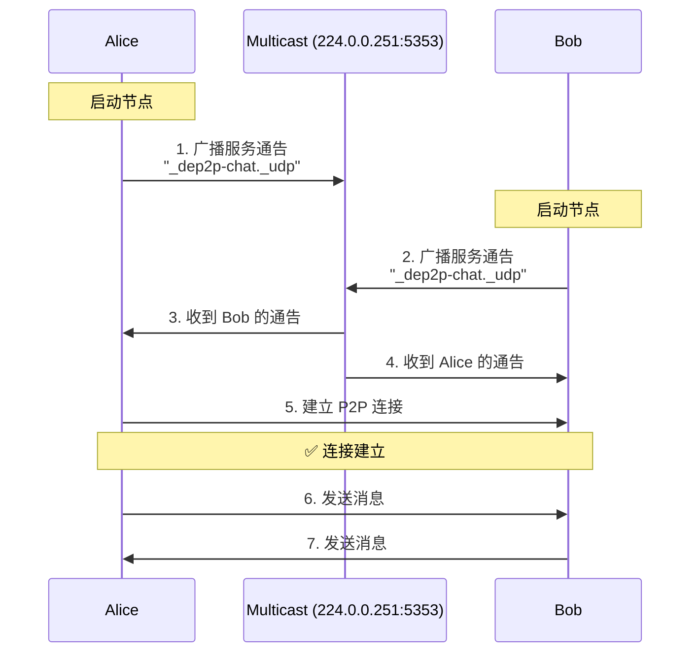

# Chat 示例 - 局域网自动发现聊天

这是一个交互式聊天示例，演示如何使用 mDNS 在局域网内自动发现其他节点并建立 P2P 连接。

## 概述

在局域网中，节点无需知道彼此的地址，只需启动程序，mDNS 会自动处理发现和连接。就像蓝牙设备自动配对一样简单！

```
局域网 (WiFi/以太网)
┌─────────────────────────────────────────┐
│                                         │
│   Alice 的电脑         Bob 的电脑       │
│   ┌─────────┐         ┌─────────┐      │
│   │  Chat   │◄─ mDNS ─►│  Chat   │     │
│   │  App    │    ↓    │  App    │      │
│   └─────────┘  自动发现  └─────────┘      │
│       ↑                    ↑            │
│       └────────P2P 连接─────┘            │
│                                         │
└─────────────────────────────────────────┘
```

## 你将学到什么

- ✅ 什么是 mDNS（多播 DNS）
- ✅ 如何在局域网内自动发现节点
- ✅ 如何管理多个对等方连接
- ✅ 如何构建交互式命令行程序
- ✅ 多节点广播消息

## 什么是 mDNS？

### 通俗解释

想象你在一个房间里喊"有人在吗？"，房间里的人听到后会回应"我在这儿！"。mDNS 就是这样工作的：

1. **你的节点广播**: "我是 Alice，正在寻找聊天伙伴"
2. **其他节点回应**: "我是 Bob，我也在聊天"
3. **自动连接**: 双方交换信息并建立连接

### 技术解释

**mDNS** (Multicast DNS) 是一种在局域网内进行服务发现的协议：

- **多播**: 一对多通信，一个节点发送，多个节点接收
- **无需中心服务器**: 节点之间直接通信
- **零配置**: 无需手动配置 IP 地址
- **端口**: 使用 UDP 5353 端口

### 使用场景

mDNS 适合：
- ✅ 局域网环境（家庭、办公室、会议室）
- ✅ 临时组网（游戏、协作、文件共享）
- ✅ IoT 设备发现

mDNS 不适合：
- ❌ 跨互联网通信（需要使用 DHT 或 Bootstrap）
- ❌ 高安全性要求（需要额外的身份验证）
- ❌ 大规模网络（会产生较多广播流量）

## 前置要求

- **网络**: 必须在同一局域网（同一 WiFi 或以太网）
- **防火墙**: 允许 UDP 5353 端口（mDNS）
- **多播**: 网络需要支持多播（大多数家庭网络支持）

### 检查网络

```bash
# 检查是否在同一网络
# 方法 1: 查看 IP 地址，确保前三段相同
# macOS/Linux
ifconfig | grep "inet "
# Windows
ipconfig

# 方法 2: 互相 ping 测试
ping 192.168.1.100  # 替换为对方的 IP
```

## 快速开始

### 第一步：启动第一个节点（Alice）

在电脑 A 上：

```bash
cd examples/chat/
go run main.go -nick Alice
```

输出：

```
╔════════════════════════════════════════╗
║     DeP2P Chat - mDNS 自动发现聊天     ║
╚════════════════════════════════════════╝

🚀 节点启动成功！
   节点 ID: 5Q2STWvBAliceNodeID...
   昵称: Alice

📡 mDNS 发现已启动，正在广播...

💬 开始聊天！直接输入消息或使用命令：
   /peers  - 查看连接的节点
   /info   - 查看本节点信息
   /help   - 显示帮助
   /quit   - 退出程序

>
```

### 第二步：启动第二个节点（Bob）

在电脑 B 上（或同一电脑的另一个终端）：

```bash
cd examples/chat/
go run main.go -nick Bob
```

### 第三步：观察自动发现

几秒钟后，Alice 的终端会显示：

```
🔍 发现新节点: Bob (5Q2STWvBBobNodeID...)
🤝 已连接到: Bob
```

Bob 的终端也会显示：

```
🔍 发现新节点: Alice (5Q2STWvBAliceNodeID...)
🤝 已连接到: Alice
```

✨ **太棒了！** 两个节点自动发现并连接，无需手动输入任何地址！

### 第四步：开始聊天

在 Alice 的终端输入：

```
> Hello Bob!
```

Bob 的终端会立即显示：

```
[Alice] Hello Bob!
```

在 Bob 的终端输入：

```
> Hi Alice! How are you?
```

Alice 的终端会显示：

```
[Bob] Hi Alice! How are you?
```

### 第五步：使用命令

查看已连接的节点：

```
> /peers

已连接的节点 (1):
  [1] Bob (5Q2STWvBBobNodeID...)
```

查看本节点信息：

```
> /info

节点信息:
  ID: 5Q2STWvBAliceNodeID...
  昵称: Alice
  监听地址: /ip4/192.168.1.100/udp/54321/quic-v1
```

## 命令参考

### 聊天命令

| 命令 | 说明 | 示例 |
|------|------|------|
| 直接输入 | 发送消息给所有连接的节点 | `Hello everyone!` |
| `/peers` | 列出当前连接的所有节点 | `/peers` |
| `/info` | 显示本节点的信息 | `/info` |
| `/connect` | 手动连接到指定节点 | `/connect <ID> <ADDR>` |
| `/help` | 显示帮助信息 | `/help` |
| `/quit` | 退出程序 | `/quit` |

### 命令详解

#### /peers - 查看连接

```
> /peers

已连接的节点 (2):
  [1] Alice (5Q2STWvBAlice...) 
  [2] Bob (5Q2STWvBBob...)
```

显示所有活跃连接的节点及其 ID。

#### /info - 节点信息

```
> /info

节点信息:
  ID: 5Q2STWvBCharlie...
  昵称: Charlie
  监听地址:
    [1] /ip4/192.168.1.102/udp/56789/quic-v1
    [2] /ip4/127.0.0.1/udp/56789/quic-v1
  已连接: 2 个节点
```

显示本节点的详细信息。

#### /connect - 手动连接

如果 mDNS 无法工作，可以手动连接：

```
> /connect 5Q2STWvBBob... /ip4/192.168.1.101/udp/54321/quic-v1

正在连接...
✅ 连接成功！
```

#### /help - 帮助

显示所有可用命令及其说明。

#### /quit - 退出

优雅地关闭所有连接并退出程序。

## 命令行参数

| 参数 | 说明 | 默认值 | 示例 |
|------|------|--------|------|
| `-nick` | 设置昵称 | 节点 ID 前 8 位 | `-nick Alice` |
| `-port` | 监听端口 | `0` (随机) | `-port 4001` |
| `-realm` | Realm ID（聊天室隔离） | `lan-chat` | `-realm my-room` |
| `-log-file` | 日志文件路径（将结构化日志写入文件） | 空（输出到控制台） | `-log-file chat.log` |

### 示例

```bash
# 使用自定义昵称
go run main.go -nick "Alice"

# 使用固定端口
go run main.go -nick "Bob" -port 5000

# 将日志写入文件（推荐，避免日志干扰聊天界面）
go run main.go -nick "Alice" -log-file chat.log

# 使用自定义 Realm（不同 Realm 的节点仍可能被系统发现，但业务连接/业务协议会被隔离）
go run main.go -nick "Alice" -realm "room-1"
go run main.go -nick "Bob" -realm "room-1"  # 同一 Realm，可以互相发现

# 默认（随机端口，自动昵称）
go run main.go
```

## mDNS 工作原理

### 发现流程



### 技术细节

1. **服务注册**: 节点启动时注册 mDNS 服务
   ```
   服务名: _dep2p-chat._udp
   端口: 节点监听端口
   TXT 记录: 节点 ID、昵称等
   ```

2. **定期广播**: 每隔一段时间重新广播（保持活跃）

3. **监听响应**: 接收其他节点的广播并记录

4. **建立连接**: 获取对方地址后建立 P2P 连接

5. **连接维护**: 定期心跳，断线重连

## 代码解析

### 关键代码 1: mDNS（底层必备能力，无需用户启用）

```go
// v1.1+：mDNS 是底层必备能力，默认开启。
// 用户只需要选择预设，使用 StartNode 一步启动（QUIC 传输）
node, err := dep2p.StartNode(ctx,
    dep2p.WithPreset(dep2p.PresetDesktop),
)
```

**解析**:
- mDNS 默认启用：无需 `WithMDNS(true)` 之类的开关
- `PresetDesktop`: 仅决定资源/参数倾向，不影响“是否启用”底层能力

### 关键代码 2: 注册聊天协议

```go
// 设置协议处理器
node.SetProtocolHandler(chatProtocol, func(stream dep2p.Stream) {
    // 每个连接会调用一次
    handleChatStream(stream, nickname)
})
```

**解析**:
- 当其他节点连接时，这个函数会被调用
- 每个对等方一个独立的 goroutine
- 流保持打开，持续接收消息

### 关键代码 3: 处理发现事件

```go
// mDNS 会自动调用此回调
func onPeerDiscovered(peerInfo dep2p.PeerInfo) {
    fmt.Printf("🔍 发现新节点: %s\n", peerInfo.ID)
    
    // 自动连接（DialByNodeID）
    conn, err := node.Connect(ctx, peerInfo.ID)
    if err == nil {
        fmt.Printf("🤝 已连接到: %s\n", getNickname(peerInfo.ID))
    }
}
```

**解析**:
- mDNS 发现新节点时自动调用
- 立即尝试建立连接
- 存储连接以便后续通信

### 关键代码 4: 广播消息

```go
func broadcastMessage(msg string) {
    peersLock.RLock()
    defer peersLock.RUnlock()
    
    // 向所有对等方发送
    for peerID, stream := range peers {
        stream.Write([]byte(msg))
    }
}
```

**解析**:
- 遍历所有活跃连接
- 并发发送消息
- 使用锁保证线程安全

## 故障排除

### 问题 1: 节点无法互相发现

**症状**: 启动两个节点后，没有看到"发现新节点"的消息。

**可能原因和解决方案**:

#### 原因 1: 不在同一网络

```bash
# 检查 IP 地址
# 电脑 A
ifconfig | grep "inet "
# 输出: inet 192.168.1.100

# 电脑 B  
ifconfig | grep "inet "
# 输出: inet 192.168.1.101

# ✅ 前三段相同 (192.168.1) = 同一网络
# ❌ 不同 = 不在同一网络
```

**解决**: 连接到同一 WiFi 或路由器。

#### 原因 2: 防火墙阻止

```bash
# macOS: 系统偏好设置 > 安全性与隐私 > 防火墙
# 允许 Go 程序接收连接

# Linux: 检查 iptables
sudo iptables -L | grep 5353

# 临时关闭防火墙测试（仅用于排查）
# 注意：测试完记得重新开启
```

#### 原因 3: 网络不支持多播

某些企业网络或公共 WiFi 禁用多播。

**检测方法**:

```bash
# 测试多播是否工作
# 在电脑 A 运行:
python3 -m http.server 8000

# 在电脑 B 访问:
curl http://192.168.1.100:8000

# 如果能访问，说明网络可达，问题在多播
```

**解决**: 
- 使用支持多播的网络
- 或使用 `/connect` 命令手动连接

### 问题 2: 连接建立但消息不显示

**症状**: 看到"已连接到..."，但发送消息没有反应。

**可能原因**:

1. **流被意外关闭**: 检查日志是否有错误
2. **编码问题**: 确保使用 UTF-8
3. **缓冲区问题**: 消息可能还在缓冲区

**解决方案**:

```go
// 发送后刷新缓冲区
stream.Write([]byte(msg))
stream.Flush()  // 如果有此方法
```

### 问题 3: Docker/虚拟机环境

**症状**: 在 Docker 容器或虚拟机中运行时，mDNS 不工作。

**原因**: 虚拟网络隔离

**解决方案**:

#### Docker
```bash
# 使用 host 网络模式
docker run --network host ...

# 或暴露 5353 端口（UDP）
docker run -p 5353:5353/udp ...
```

#### 虚拟机
- 使用桥接模式（Bridged），不要用 NAT
- 确保虚拟机在主机同一网段

### 问题 4: 发现延迟

**症状**: 节点启动后很久才发现对方。

**这是正常现象**:
- mDNS 通告间隔通常是 5-10 秒
- 首次发现可能需要 10-30 秒

**加快发现**:
- 无需操作，耐心等待
- 或使用 `/connect` 手动连接

### 问题 5: 昵称包含特殊字符

**症状**: 昵称中的中文或表情符号显示异常。

**解决方案**:

```bash
# 确保终端支持 UTF-8
# macOS/Linux 默认支持

# Windows 需要设置
chcp 65001  # 切换到 UTF-8
```

## 进阶练习

### 练习 1: 添加私聊功能

修改代码，支持发送消息给特定用户：

```go
// 命令格式: @Bob Hello!
if strings.HasPrefix(msg, "@") {
    parts := strings.SplitN(msg, " ", 2)
    targetNick := parts[0][1:]  // 去掉 @
    message := parts[1]
    
    // 查找目标节点并发送
    sendToNick(targetNick, message)
}
```

### 练习 2: 显示在线状态

定期广播在线状态：

```go
// 每 30 秒发送心跳
ticker := time.NewTicker(30 * time.Second)
for range ticker.C {
    broadcastMessage("❤️ HEARTBEAT")
}
```

### 练习 3: 消息历史

保存聊天记录：

```go
var messageHistory []string

func saveMessage(msg string) {
    messageHistory = append(messageHistory, 
        fmt.Sprintf("[%s] %s", time.Now().Format("15:04:05"), msg))
}

// 命令: /history 查看历史
```

### 练习 4: 文件共享

实现简单的文件发送：

```go
// 命令: /send file.txt
func sendFile(filename string) {
    data, _ := os.ReadFile(filename)
    // 发送文件头
    stream.Write([]byte("FILE:" + filename + "\n"))
    // 发送文件内容
    stream.Write(data)
}
```

### 练习 5: 群组功能

支持创建多个聊天群组：

```go
// 命令: /join #general
// 只向同一群组的节点发送消息
groups := map[string][]dep2p.PeerID{
    "#general": {...},
    "#tech": {...},
}
```

## 与 Echo 示例的对比

| 特性 | Echo 示例 | Chat 示例 |
|------|----------|----------|
| **发现方式** | 手动指定地址 | mDNS 自动发现 |
| **连接模式** | 单次请求-响应 | 持久连接 |
| **通信方向** | 单向（有请求才有响应） | 双向（随时发送） |
| **节点数量** | 2 个（1 listener + 1 dialer） | 多个（自动组网） |
| **适用场景** | 学习基础、简单测试 | 实际应用、多方协作 |

## 下一步

完成 Chat 示例后，继续学习：

1. **[Relay 示例](../relay/)** - 学习跨互联网通信
2. **构建自己的应用** - 参考此示例构建实用程序

## 相关资源

- **mDNS 实现**: [internal/core/discovery/mdns/](../../internal/core/discovery/mdns/)
- **服务发现**: [docs/01-design/protocols/network/01-discovery.md](../../docs/01-design/protocols/network/01-discovery.md)
- **多对等方通信**: [design/architecture/components.md](../../design/architecture/components.md)

## 参考项目

- [go-libp2p examples/chat-with-mdns](https://github.com/libp2p/go-libp2p)
- [mdns protocol spec](https://datatracker.ietf.org/doc/html/rfc6762)

---

🎉 **太棒了！** 你已经掌握了 mDNS 自动发现和多节点通信！
