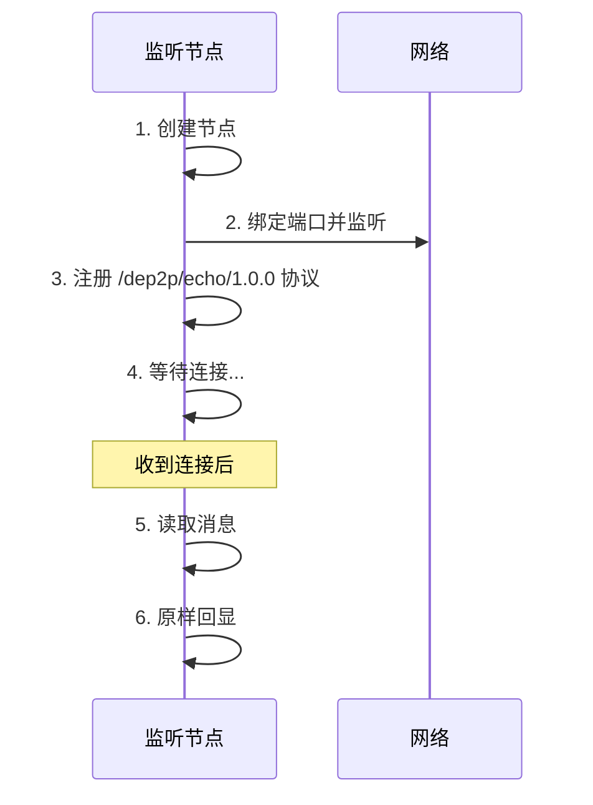
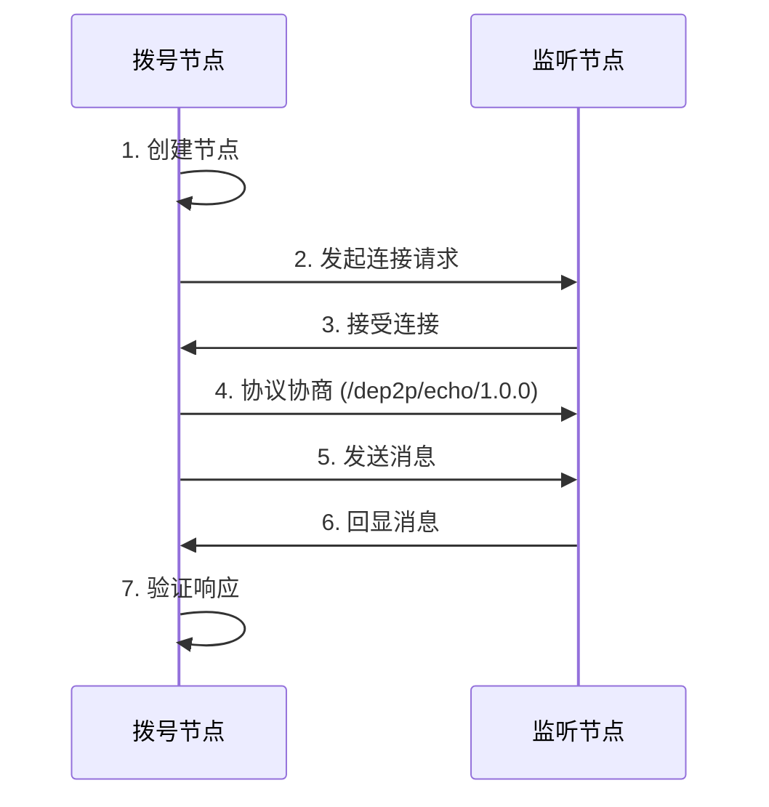
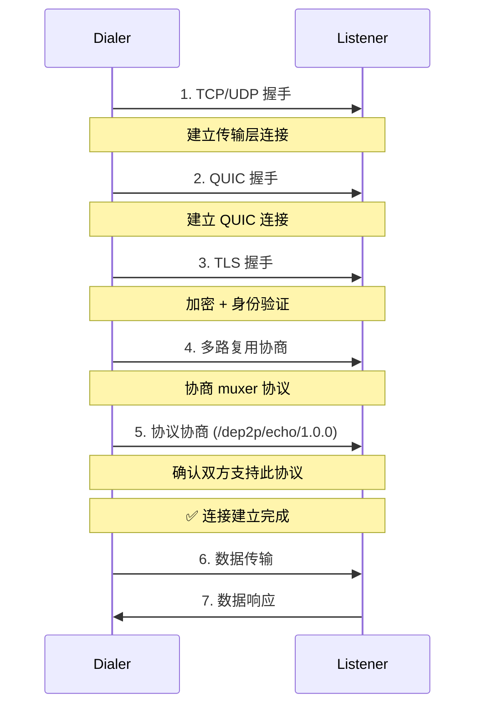

# Echo 示例 - 消息回显服务

这是一个经典的 Echo 服务示例，演示如何在两个 P2P 节点之间建立连接并通信。

## 概述

Echo 服务的工作方式很简单：你发送一条消息，服务器原样返回。虽然简单，但它演示了 P2P 通信的所有核心概念。

```
节点 A (Listener)          节点 B (Dialer)
      │                         │
      │◄────── 建立连接 ─────────┤
      │                         │
      │◄───── "Hello!" ─────────┤
      │                         │
      ├────── "Hello!" ────────►│
      │                         │
```

## 你将学到什么

- ✅ 什么是监听（Listener）和拨号（Dialer）
- ✅ 如何建立点对点连接
- ✅ 什么是流（Stream），如何使用
- ✅ 如何发送和接收数据
- ✅ 协议协商的工作原理

## 前置知识

在开始之前，建议先了解：

- **节点 ID**: 节点的唯一标识符（参考[基础示例](../basic/)）
- **监听地址**: 节点在网络上的位置
- **协议**: 定义通信格式的标识符

如果你还没有运行过基础示例，强烈建议先完成它。

## 快速开始

### 第一步：启动监听节点

打开终端 1：

```bash
cd examples/echo/
go run main.go -mode listener
```

你会看到类似输出：

```
=== DeP2P Echo 示例 ===

[Listener] 启动中...

╔════════════════════════════════════════════════════════╗
║                    节点信息                             ║
╠════════════════════════════════════════════════════════╣
║ 节点 ID: 5Q2STWvBExampleNodeID...
║ 监听地址:
║   [1] /ip4/127.0.0.1/udp/54321/quic-v1
╚════════════════════════════════════════════════════════╝

[Listener] 等待连接...

使用以下命令从另一个终端连接:
  go run main.go -mode dialer -fulladdr /ip4/127.0.0.1/udp/54321/quic-v1/p2p/5Q2STWvB...
```

⚠️ **重要**: 保持这个终端运行，不要关闭！

### 第二步：理解输出信息

让我们仔细看看这些信息：

#### 节点 ID
```
节点 ID: 5Q2STWvBExampleNodeID...
```
这是监听节点的唯一标识符。拨号节点需要这个 ID 来验证连接的目标节点身份。

💡 **为什么需要**: 防止连接到错误的节点（安全考虑）。

#### 监听地址
```
监听地址:
  [1] /ip4/127.0.0.1/udp/54321/quic-v1
```
这是节点在网络上的位置。拨号节点需要这个地址来找到监听节点。

💡 **地址解析**:
- `/ip4/127.0.0.1` = IPv4 地址
- `/udp/54321` = UDP 端口
- `/quic-v1` = 使用 QUIC 协议

### 第三步：启动拨号节点

打开终端 2（不要关闭终端 1）：

```bash
cd examples/echo/

# 复制粘贴终端 1 输出的完整命令
go run main.go -mode dialer \
  -fulladdr /ip4/127.0.0.1/udp/54321/quic-v1/p2p/5Q2STWvB... \
  -msg "Hello, DeP2P!"
```

⚠️ **重要**:
- `-fulladdr` 必须是 **Full Address**（含 `/p2p/<NodeID>`），对应 **DialByFullAddress**
- 确保完整复制，包括所有字符

### 第四步：观察结果

**终端 2（拨号节点）输出**:
```
=== DeP2P Echo 示例 ===

[Dialer] 启动中...
[Dialer] DialByFullAddress: ConnectToAddr(/ip4/127.0.0.1/udp/54321/quic-v1/p2p/5Q2STWvB...)
[Dialer] 连接成功！
[Dialer] 发送消息: Hello, DeP2P!
[Dialer] 收到回显: Hello, DeP2P!
✅ Echo 成功！消息匹配
```

**终端 1（监听节点）输出**:
```
[Listener] 收到新连接
[Listener] 远程节点: 5Q2STWvBDialerNodeID...
[Listener] 收到消息: Hello, DeP2P! (14 字节)
[Listener] 回显消息
```

🎉 **成功！** 你已经完成了第一次 P2P 通信！

## 详细教程

### 监听模式 (Listener)

监听模式创建一个服务器节点，等待其他节点连接。



**工作流程**:

1. **创建节点**: 使用默认配置或指定端口
2. **注册协议**: 告诉节点如何处理 `/dep2p/echo/1.0.0` 协议
3. **进入等待**: 阻塞等待连接
4. **处理连接**: 每个连接在独立的 goroutine 中处理

### 拨号模式 (Dialer)

拨号模式创建一个客户端节点，连接到指定的监听节点。



**工作流程**:

1. **创建节点**: 使用随机端口（不需要指定）
2. **解析目标**: 从节点 ID 和地址创建目标
3. **建立连接**: 握手、加密、验证身份
4. **打开流**: 在连接上创建通信流
5. **发送消息**: 写入数据到流
6. **读取响应**: 从流读取数据
7. **验证**: 确认响应与发送的一致

## 命令行参数

| 参数 | 说明 | 默认值 | 示例 |
|------|------|--------|------|
| `-mode` | 运行模式 | `listener` | `listener` 或 `dialer` |
| `-port` | 监听端口 | `0` (随机) | `4001` |
| `-fulladdr` | 远程 Full Address | - | `/ip4/127.0.0.1/udp/4001/quic-v1/p2p/5Q2STWvB...` |
| `-remote` | 远程 NodeID（高级） | - | `5Q2STWvB...` |
| `-dialaddr` | 远程 Dial Address（高级） | - | `/ip4/127.0.0.1/udp/4001/quic-v1` |
| `-msg` | 发送的消息 | `"Hello, dep2p!"` | `"你好"` |

### 参数详解

#### -mode
指定节点角色：
- `listener`: 服务器模式，等待连接
- `dialer`: 客户端模式，主动连接

#### -port
监听端口（仅 listener 模式）：
- `0`: 让系统自动分配（推荐）
- `1024-65535`: 指定端口

```bash
# 使用随机端口
go run main.go -mode listener

# 使用固定端口
go run main.go -mode listener -port 4001
```

#### -fulladdr（推荐）
DialByFullAddress：必须包含 `/p2p/<NodeID>`：

```bash
go run main.go -mode dialer -fulladdr "/ip4/192.168.1.100/udp/4001/quic-v1/p2p/5Q2STWvB..."
```

#### -msg
要发送的消息（dialer 模式）：

```bash
# 英文消息
go run main.go -mode dialer ... -msg "Hello"

# 中文消息
go run main.go -mode dialer ... -msg "你好"

# 带空格的消息（需要引号）
go run main.go -mode dialer ... -msg "Hello World"
```

## 代码解析

### 关键代码 1: 注册 Echo 处理器

```go
// 注册协议处理器
endpoint.SetProtocolHandler(echoProtocol, func(stream dep2p.Stream) {
    defer stream.Close()
    
    // 读取消息
    buf := make([]byte, 1024)
    n, err := stream.Read(buf)
    if err != nil {
        log.Printf("读取失败: %v", err)
        return
    }
    
    message := buf[:n]
    fmt.Printf("[Listener] 收到消息: %s (%d 字节)\n", message, n)
    
    // 回显消息
    _, err = stream.Write(message)
    if err != nil {
        log.Printf("写入失败: %v", err)
        return
    }
})
```

**解析**:
- `SetProtocolHandler`: 注册一个协议处理器
- `stream.Read()`: 从流中读取数据（阻塞）
- `stream.Write()`: 向流中写入数据
- `defer stream.Close()`: 确保流被关闭

### 关键代码 2: 建立连接

```go
// 解析远程节点 ID
remoteID, err := dep2p.ParseNodeID(*remoteIDStr)

// 解析远程地址
remoteAddr, err := dep2p.ParseAddress(*remoteAddrStr)

// 建立连接
// DialByFullAddress（推荐）
conn, err := node.ConnectToAddr(ctx, fullAddr)
```

**解析**:
- `ParseNodeID`: 从字符串解析节点 ID
- `ParseAddress`: 从字符串解析网络地址
- （高级/运维/受控）`ConnectWithAddrs`: 不在本示例文档展开，参考 `docs/04-usage/examples/advanced.md`

### 关键代码 3: 打开流并通信

```go
// 打开流
stream, err := conn.OpenStream(ctx, echoProtocol)
defer stream.Close()

// 发送消息
_, err = stream.Write([]byte(*message))

// 接收响应
buf := make([]byte, 1024)
n, err := stream.Read(buf)
response := string(buf[:n])

// 验证
if response == *message {
    fmt.Println("✅ Echo 成功！消息匹配")
}
```

**解析**:
- `OpenStream`: 在连接上创建新的流
- 流是双向的，可以读也可以写
- 每个流独立，多个流可以并发

## 工作原理

### 连接建立过程



### 协议协商

当拨号节点请求打开一个流时：

1. **拨号节点**: "我想使用 `/dep2p/echo/1.0.0` 协议"
2. **监听节点**: 检查是否注册了该协议处理器
3. **如果有**: "好的，开始通信"
4. **如果没有**: "不支持此协议" → 连接失败

## 故障排除

### 问题 1: 连接失败

**症状**:
```
[Dialer] 连接失败: context deadline exceeded
```

**可能原因**:
1. 节点 ID 或地址复制错误
2. 监听节点未启动
3. 防火墙阻止连接
4. 端口不匹配

**解决方案**:
```bash
# 1. 检查监听节点是否运行
# 终端 1 应该显示 "等待连接..."

# 2. 完整复制节点 ID 和地址
# 不要手动输入，使用复制粘贴

# 3. 检查地址格式
# 正确: /ip4/127.0.0.1/udp/54321/quic-v1
# 错误: 127.0.0.1:54321

# 4. 临时关闭防火墙测试（仅用于排查）
```

### 问题 2: 协议不匹配

**症状**:
```
[Dialer] 打开流失败: protocol not supported
```

**原因**: 监听节点未注册 echo 协议

**解决方案**:
```bash
# 确保使用正确的代码版本
# 检查监听节点是否调用了 SetProtocolHandler
```

### 问题 3: 消息不匹配

**症状**:
```
❌ Echo 失败：发送 "Hello" 但收到 "Hel"
```

**原因**: 缓冲区处理错误或网络问题

**解决方案**:
```go
// 使用 io.ReadFull 确保读取完整消息
n, err := io.ReadFull(stream, buf[:expectedLen])
```

### 问题 4: 地址格式错误

**症状**:
```
解析地址失败: invalid multiaddr
```

**常见错误**:
- ❌ `127.0.0.1:4001` （普通格式）
- ✅ `/ip4/127.0.0.1/udp/4001/quic-v1` （multiaddr 格式）

### 问题 5: 编译错误

**症状**:
```bash
cannot find package "github.com/dep2p/go-dep2p"
```

**解决方案**:
```bash
cd examples/echo/
go mod download
go mod tidy
```

## 进阶练习

### 练习 1: 修改 Echo 逻辑

让服务器返回大写版本：

```go
endpoint.SetProtocolHandler(echoProtocol, func(stream dep2p.Stream) {
    defer stream.Close()
    
    buf := make([]byte, 1024)
    n, _ := stream.Read(buf)
    
    // 转换为大写
    upper := strings.ToUpper(string(buf[:n]))
    stream.Write([]byte(upper))
})
```

### 练习 2: 添加时间戳

在消息中包含时间戳：

```go
// 发送方
msg := fmt.Sprintf("[%s] %s", time.Now().Format("15:04:05"), *message)
stream.Write([]byte(msg))
```

### 练习 3: 双向通信

实现对话而不是单次请求：

```go
// 循环发送和接收
for i := 0; i < 5; i++ {
    stream.Write([]byte(fmt.Sprintf("Message %d", i)))
    buf := make([]byte, 1024)
    n, _ := stream.Read(buf)
    fmt.Printf("Received: %s\n", buf[:n])
}
```

### 练习 4: 文件传输

尝试发送文件内容：

```go
// 读取文件
data, _ := os.ReadFile("test.txt")

// 发送
stream.Write(data)

// 接收并保存
buf := make([]byte, 10*1024) // 10KB 缓冲区
n, _ := stream.Read(buf)
os.WriteFile("received.txt", buf[:n], 0644)
```

## 下一步

完成 Echo 示例后，继续学习：

1. **[Chat 示例](../chat/)** - 学习自动发现和多节点通信
2. **[Relay 示例](../relay/)** - 学习 NAT 穿透

## 相关资源

- **流 API 文档**: [pkg/interfaces/stream/](../../pkg/interfaces/stream/)
- **连接管理**: [design/architecture/components.md](../../design/architecture/components.md)
- **协议设计**: [docs/01-design/protocols/](../../docs/01-design/protocols/)

## 参考项目

- [iroh examples/echo.rs](https://github.com/n0-computer/iroh)
- [go-libp2p examples/echo](https://github.com/libp2p/go-libp2p)

---

🎉 **做得好！** 你已经掌握了 P2P 节点间通信的基础。
