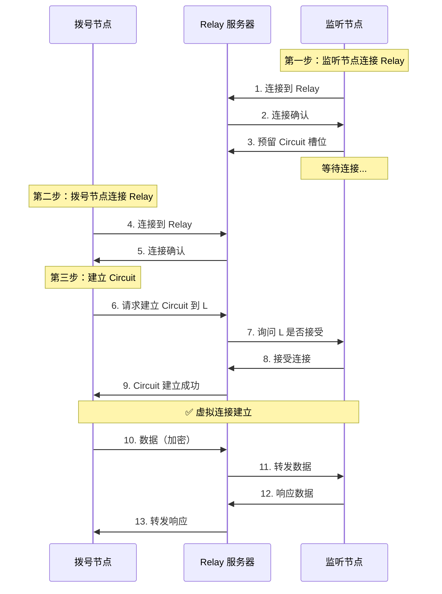

# Relay 示例 - NAT 穿透与中继通信

这个示例演示如何使用 Circuit Relay 让两个 NAT 后的节点通过中继服务器建立连接，这是 P2P 网络中最重要的功能之一。

## 概述

在真实的互联网环境中，大多数设备都位于路由器（NAT）后面，无法被外部直接访问。Relay 服务器充当"中间人"，帮助这些节点建立连接。

```
互联网
┌────────────────────────────────────────────────────────┐
│                                                        │
│   家庭网络 A                                 家庭网络 B  │
│   (NAT 后)                                  (NAT 后)   │
│   ┌─────────┐                              ┌─────────┐│
│   │ Alice   │                              │  Bob    ││
│   │ 私有IP  │                              │ 私有IP  ││
│   └────┬────┘                              └────┬────┘│
│        │                                        │     │
│        │         ┌──────────────────┐          │     │
│        └────────►│  Relay Server    │◄─────────┘     │
│                  │   (公网 IP)      │                │
│                  │  转发双方流量     │                │
│                  └──────────────────┘                │
│                                                        │
└────────────────────────────────────────────────────────┘
```

## 你将学到什么

- ✅ 什么是 NAT，为什么会阻止 P2P 连接
- ✅ Circuit Relay 的工作原理
- ✅ 如何搭建 Relay 服务器
- ✅ 如何配置客户端使用 Relay
- ✅ Circuit Relay 地址格式
- ✅ 何时使用 Relay vs 直连

## 什么是 NAT 问题？

### 通俗解释

**NAT** (Network Address Translation) 就像公司的前台：

- **内部员工**（你的设备）有内部工位号（私有 IP）
- **外部访客**（互联网）只能看到公司地址（公网 IP）
- **前台**（路由器）负责转发：外部打电话进来，前台知道转给哪个分机

**问题**: 如果两个公司的员工想直接通话，他们都不知道对方的分机号，只能通过前台。

### 技术解释

```
你的设备                路由器                  互联网
┌──────────┐          ┌──────────┐          ┌──────────┐
│ 私有 IP  │◄────────►│   NAT    │◄────────►│  公网    │
│192.168.1.│          │ 转换地址  │          │          │
└──────────┘          └──────────┘          └──────────┘
     │                      │                      │
     └─ 无法被外部直接访问──┘                      │
                                                   │
                         只能访问外部，不能被外部访问
```

**NAT 的问题**:
1. **内部无法被外部访问**: 私有 IP 在公网上无效
2. **端口不可预测**: NAT 会动态分配端口
3. **类型多样**: 不同类型的 NAT 有不同的行为

### 为什么需要 Relay？

当两个节点都在 NAT 后面时：

- ❌ **直连失败**: 双方都无法直接访问对方
- ❌ **打洞失败**: 某些 NAT 类型不支持打洞
- ✅ **Relay 解决**: 通过公网服务器转发流量

## 前置要求

- **Relay 服务器**: 需要一台有公网 IP 的机器
- **客户端**: 可以在任何网络环境
- **网络**: 客户端能访问 Relay 服务器即可

### 获取公网 IP

如果你没有公网 IP 的机器，可以：

1. **云服务器**: AWS、阿里云、腾讯云等（推荐）
2. **VPS**: DigitalOcean、Linode 等
3. **本地测试**: 使用 `127.0.0.1`（仅适合学习）

## 快速开始

### 角色说明

这个示例需要三个角色：

| 角色 | 作用 | 网络要求 |
|------|------|----------|
| **Relay 服务器** | 转发流量 | 公网 IP（或所有客户端可达的 IP） |
| **监听节点** | 等待连接 | 任意（可在 NAT 后） |
| **拨号节点** | 发起连接 | 任意（可在 NAT 后） |

### 第一步：启动 Relay 服务器

在有公网 IP 的机器上：

```bash
# 进入项目根目录
cd /path/to/dep2p

# 启动 Relay 服务器
go run ./cmd/relay-server -port 4001
```

输出：

```
╔══════════════════════════════════════════════════╗
║          DeP2P Relay Server                      ║
╚══════════════════════════════════════════════════╝

🚀 Relay 服务器启动成功！

节点 ID: 5Q2STWvBRelayServerID...

监听地址:
  [1] /ip4/0.0.0.0/udp/4001/quic-v1

公网访问地址（客户端使用此地址）:
  /ip4/203.0.113.10/udp/4001/quic-v1/p2p/5Q2STWvBRelayServerID...

⚡ Relay 服务已就绪，等待客户端连接...
```

⚠️ **重要**: 
- 记录**公网访问地址**，客户端需要用它连接
- 确保防火墙允许 4001 端口（TCP 和 UDP）
- 如果是云服务器，确保安全组规则开放

### 第二步：启动监听节点

在客户端 A（可以在 NAT 后）：

```bash
cd examples/relay/

# 使用 Relay 服务器地址（QUIC 传输）
go run main.go -mode listen \
  -relay /ip4/203.0.113.10/udp/4001/quic-v1/p2p/5Q2STWvBRelayServerID...
```

输出：

```
╔══════════════════════════════════════════════════════╗
║            DeP2P Relay 示例                          ║
╚══════════════════════════════════════════════════════╝

🚀 节点启动成功！
   节点 ID: 5Q2STWvBListenerNodeID...

📡 正在连接到 Relay 服务器...
✅ 已连接到 Relay: 5Q2STWvBRelayServerID...

🔊 监听模式已启动，等待其他节点通过 Relay 连接...

📋 其他节点可以使用以下信息连接:
   节点 ID: 5Q2STWvBListenerNodeID...
   
📌 Relay 地址: /ip4/203.0.113.10/udp/4001/quic-v1/p2p/5Q2STWvBRelayServerID...

💡 提示: 保持此程序运行，等待拨号节点连接
```

⚠️ **记录监听节点的 ID**，拨号节点需要用它。

### 第三步：启动拨号节点

在客户端 B（可以在不同的网络，也可以在 NAT 后）：

```bash
cd examples/relay/

# 使用相同的 Relay 地址和监听节点的 ID（QUIC 传输）
go run main.go -mode dial \
  -relay /ip4/203.0.113.10/udp/4001/quic-v1/p2p/5Q2STWvBRelayServerID... \
  -target 5Q2STWvBListenerNodeID...
```

输出：

```
╔══════════════════════════════════════════════════════╗
║            DeP2P Relay 示例                          ║
╚══════════════════════════════════════════════════════╝

🚀 节点启动成功！
   节点 ID: 5Q2STWvBDialerNodeID...

📡 正在连接到 Relay 服务器...
✅ 已连接到 Relay: 5Q2STWvBRelayServerID...

🔍 正在通过 Relay 连接到目标节点...
   目标节点: 5Q2STWvBListenerNodeID...

🎉 成功建立 Circuit Relay 连接！

💬 开始通信测试...
   发送: Hello via Relay!
   收到: Hello via Relay!

✅ Relay 通信测试成功！
```

### 第四步：观察 Relay 服务器

Relay 服务器会显示：

```
📥 新连接: 5Q2STWvBListenerNodeID... (监听节点)
📥 新连接: 5Q2STWvBDialerNodeID... (拨号节点)
🔄 建立 Circuit: 5Q2STWvBDialerNodeID... → 5Q2STWvBListenerNodeID...
📊 正在中继数据...
   上行: 1.2 KB
   下行: 1.2 KB
```

🎉 **成功！** 两个 NAT 后的节点通过 Relay 成功通信！

## Circuit Relay 地址格式

### 完整格式

```
/ip4/<relay-ip>/udp/<relay-port>/quic-v1/p2p/<relay-id>/p2p-circuit/p2p/<target-id>
```

### 各部分含义

```
/ip4/203.0.113.10     ← Relay 服务器的 IP 地址
/udp/4001             ← Relay 服务器的端口
/quic-v1              ← QUIC 传输协议
/p2p/5Q2STWvBRelay... ← Relay 服务器的节点 ID
/p2p-circuit          ← 表示这是一个 Circuit Relay 地址
/p2p/5Q2STWvBTarget.. ← 目标节点的 ID
```

### 示例

```bash
# 完整的 Circuit Relay 地址（QUIC 传输）
/ip4/203.0.113.10/udp/4001/quic-v1/p2p/5Q2STWvBRelayID.../p2p-circuit/p2p/5Q2STWvBTargetID...

# 分解：
# 1. 先连接到 Relay: /ip4/203.0.113.10/udp/4001/quic-v1/p2p/5Q2STWvBRelayID...
# 2. 通过 Relay 访问目标: /p2p-circuit/p2p/5Q2STWvBTargetID...
```

## 详细教程

### Relay 服务器配置

#### 基本配置

```go
// cmd/relay-server/main.go
endpoint, err := dep2p.Start(ctx,
    dep2p.WithPreset(dep2p.PresetRelay),  // Relay 预设
    dep2p.WithListenPort(4001),  // 监听所有接口（使用 QUIC 传输）
)
```

#### 高级配置

```go
// 限制中继资源
endpoint, err := dep2p.Start(ctx,
    dep2p.WithPreset(dep2p.PresetRelay),
    dep2p.WithRelayLimit(
        dep2p.RelayLimitOpt{
            MaxCircuits:     100,  // 最大 Circuit 数
            MaxPerPeer:      5,    // 每个对等方最大 Circuit 数
            BandwidthLimit:  10 * 1024 * 1024,  // 10 MB/s
        },
    ),
)
```

### 客户端配置

#### 基本配置

```go
// 启用 Relay 客户端
endpoint, err := dep2p.Start(ctx,
    dep2p.WithPreset(dep2p.PresetDesktop),
    dep2p.WithRelayClient(true),  // 启用 Relay 客户端
)

// 连接到 Relay 服务器
err = endpoint.ConnectRelay(ctx, relayAddr)
```

#### 自动 Relay 发现

```go
// 从 Bootstrap 节点自动发现 Relay
endpoint, err := dep2p.Start(ctx,
    dep2p.WithPreset(dep2p.PresetDesktop),
    dep2p.WithRelayClient(true),
    dep2p.WithBootstrapPeers(bootstrapAddrs),  // 包含 Relay 地址
)
```

### 连接流程



## 工作原理

### Circuit Relay 的本质

Circuit Relay 创建一个"虚拟连接"：

```
实际连接：Dialer ←→ Relay ←→ Listener
虚拟连接：Dialer ←──────────────→ Listener
```

从应用层看，就像直接连接，但实际通过 Relay 转发。

### 数据流转

```
发送方                 Relay                   接收方
┌──────┐              ┌──────┐              ┌──────┐
│      │──加密数据────►│      │──原样转发────►│      │
│ App  │              │ 中继 │              │ App  │
│      │◄──加密数据────│      │◄──原样转发────│      │
└──────┘              └──────┘              └──────┘
                          │
                          └─ Relay 无法解密，只是转发
```

**重要**: Relay 服务器**无法读取**通信内容，因为数据是端到端加密的。

### 自动升级到直连

建立 Circuit 后，节点会尝试"升级"到直连：

```mermaid
sequenceDiagram
    participant D as Dialer
    participant R as Relay
    participant L as Listener
    
    Note over D,L: Circuit 已建立
    
    D->>L: 交换地址信息
    Note over D,L: 尝试 NAT 打洞
    
    alt 打洞成功
        D->>L: 建立直连
        Note over D,L: ✅ 关闭 Circuit<br/>切换到直连
    else 打洞失败
        Note over D,R,L: ⚠️ 继续使用 Relay
    end
```

## 性能考虑

### Relay 的代价

| 指标 | 直连 | Relay |
|------|------|-------|
| **延迟** | 低 (~10ms) | 高 (~50-200ms) |
| **吞吐量** | 高 | 中等（受 Relay 带宽限制） |
| **稳定性** | 高 | 取决于 Relay 服务器 |
| **成本** | 免费 | Relay 服务器费用 |

### 优化建议

1. **优先尝试直连**: 只在直连失败时使用 Relay
2. **自动升级**: 利用 NAT 打洞升级到直连
3. **多个 Relay**: 部署多个 Relay 服务器提高可用性
4. **地理分布**: Relay 服务器靠近用户可降低延迟

### 带宽计算

如果有 1000 个活跃连接，平均每个连接 100 KB/s：

```
总带宽 = 1000 × 100 KB/s × 2（双向）= 200 MB/s
```

需要选择带宽足够的服务器。

## 生产环境部署

### Relay 服务器要求

| 资源 | 小规模 | 中等规模 | 大规模 |
|------|--------|----------|--------|
| **CPU** | 2 核 | 4 核 | 8+ 核 |
| **内存** | 2 GB | 4 GB | 8+ GB |
| **带宽** | 100 Mbps | 500 Mbps | 1 Gbps+ |
| **并发连接** | ~100 | ~500 | ~1000+ |

### 部署建议

#### 1. 使用 Systemd 服务

```bash
# /etc/systemd/system/dep2p-relay.service
[Unit]
Description=DeP2P Relay Server
After=network.target

[Service]
Type=simple
User=dep2p
ExecStart=/usr/local/bin/relay-server -port 4001
Restart=always

[Install]
WantedBy=multi-user.target
```

#### 2. 配置防火墙

```bash
# UFW (Ubuntu)
sudo ufw allow 4001/tcp
sudo ufw allow 4001/udp

# iptables
sudo iptables -A INPUT -p tcp --dport 4001 -j ACCEPT
sudo iptables -A INPUT -p udp --dport 4001 -j ACCEPT
```

#### 3. 监控和日志

```go
// 添加监控指标
prometheus.MustRegister(
    circuitCount,      // 活跃 Circuit 数
    bandwidthUsage,    // 带宽使用
    errorRate,         // 错误率
)

// 结构化日志
log.Info("circuit established",
    zap.String("source", sourceID),
    zap.String("target", targetID),
)
```

#### 4. 负载均衡

使用 DNS 轮询或负载均衡器：

```
relay1.example.com → 1.2.3.4
relay2.example.com → 5.6.7.8
relay3.example.com → 9.10.11.12
```

客户端配置多个 Relay：

```go
relays := []string{
    "relay1.example.com:4001",
    "relay2.example.com:4001",
    "relay3.example.com:4001",
}
```

## 故障排除

### 问题 1: 无法连接到 Relay

**症状**:
```
❌ 错误: 连接 Relay 失败: context deadline exceeded
```

**可能原因**:
1. Relay 服务器未启动
2. 防火墙阻止
3. 地址错误

**解决方案**:

```bash
# 1. 检查 Relay 是否运行
# 在 Relay 服务器上
ps aux | grep relay-server

# 2. 测试端口是否开放
telnet 203.0.113.10 4001

# 3. 检查防火墙
sudo ufw status
```

### 问题 2: Circuit 建立失败

**症状**:
```
❌ 错误: 建立 Circuit 失败: target peer not connected to relay
```

**原因**: 目标节点未连接到 Relay

**解决方案**:
- 确保监听节点已成功连接到 Relay
- 检查监听节点的输出是否显示"已连接到 Relay"

### 问题 3: 连接后无法通信

**症状**: Circuit 建立成功，但发送消息失败

**可能原因**:
1. 协议不匹配
2. 流被过早关闭
3. Relay 服务器问题

**调试**:

```bash
# 检查 Relay 服务器日志
journalctl -u dep2p-relay -f

# 启用详细日志
go run main.go -mode dial -relay ... -verbose
```

### 问题 4: Relay 服务器过载

**症状**: 连接变慢或超时

**解决方案**:
1. 增加服务器资源
2. 限制连接数
3. 部署多个 Relay 服务器

### 问题 5: 地址格式错误

**常见错误**:

```bash
# ❌ 缺少节点 ID
/ip4/203.0.113.10/udp/4001/quic-v1

# ❌ 缺少 /p2p-circuit
/ip4/203.0.113.10/udp/4001/quic-v1/p2p/5Q2STWvB.../p2p/5Q2STWvB...

# ✅ 正确格式（QUIC 传输）
/ip4/203.0.113.10/udp/4001/quic-v1/p2p/5Q2STWvBRelay.../p2p-circuit/p2p/5Q2STWvBTarget...
```

## 进阶练习

### 练习 1: 添加认证

只允许授权的节点使用 Relay：

```go
func authCheck(peerID dep2p.PeerID) bool {
    allowedPeers := []dep2p.PeerID{...}
    return contains(allowedPeers, peerID)
}
```

### 练习 2: 实现备用 Relay

多个 Relay 自动切换：

```go
relays := []string{relay1, relay2, relay3}
for _, relay := range relays {
    if err := connectRelay(relay); err == nil {
        break
    }
}
```

### 练习 3: 监控仪表盘

添加 Web 界面显示：
- 活跃连接数
- 带宽使用
- Circuit 列表

### 练习 4: 速率限制

防止滥用：

```go
// 每个节点最多 5 个 Circuit
limiter := rate.NewLimiter(5, 10)
if !limiter.Allow() {
    return errors.New("rate limit exceeded")
}
```

## 下一步

完成 Relay 示例后：

1. **构建实际应用**: 结合所学知识构建 P2P 应用
2. **阅读源码**: 深入理解 Relay 实现
3. **部署生产环境**: 搭建自己的 Relay 网络

## 相关资源

- **Relay 实现**: [internal/core/relay/](../../internal/core/relay/)
- **NAT 穿透**: [internal/core/nat/](../../internal/core/nat/)
- **设计文档**: [docs/01-design/protocols/network/03-relay.md](../../docs/01-design/protocols/network/03-relay.md)

## 参考资料

- [go-libp2p Circuit Relay](https://github.com/libp2p/go-libp2p/tree/master/p2p/protocol/circuitv2)
- [libp2p Circuit Relay Spec](https://github.com/libp2p/specs/tree/master/relay)
- [NAT Traversal Techniques](https://en.wikipedia.org/wiki/NAT_traversal)

---

🎉 **恭喜！** 你已经掌握了 NAT 穿透和 Relay 通信，这是 P2P 网络的核心技术！
