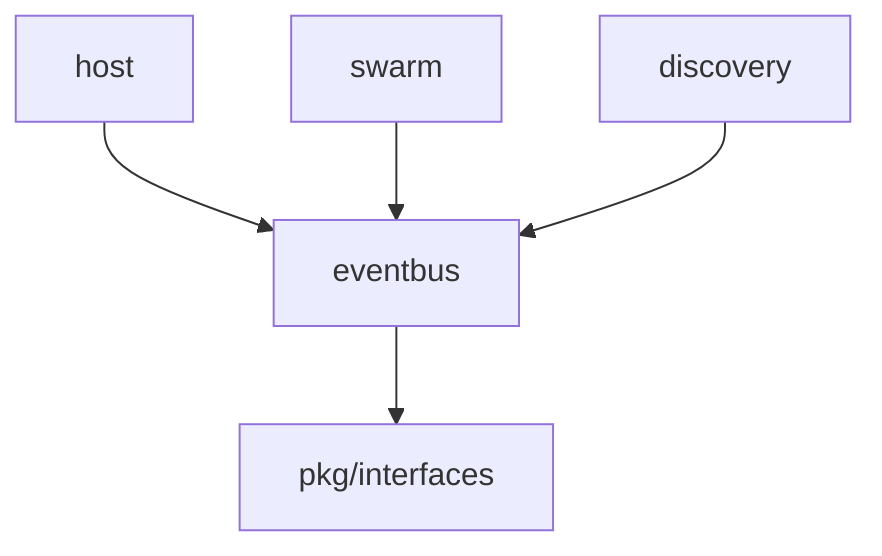

# Core EventBus 模块

> **版本**: v1.1.0  
> **更新日期**: 2026-01-13  
> **状态**: ✅ 已实现

---

## 概述

eventbus 模块提供进程内的事件发布订阅机制，用于组件间的松耦合通信。它是 DeP2P 内部事件驱动架构的基础。

| 属性 | 值 |
|------|-----|
| **架构层** | Core Layer Level 1 |
| **代码位置** | `internal/core/eventbus/` |
| **Fx 模块** | `fx.Module("eventbus")` |
| **依赖** | 无（底层组件） |
| **被依赖** | host, swarm, discovery |

---

## 快速开始

```go
import "github.com/dep2p/go-dep2p/internal/core/eventbus"

// 创建事件总线
bus := eventbus.NewBus()

// 订阅事件
sub, _ := bus.Subscribe(new(EvtPeerConnectedness))
go func() {
    for evt := range sub.Out() {
        e := evt.(EvtPeerConnectedness)
        log.Printf("Peer %s connectedness: %d", e.Peer, e.Connectedness)
    }
}()

// 发射事件
em, _ := bus.Emitter(new(EvtPeerConnectedness))
em.Emit(EvtPeerConnectedness{
    Peer:          "QmPeer123",
    Connectedness: 1,
})
em.Close()
sub.Close()
```

---

## 核心功能

### 1. 类型安全的事件发布/订阅

**订阅事件**：
```go
// 订阅特定事件类型
sub, err := bus.Subscribe(new(MyEvent))
defer sub.Close()

// 带选项订阅
sub, err := bus.Subscribe(new(MyEvent), eventbus.BufSize(100))
```

**发射事件**：
```go
em, err := bus.Emitter(new(MyEvent))
defer em.Close()

err = em.Emit(MyEvent{...})
```

---

### 2. 订阅选项

```go
// 设置缓冲区大小（默认 16）
sub, _ := bus.Subscribe(new(MyEvent), eventbus.BufSize(100))
```

---

### 3. 发射器选项

```go
// 有状态模式（记忆最后一个事件，新订阅者立即收到）
em, _ := bus.Emitter(new(MyEvent), eventbus.Stateful())
```

---

### 4. 事件类型管理

```go
// 获取所有已注册的事件类型
types := bus.GetAllEventTypes()
for _, typ := range types {
    fmt.Printf("Event type: %T\n", typ)
}
```

---

## 文件结构

```
internal/core/eventbus/
├── doc.go              # 包文档
├── module.go           # Fx 模块定义
├── bus.go              # Bus 核心实现
├── subscription.go     # Subscription 和 Emitter
├── settings.go         # 设置类型
├── options.go          # 选项函数
├── events/             # 事件类型定义（已废弃，使用 pkg/types）
│   ├── connection.go
│   ├── discovery.go
│   └── protocol.go
└── *_test.go           # 测试文件（6 个）
```

---

## Fx 模块使用

### 基础用法

```go
import (
    "go.uber.org/fx"
    "github.com/dep2p/go-dep2p/internal/core/eventbus"
    pkgif "github.com/dep2p/go-dep2p/pkg/interfaces"
)

app := fx.New(
    eventbus.Module(),
    fx.Invoke(func(bus pkgif.EventBus) {
        // 使用 EventBus
        sub, _ := bus.Subscribe(new(MyEvent))
        defer sub.Close()
    }),
)
```

### 在其他模块中使用

```go
type Params struct {
    fx.In
    EventBus pkgif.EventBus
}

func MyModule(p Params) {
    sub, _ := p.EventBus.Subscribe(new(MyEvent))
    // ...
}
```

---

## 性能指标

| 操作 | 时间 | 说明 |
|------|------|------|
| Subscribe | < 10µs | 创建订阅 |
| Emitter | < 5µs | 获取发射器 |
| Emit（无竞争） | < 1µs | 单个订阅者 |
| Emit（10 订阅者） | < 10µs | 并发发送 |

**说明**：基于 Apple Silicon M 系列芯片的估算。

---

## 测试统计

| 指标 | 数量 | 状态 |
|------|------|------|
| 实现文件 | 6 | ✅ |
| 测试文件 | 6 | ✅ |
| 测试用例 | 40+ | ✅ |
| 测试覆盖率 | 86.4% | ✅ |
| 竞态检测 | 通过 | ✅ |
| 测试通过率 | 100% | ✅ |

---

## 架构定位

### Tier 分层

```
Tier 1: Core Layer Level 1
├── identity
├── eventbus ◄── 本模块
├── resourcemgr
└── muxer

依赖：无（最底层）
被依赖：host, swarm, discovery
```

### 依赖关系



---

## 并发安全

EventBus 使用以下机制保证并发安全：

1. **RWMutex 保护**：共享状态（nodes map）使用读写锁
2. **Atomic 计数器**：发射器引用计数使用 atomic.Int32
3. **closeOnce**：防止重复关闭
4. **通道排空**：关闭订阅时后台排空通道，防止阻塞

---

## 设计模式

### 1. 类型安全

使用 `reflect.Type` 作为事件类型键，确保编译时类型检查：

```go
typ := reflect.TypeOf(eventType).Elem()
```

### 2. 引用计数

发射器使用引用计数，当计数为 0 时自动清理节点：

```go
if node.nEmitters.Add(-1) == 0 {
    bus.tryDropNode(typ)
}
```

### 3. 节点管理

每个事件类型对应一个 node，包含订阅者列表和发射器计数：

```go
type node struct {
    typ       reflect.Type
    sinks     []*Subscription
    nEmitters atomic.Int32
    keepLast  bool       // Stateful 模式
    last      interface{} // 最后的事件
}
```

---

## 相关文档

| 文档 | 说明 |
|------|------|
| [L6_domains/core_eventbus/](../../../design/03_architecture/L6_domains/core_eventbus/) | 设计文档 |
| [pkg/interfaces/eventbus.go](../../../pkg/interfaces/eventbus.go) | 接口定义 |
| [COMPLIANCE_CHECK.md](../../../design/03_architecture/L6_domains/core_eventbus/COMPLIANCE_CHECK.md) | 合规性检查 |

---

**最后更新**：2026-01-13
