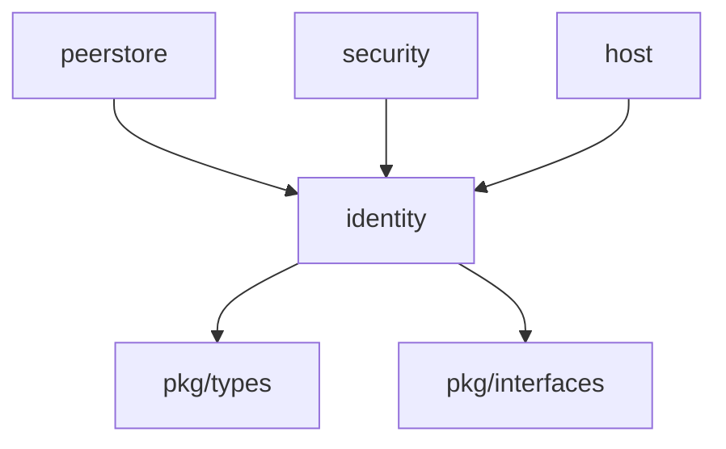

# Core Identity 模块

> **版本**: v1.1.0  
> **更新日期**: 2026-01-13  
> **状态**: ✅ 已实现

---

## 概述

identity 模块是 DeP2P 的身份管理模块，负责密钥对管理、PeerID 派生和签名验证。

| 属性 | 值 |
|------|-----|
| **架构层** | Core Layer Level 1 |
| **代码位置** | `internal/core/identity/` |
| **Fx 模块** | `fx.Module("identity")` |
| **依赖** | 无（最底层模块） |
| **被依赖** | peerstore, security, host |

---

## 快速开始

```go
import "github.com/dep2p/go-dep2p/internal/core/identity"

// 生成新身份
priv, pub, _ := identity.GenerateEd25519Key()
id, _ := identity.New(priv)

// 获取 PeerID
peerID := id.PeerID()
fmt.Printf("PeerID: %s\n", peerID)

// 签名和验证
sig, _ := id.Sign([]byte("data"))
valid, _ := id.Verify([]byte("data"), sig)
```

---

## 核心功能

### 1. 密钥对管理

**支持的密钥类型**：
- ✅ Ed25519（默认，推荐）
- ⬜ Secp256k1（未来支持）
- ⬜ RSA（未来支持）

**密钥生成**：
```go
priv, pub, err := identity.GenerateEd25519Key()
```

**密钥序列化**：
```go
// 获取原始字节
privBytes, _ := priv.Raw()
pubBytes, _ := pub.Raw()

// PEM 格式
pemBytes, _ := identity.MarshalPrivateKeyPEM(priv)
restored, _ := identity.UnmarshalPrivateKeyPEM(pemBytes)
```

---

### 2. PeerID 派生

**算法**：
```
PeerID = Base58(Multihash(SHA-256(PublicKey)))
```

**实现**：
```go
peerID, err := identity.PeerIDFromPublicKey(pub)
// 示例输出: "zQmZEtDCL681At9ewnvze3fS9bFaZEeBDPMYWss2cwdoR7k"
```

**验证**：
```go
err := identity.ValidatePeerID(peerID)
```

---

### 3. 签名与验证

**签名**：
```go
data := []byte("message to sign")
sig, err := id.Sign(data)
// Ed25519 签名长度：64 字节
```

**验证**：
```go
valid, err := id.Verify(data, sig)
// valid == true 表示签名有效
```

**批量操作**（性能优化）：
```go
// 批量签名
dataList := [][]byte{msg1, msg2, msg3}
sigs, _ := identity.SignBatch(priv, dataList)

// 批量验证
results, _ := identity.VerifyBatch(pub, dataList, sigs)
```

---

## 文件结构

```
internal/core/identity/
├── doc.go              # 包文档
├── module.go           # Fx 模块定义
├── identity.go         # Identity 主实现
├── key.go              # Ed25519 密钥实现
├── peerid.go           # PeerID 派生和验证
├── signing.go          # 签名和验证操作
├── errors.go           # 错误定义
├── interfaces/         # 本地接口（已弃用，使用 pkg/interfaces）
│   └── identity.go
└── *_test.go           # 测试文件（12 个）
```

---

## Fx 模块使用

### 配置

```go
type Config struct {
    KeyType     pkgif.KeyType  // 密钥类型（默认 Ed25519）
    PrivKeyPath string          // 私钥文件路径（可选）
    AutoCreate  bool            // 是否自动创建（默认 true）
}
```

### 使用示例

```go
import (
    "go.uber.org/fx"
    "github.com/dep2p/go-dep2p/internal/core/identity"
    pkgif "github.com/dep2p/go-dep2p/pkg/interfaces"
)

// 在应用中使用
app := fx.New(
    identity.Module(),
    fx.Invoke(func(id pkgif.Identity) {
        fmt.Printf("PeerID: %s\n", id.PeerID())
    }),
)
```

### 配置注入

```go
app := fx.New(
    fx.Provide(func() *identity.Config {
        return &identity.Config{
            KeyType:     pkgif.KeyTypeEd25519,
            PrivKeyPath: "/path/to/key.pem",
            AutoCreate:  true,
        }
    }),
    identity.Module(),
)
```

---

## 性能指标

| 操作 | 时间 | 要求 | 状态 |
|------|------|------|------|
| 密钥生成 | ~24µs | < 10ms | ✅ 优秀 |
| PeerID 派生 | ~1.8µs | - | ✅ 优秀 |
| 签名 | ~28µs | < 1ms | ✅ 优秀 |
| 验证 | ~65µs | < 1ms | ✅ 优秀 |

**说明**：基于 Apple Silicon M 系列芯片的基准测试结果。

---

## 测试统计

| 指标 | 数量 | 状态 |
|------|------|------|
| 实现文件 | 8 | ✅ |
| 测试文件 | 12 | ✅ |
| 测试用例 | 70+ | ✅ |
| 基准测试 | 5 | ✅ |
| 测试覆盖率 | 82.4% | ✅ |
| 测试通过率 | 100% | ✅ |

---

## 架构定位

### Tier 分层

```
Tier 1: Core Layer Level 1
├── identity ◄── 本模块
├── eventbus
├── resourcemgr
└── muxer

依赖：无（最底层）
被依赖：peerstore, security, host, realm
```

### 依赖关系



---

## 接口实现

实现 `pkg/interfaces/identity.go` 中的接口：

```go
// Identity 接口
type Identity interface {
    PeerID() string
    PublicKey() PublicKey
    PrivateKey() PrivateKey
    Sign(data []byte) ([]byte, error)
    Verify(data []byte, sig []byte) (bool, error)
}

// PublicKey 接口
type PublicKey interface {
    Raw() ([]byte, error)
    Type() KeyType
    Equals(other PublicKey) bool
    Verify(data, sig []byte) (bool, error)
}

// PrivateKey 接口
type PrivateKey interface {
    Raw() ([]byte, error)
    Type() KeyType
    PublicKey() PublicKey
    Equals(other PrivateKey) bool
    Sign(data []byte) ([]byte, error)
}
```

---

## 相关文档

| 文档 | 说明 |
|------|------|
| [L6_domains/core_identity/](../../../design/03_architecture/L6_domains/core_identity/) | 设计文档 |
| [pkg/interfaces/identity.go](../../../pkg/interfaces/identity.go) | 接口定义 |
| [COMPLIANCE_CHECK.md](../../../design/03_architecture/L6_domains/core_identity/COMPLIANCE_CHECK.md) | 合规性检查 |

---

**最后更新**：2026-01-13
