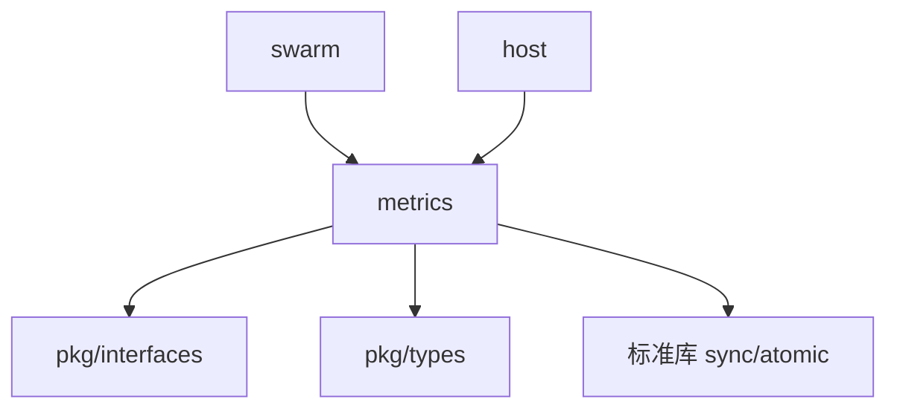

# Core Metrics 模块

> **版本**: v1.1.0  
> **更新日期**: 2026-01-13  
> **状态**: ✅ 已实现

---

## 概述

metrics 模块提供带宽统计功能，支持全局、按协议、按节点的流量统计。

| 属性 | 值 |
|------|-----|
| **架构层** | Core Layer Level 1 |
| **代码位置** | `internal/core/metrics/` |
| **Fx 模块** | `fx.Module("metrics")` |
| **依赖** | 无（底层组件） |
| **被依赖** | swarm, host |

**重要说明**：DeP2P 是独立于 libp2p 的项目，本模块使用标准库 `sync/atomic` 实现，不依赖任何 libp2p 包。

---

## 快速开始

### 基础用法

```go
import "github.com/dep2p/go-dep2p/internal/core/metrics"

// 创建 BandwidthCounter
counter := metrics.NewBandwidthCounter()

// 记录全局消息
counter.LogSentMessage(1024)
counter.LogRecvMessage(2048)

// 记录流消息（关联协议和节点）
counter.LogSentMessageStream(512, proto, peer)
counter.LogRecvMessageStream(256, proto, peer)

// 获取统计
stats := counter.GetBandwidthTotals()
fmt.Printf("Total In: %d, Out: %d\n", stats.TotalIn, stats.TotalOut)
fmt.Printf("Rate In: %.2f B/s, Out: %.2f B/s\n", stats.RateIn, stats.RateOut)
```

---

## 核心功能

### 1. 全局带宽统计

**记录消息**：
```go
// 记录发送（不关联协议/节点）
counter.LogSentMessage(1024)

// 记录接收
counter.LogRecvMessage(2048)
```

**获取统计**：
```go
stats := counter.GetBandwidthTotals()
// stats.TotalIn  - 总入站字节
// stats.TotalOut - 总出站字节
// stats.RateIn   - 入站速率（字节/秒）
// stats.RateOut  - 出站速率（字节/秒）
```

---

### 2. 按协议统计

**记录流消息**：
```go
proto := types.ProtocolID("/test/1.0.0")
peer := types.PeerID("peer1")

// 记录流发送（自动关联协议和节点）
counter.LogSentMessageStream(512, proto, peer)

// 记录流接收
counter.LogRecvMessageStream(256, proto, peer)
```

**获取协议统计**：
```go
protoStats := counter.GetBandwidthForProtocol(proto)
fmt.Printf("Protocol %s: In=%d, Out=%d\n", 
    proto, protoStats.TotalIn, protoStats.TotalOut)

// 获取所有协议统计
allProtocols := counter.GetBandwidthByProtocol()
for proto, stats := range allProtocols {
    fmt.Printf("%s: %+v\n", proto, stats)
}
```

---

### 3. 按节点统计

**获取节点统计**：
```go
peerStats := counter.GetBandwidthForPeer(peer)
fmt.Printf("Peer %s: In=%d, Out=%d\n", 
    peer, peerStats.TotalIn, peerStats.TotalOut)

// 获取所有节点统计
allPeers := counter.GetBandwidthByPeer()
for peer, stats := range allPeers {
    fmt.Printf("%s: %+v\n", peer, stats)
}
```

---

### 4. 速率计算

**瞬时速率**：
```go
// 第一次调用
stats1 := counter.GetBandwidthTotals()
// stats1.RateIn, stats1.RateOut 为 0

// 记录一些消息
counter.LogSentMessage(10240)
time.Sleep(1 * time.Second)

// 第二次调用（计算自上次调用的速率）
stats2 := counter.GetBandwidthTotals()
// stats2.RateIn = (stats2.TotalIn - stats1.TotalIn) / 时间差
// stats2.RateOut ≈ 10240 字节/秒
```

**说明**：
- 速率基于两次 `GetBandwidthTotals()` 调用之间的时间差
- 第一次调用速率为 0（无历史数据）
- 后续调用计算瞬时速率

---

### 5. 重置和清理

**重置所有统计**：
```go
counter.Reset()
// 所有计数器归零
```

**清理空闲统计**：
```go
// 清理 1 小时前的空闲计量器（简化实现暂不支持）
counter.TrimIdle(time.Now().Add(-1 * time.Hour))
```

---

## 文件结构

```
internal/core/metrics/
├── doc.go              # 包文档
├── module.go           # Fx 模块
├── bandwidth.go        # BandwidthCounter（原子计数器）
├── reporter.go         # Reporter 接口
├── stats.go            # Stats 结构
├── testing.go          # 测试辅助
└── *_test.go           # 测试文件（5 个）
```

---

## Fx 模块使用

### 基础用法

```go
import (
    "go.uber.org/fx"
    "github.com/dep2p/go-dep2p/internal/core/metrics"
)

app := fx.New(
    metrics.Module,
    fx.Invoke(func(reporter metrics.Reporter) {
        reporter.LogSentMessage(100)
        stats := reporter.GetBandwidthTotals()
        log.Printf("Stats: %+v", stats)
    }),
)
```

### 在其他模块中使用

```go
type Params struct {
    fx.In
    Reporter metrics.Reporter
}

func MyModule(p Params) {
    p.Reporter.LogSentMessage(1024)
    // ...
}
```

---

## 实现细节

### 原子计数器

**全局计数器**：
```go
type BandwidthCounter struct {
    totalIn  atomic.Int64  // 原子操作，并发安全
    totalOut atomic.Int64
    // ...
}

func (bwc *BandwidthCounter) LogSentMessage(size int64) {
    bwc.totalOut.Add(size)  // 原子加法
}
```

**优势**：
- 使用标准库 `sync/atomic`
- 无外部依赖
- 高性能，无锁开销

---

### 协议/节点计数器

**Map + Mutex 保护**：
```go
type BandwidthCounter struct {
    protocolMu sync.RWMutex
    protocolOut map[types.ProtocolID]*atomic.Int64
    // ...
}

func (bwc *BandwidthCounter) LogSentMessageStream(...) {
    bwc.protocolMu.Lock()
    counter := bwc.protocolOut[proto]
    if counter == nil {
        counter = &atomic.Int64{}
        bwc.protocolOut[proto] = counter
    }
    bwc.protocolMu.Unlock()
    counter.Add(size)  // 原子操作
}
```

**设计**：
- 写入：加锁创建 counter，解锁后原子加法
- 读取：读锁遍历 map，原子读取值
- 并发安全：RWMutex + atomic 组合

---

### 速率计算

**瞬时速率实现**：
```go
func (bwc *BandwidthCounter) GetBandwidthTotals() Stats {
    totalIn := bwc.totalIn.Load()
    totalOut := bwc.totalOut.Load()
    
    now := time.Now().UnixNano()
    lastUpdate := bwc.lastUpdate.Load()
    duration := float64(now-lastUpdate) / 1e9 // 秒
    
    rateIn = float64(totalIn-lastIn) / duration
    rateOut = float64(totalOut-lastOut) / duration
    
    // 更新上次统计
    bwc.lastUpdate.Store(now)
    bwc.lastIn.Store(totalIn)
    bwc.lastOut.Store(totalOut)
}
```

**说明**：
- 基于时间差计算瞬时速率
- 每次调用 `GetBandwidthTotals()` 更新速率
- Phase 2 可扩展为 EWMA 或滑动窗口

---

## 性能指标

| 操作 | 时间 | 说明 |
|------|------|------|
| LogSentMessage | < 10ns | 原子加法 |
| LogRecvMessage | < 10ns | 原子加法 |
| LogSentMessageStream | < 100ns | Mutex + 原子加法 |
| GetBandwidthTotals | < 50ns | 原子读取 + 速率计算 |
| GetBandwidthForPeer | < 100ns | RLock + 原子读取 |
| GetBandwidthByPeer | O(n) | 遍历所有节点 |

**说明**：基于 Apple Silicon M 系列芯片的估算。

---

## 测试统计

| 指标 | 数量 | 状态 |
|------|------|------|
| 实现文件 | 5 | ✅ |
| 测试文件 | 6 | ✅ |
| 测试用例 | 30+ | ✅ |
| 测试覆盖率 | 82.1% | ✅ |
| 竞态检测 | 通过 | ✅ |
| 测试通过率 | 100% | ✅ |

---

## 架构定位

### Tier 分层

```
Tier 1: Core Layer Level 1
├── identity
├── eventbus
├── resourcemgr
├── muxer
├── metrics ◄── 本模块
└── （其他核心模块）

依赖：无（最底层）
被依赖：swarm, host
```

### 依赖关系



---

## 并发安全

**原子操作 + 锁保护**：

1. **全局计数**：`atomic.Int64`（无锁）
2. **Map 操作**：`sync.RWMutex` 保护
3. **计数器更新**：原子 `Add()`
4. **统计读取**：原子 `Load()`

**竞态检测**：
```bash
go test -race .
ok   internal/core/metrics  2.275s
```

---

## Phase 1 vs Phase 2

### Phase 1 实现 ✅

**核心带宽统计**：
- ✅ BandwidthCounter（原子计数器）
- ✅ Reporter 接口
- ✅ Stats 结构
- ✅ 全局/协议/节点三层统计
- ✅ 瞬时速率计算
- ✅ Fx 模块集成

**技术栈**：
- 标准库：`sync/atomic`, `sync.RWMutex`, `time`
- DeP2P：`pkg/types`, `pkg/interfaces`
- Fx：`go.uber.org/fx`

**无外部依赖**（除 Fx）

---

### Phase 2 扩展 ⏸️

**高级功能**（未实现）：
- ⏸️ Prometheus 集成（`pkg/interfaces/metrics.go` 的完整 Metrics 接口）
- ⏸️ OpenTelemetry 集成
- ⏸️ 复杂指标类型（Counter/Gauge/Histogram/Summary）
- ⏸️ 连接/流指标（由 swarm 层实现）
- ⏸️ EWMA 速率计算
- ⏸️ 滑动窗口统计
- ⏸️ 空闲统计清理（TrimIdle 完整实现）

---

## 使用示例

### 监控全局带宽

```go
counter := metrics.NewBandwidthCounter()

// 持续记录
go func() {
    for {
        counter.LogSentMessage(rand.Int63n(1024))
        time.Sleep(10 * time.Millisecond)
    }
}()

// 定期报告
ticker := time.NewTicker(5 * time.Second)
for range ticker.C {
    stats := counter.GetBandwidthTotals()
    log.Printf("Bandwidth: In=%d (%.2f KB/s), Out=%d (%.2f KB/s)",
        stats.TotalIn, stats.RateIn/1024,
        stats.TotalOut, stats.RateOut/1024)
}
```

---

### 监控协议带宽

```go
protocols := []types.ProtocolID{
    "/bitswap/1.0.0",
    "/kad/1.0.0",
    "/identify/1.0.0",
}

// 定期报告各协议带宽
for _, proto := range protocols {
    stats := counter.GetBandwidthForProtocol(proto)
    log.Printf("Protocol %s: In=%d, Out=%d", 
        proto, stats.TotalIn, stats.TotalOut)
}
```

---

### 监控节点带宽

```go
// 获取所有节点统计
byPeer := counter.GetBandwidthByPeer()

// 找出 Top 10 流量最大的节点
type peerStat struct {
    peer  types.PeerID
    total int64
}

var topPeers []peerStat
for peer, stats := range byPeer {
    topPeers = append(topPeers, peerStat{
        peer:  peer,
        total: stats.TotalIn + stats.TotalOut,
    })
}

// 排序并输出...
```

---

## 设计模式

### 1. 原子计数器

```go
// 全局计数器
type BandwidthCounter struct {
    totalIn  atomic.Int64
    totalOut atomic.Int64
}

// 原子操作
func (bwc *BandwidthCounter) LogSentMessage(size int64) {
    bwc.totalOut.Add(size)
}
```

**优势**：
- 无锁高性能
- 并发安全
- 标准库实现

---

### 2. 懒创建 Map

```go
func (bwc *BandwidthCounter) LogSentMessageStream(...) {
    bwc.protocolMu.Lock()
    counter := bwc.protocolOut[proto]
    if counter == nil {
        counter = &atomic.Int64{}  // 懒创建
        bwc.protocolOut[proto] = counter
    }
    bwc.protocolMu.Unlock()
    counter.Add(size)
}
```

**优势**：
- 按需创建
- 减少内存占用
- 支持动态协议/节点

---

### 3. 读写锁优化

```go
func (bwc *BandwidthCounter) GetBandwidthForPeer(p types.PeerID) Stats {
    bwc.peerMu.RLock()  // 读锁
    inCounter := bwc.peerIn[p]
    outCounter := bwc.peerOut[p]
    bwc.peerMu.RUnlock()
    
    // 解锁后原子读取
    totalIn := inCounter.Load()
    totalOut := outCounter.Load()
}
```

**优势**：
- 读操作并发
- 写操作串行
- 锁粒度最小化

---

## 并发安全

**并发保证**：

| 操作 | 并发安全机制 | 性能 |
|------|-------------|------|
| LogSentMessage | atomic.Int64.Add() | 高 |
| LogRecvMessage | atomic.Int64.Add() | 高 |
| LogSentMessageStream | Mutex + atomic | 中 |
| GetBandwidthTotals | atomic.Int64.Load() | 高 |
| GetBandwidthForPeer | RLock + atomic | 高 |
| GetBandwidthByPeer | RLock + 遍历 | 中 |

**竞态检测**：
```bash
go test -race .
ok   internal/core/metrics  2.275s
```

---

## 与 libp2p 的对比

### 设计借鉴

| 特性 | libp2p | DeP2P | 说明 |
|------|--------|-------|------|
| 带宽统计 | go-flow-metrics | sync/atomic | ✅ 独立实现 |
| 三层统计 | 全局/协议/节点 | 同 | ✅ 设计一致 |
| 速率计算 | EWMA | 瞬时速率 | 简化实现 |
| Reporter 接口 | 相同 | 相同 | ✅ 接口兼容 |

**关键差异**：
- **依赖**：DeP2P 使用标准库，libp2p 使用 go-flow-metrics
- **速率**：DeP2P 瞬时速率，libp2p EWMA
- **清理**：DeP2P 简化实现，libp2p 完整 TrimIdle

**独立性**：✅ DeP2P 是完全独立的实现，不依赖任何 libp2p 包

---

## 相关文档

| 文档 | 说明 |
|------|------|
| [L6_domains/core_metrics/](../../../design/03_architecture/L6_domains/core_metrics/) | 设计文档 |
| [pkg/interfaces/metrics.go](../../../pkg/interfaces/metrics.go) | 接口定义 |
| [CLEANUP_REPORT.md](./CLEANUP_REPORT.md) | 代码清理报告 |
| [COMPLIANCE_CHECK.md](../../../design/03_architecture/L6_domains/core_metrics/COMPLIANCE_CHECK.md) | 合规性检查 |

---

**最后更新**：2026-01-13
