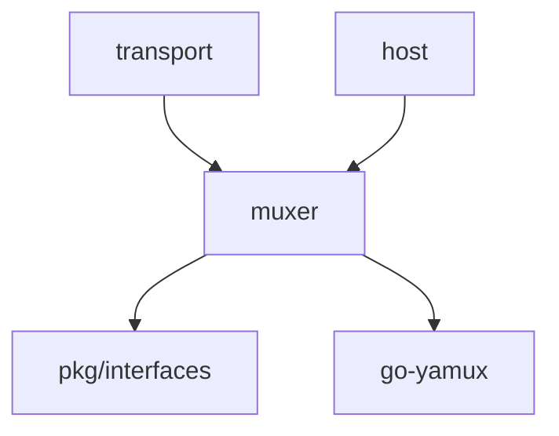

# Core Muxer 模块

> **版本**: v1.1.0  
> **更新日期**: 2026-01-13  
> **状态**: ✅ 已实现

---

## 概述

muxer 模块提供基于 yamux 协议的流多路复用能力，在单个连接上支持多个并发流。

| 属性 | 值 |
|------|-----|
| **架构层** | Core Layer Level 1 |
| **代码位置** | `internal/core/muxer/` |
| **Fx 模块** | `fx.Module("muxer")` |
| **依赖** | 无（底层组件） |
| **被依赖** | transport, host |

---

## 快速开始

### 基础用法

```go
import "github.com/dep2p/go-dep2p/internal/core/muxer"

// 创建 Transport
transport := muxer.NewTransport()

// 服务端
muxedConn, _ := transport.NewConn(conn, true, peerScope)
defer muxedConn.Close()

stream, _ := muxedConn.AcceptStream()
defer stream.Close()

// 读取数据
buf := make([]byte, 1024)
n, _ := stream.Read(buf)

// 客户端
muxedConn, _ := transport.NewConn(conn, false, peerScope)
defer muxedConn.Close()

stream, _ := muxedConn.OpenStream(ctx)
defer stream.Close()

// 写入数据
stream.Write([]byte("hello"))
```

---

## 核心功能

### 1. 单连接多流

**流创建**：
```go
// 客户端打开流
stream, err := muxedConn.OpenStream(ctx)
defer stream.Close()

// 服务端接受流
stream, err := muxedConn.AcceptStream()
defer stream.Close()
```

**并发流**：
- 支持 1000+ 并发流
- 无队头阻塞
- 独立的流量控制

---

### 2. 流量控制

**窗口管理**：
- 初始窗口：64KB
- 最大窗口：16MB
- 自动窗口更新

**配置优化**：
```go
config.MaxStreamWindowSize = 16 * 1024 * 1024 // 16MB
// 100ms 延迟下可达 160MB/s 吞吐量
```

---

### 3. 流操作

**读写数据**：
```go
// 写入
n, err := stream.Write(data)

// 读取
buf := make([]byte, 1024)
n, err := stream.Read(buf)
```

**半关闭**：
```go
// 关闭写端（发送 EOF）
stream.CloseWrite()

// 关闭读端
stream.CloseRead()
```

**超时控制**：
```go
// 设置读超时
stream.SetReadDeadline(time.Now().Add(5 * time.Second))
defer stream.SetReadDeadline(nil) // 清除超时

// 设置写超时
stream.SetWriteDeadline(time.Now().Add(5 * time.Second))

// 设置读写超时
stream.SetDeadline(time.Now().Add(5 * time.Second))
```

**流重置**：
```go
// 正常关闭
stream.Close()

// 强制重置（错误时）
stream.Reset()
```

---

### 4. 资源管理集成

**内存管理**：
```go
// PeerScope 提供内存管理
muxedConn, _ := transport.NewConn(conn, true, peerScope)

// yamux 自动调用 peerScope.BeginSpan() 预留内存
// 流关闭时自动释放
```

**Span 接口**：
```go
// ResourceScopeSpan 实现 yamux.MemoryManager
type ResourceScopeSpan interface {
    ReserveMemory(size int, prio uint8) error
    ReleaseMemory(size int)
}
```

---

## yamux 配置

| 参数 | 默认值 | 说明 |
|------|--------|------|
| `MaxStreamWindowSize` | 16MB | 最大流窗口（吞吐量优化） |
| `KeepAliveInterval` | 30s | 心跳间隔（连接保活） |
| `MaxIncomingStreams` | 无限制 | 由 ResourceManager 控制 |
| `ReadBufSize` | 0 | 禁用（安全层已缓冲） |
| `LogOutput` | io.Discard | 禁用日志 |

---

## 文件结构

```
internal/core/muxer/
├── doc.go              # 包文档
├── module.go           # Fx 模块定义
├── transport.go        # Transport 实现
├── conn.go             # MuxedConn 实现
├── stream.go           # MuxedStream 实现
├── errors.go           # 错误定义
├── testing.go          # 测试辅助
└── *_test.go           # 测试文件（7 个）
```

---

## Fx 模块使用

### 基础用法

```go
import (
    "go.uber.org/fx"
    "github.com/dep2p/go-dep2p/internal/core/muxer"
    pkgif "github.com/dep2p/go-dep2p/pkg/interfaces"
)

app := fx.New(
    muxer.Module,
    fx.Invoke(func(transport pkgif.StreamMuxer) {
        id := transport.ID()
        log.Printf("Muxer: %s", id) // "/yamux/1.0.0"
    }),
)
```

### 在其他模块中使用

```go
type Params struct {
    fx.In
    Muxer pkgif.StreamMuxer
}

func MyModule(p Params) {
    muxedConn, _ := p.Muxer.NewConn(conn, true, peerScope)
    // ...
}
```

---

## 性能指标

| 操作 | 时间 | 说明 |
|------|------|------|
| NewConn | < 100µs | 创建多路复用连接 |
| OpenStream | < 1ms | 打开新流 |
| AcceptStream | < 1ms | 接受流（阻塞） |
| Read/Write | < 100µs | 数据读写（无竞争） |
| Close | < 50µs | 关闭流 |

**吞吐量**：
- 单流：160MB/s (100ms 延迟)
- 多流：取决于底层连接带宽

**说明**：基于 Apple Silicon M 系列芯片的估算。

---

## 测试统计

| 指标 | 数量 | 状态 |
|------|------|------|
| 实现文件 | 6 | ✅ |
| 测试文件 | 7 | ✅ |
| 测试用例 | 40+ | ✅ |
| 测试覆盖率 | 84.1% | ✅ |
| 竞态检测 | 通过 | ✅ |
| 测试通过率 | 100% | ✅ |

---

## 架构定位

### Tier 分层

```
Tier 1: Core Layer Level 1
├── identity
├── eventbus
├── resourcemgr
├── muxer ◄── 本模块
└── metrics

依赖：无（最底层）
被依赖：transport, host
```

### 依赖关系



---

## 并发安全

yamux 本身是并发安全的：

1. **流创建**：OpenStream/AcceptStream 可以并发调用
2. **流读写**：多个流可以并发读写
3. **连接关闭**：Close 操作是线程安全的
4. **心跳保活**：自动后台心跳检测

---

## 流使用规范

### 正确关闭

```go
// 优雅关闭
func handleStream(stream MuxedStream) error {
    defer stream.Close()  // 始终关闭
    
    // 业务逻辑
    return nil
}

// 错误时重置
func handleStream(stream MuxedStream) error {
    if err := process(stream); err != nil {
        stream.Reset()  // 强制关闭
        return err
    }
    return stream.Close()  // 优雅关闭
}
```

### 超时设置

```go
func readWithTimeout(stream MuxedStream, timeout time.Duration) ([]byte, error) {
    stream.SetReadDeadline(time.Now().Add(timeout))
    defer stream.SetReadDeadline(nil)  // 清除超时
    
    return io.ReadAll(stream)
}
```

### 并发接受流

```go
func acceptLoop(conn MuxedConn, handler func(MuxedStream)) {
    for {
        stream, err := conn.AcceptStream()
        if err != nil {
            if errors.Is(err, ErrConnClosed) {
                return
            }
            continue
        }
        go handler(stream)
    }
}
```

---

## 错误处理

```go
// 流重置
if err == muxer.ErrStreamReset {
    // 流被对端重置
}

// 连接关闭
if err == muxer.ErrConnClosed {
    // 连接已关闭
}
```

---

## yamux 协议特性

### 核心特性

- **流 ID 分配**：客户端偶数，服务端奇数
- **流量控制**：连接级 + 流级双层控制
- **心跳保活**：定期发送 PING 帧
- **窗口更新**：消费 50% 后自动更新

### 帧类型

| 帧类型 | 说明 |
|--------|------|
| Data | 数据传输 |
| WindowUpdate | 窗口更新 |
| Ping | 心跳检测 |
| GoAway | 连接关闭 |

---

## 设计模式

### 1. 包装模式

```go
// Transport 包装 yamux.Config
type Transport struct {
    config *yamux.Config
}

// muxedConn 包装 yamux.Session
type muxedConn struct {
    session *yamux.Session
}

// muxedStream 包装 yamux.Stream
type muxedStream struct {
    stream *yamux.Stream
}
```

### 2. 单例模式

```go
var DefaultTransport *Transport

func init() {
    DefaultTransport = &Transport{config: ...}
}
```

### 3. 错误转换

```go
func parseError(err error) error {
    if errors.Is(err, yamux.ErrStreamReset) {
        return ErrStreamReset
    }
    return err
}
```

---

## 相关文档

| 文档 | 说明 |
|------|------|
| [L6_domains/core_muxer/](../../../design/03_architecture/L6_domains/core_muxer/) | 设计文档 |
| [pkg/interfaces/muxer.go](../../../pkg/interfaces/muxer.go) | 接口定义 |
| [COMPLIANCE_CHECK.md](../../../design/03_architecture/L6_domains/core_muxer/COMPLIANCE_CHECK.md) | 合规性检查 |
| [yamux 规范](https://github.com/libp2p/go-yamux) | yamux 协议实现 |

---

**最后更新**：2026-01-13
