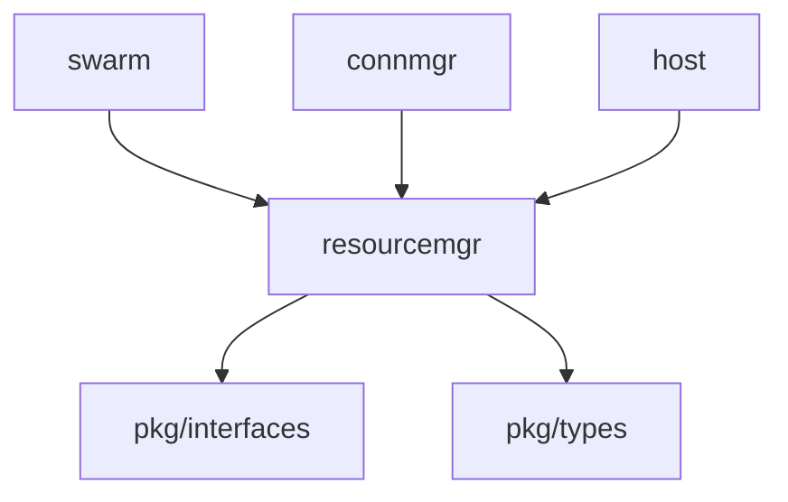

# Core ResourceMgr 模块

> **版本**: v1.1.0  
> **更新日期**: 2026-01-13  
> **状态**: ✅ 已实现

---

## 概述

resourcemgr 模块提供层次化的资源限制和配额管理，防止资源耗尽攻击，确保节点稳定运行。

| 属性 | 值 |
|------|-----|
| **架构层** | Core Layer Level 1 |
| **代码位置** | `internal/core/resourcemgr/` |
| **Fx 模块** | `fx.Module("resourcemgr")` |
| **依赖** | 无（底层组件） |
| **被依赖** | swarm, connmgr, host |

---

## 快速开始

```go
import "github.com/dep2p/go-dep2p/internal/core/resourcemgr"

// 创建资源管理器
cfg := resourcemgr.DefaultLimitConfig()
rm, _ := resourcemgr.NewResourceManager(cfg)
defer rm.Close()

// 打开连接
connScope, _ := rm.OpenConnection(pkgif.DirInbound, true, addr)
defer connScope.Done()

// 打开流
streamScope, _ := rm.OpenStream(peerID, pkgif.DirOutbound)
defer streamScope.Done()

// 预留内存
span, _ := streamScope.BeginSpan()
defer span.Done()
span.ReserveMemory(1024, pkgif.ReservationPriorityHigh)
```

---

## 核心功能

### 1. 层次化作用域

**作用域层次**：
```
System (系统级)
  ├─ Transient (临时资源，握手期间)
  ├─ Service[name] (服务级)
  ├─ Protocol[id] (协议级)
  └─ Peer[id] (节点级)
       ├─ Connection (连接级)
       └─ Stream (流级)
```

**查看作用域**：
```go
// 查看系统作用域
rm.ViewSystem(func(s pkgif.ResourceScope) error {
    stat := s.Stat()
    fmt.Printf("System: %+v\n", stat)
    return nil
})

// 查看节点作用域
rm.ViewPeer(peerID, func(s pkgif.PeerScope) error {
    fmt.Printf("Peer %s: %+v\n", s.Peer(), s.Stat())
    return nil
})
```

---

### 2. 资源限制

**资源类型**：
- **Streams**: 流数量（入站/出站）
- **Conns**: 连接数量（入站/出站）
- **FD**: 文件描述符数量
- **Memory**: 内存使用量（字节）

**默认限制**：

| 作用域 | Streams | Conns | FD | Memory |
|--------|---------|-------|----|---------| 
| System | 10000 | 1000 | 900 | 1GB |
| Transient | 500 | 100 | 100 | 256MB |
| Peer | 100 | 10 | 10 | 64MB |
| Connection | 50 | 1 | 1 | 32MB |
| Stream | - | - | - | 16MB |

---

### 3. 内存预留

**优先级控制**：
```go
// 低优先级（<= 40% 利用率）
span.ReserveMemory(size, pkgif.ReservationPriorityLow)

// 中优先级（<= 60% 利用率）
span.ReserveMemory(size, pkgif.ReservationPriorityMedium)

// 高优先级（<= 80% 利用率）
span.ReserveMemory(size, pkgif.ReservationPriorityHigh)

// 总是预留（只要有资源）
span.ReserveMemory(size, pkgif.ReservationPriorityAlways)
```

**Span 管理**：
```go
span, _ := scope.BeginSpan()
defer span.Done() // 自动释放所有 Span 持有的资源

span.ReserveMemory(1024, pkgif.ReservationPriorityHigh)
// ... 使用内存 ...
span.ReleaseMemory(1024)
```

---

### 4. 连接/流管理

**打开连接**：
```go
connScope, err := rm.OpenConnection(
    pkgif.DirInbound,  // 方向
    true,               // 使用文件描述符
    addr,               // 端点地址
)
defer connScope.Done()

// 设置关联的节点
connScope.SetPeer(peerID)

// 保护节点
connScope.ProtectPeer(peerID)
```

**打开流**：
```go
streamScope, err := rm.OpenStream(
    peerID,              // 节点 ID
    pkgif.DirOutbound,  // 方向
)
defer streamScope.Done()

// 设置协议
streamScope.SetProtocol(protoID)

// 设置服务
streamScope.SetService("my-service")
```

---

## 文件结构

```
internal/core/resourcemgr/
├── doc.go                # 包文档
├── module.go             # Fx 模块定义
├── manager.go            # ResourceManager 主体
├── scope.go              # 基础作用域实现
├── connection_scope.go   # 连接作用域
├── stream_scope.go       # 流作用域
├── limit.go              # 限制定义和默认配置
├── errors.go             # 错误定义
├── testing.go            # 测试辅助
└── *_test.go             # 测试文件（7 个）
```

---

## Fx 模块使用

### 基础用法

```go
import (
    "go.uber.org/fx"
    "github.com/dep2p/go-dep2p/internal/core/resourcemgr"
    pkgif "github.com/dep2p/go-dep2p/pkg/interfaces"
)

app := fx.New(
    resourcemgr.Module,
    fx.Invoke(func(rm pkgif.ResourceManager) {
        // 使用 ResourceManager
        rm.ViewSystem(func(s pkgif.ResourceScope) error {
            stat := s.Stat()
            log.Printf("System: %+v", stat)
            return nil
        })
    }),
)
```

### 在其他模块中使用

```go
type Params struct {
    fx.In
    ResourceManager pkgif.ResourceManager
}

func MyModule(p Params) {
    connScope, _ := p.ResourceManager.OpenConnection(...)
    defer connScope.Done()
    // ...
}
```

---

## 性能指标

| 操作 | 时间 | 说明 |
|------|------|------|
| ViewSystem | < 1µs | 查看系统作用域 |
| ViewPeer | < 10µs | 查看节点作用域（含创建） |
| OpenConnection | < 20µs | 打开连接作用域 |
| OpenStream | < 20µs | 打开流作用域 |
| ReserveMemory | < 1µs | 预留内存（无竞争） |
| BeginSpan | < 5µs | 创建 Span |

**说明**：基于 Apple Silicon M 系列芯片的估算。

---

## 测试统计

| 指标 | 数量 | 状态 |
|------|------|------|
| 实现文件 | 8 | ✅ |
| 测试文件 | 7 | ✅ |
| 测试用例 | 50+ | ✅ |
| 测试覆盖率 | 83.9% | ✅ |
| 竞态检测 | 通过 | ✅ |
| 测试通过率 | 100% | ✅ |

---

## 架构定位

### Tier 分层

```
Tier 1: Core Layer Level 1
├── identity
├── eventbus
├── resourcemgr ◄── 本模块
├── muxer
└── metrics

依赖：无（最底层）
被依赖：swarm, connmgr, host
```

### 依赖关系



---

## 并发安全

ResourceManager 使用以下机制保证并发安全：

1. **Atomic 计数器**：资源计数器使用 atomic 操作（热路径）
2. **Mutex 保护**：作用域 map 使用 sync.Mutex（冷路径）
3. **closeOnce**：防止重复关闭
4. **引用计数**：作用域生命周期管理

---

## 设计模式

### 1. 层次化作用域

资源使用向上累积到父作用域：

```
Stream.Memory = 1KB
  └─ 累积到 Peer.Memory
       └─ 累积到 System.Memory
```

### 2. 引用计数

作用域使用引用计数管理生命周期：

```go
scope := rm.getPeerScope(peer)
scope.IncRef()    // +1
defer scope.DecRef() // -1，当 refCnt=0 时可能被清理
```

### 3. 优先级预留

内存预留使用优先级控制：

```
阈值 = limit * (prio + 1) / 256

prio=255: threshold = limit (100%)
prio=203: threshold ≈ limit * 80% 
prio=152: threshold ≈ limit * 60%
prio=101: threshold ≈ limit * 40%
```

### 4. Span 模式

Span 是控制流 delimited 的作用域，自动释放资源：

```go
span, _ := scope.BeginSpan()
defer span.Done() // 自动释放 Span 持有的所有资源

span.ReserveMemory(size, prio)
// ... 使用资源 ...
// Done() 时自动释放
```

---

## 错误处理

```go
// 资源限制超出
if err == resourcemgr.ErrResourceLimitExceeded {
    // 处理限制超出
}

// 作用域已关闭
if err == resourcemgr.ErrResourceScopeClosed {
    // 作用域已关闭，无法操作
}
```

---

## 相关文档

| 文档 | 说明 |
|------|------|
| [L6_domains/core_resourcemgr/](../../../design/03_architecture/L6_domains/core_resourcemgr/) | 设计文档 |
| [pkg/interfaces/resource.go](../../../pkg/interfaces/resource.go) | 接口定义 |
| [COMPLIANCE_CHECK.md](../../../design/03_architecture/L6_domains/core_resourcemgr/COMPLIANCE_CHECK.md) | 合规性检查 |

---

**最后更新**：2026-01-13
