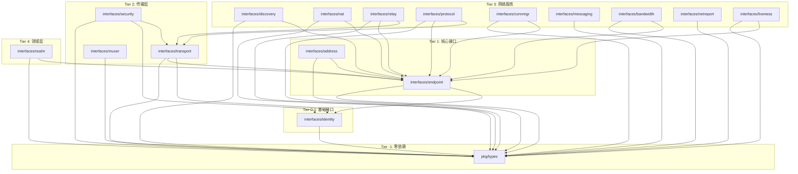

# DeP2P 公共接口

本目录包含 DeP2P 所有公共接口的定义。

## 目录结构

```
pkg/
├── types/                     # Tier -1: 零依赖纯类型
│   ├── ids.go                 # NodeID, StreamID, ProtocolID, RealmID
│   ├── enums.go               # Direction, NATType, Priority, KeyType, Connectedness
│   ├── stats.go               # ConnectionStats, StreamStats, NetworkStats
│   └── address.go             # AddressInfo, AddressRecord, AddressState
│
├── proto/                     # 网络协议 protobuf
│   ├── key/
│   │   ├── key.proto          # 密钥序列化格式
│   │   └── key.pb.go          # 生成的 Go 代码
│   └── peer/
│       ├── peer.proto         # 节点记录
│       └── peer.pb.go         # 生成的 Go 代码
│
└── interfaces/                # 接口定义
    ├── identity/              # Tier 0-1: 身份和密钥接口
    │   ├── key.go             # PublicKey, PrivateKey, KeyGenerator
    │   └── identity.go        # Identity, IdentityManager
    │
    ├── endpoint/              # Tier 1: API 层接口 (原 core 包)
    │   ├── types.go           # 类型别名（向后兼容）
    │   ├── endpoint.go        # Endpoint 接口
    │   ├── connection.go      # Connection 接口
    │   ├── stream.go          # Stream 接口
    │   └── errors.go          # 错误定义
    │
    ├── address/               # Tier 1: 地址接口
    │   └── address.go         # AddressManager, AddressBook, AddressParser
    │
    ├── transport/             # Tier 2: 传输接口
    │   └── transport.go       # Transport, Listener, Conn, Upgrader
    │
    ├── security/              # Tier 2: 安全接口
    │   └── security.go        # SecureTransport, SecureConn
    │
    ├── muxer/                 # Tier 2: 多路复用接口
    │   └── muxer.go           # Muxer, Stream, MuxerFactory
    │
    ├── discovery/             # Tier 3: 发现接口
    │   └── discovery.go       # DiscoveryService, Discoverer, DHT
    │
    ├── nat/                   # Tier 3: NAT 接口
    │   └── nat.go             # NATService, HolePuncher, PortMapper
    │
    ├── relay/                 # Tier 3: 中继接口
    │   └── relay.go           # RelayClient, RelayServer, Reservation
    │
    ├── protocol/              # Tier 3: 协议接口
    │   └── protocol.go        # Protocol, Router, Negotiator
    │
    ├── connmgr/               # Tier 3: 连接管理接口
    │   └── connmgr.go         # ConnectionManager, ConnectionFilter
    │
    ├── messaging/             # Tier 3: 消息接口
    │   └── messaging.go       # MessagingService (Request/Response, Pub/Sub, Query)
    │
    ├── bandwidth/             # Tier 3: 带宽统计接口
    │   └── bandwidth.go       # Counter, Stats
    │
    ├── netreport/             # Tier 3: 网络诊断接口
    │   └── netreport.go       # NetReporter, Report
    │
    ├── liveness/              # Tier 3: 活性检测接口
    │   └── liveness.go        # LivenessService
    │
    └── realm/                 # Tier 4: 领域隔离接口
        └── realm.go           # RealmManager
```

## 依赖层次



## 使用方式

### 导入基础类型

```go
import "github.com/dep2p/go-dep2p/pkg/types"

// 使用基础类型
var nodeID types.NodeID
var direction types.Direction = types.DirInbound
```

### 导入密钥接口

```go
import "github.com/dep2p/go-dep2p/pkg/interfaces/identity"

// 使用密钥接口（原 crypto 包已合并）
func sign(key identity.PrivateKey, data []byte) ([]byte, error) {
    return key.Sign(data)
}
```

### 导入 Endpoint 接口

```go
import (
    "github.com/dep2p/go-dep2p/pkg/interfaces/endpoint"
    "github.com/dep2p/go-dep2p/pkg/types"
)

// endpoint 包提供向后兼容的类型别名
var _ endpoint.NodeID = types.NodeID{} // 类型相同
```

## 重构说明 (2025-12-20)

### core → endpoint

原 `pkg/interfaces/core` 已重命名为 `pkg/interfaces/endpoint`：
- 原因：`core` 与 `internal/core` 命名冲突，且设计文档中 Core 指基础类型而非 Endpoint
- 影响：`core.Endpoint` → `endpoint.Endpoint`，`core.Connection` → `endpoint.Connection` 等

### crypto → identity

原 `pkg/interfaces/crypto` 已合并到 `pkg/interfaces/identity`：
- 原因：设计文档中 Identity 包含密钥管理职责，分离导致接口/实现不一一对应
- 影响：`crypto.PublicKey` → `identity.PublicKey`，`crypto.PrivateKey` → `identity.PrivateKey` 等

### 删除 event 和 preset

原 `pkg/interfaces/event` 和 `pkg/interfaces/preset` 已删除：

**event 删除原因**：
- 从未实现，`Endpoint.EventBus()` 始终返回 `nil`
- 当前系统使用回调函数模式（如 `OnUpgraded`、`OnConnected` callback）
- 如需事件系统，建议使用回调注册或 channel 机制

**preset 删除原因**：
- `pkg/dep2p/presets.go` 直接定义了 `Preset struct`，未使用接口
- 接口从未被任何代码导入或使用
- 对于预设配置，直接使用 struct 已足够灵活

## Protobuf 消息

`pkg/proto/` 目录包含网络传输使用的 protobuf 定义：

- `key/key.proto` - 密钥序列化格式
- `peer/peer.proto` - 节点记录和地址信息

生成 Go 代码：

```bash
protoc --go_out=. --go_opt=paths=source_relative pkg/proto/key/key.proto
protoc --go_out=. --go_opt=paths=source_relative pkg/proto/peer/peer.proto
```

## 设计原则

1. **零循环依赖** - 严格的分层依赖，下层不依赖上层
2. **接口与实现分离** - 公共接口在 `pkg/interfaces/`，内部实现在 `internal/core/`
3. **一一对应** - 每个 `pkg/interfaces/X` 对应 `internal/core/X`
4. **高内聚低耦合** - 每个包职责单一，依赖清晰
