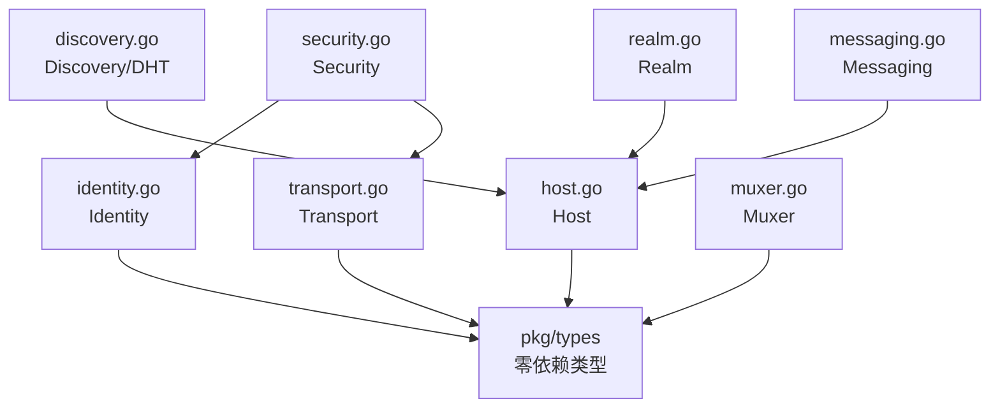

# DeP2P 公共接口

本目录包含 DeP2P 所有公共接口的定义。

## 实际目录结构（扁平结构）

```
pkg/
├── types/                     # Tier -1: 零依赖纯类型
│   ├── ids.go                 # NodeID, PeerID, StreamID, ProtocolID, RealmID
│   ├── enums.go               # Direction, NATType, Priority, KeyType, Connectedness
│   ├── stats.go               # ConnectionStats, StreamStats, NetworkStats
│   └── address.go             # AddressInfo, AddressRecord, AddressState
│
├── proto/                     # 网络协议 protobuf（已在 Phase 0 删除）
│
└── interfaces/                # 接口定义（扁平结构）
    ├── doc.go                 # 包文档
    ├── host.go                # Host 接口（网络主机门面）
    ├── node.go                # Node 接口（顶层 API）
    ├── identity.go            # Identity 接口
    ├── transport.go           # Transport 接口
    ├── security.go            # Security 接口
    ├── muxer.go               # Muxer 接口
    ├── discovery.go           # Discovery/DHT 接口
    ├── peerstore.go           # Peerstore 接口
    ├── connmgr.go             # ConnMgr 接口
    ├── swarm.go               # Swarm 接口
    ├── realm.go               # Realm 接口
    ├── messaging.go           # Messaging 接口
    ├── pubsub.go              # PubSub 接口
    ├── streams.go             # Streams 接口
    ├── liveness.go            # Liveness 接口
    ├── eventbus.go            # EventBus 接口
    ├── metrics.go             # Metrics 接口
    ├── resource.go            # ResourceManager 接口
    ├── protocol.go            # Protocol 接口
    ├── upgrader.go            # Upgrader 接口
    └── health.go              # 健康检查接口
```

## 架构说明

### 为什么是扁平结构？

DeP2P 采用**扁平接口结构**，所有接口文件直接放在 `pkg/interfaces/` 目录下，而不是分散到子目录中。

**原因**：

1. **简化导入**：`import "github.com/dep2p/go-dep2p/pkg/interfaces"` 一次性导入所有接口
2. **避免循环依赖**：接口间的依赖关系清晰，不会因为子目录结构导致循环引用
3. **go-libp2p 风格**：与 go-libp2p 的接口组织方式一致
4. **减少包层级**：降低代码复杂度，提高可维护性

### 接口命名约定

接口文件不使用架构层前缀（如 `core_*`, `protocol_*`），采用直接的功能名称：

| 接口文件 | 主要接口 | 架构层 |
|----------|----------|--------|
| `host.go` | `Host` | Core Layer |
| `node.go` | `Node` | API Layer |
| `identity.go` | `Identity` | Core Layer |
| `transport.go` | `Transport` | Core Layer |
| `discovery.go` | `Discovery`, `DHT` | Discovery Layer |
| `realm.go` | `Realm`, `RealmManager` | Realm Layer |
| `messaging.go` | `MessagingService` | Protocol Layer |
| `pubsub.go` | `PubSubService`, `Topic` | Protocol Layer |

## 依赖层次



## 使用方式

### 导入接口

```go
import (
    "github.com/dep2p/go-dep2p/pkg/interfaces"
    "github.com/dep2p/go-dep2p/pkg/types"
)

// 使用接口
func processHost(h interfaces.Host) {
    peerID := h.ID()
    addrs := h.Addrs()
}

// 使用基础类型
var nodeID types.NodeID
var direction types.Direction = types.DirInbound
```

### Host 接口（核心门面）

`Host` 是 DeP2P 的核心接口，采用 **go-libp2p 风格** 的门面模式：

```go
type Host interface {
    // 身份
    ID() string
    Addrs() []string
    
    // 连接
    Connect(ctx context.Context, peerID string, addrs []string) error
    
    // 流
    NewStream(ctx context.Context, peerID string, protocolIDs ...string) (Stream, error)
    
    // 协议
    SetStreamHandler(protocolID string, handler StreamHandler)
    RemoveStreamHandler(protocolID string)
    
    // 子系统访问
    Peerstore() Peerstore
    EventBus() EventBus
    
    // 生命周期
    Close() error
}
```

## 设计原则

1. **接口优先**：先定义契约，再实现
2. **依赖倒置**：高层依赖抽象，不依赖实现
3. **零循环依赖**：严格的依赖方向
4. **接口与实现分离**：公共接口在 `pkg/interfaces/`，内部实现在 `internal/`

## 与实现的映射

| 接口文件 | 实现位置 | 说明 |
|----------|----------|------|
| `host.go` | `internal/core/host/` | P2P 主机 |
| `identity.go` | `internal/core/identity/` | 身份管理 |
| `transport.go` | `internal/core/transport/` | 传输层 |
| `security.go` | `internal/core/security/` | 安全握手 |
| `muxer.go` | `internal/core/muxer/` | 流复用 |
| `discovery.go` | `internal/discovery/` | 节点发现 |
| `messaging.go` | `internal/protocol/messaging/` | 消息服务 |
| `pubsub.go` | `internal/protocol/pubsub/` | 发布订阅 |
| `realm.go` | `internal/realm/` | Realm 管理 |
| `peerstore.go` | `internal/core/peerstore/` | 节点存储 |
| `connmgr.go` | `internal/core/connmgr/` | 连接管理 |
| `swarm.go` | `internal/core/swarm/` | 连接池 |

## 历史说明

### 架构决策变更（2026-01）

在早期设计阶段，曾考虑过使用 **子目录分层结构**（参考 Iroh 的 `endpoint/` 概念），但在实施阶段决定采用 **go-libp2p 风格的扁平结构 + Host 门面模式**。

**已废弃的设计**（仅存在于早期文档中）：
- `pkg/interfaces/endpoint/` - 已废弃，使用 `host.go` 中的 `Host` 接口
- `pkg/interfaces/identity/` - 已废弃，使用 `identity.go`
- `pkg/interfaces/address/` - 已废弃，地址使用字符串形式的 multiaddr

**当前架构**：
- ✅ 扁平接口结构
- ✅ Host 作为核心门面
- ✅ 字符串形式的 PeerID 和地址

## 相关文档

| 文档 | 说明 |
|------|------|
| `design/03_architecture/L4_interfaces/` | 接口设计规范 |
| `design/03_architecture/L6_domains/pkg_interfaces/` | 接口模块文档 |
| `internal/core/host/` | Host 实现 |

---

**最后更新**：2026-01-14
